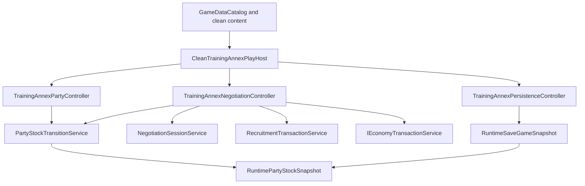

# Phase 5-6 Code Review And Readiness

> **Status: Concluded implementation audit for Phase 5 Party And Stock and Phase 6 Negotiation And Recruitment.** This report is derived from source code, tests, and the current active roadmap documents. It does not authorize legacy removal and does not mark any capability as `clean_parity`.

## Executive Verdict

Phase 5 and Phase 6 are implemented correctly for their approved scope: they prove the original clean Training Annex host can use framework-owned party, stock, negotiation, recruitment, economy, and save-snapshot contracts without falling back to legacy `Database`, legacy DTOs, or console-only rule ownership.

The implementation is intentionally still `parallel_partial`. It is usable evidence for the new framework path, but it is not full parity with every protected legacy consumer. The old console prototype remains active compatibility code, and removal remains unauthorized.

No critical blocker was found. CodeReview-5-6-1 resolved the save-validation invariant gap. CodeReview-5-6-2 resolved the authored negotiation demand gap by making content-supplied demands authoritative in the runtime flow. CodeReview-5-6-3 removed the fake active-demon sentinel. CodeReview-5-6-4 removed the fixed Bramble Runner negotiation target from the clean Training Annex negotiation controller.

## Final Closure

The Phase 5-6 review is closed with all identified follow-ups addressed.

The final state is deliberately conservative:

- framework party/stock transitions own the clean rules for active party, reserve party, active form, Persona stock, Demon stock, and immutable before/after results;
- framework save validation now rejects illegal party/stock structures that could not be produced by legal transition commands;
- framework negotiation runtime can consume authored demand records supplied by the host instead of silently calculating every Macca demand internally;
- the Training Annex clean host no longer uses a fake active-demon runtime ID for host-side rejection;
- the Training Annex clean host no longer hardcodes the negotiation target to `ReplacementBrambleRunnerInstance`;
- the insufficient-Macca clean-host regression is present and proves no wallet, stock, recruitment, or demand-prompt mutation happens when an authored demand is unaffordable.

These outcomes improve correctness and reduce host-specific shortcuts, but they do not make the protected legacy console consumers obsolete. The affected capabilities remain `parallel_partial` until real consumers outside the Training Annex proof are migrated and verified.

## Source Re-Inspection Notes

After the closure pass, the review was rechecked against the actual code rather than only against the written summary.

The re-inspection confirmed:

- `PartyStockTransitionService` owns the clean transition rules for active/reserve party, active-form exchange, Persona stock, Demon stock, summon, return, swap, dismiss, replace, and consume operations. Rejections return unchanged snapshots and stable diagnostics.
- `RuntimeSaveValidator` now validates the structural party/stock invariants identified by the review: duplicate list entries, active party overflow, Demon stock overflow using an injected stock-capacity policy, active/reserve overlap, and active-form duplication in Persona stock. It intentionally still allows active-party plus Demon-stock overlap for summoned owned demons.
- `NegotiationSessionService` now accepts typed `NegotiationRuntimeDemand` records. When demands are supplied, authored demand weight and operands drive the runtime demand path. The older calculated Macca formula remains a compatibility fallback only when no authored demands are supplied.
- `TrainingAnnexPartyController.ReturnActiveDemon` now returns a typed `NotActive` rejection when no active demon exists, without inventing a fake runtime ID.
- `TrainingAnnexNegotiationController` now builds target candidates from host-prepared recruitable actors that match the authored negotiation default entity/race IDs, then resolves the selected target through `HostCommandSelectionIdentity.RuntimeInstanceId`.
- `CleanTrainingAnnexPlayHostTests` includes focused regressions for selected negotiation target identity, authored demand amount, insufficient authored Macca, refusal without mutation, repeated familiar negotiation, party-stock rejection immutability, and framework save validation.

No source-level contradiction was found between the implementation and the final review verdict. The remaining limitations are scope limitations, not discovered defects: Training Annex remains a proof host, its party operation menu is still sample-specific, and broader consumer migration is still required before any capability can be called `clean_parity`.

## Audit Scope

### Reviewed capability phases

| Phase | Capability | Current status | Review result |
| --- | --- | --- | --- |
| 5-26 | `active_and_reserve_party` | `parallel_partial` | Implemented as framework party/stock snapshots plus Training Annex presentation. |
| 5-27 | `persona_and_demon_stock` | `parallel_partial` | Implemented as active-form, Persona stock, and Demon stock ownership in the same snapshot. |
| 5-28 | `party_operations` | `parallel_partial` | Implemented through `PartyStockTransitionService` operations and non-mutating rejection diagnostics. |
| 6-29 | `negotiation_and_recruitment` | `parallel_partial` | Implemented through framework negotiation, recruitment, party-stock, and economy services. |

### Reviewed implementation files

- `JRPG.Framework/Logic/Runtime/PartyStockTransitions.cs`
- `JRPG.Framework/Logic/Runtime/RuntimePersistenceSnapshots.cs`
- `JRPG.Framework/Logic/Battle/Runtime/BattleNegotiationAndRewards.cs`
- `Host/CleanConsole/TrainingAnnex/TrainingAnnexPartyController.cs`
- `Host/CleanConsole/TrainingAnnex/TrainingAnnexNegotiationController.cs`
- `Host/CleanConsole/TrainingAnnex/TrainingAnnexPersistenceController.cs`
- `Host/CleanConsole/TrainingAnnex/TrainingAnnexHostSupport.cs`
- `Host/CleanConsole/TrainingAnnex/CleanTrainingAnnexPlayHost.cs`
- `Data/Jsons/training_annex_slice.negotiations.json`
- `Convergence.Tests/Runtime/PartyStockTransitionTests.cs`
- `Convergence.Tests/Host/CleanTrainingAnnexPlayHostTests.cs`
- `Convergence.Tests/SkillSystem/OriginalCleanContentSliceTests.cs`
- `Convergence.Tests/Fixtures/Parity/recovery-baseline.json`

## Verification Evidence

The active roadmap records the following completed gates:

| Checkpoint | Focused tests | Full suite | Framework build | Solution warnings | Demo status |
| --- | ---: | ---: | ---: | ---: | --- |
| Phase 5-26 | `88/88` | `843/843` | `0` warnings | `98` existing warnings | Clean demos passed |
| Phase 5-27 | `74/74` | `845/845` | `0` warnings | `98` existing warnings | Clean demos passed |
| Phase 5-28 | `76/76` | `847/847` | `0` warnings | `98` existing warnings | Clean demos passed |
| Phase 6-29 | `104/104` | `851/851` | `0` warnings | `98` existing warnings | Clean battle, field, save, and Training Annex demos passed |
| CodeReview-5-6 follow-ups | Latest focused gate `82/82` | `859/859` | `0` warnings | `98` existing warnings | Clean battle, field, and save demos passed |

The Phase 6-29 gate also records:

- `git diff --check` passed.
- Framework forbidden-reference search returned no matches.
- Protected legacy/prototype data remained untouched.
- The only `Data/Jsons` change was the clean Training Annex negotiation sample.

## Current Architecture



The important boundary is clear: framework services own rules and immutable result shapes; the Training Annex host owns menu flow, presentation strings, command scripts, and applying accepted results to the live demo session.

## Phase 5-26 Review: Active And Reserve Party

Phase 5-26 added a clean party snapshot to the Training Annex session through `RuntimePartyStockSnapshot`. The snapshot records the owner, owner level, active party, reserve members, optional active form, Persona stock, Demon stock, and max active party size.

The implementation is framework-first in the parts that matter:

- `RuntimePartyStockSnapshot` takes defensive immutable snapshots of supplied actor-reference collections.
- `PartyStockTransitionService.AddPartyMember` rejects duplicate active/reserve ownership and routes overflow into reserve when the active party is full.
- `SwapPartyMember` uses stable active/reserve indices and returns an immutable before/after result.
- Training Annex creates the initial party with Echo Adept active and Annex Mentor reserved.
- Save snapshots include the party-stock snapshot rather than rebuilding it from console state.

Test coverage is meaningful. `PartyStockTransitionTests` proves active/reserve add and swap behavior, unchanged snapshots on rejection, and defensive copying. `CleanTrainingAnnexPlayHostTests` proves `Inspect Party` reads the framework snapshot, not a separate hardcoded display model.

**Review conclusion:** implemented correctly for a clean demo host. It remains `parallel_partial` because broader production consumers and alternate hosts are not fully migrated.

## Phase 5-27 Review: Persona And Demon Stock

Phase 5-27 expanded the same snapshot instead of creating a second ownership model. That is the right architectural choice.

The current clean stock model includes:

- `ActiveForm`, used for the equipped Persona/form concept.
- `PersonaStock`, used for owned inactive forms.
- `DemonStock`, used for owned demons.
- The intentional active+owned Demon overlap: a summoned demon may appear in `ActiveParty` and remain in `DemonStock`.

The framework transition service enforces the core stock behavior:

- `LegacyStockCapacityPolicy` preserves the current capacity thresholds: `3`, `5`, `7`, `10`, and `12`.
- `AddDemonToStock` rejects duplicate owned demons and full stock.
- `SummonDemon` requires stock ownership, rejects already-active demons, and respects active party capacity.
- `SwapActivePersona` exchanges the active form with a stock entry rather than duplicating it.
- Persona and demon consume/replace operations remove or replace references consistently.

Training Annex hydrates active-form, Persona-stock, and Demon-stock actors from original clean content roles. The host then presents them through `Inspect Stock`.

**Review conclusion:** implemented correctly for the approved proof. The design is reusable because the state model is not console-specific.

## Phase 5-28 Review: Party Operations

Phase 5-28 added manual Training Annex party/stock operations over the framework service:

- active-form swap;
- summon Ashling from Demon stock;
- swap the active demon to Ward Shell;
- return the active demon;
- replace Ward Shell with Bramble Runner;
- dismiss Ashling;
- consume Bramble Runner.

The strongest part of this pass is that failed operations are not silent and do not mutate live state. `PartyStockTransitionResult` carries:

- stable `PartyStockTransitionCode`;
- immutable `Before` and `After` snapshots;
- affected runtime IDs;
- diagnostics for rejected operations.

The Training Annex host applies `result.After` only when the result is successful. Tests cover the happy path and rejection path, including duplicate active summon rejection and return-without-active-demon rejection.

CodeReview-5-6-3 removed the small host-code smell around returning an active demon when no demon is deployed. The host now returns an explicit rejected `PartyStockTransitionResult` instead of inventing a fake runtime ID.

**Review conclusion:** implemented correctly. The earlier low-priority sentinel cleanup is now resolved by CodeReview-5-6-3.

## Phase 6-29 Review: Negotiation And Recruitment

Phase 6-29 is the first clean negotiation/recruitment proof for original content. It does not use the legacy `NegotiationEngine` or legacy `questions.json`.

The current flow is:

1. Training Annex loads `steady_sample` from `training_annex_slice.negotiations.json`.
2. The host selects the Bramble Runner sample target.
3. `NegotiationSessionService` runs the question, mood, demand, familiar, and failure flow.
4. `RecruitmentTransactionService` validates that the target can be recruited.
5. `PartyStockTransitionService.AddDemonToStock` computes the Demon-stock update.
6. The bound economy service spends Macca if the negotiation succeeded with a Macca demand.
7. Only after all checks pass does the host commit the party-stock snapshot and wallet snapshot.

That ordering is good. The stock addition is computed before Macca spending, but the host does not apply `stock.After` if the wallet spend fails. From the live session's point of view, recruitment is atomic.

The implementation also handles non-mutating outcomes:

- target-selection cancellation leaves wallet and stock unchanged;
- answer/demand refusal leaves wallet and stock unchanged;
- familiar repeat path does not duplicate recruitment;
- recruitment validation failure leaves wallet and stock unchanged;
- stock transition rejection leaves wallet and stock unchanged;
- wallet spend rejection leaves wallet and stock unchanged.

The content record has two authored questions, answer scores, familiar dialogue, and one `sample_macca` demand record. Tests verify the negotiation record exists, has the expected shape, and participates in the clean host proof.

**Review conclusion:** implemented correctly for a first clean negotiation slice. After CodeReview-5-6-2, authored demand records are now authoritative when the host supplies them to the framework runtime request.

## Findings

### Critical

None.

### High

None.

### Medium (resolved by CodeReview-5-6-1): Save validation checked party-stock references but not full party-stock invariants

`RuntimeSaveValidator.ValidatePartyReferences` currently checks whether party-stock references point to actors in the save. That is necessary, but not sufficient for production save safety.

It does not yet validate all structural invariants that `PartyStockTransitionService` normally protects during gameplay, such as:

- duplicate references inside active party, reserve party, Persona stock, or Demon stock;
- active party count exceeding `MaxActivePartySize`;
- Demon stock count exceeding the stock capacity policy for `OwnerLevel`;
- active form duplicated into Persona stock;
- invalid active+owned overlap outside the intentional Demon-stock summon model.

Training Annex adds host restore checks for some role mistakes, such as enemy actors in party or Demon stock, but the framework save validator should eventually own the general invariants. Otherwise a malformed host save can bypass transition rules and restore a state no legal command could have produced.

**Resolution:** CodeReview-5-6-1 adds framework-level validation for duplicate party/stock references, active party capacity, Demon stock capacity, active/reserve overlap, and active-form duplication in Persona stock. The validator accepts an injected `IStockCapacityPolicy`, so the capacity rule is not hardwired to one future host model. Regression tests also preserve the intentional active+owned Demon stock overlap.

CodeReview-5-6-1 verification: focused persistence and party-stock coverage passed `30/30` tests with no failures or skips.

### Medium (resolved by CodeReview-5-6-2): Authored negotiation demands were present in content but not rule-authoritative

`training_annex_slice.negotiations.json` includes:

```json
"demands": [
  {
    "demandId": "sample_macca",
    "weight": 1,
    "parameters": {
      "amount": 50
    }
  }
]
```

Earlier, `TrainingAnnexNegotiationController.BuildRequest` mapped questions and familiar dialogue into `NegotiationSessionRequest`, while `NegotiationSessionService.ResolveDemandsAsync` calculated its own Macca demand from target level and actor luck.

That meant the content proved the schema surface existed, but the runtime did not use the authored demand amount or weight.

**Resolution:** CodeReview-5-6-2 adds `NegotiationRuntimeDemand` and extends `NegotiationSessionRequest` with an immutable demand list. When demands are supplied, `NegotiationSessionService` selects them by authored weight and executes the typed demand instead of calculating level/luck Macca internally. The older calculated path remains only as fallback compatibility for callers that do not supply authored demands.

Training Annex now maps `steady_sample.demands[0]` through a host-owned demand vocabulary mapping:

- `demandId: sample_macca`
- `parameters.amount: 50`
- runtime kind: `Macca`

The clean host now spends the authored `50` Macca, not the old internally calculated `86`. A test-only content source changes the amount to `30` and proves the runtime result follows the authored parameter. The unaffordable authored-demand path now fails before the demand prompt and before wallet or Demon-stock mutation.

CodeReview-5-6-2 verification added focused runtime and host tests for authored amount selection, unaffordable authored demands, and Training Annex content parameter mapping. The focused negotiation/content gate passed `94/94`, the full suite passed `858/858`, the framework build reported `0` warnings, the solution build retained the existing `98` console-host warnings, `git diff --check` passed, the refined framework forbidden-reference search returned no matches, and `Data/Jsons` remained unchanged.

### Low (resolved by CodeReview-5-6-3): `missing_active_demon` sentinel should become an explicit host result

`TrainingAnnexPartyController.RequireActiveDemon` previously returned `RuntimeInstanceId.Parse("missing_active_demon")` when there was no active demon. The service then rejected the operation as `NotActive`.

That kept behavior safe, but mixed a host presentation condition with a fake runtime identity.

**Resolution:** CodeReview-5-6-3 replaces the sentinel with a typed host-side rejection result. `ReturnActiveDemon` now emits `PartyStockTransitionCode.NotActive`, preserves the original snapshot, reports no affected runtime IDs, and carries a clear diagnostic with no fake subject ID.

CodeReview-5-6-3 verification: focused Training Annex host tests passed `81/81`, the full suite passed `858/858`, the standalone framework build reported `0` warnings, the solution build retained the existing `98` console-host warnings, `git diff --check` passed, the refined framework forbidden-reference search returned no matches, clean battle/field/save demos passed, and `Data/Jsons` remained unchanged.

### Low (resolved by CodeReview-5-6-4): Training Annex negotiation target was fixed to Bramble Runner

`TrainingAnnexNegotiationController.FindRecruitmentCandidate` previously selected `ReplacementBrambleRunnerInstance` directly. That was fine for a single-slice proof, but it was not a general clean negotiation target-selection system.

**Resolution:** CodeReview-5-6-4 replaces the fixed instance lookup with a host-owned candidate list. The controller now finds prepared recruitment candidates by host role, recruitable entity capability, and the authored negotiation defaults for allowed entity/race IDs. The target menu carries runtime-instance selection identities, and the selected identity determines which actor enters the negotiation and recruitment transaction.

The default Training Annex flow still has one prepared candidate, so visible behavior remains the same. A regression test adds a second prepared Bramble Runner candidate and proves the controller recruits the selected runtime instance instead of `ReplacementBrambleRunnerInstance`.

CodeReview-5-6-4 verification: `CleanTrainingAnnexPlayHostTests` passed `82/82`, the full suite passed `859/859`, the standalone framework build reported `0` warnings, the solution build retained the existing `98` console-host warnings, `git diff --check` passed, the refined framework forbidden-reference search returned no matches, clean battle/field/save demos passed, and `Data/Jsons` remained unchanged.

### Low (resolved by CodeReview-5-6-2): Add one clean-host insufficient-Macca regression

CodeReview-5-6-2 adds the clean-host insufficient-Macca regression alongside authored demand binding. The test proves a successful mood with an unaffordable authored demand does not prompt for demand selection, spend Macca, recruit the target, or mutate Demon stock.

## Hardcoding Review

### Acceptable slice constants

The Training Annex host still contains sample-specific IDs such as `DemonAshlingInstance`, `DemonWardShellInstance`, `PersonaBrambleRunnerInstance`, and `SteadySampleNegotiation`. These are acceptable because Training Annex is a demo host over original sample content, not a generic Godot-facing runtime.

### Not acceptable as framework rules

The following should not graduate into framework-level assumptions:

- fixed sample party operation menu;
- host-specific negotiation candidate roles as a framework rule;
- internally calculated negotiation demands when a caller supplies authored demand records.

The framework itself remains clean of console, filesystem, Godot, Newtonsoft, `Database`, `Combatant`, `Persona`, and legacy DTO dependencies in this area.

## Readiness For Next Phase

Phase 5 and Phase 6 are ready to build on.

The next phase may proceed, provided we keep the current status honest:

- `active_and_reserve_party`: `parallel_partial`
- `persona_and_demon_stock`: `parallel_partial`
- `party_operations`: `parallel_partial`
- `negotiation_and_recruitment`: `parallel_partial`

No capability should be promoted to `clean_parity` yet. Full parity still requires real consumer migration outside the Training Annex proof and broader gameplay integration.

## Recommended Follow-Up Queue

1. **CodeReview-5-6-1: Harden party-stock save invariants. Completed.**
   Framework validation now rejects duplicate party/stock references, active party overflow, Demon stock overflow, active/reserve overlap, and illegal active-form duplication while preserving the intentional active+owned Demon stock overlap.

2. **CodeReview-5-6-2: Make authored negotiation demands authoritative.**
   Completed. `NegotiationDefinition.Demands` now flow into typed runtime demands for the clean Training Annex path, and the framework uses authored demand weights and operands when supplied.

3. **CodeReview-5-6-3: Clean up Training Annex host seams.**
   Completed. `ReturnActiveDemon` now returns a typed rejected result when no active demon exists, rather than inventing a fake runtime ID. The insufficient-Macca clean-host regression was completed as part of CodeReview-5-6-2 because it directly proves authored-demand transaction safety.

4. **CodeReview-5-6-4: Remove fixed Training Annex negotiation target.**
   Completed. Clean Training Annex negotiation now builds a candidate list from host-prepared recruitable actors plus authored negotiation defaults, then uses the selected runtime-instance identity for the session and recruitment transaction.

These follow-ups are quality improvements, not emergency blockers.
