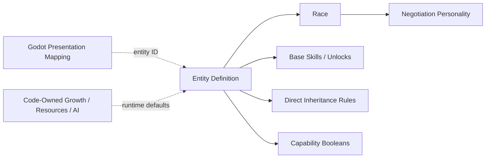
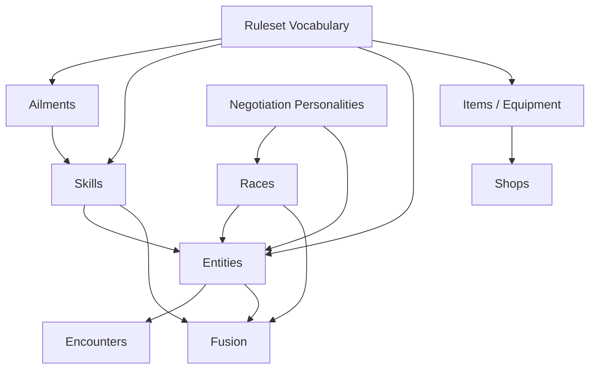

# Content Schema v1 Proposal

## Status

This is a design proposal, not an implementation contract yet.

The existing legacy and v2 datasets should not constrain this design. They may be kept temporarily as reference material, but new production code and new content should target the approved schema rather than preserve accidental legacy shapes.

The skill portions of this proposal must conform to the normative [Skill System GDD](skill-system-gdd.md). Where the two documents currently differ, the GDD records the newer design decision and this proposal still requires revision.

Reconciled examples in this document may be used as Track 1 candidates, but unresolved fields remain proposals until the redesign plan records an explicit decision. Navigator abilities, dungeon presentation, and host asset mappings are outside this skill-contract pass.

## Goal

Define a stable, validated content model for Convergence before migrating data or rewriting gameplay consumers.

The schema should:

- represent supported gameplay without parsing names or descriptions,
- distinguish immutable content definitions from mutable runtime state,
- use stable IDs for every reference,
- support multiple effects on one skill or item,
- provide deliberate extension points for unusual mechanics,
- allow content packs to be validated before gameplay starts,
- remain usable by console, Unity, Godot, tests, and tools,
- avoid embedding a general-purpose scripting language in JSON.

## Non-Goals

Schema v1 should not:

- encode the complete battle, field, fusion, or negotiation state machines,
- store live HP, SP, EXP, inventory quantities, dungeon progress, or compendium snapshots,
- make every formula editable through arbitrary expressions,
- preserve old display-name-driven behavior,
- require all future game mechanics to be expressible without adding code,
- include protected franchise content as a framework requirement.

## Architectural Boundary


Content definitions answer questions such as:

- What is this skill?
- What effects does it request?
- What entity template is this?
- Which entities can appear in this encounter table?
- What recipe does this fusion pair produce?

Runtime state answers questions such as:

- How much HP does this combatant currently have?
- Which skills has this individual learned?
- Which ailment instances and durations are active?
- How many copies of an item does the player own?
- Which dungeon terminals have been unlocked?

JSON must never be mutated to represent a play session.

## File Layout

```text
Data/
  Schemas/
    manifest.schema.json
    ruleset.schema.json
    skills.schema.json
    ailments.schema.json
    races.schema.json
    entities.schema.json
    items.schema.json
    equipment.schema.json
    shops.schema.json
    negotiation.schema.json
    encounters.schema.json
    fusion.schema.json
  Content/
    core/
      manifest.json
      ruleset.json
      skills/
      ailments/
      races/
      entities/
      items/
      equipment/
      shops/
      negotiation/
      encounters/
      fusion/
```

A content pack may split a content type across multiple files. The manifest determines deterministic load order; the loader should not depend on filesystem enumeration order.

## Content Pack Manifest

```json
{
  "$schema": "../../Schemas/manifest.schema.json",
  "schemaVersion": 1,
  "id": "convergence.core",
  "version": "1.0.0",
  "displayName": "Convergence Core Content",
  "description": "Original reference content for the Convergence framework.",
  "dependencies": [
    { "id": "convergence.shared", "version": "1.2.0" }
  ],
  "documents": [
    { "type": "ruleset", "path": "ruleset.json" },
    { "type": "ailments", "path": "ailments/core.json" },
    { "type": "skills", "path": "skills/core.json" },
    { "type": "races", "path": "races/core.json" },
    { "type": "negotiation", "path": "negotiation/core.json" },
    { "type": "entities", "path": "entities/core.json" },
    { "type": "items", "path": "items/core.json" },
    { "type": "equipment", "path": "equipment/core.json" },
    { "type": "shops", "path": "shops/core.json" },
    { "type": "encounters", "path": "encounters/core.json" },
    { "type": "fusion", "path": "fusion/core.json" }
  ]
}
```

Each content document uses the same metadata envelope and a type-named record array. The named array makes the document type visible without inspecting the manifest and matches the initial redesign fixtures:

```json
{
  "$schema": "../../../Schemas/skills.schema.json",
  "schemaVersion": 1,
  "skills": []
}
```

The equivalent arrays are `entities`, `races`, and `ailments` for those document types. `$schema` is optional authoring metadata; `schemaVersion` and the type-named array are part of the imported document shape.

Dependency entries are objects containing a pack `id` and one exact Semantic Versioning 2.0 `version`. Schema v1 has no version ranges. Prerelease and build metadata are accepted, and build metadata participates in exact dependency matching. A dependency grants visibility only to that pack; dependencies are not re-exported transitively.

Document paths are logical host-provided keys, not filesystem paths. They must be canonical relative paths using forward slashes. The manifest order controls deserialization and diagnostic order regardless of the order in which the host supplies document text.

## Identity Rules

- Every record has a stable local `id`.
- IDs use lower snake case: `flame_burst`, `ash_wisp`, `physical_attack`.
- The loader creates a canonical ID using the content-pack ID: `convergence.core:flame_burst`.
- References in the same pack may use local IDs.
- References to another pack must be fully qualified.
- IDs are case-insensitively unique within their content type and namespace.
- Display names are not identifiers and do not need to be unique.
- Renaming display text must never change gameplay behavior or break references.

## Shared Vocabulary

The ruleset document declares the vocabulary available to other content documents. Code provides the behavior for the vocabulary, while content provides IDs and tuning values.

### Ruleset Document

```json
{
  "$schema": "../../Schemas/ruleset.schema.json",
  "schemaVersion": 1,
  "id": "default_ruleset",
  "resources": [
    { "id": "hp", "displayName": "HP" },
    { "id": "sp", "displayName": "SP" },
    { "id": "macca", "displayName": "Macca" }
  ],
  "equipmentSlots": [
    { "id": "weapon", "displayName": "Weapon" },
    { "id": "armor", "displayName": "Armor" },
    { "id": "footwear", "displayName": "Footwear" },
    { "id": "accessory", "displayName": "Accessory" }
  ],
  "moonPhases": [
    { "id": "new_moon", "displayName": "New Moon", "order": 0 },
    { "id": "full_moon", "displayName": "Full Moon", "order": 8 }
  ],
  "stats": [
    { "id": "strength", "shortName": "St" },
    { "id": "magic", "shortName": "Ma" },
    { "id": "vitality", "shortName": "Vi" },
    { "id": "agility", "shortName": "Ag" },
    { "id": "luck", "shortName": "Lu" }
  ],
  "modifierTracks": [
    { "id": "physical_attack", "minimumStage": -4, "maximumStage": 4 },
    { "id": "magical_attack", "minimumStage": -4, "maximumStage": 4 },
    { "id": "defense", "minimumStage": -4, "maximumStage": 4 },
    { "id": "agility", "minimumStage": -4, "maximumStage": 4 }
  ],
  "elements": [
    { "id": "physical", "category": "physical" },
    { "id": "fire", "category": "magical" },
    { "id": "ice", "category": "magical" },
    { "id": "electric", "category": "magical" },
    { "id": "wind", "category": "magical" },
    { "id": "light", "category": "magical" },
    { "id": "dark", "category": "magical" },
    { "id": "almighty", "category": "unresistable" }
  ],
  "affinities": [
    { "id": "normal", "damageMultiplier": 1.0, "turnOutcome": "normal" },
    { "id": "weak", "damageMultiplier": 1.5, "turnOutcome": "weakness" },
    { "id": "resist", "damageMultiplier": 0.5, "turnOutcome": "normal" },
    { "id": "null", "damageMultiplier": 0.0, "turnOutcome": "null" },
    { "id": "repel", "damageMultiplier": 1.0, "turnOutcome": "repel" },
    { "id": "absorb", "damageMultiplier": -1.0, "turnOutcome": "absorb" }
  ],
  "resistanceLevels": [
    { "id": "vulnerable" },
    { "id": "normal" },
    { "id": "resistant" },
    { "id": "immune" }
  ],
  "defaults": {
    "affinityId": "normal",
    "ailmentResistanceId": "normal",
    "instantDeathResistanceId": "normal",
    "buffDurationTurns": 3,
    "ailmentDurationTurns": 3,
    "maximumActivePartySize": 4
  }
}
```

The ruleset may tune finite parameters. Algorithms such as damage calculation, initiative, Press Turn consumption, and EXP curves remain named code strategies rather than JSON expressions.

## Shared Primitives

### Target Specification

```json
{
  "relation": "enemy",
  "selection": "single",
  "lifeState": "alive",
  "allowSelf": false,
  "count": { "minimum": 1, "maximum": 1 }
}
```

Allowed concepts:

| Field | Values |
| --- | --- |
| `relation` | `none`, `self`, `ally`, `enemy`, `any` |
| `selection` | `single`, `all`, `random` |
| `lifeState` | `alive`, `dead`, `any` |
| `allowSelf` | Whether an ally selection may include the actor |
| `count` | Required for random or bounded multi-selection |

`selection` also supports `none` when `relation` is `none`.

Target selection and hit count are separate. An attack may target one enemy and hit it three times, or select three random enemies and hit each once.

### Duration Specification

```json
{
  "type": "turns",
  "value": 3,
  "tick": "owner_turn_end",
  "suspendWhileReserve": true
}
```

Duration types are `instant`, `turns`, `phase`, `battle`, and `permanent`.

### Amount Specification

```json
{ "type": "flat", "value": 50 }
```

Supported amount types:

- `flat`
- `percent_max`
- `percent_current`
- `full`
- `power`
- `formula`

`formula` must reference a registered formula ID and typed parameters. It is not an arbitrary expression string.

```json
{
  "type": "formula",
  "formulaId": "actor_current_hp_damage",
  "parameters": { "ratio": 1.0 }
}
```

### Condition Specification

Conditions use a small typed expression tree:

```json
{
  "all": [
    { "type": "target_has_ailment", "ailmentIds": ["sleep"] },
    { "type": "battle_kind", "allowed": ["random"] }
  ]
}
```

Supported v1 conditions should be limited to mechanics the engine already understands:

- actor or target HP/SP percentage,
- actor or target has an ailment, skill, buff, affinity, or explicit capability,
- target life state,
- battle kind,
- moon phase,
- party size,
- chance roll,
- `all`, `any`, and `not` composition.

Unusual conditions use a registered custom condition handler. Effects and rule modifiers expose one optional `when` property containing this tree. Arrays named `conditions` are not part of the contract. An effect's `when` tree is evaluated once per target immediately before that effect executes.

## Effect Model

Active skills and consumable items contain an ordered `effects` list. Effects execute in order unless the action is rejected before execution.

The skill effect vocabulary must match the GDD:

| Effect type | Purpose |
| --- | --- |
| `damage` | Typed elemental damage, hit count, accuracy, critical and drain behavior |
| `instant_kill` | Chance-based or conditional instant death using the separate instant-death resistance system |
| `restore_resource` | Restore HP, SP, or another resource |
| `reduce_resource` | Flat, percent, or formula-based nonstandard resource reduction |
| `set_resource` | Set a resource to an exact or bounded value |
| `revive` | Revive a dead target and restore a resource amount |
| `apply_ailment` | Apply an ailment by ID with chance and duration |
| `remove_ailment` | Remove ailments by explicit IDs, ailment group IDs, or all |
| `modify_stat_stage` | Change one or more modifier tracks |
| `grant_charge` | Grant a physical or magical charge state |
| `grant_shield` | Grant a physical or magical reflection shield |
| `override_affinity` | Temporarily replace one or more affinities, including Break effects |
| `escape` | Request escape with explicit eligibility and chance behavior |
| `analyze` | Reveal one or more knowledge layers |
| `remove_status_effect` | Remove buffs, debuffs, shields, charges, or other declared runtime effects |
| `custom` | Invoke a registered, validated handler for exceptional mechanics |

Inventory rewards, currency rewards, and permanent skill grants are wider gameplay operations, not ordinary skill effects. Their contracts belong to the owning reward, field, or progression subsystem.

Effects may include an optional `when` tree and an optional `onFailure` policy:

```json
{
  "type": "apply_ailment",
  "ailmentId": "poison",
  "chance": 40,
  "onFailure": "continue"
}
```

`onFailure` accepts:

- `continue`: continue with the next effect for this target; this is the default when omitted,
- `stop_target`: skip later effects for this target while continuing other targets,
- `stop_action`: stop the remaining effects and targets for the action.

Misses, failed chance rolls, and resistance outcomes that prevent the intended effect are failures. A false `when` condition is skipped and does not activate `onFailure`. A valid effect that produces no net state change, such as healing a target already at maximum HP, is still successful. Battle interruptions such as Repel override authored failure policy.

## Skill Schema

Skills have one of two activation models:

- `active`: selected and executed as an action.
- `passive`: responds to registered runtime events.

Active skills require one of the GDD's bounded `menuGroup` values for presentation and AI filtering. Passive skills are displayed through `activation: passive` and validation rejects `menuGroup` on them. Menu placement does not select the execution implementation. Generic tags are deliberately excluded from Schema v1: behavior that matters to rules should use an explicit field, effect, group ID, or capability flag.

Every skill has one top-level `inheritanceGroupId`. The nested `inheritance` object contains `isInheritable` and owner-exclusivity data. Mutation is separate optional metadata under `mutation`; it is not part of inheritance.

### Availability

Active skills declare supported execution contexts with this wire shape:

```json
{
  "availability": {
    "contexts": ["battle", "field"]
  }
}
```

Context values are extensible `ContentId` references rather than a closed engine enum. `battle` and `field` are the initial framework contexts. A host may register additional contexts without placing Godot, filesystem, or presentation concepts in the domain model.

Passive skills omit `availability`; their triggers declare when they operate. Track 4 preserves availability structurally. Track 5 validation requires every active skill to provide at least one context, rejects availability on passive skills, and rejects context IDs that are not registered by the active ruleset or host.

### Active Skill Example

```json
{
  "id": "venom_needle",
  "displayName": "Venom Needle",
  "description": "Physical damage with a chance to poison one enemy.",
  "activation": "active",
  "menuGroup": "offense",
  "inheritanceGroupId": "physical",
  "costs": [
    {
      "resourceId": "hp",
      "amount": { "type": "percent_max", "value": 7 },
      "canReduceToZero": false
    }
  ],
  "targeting": {
    "relation": "enemy",
    "selection": "single",
    "lifeState": "alive",
    "allowSelf": false,
    "count": { "minimum": 1, "maximum": 1 }
  },
  "effects": [
    {
      "type": "damage",
      "elementId": "physical",
      "power": 62,
      "accuracy": 76,
      "critical": { "mode": "chance", "chance": 24 },
      "hits": { "minimum": 1, "maximum": 1 },
      "onFailure": "stop_target"
    },
    {
      "type": "apply_ailment",
      "ailmentId": "poison",
      "chance": 40
    }
  ],
  "availability": {
    "contexts": ["battle"]
  },
  "inheritance": {
    "isInheritable": true,
    "exclusiveOwnerEntityIds": []
  },
  "mutation": {
    "familyId": "poison",
    "tier": 2
  }
}
```

### Multi-Hit Skill Example

```json
{
  "id": "shining_arrows",
  "displayName": "Shining Arrows",
  "description": "Deals several hits of light damage to all enemies.",
  "activation": "active",
  "menuGroup": "offense",
  "inheritanceGroupId": "light",
  "costs": [
    { "resourceId": "sp", "amount": { "type": "flat", "value": 24 } }
  ],
  "targeting": {
    "relation": "enemy",
    "selection": "all",
    "lifeState": "alive",
    "allowSelf": false
  },
  "effects": [
    {
      "type": "damage",
      "elementId": "light",
      "power": 25,
      "accuracy": 90,
      "critical": { "mode": "never" },
      "hits": { "minimum": 4, "maximum": 8, "distribution": "uniform" }
    }
  ],
  "availability": { "contexts": ["battle"] },
  "inheritance": {
    "isInheritable": true
  },
  "mutation": {
    "familyId": "light_multi_hit",
    "tier": 3
  }
}
```

### Cure Skill Example

```json
{
  "id": "patra",
  "displayName": "Patra",
  "description": "Removes mental ailments from one ally.",
  "activation": "active",
  "menuGroup": "recovery",
  "inheritanceGroupId": "recovery",
  "costs": [
    { "resourceId": "sp", "amount": { "type": "flat", "value": 3 } }
  ],
  "targeting": {
    "relation": "ally",
    "selection": "single",
    "lifeState": "alive",
    "allowSelf": true
  },
  "effects": [
    {
      "type": "remove_ailment",
      "ailmentGroupIds": ["mental"],
      "removalLimit": { "type": "all" }
    }
  ],
  "availability": { "contexts": ["battle", "field"] },
  "inheritance": {
    "isInheritable": true
  },
  "mutation": {
    "familyId": "mental_cure",
    "tier": 1
  }
}
```

### Conditional Instant-Kill Example

```json
{
  "id": "eternal_rest",
  "displayName": "Eternal Rest",
  "description": "Instantly kills sleeping enemies.",
  "activation": "active",
  "menuGroup": "offense",
  "inheritanceGroupId": "ailment",
  "targeting": {
    "relation": "enemy",
    "selection": "all",
    "lifeState": "alive",
    "allowSelf": false
  },
  "effects": [
    {
      "type": "instant_kill",
      "chance": 100,
      "resistanceCheck": { "mode": "none" },
      "when": {
        "type": "target_has_ailment",
        "ailmentIds": ["sleep"]
      }
    }
  ],
  "availability": { "contexts": ["battle"] },
  "inheritance": {
    "isInheritable": true
  },
  "mutation": {
    "familyId": "conditional_death",
    "tier": 3
  }
}
```

Hama- and Mudo-line effects use an explicit channel check rather than a damage element:

```json
{
  "type": "instant_kill",
  "chance": 30,
  "resistanceCheck": {
    "mode": "channel",
    "channelId": "light"
  }
}
```

`channelId` accepts `light` or `dark`. `mode: none` is explicit and is used by Eternal Rest after its Sleep condition passes; omission is invalid rather than silently bypassing resistance.

### Passive Skill Example

```json
{
  "id": "regenerate_1",
  "displayName": "Regenerate 1",
  "description": "Restores a small amount of HP at the end of the owner's turn.",
  "activation": "passive",
  "inheritanceGroupId": "passive",
  "triggers": [
    {
      "event": "owner_turn_end",
      "effects": [
        {
          "type": "restore_resource",
          "resourceId": "hp",
          "amount": { "type": "percent_max", "value": 2 }
        }
      ]
    }
  ],
  "inheritance": {
    "isInheritable": true
  },
  "mutation": {
    "familyId": "regenerate",
    "tier": 1
  }
}
```

### Rule Modifier Passive Example

```json
{
  "id": "ice_boost",
  "displayName": "Ice Boost",
  "description": "Increases Ice damage by 25 percent.",
  "activation": "passive",
  "inheritanceGroupId": "passive",
  "inheritance": { "isInheritable": true },
  "modifiers": [
    {
      "type": "damage_dealt",
      "operation": "multiply",
      "value": 1.25,
      "when": { "type": "effect_element_is", "elementId": "ice" }
    }
  ]
}
```

Numeric rule modifiers declare their type, operation, value, and optional `when` tree. Stacking groups and numeric priorities are not authored. Every numeric modifier type uses the code-owned formula `(base + sum(add)) * product(multiply)`.

An ailment resistance passive uses a separate nonnumeric shape:

```json
{
  "id": "resist_poison",
  "displayName": "Resist Poison",
  "description": "Improves the owner's resistance to Poison.",
  "activation": "passive",
  "inheritanceGroupId": "passive",
  "inheritance": { "isInheritable": true },
  "modifiers": [
    {
      "type": "ailment_resistance",
      "ailmentId": "poison",
      "resistance": "resistant"
    }
  ]
}
```

`ailment_resistance` must provide `ailmentId` and `resistance`; it does not accept `operation` or `value`. Applicable replacements use `immune > resistant > normal > vulnerable`. The referenced ailment is a content reference and is qualified by the catalog loader, while the resistance applies only to that ailment.

Elemental-affinity passives choose the strongest applicable response from the base affinity and passive replacements:

```text
absorb > repel > null > resist > normal > weak
```

An active shield overrides that result. If no shield applies, an active Break effect temporarily normalizes it. Almighty always resolves as normal.

Passive triggers are processed in authored loadout, trigger, target, and effect order. The passive owner is condition `actor`, while the event-selected actor is condition `target`. Recursion permission and per-battle activation limits belong to registered event policy; they are deliberately absent from JSON. The standard `owner_would_be_defeated` policy permits one activation per trigger per battle. Trigger effects reuse ordinary effect conditions and failure policies.

Hosts or migrated lifecycle services dispatch registered events such as `battle_start` and `owner_turn_end`. Ailment-owned triggers and passive duration expiration are not yet consumed by the clean runtime and remain deferred to their lifecycle integration.

### Navigator Abilities

Oracle and related Navigator abilities are not demon or Persona stock skills. They are excluded from this schema, its inheritance groups, and its mutation rules. A future Navigator-system contract may reuse shared effects, but it must not model those mechanics as ordinary selectable skills.

Every `handlerId`, `formulaId`, trigger event, effect type, and condition type must be registered by code and validated at startup.

## Ailment Schema

```json
{
  "id": "poison",
  "displayName": "Poison",
  "description": "Deals damage at the end of the afflicted combatant's turn.",
  "groupIds": [],
  "exclusivityGroupId": "major_ailment",
  "defaultDuration": {
    "type": "turns",
    "value": 3,
    "tick": "owner_turn_end",
    "suspendWhileReserve": true
  },
  "turnBehavior": { "type": "normal" },
  "modifiers": {
    "evasionMultiplier": 1.0,
    "criticalChanceTakenBonus": 0,
    "damageTakenMultiplier": 1.0,
    "damageDealtMultiplier": 1.0,
    "isRigidBody": false
  },
  "triggers": [
    {
      "event": "owner_turn_end",
      "effects": [
        {
          "type": "reduce_resource",
          "resourceId": "hp",
          "amount": { "type": "percent_max", "value": 13 },
          "canReduceToZero": true
        }
      ]
    }
  ],
  "recovery": {
    "natural": {
      "baseChance": 20,
      "statId": "luck",
      "statMultiplier": 0.5
    },
    "removeOnEvents": []
  }
}
```

Ailment definitions describe behavior, duration, grouping, and recovery. They do not select an elemental or family resistance channel. Each entity stores resistance by ailment ID, for example `"poison": "resistant"`. Optional `groupIds` support broad cures and passive modifiers only.

Turn behavior is a finite union for common restrictions:

- `normal`
- `skip`
- `limited_actions`
- `chance_skip`
- `chance_skip_or_flee`
- `forced_basic_attack`
- `confused_action`
- `custom`

Example fear behavior:

```json
{
  "type": "chance_skip_or_flee",
  "skipChance": 40,
  "fleeChance": 15,
  "demonFleeOutcome": "return_to_stock"
}
```

## Race Schema

Races should be records rather than repeated free-form strings.

```json
{
  "id": "fairy",
  "displayName": "Fairy",
  "alignmentIds": ["neutral"],
  "negotiationPersonalityId": "childlike"
}
```

## Entity Inheritance Rules

Inheritance compatibility should be stated directly on the entity. A label such as `fire_aligned` is too ambiguous: it does not say whether Ice alone is forbidden or whether Fire is the only permitted element.

```json
{
  "groupPolicy": {
    "mode": "deny_list",
    "groupIds": ["ice"]
  },
  "blockedSkillIds": [],
  "allowedSkillIds": []
}
```

The two policy modes have exact semantics:

- `deny_list`: all otherwise inheritable skills are allowed except skills whose `inheritanceGroupId` appears in `groupIds`.
- `allow_list`: only skills whose `inheritanceGroupId` appears in `groupIds` are allowed.

Every skill has exactly one inheritance group. The groups are the eight damage elements plus `recovery`, `ailment`, `support`, `utility`, and `passive`.

Therefore, an entity with `mode: deny_list` and `groupIds: [ice]` can inherit Fire, recovery, support, and passive skills, but not active skills in the Ice inheritance group. Ice Boost remains inheritable because it has `activation: passive` and `inheritanceGroupId: passive`; its Ice modifier does not make it an Ice inheritance skill.

Inheritance checks use this precedence:

1. A skill with `isInheritable: false` is rejected.
2. An owner-exclusive skill is rejected when the entity is not one of its permitted owners.
3. `blockedSkillIds` rejects an explicit skill.
4. `allowedSkillIds` permits an explicit exception to the group policy.
5. All other skills follow `groupPolicy`.

An explicit allow never overrides `isInheritable: false` or owner exclusivity. Validation rejects the same skill ID appearing in both explicit lists.

The clean runtime uses these authored fields through one typed inheritance evaluator. Preview candidates expose stable policy reason codes, while final selection re-runs the same evaluator before issuing a validated selection. Already-known skills are represented separately from policy rejection, candidate order is preserved after first-occurrence ID deduplication, and display text or effect descriptions never influence eligibility.

The entity and skill schemas do not author an inherited-skill slot count. The caller supplies a nonnegative maximum when it creates an inheritance plan. A later fusion tuning profile may calculate that number, but it must remain separate from the entity's eligibility policy.

## Entity Schema

An entity definition is an immutable species or character template. A summoned demon, enemy, Persona instance, or party member is runtime state created from this template.

```json
{
  "id": "ash_wisp",
  "displayName": "Ash Wisp",
  "description": "A minor spirit drawn to dying embers.",
  "entityKind": "demon",
  "raceId": "spirit",
  "rank": 1,
  "baseLevel": 4,
  "capabilities": {
    "recruitable": true,
    "fusionEligible": true,
    "compendiumEligible": true
  },
  "inheritanceRules": {
    "groupPolicy": {
      "mode": "deny_list",
      "groupIds": ["ice"]
    },
    "blockedSkillIds": [],
    "allowedSkillIds": []
  },
  "stats": {
    "strength": 3,
    "magic": 7,
    "vitality": 4,
    "agility": 5,
    "luck": 4
  },
  "elementalAffinities": {
    "fire": "resist",
    "ice": "weak"
  },
  "ailmentResistances": {
    "poison": "resistant",
    "sleep": "vulnerable"
  },
  "instantDeathResistances": {
    "light": "normal",
    "dark": "immune"
  },
  "baseSkillIds": ["ember_flicker"],
  "skillUnlocks": [
    { "level": 6, "skillId": "flame_instinct" },
    { "level": 6, "skillId": "fire_resist" }
  ]
}
```

Important decisions:

- Multiple records may share the same display name.
- Missing elemental affinities use the ruleset default.
- Missing ailment-resistance entries use the ruleset's normal resistance default.
- Ailment resistance is keyed by ailment ID and accepts only `vulnerable`, `normal`, `resistant`, or `immune`.
- Instant-death resistance is keyed by the fixed `light` and `dark` channels and uses the same four resistance values.
- `skillUnlocks` is a list so multiple skills may unlock at one level.
- Explicit capability fields determine system eligibility instead of generic tags or name/race checks.
- Negotiation personality defaults from the race. Entity-specific negotiation overrides are deferred until a concrete use case requires them.
- Level growth, HP/SP calculation, and enemy decision-making use code-owned defaults in Schema v1.
- Portraits, models, scenes, animations, and resource paths belong to the Godot host or an adapter-owned presentation manifest, not the framework entity definition.
- Boss variants should normally be separate entity records or encounter modifiers, not mutation of shared content definitions.



## Why Shared Profiles Are Deferred

A profile becomes useful when several records genuinely share one configurable behavior and the project needs multiple stable alternatives. The current framework has not established those alternatives yet, so profile IDs would add indirection without reducing real duplication.

- A growth profile would define how stats increase on level-up.
- A resource profile would define how maximum HP and SP are calculated from level and stats.
- An AI profile would select and configure enemy action-selection behavior.

Schema v1 keeps all three as code-owned algorithms. They should become data profiles only after the game has concrete variants that designers must assign without changing code. This leaves room for those schemas later without forcing every entity to reference speculative abstractions now.

## What Tags Mean

A tag is a generic label such as `healing`, `recruitable`, or `fire_aligned` attached to a record. Tags are convenient for searching and grouping, but they become difficult to reason about when code silently gives particular strings gameplay meaning.

Schema v1 therefore does not use a generic `tags` field for rules. It uses named concepts instead:

- eligibility uses entity capability booleans,
- inheritance uses explicit inheritance groups and allow/deny rules,
- ailments use declared group IDs,
- equipment restrictions use entity kinds or entity IDs,
- UI grouping uses bounded fields such as skill `menuGroup`.

Non-gameplay labels can be added later for editor search or presentation without affecting runtime behavior.

## Item Schema

Consumables reuse the same targeting and effect model as active skills.

```json
{
  "id": "medicine",
  "displayName": "Medicine",
  "description": "Restores 50 HP to one ally.",
  "itemKind": "consumable",
  "stackLimit": 99,
  "baseValue": 150,
  "usage": {
    "contexts": ["battle", "field"],
    "consumeOn": "successful_execution",
    "targeting": {
      "relation": "ally",
      "selection": "single",
      "lifeState": "alive",
      "allowSelf": true
    },
    "effects": [
      {
        "type": "restore_resource",
        "resourceId": "hp",
        "amount": { "type": "flat", "value": 50 }
      }
    ]
  }
}
```

Other item kinds include `key`, `material`, and `valuable`. Items without `usage` are not directly usable.

## Equipment Schema

```json
{
  "id": "ember_blade",
  "displayName": "Ember Blade",
  "description": "A short blade carrying residual heat.",
  "slotId": "weapon",
  "baseValue": 2400,
  "equipRestrictions": {
    "allowedEntityKinds": ["human"],
    "allowedEntityIds": [],
    "blockedEntityIds": []
  },
  "statModifiers": {
    "strength": 2
  },
  "grantedSkillIds": [],
  "weapon": {
    "elementId": "physical",
    "power": 34,
    "accuracy": 92,
    "range": "melee"
  }
}
```

All equipment uses one definition type. Passive behavior is granted through passive skill IDs, so equipment does not introduce a second competing passive-effect format. Slot-specific payloads are optional and validated against `slotId`:

- weapon: attack element, power, accuracy, range,
- armor: defense and evasion,
- footwear: defense/evasion and movement properties,
- accessory: stat modifiers, granted skills, or passive effects.

## Shop Schema

```json
{
  "id": "city_item_shop",
  "displayName": "Item Shop",
  "pricingProfileId": "standard_luck_pricing",
  "inventory": [
    {
      "contentType": "item",
      "contentId": "medicine",
      "stock": { "type": "unlimited" },
      "buyPriceOverride": null,
      "sellable": true,
      "when": null
    },
    {
      "contentType": "equipment",
      "contentId": "ember_blade",
      "stock": { "type": "limited", "quantity": 1 },
      "buyPriceOverride": 2600,
      "sellable": true,
      "when": { "type": "minimum_player_level", "value": 8 }
    }
  ]
}
```

The shop references item and equipment records. It must not duplicate names or gameplay metadata.

## Negotiation Schema

Negotiation data is divided into personalities, dialogue sets, demand policies, and familiar outcome tables. These records are centralized negotiation content; they are not embedded into every entity.

```json
{
  "personalities": [
    {
      "id": "childlike",
      "displayName": "Childlike",
      "questionSetIds": ["childlike_general"],
      "familiarDialogueSetIds": ["childlike_familiar"],
      "demandPolicyId": "standard_demon_demand",
      "familiarOutcomeTableId": "standard_familiar_gift"
    }
  ],
  "questionSets": [
    {
      "id": "childlike_general",
      "questions": [
        {
          "id": "friend_request",
          "prompt": "Do you want to be my friend?",
          "answers": [
            { "id": "yes", "text": "Of course.", "moodDelta": 2 },
            { "id": "prove_it", "text": "Prove your strength.", "moodDelta": 0 },
            { "id": "no", "text": "No.", "moodDelta": -1 }
          ]
        }
      ]
    }
  ],
  "familiarDialogueSets": [
    {
      "id": "childlike_familiar",
      "lines": ["We meet again."]
    }
  ],
  "demandPolicies": [
    {
      "id": "standard_demon_demand",
      "strategyId": "standard_negotiation_demand",
      "parameters": {
        "currencyFormulaId": "level_squared_luck_discount",
        "itemDemandChance": 50,
        "trickChanceAfterPayment": 50
      }
    }
  ],
  "familiarOutcomeTables": [
    {
      "id": "standard_familiar_gift",
      "outcomes": [
        {
          "weight": 50,
          "effects": [
            { "type": "grant_item", "itemId": "medicine", "quantity": 1 }
          ]
        },
        {
          "weight": 30,
          "effects": [
            {
              "type": "grant_currency",
              "resourceId": "macca",
              "amount": {
                "type": "formula",
                "formulaId": "entity_level_scaled",
                "parameters": { "multiplier": 20 }
              }
            }
          ]
        }
      ]
    }
  ]
}
```

`familiarDialogueSetIds` contains lines used when the negotiation system recognizes a previously encountered or already-known demon. It belongs to the shared personality rather than the entity because many entities can use the same conversational style. If that mechanic is not part of the final game, the field and familiar outcome table can be omitted from Schema v1 without affecting battle entities.

Negotiation flow, stock checks, mood resolution, and selection remain code-owned. Content supplies dialogue, demand policies, and outcome pools.

## Encounter Schema

Encounter tables should describe complete weighted groups rather than an unweighted pool of individual entity IDs.

```json
{
  "encounterTables": [
    {
      "id": "ember_cavern_early",
      "entries": [
        {
          "weight": 50,
          "members": [
            { "entityId": "ash_wisp", "count": { "minimum": 1, "maximum": 2 } }
          ]
        },
        {
          "weight": 20,
          "members": [
            { "entityId": "ash_wisp", "count": { "minimum": 1, "maximum": 1 } },
            { "entityId": "cinder_imp", "count": { "minimum": 1, "maximum": 1 } }
          ]
        }
      ]
    }
  ],
  "encounters": [
    {
      "id": "ember_gatekeeper",
      "battleKind": "boss",
      "members": [
        {
          "entityId": "ember_guardian",
          "count": { "minimum": 1, "maximum": 1 },
          "levelOverride": 15
        }
      ],
      "rewards": []
    }
  ]
}
```

## Deferred Dungeon And Presentation Schemas

The current console dungeon is prototype application flow, while the eventual Godot host will own scenes, navigation, collision, map transitions, interactables, procedural generation, and presentation timing. Defining a framework dungeon schema before those systems are designed would turn prototype assumptions into a premature contract.

Schema v1 therefore keeps encounters but defers dungeons. A Godot scene or dungeon controller can request a weighted encounter table or fixed encounter by content ID without the framework knowing how the player reached it.

The same boundary applies to portraits, models, animations, audio resources, and scene paths. Those are host-owned presentation data that may later live in a Godot resource, import manifest, or adapter-specific mapping keyed by framework entity IDs.

## Fusion Schema

Fusion data is divided into race recipes, special recipes, catalyst recipes, skill-inheritance tuning, and other fusion tuning profiles.

There must be no magic result values such as `-1` or display strings used as operations.

```json
{
  "raceRecipes": [
    {
      "parentRaceIds": ["deity", "kishin"],
      "result": { "type": "race", "raceId": "fury" }
    }
  ],
  "specialRecipes": [
    {
      "id": "ashen_sovereign_recipe",
      "parentEntityIds": ["ash_wisp", "cinder_imp", "ember_guardian"],
      "result": { "type": "entity", "entityId": "ashen_sovereign" }
    }
  ],
  "catalystRecipes": [
    {
      "catalystRaceId": "element",
      "targetRaceId": "fairy",
      "result": {
        "type": "rank_shift",
        "target": "non_catalyst_parent",
        "amount": 1
      }
    },
    {
      "catalystRaceId": "mitama",
      "targetRaceId": "any",
      "result": {
        "type": "stat_boost",
        "profileId": "standard_mitama_boost"
      }
    }
  ],
  "profiles": {
    "resultSelection": {
      "strategyId": "nearest_rank_above_average_level"
    },
    "inheritanceSlots": {
      "strategyId": "unique_parent_skill_count",
      "parameters": {
        "thresholds": [
          { "minimumSkills": 1, "slots": 1 },
          { "minimumSkills": 6, "slots": 2 },
          { "minimumSkills": 10, "slots": 3 }
        ]
      }
    },
    "accident": {
      "strategyId": "moon_phase_accident",
      "parameters": {
        "baseChance": 3,
        "fullMoonChance": 12,
        "skillMutationChance": 20
      }
    },
    "sacrifice": {
      "strategyId": "lifetime_exp_transfer",
      "parameters": { "transferRatio": 0.5 }
    }
  }
}
```

Parent race pairs are unordered. The loader should canonicalize and detect duplicate reversed pairs.

The fusion document above remains a future schema proposal. Track 10 implements only the serializer-neutral inheritance evaluator, plan, and validated-selection boundary over catalog definitions. It does not load fusion documents, adopt the illustrated inheritance-slot strategy, mutate runtime entities, or migrate the legacy Cathedral flow; those integrations begin with the later consumer-migration work.

## Reference Graph



## Validation Pipeline

The redesigned content path has three explicit boundaries.

### 1. Structural Deserialization

Track 4 accepts JSON text and enforces the wire contract:

- required properties and token types,
- exact property and enum casing,
- known discriminators and union shapes,
- no unknown properties, comments, trailing commas, or ambiguous condition nodes,
- mapping into immutable domain definitions without retaining serializer-owned values.

Structural success does not imply that IDs resolve or gameplay values are semantically usable.

### 2. Semantic Pack Validation

Track 5 receives deserialized definitions plus an explicit host registration snapshot. It validates:

- schema version `1`, local record IDs, duplicate records, duplicate authored IDs, and manifest/document consistency,
- active/passive skill shapes, meaningful effect operands, target shapes, inheritance restrictions, entity skill assignments, and mutation-family continuity,
- local and same-pack-qualified references among skills, entities, races, and ailments,
- every host-owned context, resource, stat, modifier track, event, phase, entity kind, alignment, negotiation personality, ailment group, battle kind, moon phase, capability, action, status, and escape rule,
- supported effect, condition, modifier, and ailment-behaviour definition types,
- registered formulas and custom effect, condition, and ailment-behaviour parameter contracts.

The numeric policy is contract-only. Probabilities and accuracy use `0` through `100`; counts, durations, levels, ranks, and mutation tiers are positive; amounts and powers are nonnegative; multiplicative values are positive; and minimums cannot exceed maximums. Balance-specific ceilings are deliberately absent.

Validation aggregates independent errors in deterministic authored order. Invalid content cannot produce a `ValidatedSkillSystemContentPack`.

### 3. Catalog And Dependency Validation

Track 6 accepts host-supplied manifest and document text bundles, invokes Tracks 4 and 5, and then resolves the complete supplied pack graph. It rejects duplicate pack IDs, duplicate/self/missing/cyclic dependencies, exact-version mismatches, malformed logical paths, missing or unexpected documents, and unsupported document types. Independent diagnostics are aggregated in caller, manifest-document, and authored-record order.

Every external content reference must target a directly declared dependency. A transitive dependency does not grant visibility. Cross-pack references are checked for target existence and type, and entity explicit-allow rules are rechecked against external skill inheritance and owner exclusivity.

Successful catalog construction qualifies local record IDs, mutation-family IDs, and references to skills, entities, races, and ailments as `pack.id:local_id`. Already qualified external references remain qualified after resolution. Host capability IDs are never rewritten; resources, events, contexts, stats, groups, handlers, actions, and similar registrations retain their authored identity. Catalog repositories require qualified lookup IDs and expose immutable collections. Any load diagnostic prevents catalog creation.

The broader schema proposal still reserves future catalog validation for items, equipment, shops, encounters, fusion, and other document families when those contracts are implemented.

Validation errors should include:

- content-pack ID,
- source file,
- record type and ID,
- JSON path,
- stable error code,
- actionable error text.

Example:

```text
[convergence.core] skills/core.json
Skill 'venom_needle' at $.skills[12].effects[1].ailmentId:
Unknown ailment ID 'poisn'. Did you mean 'poison'?
```

## Code Shape Implied By The Schema

The schema should map to immutable C# definition records and small discriminated payload hierarchies.

```text
GameDataCatalog
  Skills: IReadOnlyDictionary<ContentId, SkillDefinition>
  Ailments: IReadOnlyDictionary<ContentId, AilmentDefinition>
  Races: IReadOnlyDictionary<ContentId, RaceDefinition>
  Entities: IReadOnlyDictionary<ContentId, EntityDefinition>
  Items: IReadOnlyDictionary<ContentId, ItemDefinition>
  Equipment: IReadOnlyDictionary<ContentId, EquipmentDefinition>
  Shops: IReadOnlyDictionary<ContentId, ShopDefinition>
  Negotiation: NegotiationCatalog
  Encounters: EncounterCatalog
  Fusion: FusionDefinitionCatalog
```

Runtime services should accept repository interfaces or the immutable catalog. They should not read JSON or static dictionaries directly.

Schema v1 avoids generic behavior-driving tags. Important rules use explicit fields such as `capabilities.recruitable`, `inheritanceGroupId`, and ailment `groupIds`. Optional labels may be added later for search or presentation, but they must not silently control gameplay.

Effect execution should look conceptually like:

```text
Action request
  -> validate costs and targeting
  -> resolve targets
  -> execute ordered effect definitions
  -> produce structured effect results/events
  -> commit costs and consumable use according to policy
```

## Wider Schema Decisions To Approve Before Coding

The Skill System GDD has already settled ordered effects, presentation-only display text, explicit inheritance groups, passive structure, and the separation between elemental affinities and ailment resistance. The remaining list concerns the wider content-pack architecture:

1. Use local IDs plus content-pack namespaces.
2. Model races and negotiation personalities as records, while keeping entity inheritance restrictions explicit and local.
3. Unify equipment under one definition with slot-specific payloads.
4. Reuse targeting and effects for skills and consumable items.
5. Store complete weighted encounters separately from dungeons.
6. Make fusion operations explicit discriminated results.
7. Validate the entire content graph before exposing a catalog.
8. Keep mutable game/save state outside content definitions.
9. Keep growth, HP/SP formulas, and AI code-owned until concrete configurable variants exist.
10. Defer dungeon and presentation schemas to the Godot integration design.

## Resolved Design Choices

- Buffs should use stages for the normal battle rules. Direct percentage modifiers should be a separate effect type for exceptional mechanics and should not share the stage stack.
- Ailment behavior and ailment resistance are separate. Entities store one resistance value per ailment ID; ailment groups may support broad cures or passive modifiers but never act as elemental affinities or substitute resistance channels.
- Skill mutation preserves the existing family-and-tier mechanic through an optional nested `mutation` object, separate from inheritance metadata.
- Eternal Rest is an active Offense skill in the `ailment` inheritance group because Sleep is its defining prerequisite.
- Oracle and other Navigator abilities are excluded from the demon/Persona stock skill contract and deferred to a dedicated future system.
- Basic weapon damage uses the `physical` element.
- `inheritanceGroupId` is top-level; explicit allowed skill IDs override group policy but not non-inheritable or owner-exclusive restrictions.
- Active skills require `menuGroup`; passive skills forbid it.
- Effects use one per-target `when` tree and optional `onFailure`, which defaults to `continue`.
- Hama and Mudo use explicit Light/Dark instant-death resistance channels; Eternal Rest explicitly bypasses them after its Sleep condition passes.
- Numeric modifier stacking is code-owned and uses `(base + sum(add)) * product(multiply)`; affinity and ailment-resistance passives use their separate fixed replacement precedence.
- Active definitions should support a list of costs. Most skills will have zero or one, but the schema should not need revision for a dual-resource action.
- Passive mechanics should use passive skill definitions in v1. Entities and equipment grant passive skill IDs instead of embedding a second trigger format.
- Equipment should grant skill IDs and stat modifiers. It should not embed anonymous passive behavior in v1.
- Race-based negotiation should be the default. Entity-level overrides should be added only when an authored character needs one.
- Content packs should add records in v1. Replacement/patch semantics should be deferred until load order and compatibility rules are deliberately designed.
- Custom handlers should be reserved for mechanics that cannot be expressed as a short composition of existing effects. They require registration, parameter validation, and dedicated tests.

## Schema Test Fixtures Before Full Data

Do not migrate a complete dataset immediately. First create a deliberately small original test pack containing:

- one standard damage skill,
- one damage-plus-ailment skill,
- one multi-hit skill,
- one heal,
- one revive,
- one cure-group skill,
- one buff and one debuff,
- one passive trigger,
- one conditional instant kill,
- one custom-handler skill,
- three ailments with different turn behaviors,
- two races and four entities,
- one entity with two skill unlocks at the same level,
- one consumable and one item without active use,
- one record for each equipment slot,
- one shop,
- one personality and question set,
- one weighted encounter table and one boss encounter,
- one normal fusion recipe, one rank-shift catalyst, and one special recipe.

This fixture becomes the executable definition of Schema v1. Full content should only be authored or migrated after the fixture validates, hydrates runtime entities, and drives representative battle, field, and fusion tests.

## Catalog Actor Hydration And Demo Pack

Track 11 proves the existing skill, entity, race, validation, and catalog contracts through a clean battle vertical slice. It does not add a battle document or put runtime HP/SP values into entity content.

The runtime factory accepts a qualified entity ID and host-owned instance, team, and level values. It copies entity stats and defense maps, resolves base skills followed by eligible level unlocks, suppresses duplicate skill IDs after their first occurrence, attaches passive definitions, and exposes active definitions in authored loadout order. A host initialization policy supplies vital-resource identity and initial resource values. This is deliberately outside JSON because formulas and save-state resource values are runtime concerns.

The separate `convergence.clean_battle_demo` pack depends exactly on `convergence.skill_system_redesign_sample` `0.1.0`. Its Frost combatant references the sample pack's qualified Ice Boost skill, demonstrating that external qualified skill references survive catalog construction and hydrate as passives. The pack also contains Fire and Ice active skills, a turn-end regeneration passive, two entities, and one race. The minimal reference fixture remains unchanged.

The automated battle runner is not an authored encounter schema. Participants, team order, round limit, execution context, battle kind, and moon phase are host request values. Future encounter definitions may construct that request, but they must not alter the clean actor or execution contracts.

The CLI file reader is host code. It converts known files into `ContentPackTextBundle` values and no filesystem type enters catalog, actor, selector, or runner APIs. The `--clean-battle-demo` route is evaluated before the ordinary console host, which proves the clean path can execute without `Database.LoadData`.

## Proposed Implementation Sequence

1. Review and approve this conceptual model.
2. Write JSON Schema files for the small test pack.
3. Add immutable C# schema DTOs and definition records.
4. Add handler/strategy registries and validation contracts.
5. Implement the two-stage content validator.
6. Build an immutable `GameDataCatalog` from the test pack.
7. Add runtime adapters for skills, ailments, and entities first.
8. Convert battle execution from `SkillData` string parsing to typed effects.
9. Convert items and field skill use to the same effect model.
10. Convert entity factories, negotiation, shops, encounters, and fusion.
11. Remove static legacy `Database` dependencies subsystem by subsystem.
12. Delete or archive old datasets only after no runtime consumer depends on them.
13. Author original production content directly against Schema v1.

## Remaining Review Questions

The broad architecture is now narrow enough to implement, but these content-policy choices still merit explicit approval:

- Should every race have a negotiation personality, or should non-negotiable races omit it?
- Are the three capability booleans sufficient for Schema v1, or is another concrete eligibility rule already required?
- Should shops and negotiation remain in the first implementation pass, or follow battle, entities, encounters, and fusion in a second pass?

The answers should favor explicit, testable behavior and a small v1 surface over speculative flexibility.
