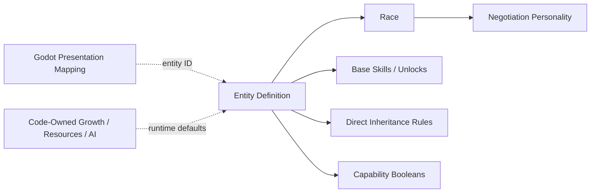
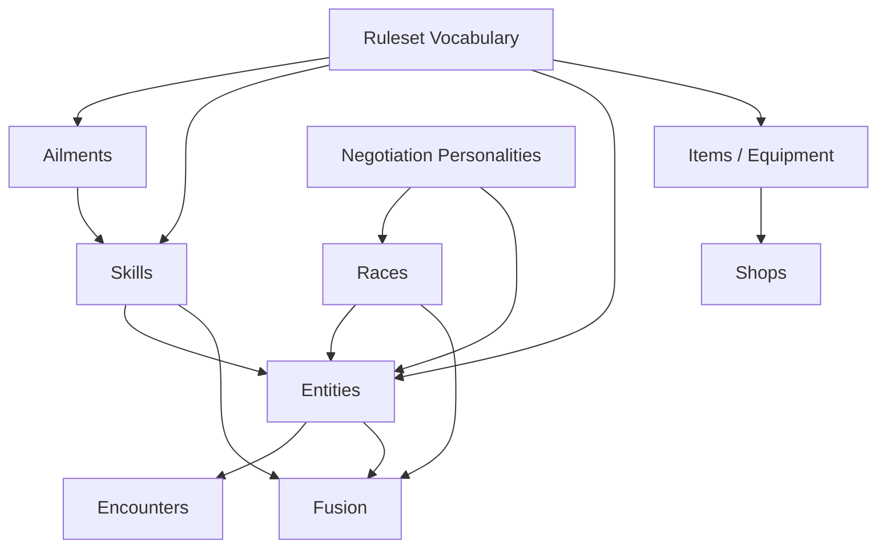

# Content Schema v1 Proposal

## Status

This is a design proposal, not an implementation contract yet.

The existing legacy and v2 datasets should not constrain this design. They may be kept temporarily as reference material, but new production code and new content should target the approved schema rather than preserve accidental legacy shapes.

The skill portions of this proposal must conform to the normative [Skill System GDD](skill-system-gdd.md). Where the two documents currently differ, the GDD records the newer design decision and this proposal still requires revision.

## Goal

Define a stable, validated content model for Convergence before migrating data or rewriting gameplay consumers.

The schema should:

- represent supported gameplay without parsing names or descriptions,
- distinguish immutable content definitions from mutable runtime state,
- use stable IDs for every reference,
- support multiple effects on one skill or item,
- provide deliberate extension points for unusual mechanics,
- allow content packs to be validated before gameplay starts,
- remain usable by console, Unity, Godot, tests, and tools,
- avoid embedding a general-purpose scripting language in JSON.

## Non-Goals

Schema v1 should not:

- encode the complete battle, field, fusion, or negotiation state machines,
- store live HP, SP, EXP, inventory quantities, dungeon progress, or compendium snapshots,
- make every formula editable through arbitrary expressions,
- preserve old display-name-driven behavior,
- require all future game mechanics to be expressible without adding code,
- include protected franchise content as a framework requirement.

## Architectural Boundary


Content definitions answer questions such as:

- What is this skill?
- What effects does it request?
- What entity template is this?
- Which entities can appear in this encounter table?
- What recipe does this fusion pair produce?

Runtime state answers questions such as:

- How much HP does this combatant currently have?
- Which skills has this individual learned?
- Which ailment instances and durations are active?
- How many copies of an item does the player own?
- Which dungeon terminals have been unlocked?

JSON must never be mutated to represent a play session.

## File Layout

```text
Data/
  Schemas/
    manifest.schema.json
    ruleset.schema.json
    skills.schema.json
    ailments.schema.json
    races.schema.json
    entities.schema.json
    items.schema.json
    equipment.schema.json
    shops.schema.json
    negotiation.schema.json
    encounters.schema.json
    fusion.schema.json
  Content/
    core/
      manifest.json
      ruleset.json
      skills/
      ailments/
      races/
      entities/
      items/
      equipment/
      shops/
      negotiation/
      encounters/
      fusion/
```

A content pack may split a content type across multiple files. The manifest determines deterministic load order; the loader should not depend on filesystem enumeration order.

## Content Pack Manifest

```json
{
  "$schema": "../../Schemas/manifest.schema.json",
  "schemaVersion": 1,
  "id": "convergence.core",
  "version": "1.0.0",
  "displayName": "Convergence Core Content",
  "description": "Original reference content for the Convergence framework.",
  "dependencies": [],
  "documents": [
    { "type": "ruleset", "path": "ruleset.json" },
    { "type": "ailments", "path": "ailments/core.json" },
    { "type": "skills", "path": "skills/core.json" },
    { "type": "races", "path": "races/core.json" },
    { "type": "negotiation", "path": "negotiation/core.json" },
    { "type": "entities", "path": "entities/core.json" },
    { "type": "items", "path": "items/core.json" },
    { "type": "equipment", "path": "equipment/core.json" },
    { "type": "shops", "path": "shops/core.json" },
    { "type": "encounters", "path": "encounters/core.json" },
    { "type": "fusion", "path": "fusion/core.json" }
  ]
}
```

Each content document uses the same envelope:

```json
{
  "$schema": "../../../Schemas/skills.schema.json",
  "schemaVersion": 1,
  "records": []
}
```

## Identity Rules

- Every record has a stable local `id`.
- IDs use lower snake case: `flame_burst`, `ash_wisp`, `physical_attack`.
- The loader creates a canonical ID using the content-pack ID: `convergence.core:flame_burst`.
- References in the same pack may use local IDs.
- References to another pack must be fully qualified.
- IDs are case-insensitively unique within their content type and namespace.
- Display names are not identifiers and do not need to be unique.
- Renaming display text must never change gameplay behavior or break references.

## Shared Vocabulary

The ruleset document declares the vocabulary available to other content documents. Code provides the behavior for the vocabulary, while content provides IDs and tuning values.

### Ruleset Document

```json
{
  "$schema": "../../Schemas/ruleset.schema.json",
  "schemaVersion": 1,
  "id": "default_ruleset",
  "resources": [
    { "id": "hp", "displayName": "HP" },
    { "id": "sp", "displayName": "SP" },
    { "id": "macca", "displayName": "Macca" }
  ],
  "equipmentSlots": [
    { "id": "weapon", "displayName": "Weapon" },
    { "id": "armor", "displayName": "Armor" },
    { "id": "footwear", "displayName": "Footwear" },
    { "id": "accessory", "displayName": "Accessory" }
  ],
  "moonPhases": [
    { "id": "new_moon", "displayName": "New Moon", "order": 0 },
    { "id": "full_moon", "displayName": "Full Moon", "order": 8 }
  ],
  "stats": [
    { "id": "strength", "shortName": "St" },
    { "id": "magic", "shortName": "Ma" },
    { "id": "vitality", "shortName": "Vi" },
    { "id": "agility", "shortName": "Ag" },
    { "id": "luck", "shortName": "Lu" }
  ],
  "modifierTracks": [
    { "id": "physical_attack", "minimumStage": -4, "maximumStage": 4 },
    { "id": "magical_attack", "minimumStage": -4, "maximumStage": 4 },
    { "id": "defense", "minimumStage": -4, "maximumStage": 4 },
    { "id": "agility", "minimumStage": -4, "maximumStage": 4 }
  ],
  "elements": [
    { "id": "slash", "category": "physical" },
    { "id": "strike", "category": "physical" },
    { "id": "pierce", "category": "physical" },
    { "id": "fire", "category": "magical" },
    { "id": "ice", "category": "magical" },
    { "id": "electric", "category": "magical" },
    { "id": "wind", "category": "magical" },
    { "id": "earth", "category": "magical" },
    { "id": "light", "category": "special" },
    { "id": "dark", "category": "special" },
    { "id": "almighty", "category": "special" },
    { "id": "mind", "category": "ailment" },
    { "id": "nerve", "category": "ailment" },
    { "id": "curse", "category": "ailment" }
  ],
  "affinities": [
    { "id": "normal", "damageMultiplier": 1.0, "turnOutcome": "normal" },
    { "id": "weak", "damageMultiplier": 1.5, "turnOutcome": "weakness" },
    { "id": "resist", "damageMultiplier": 0.5, "turnOutcome": "normal" },
    { "id": "null", "damageMultiplier": 0.0, "turnOutcome": "null" },
    { "id": "repel", "damageMultiplier": 1.0, "turnOutcome": "repel" },
    { "id": "absorb", "damageMultiplier": -1.0, "turnOutcome": "absorb" }
  ],
  "defaults": {
    "affinityId": "normal",
    "buffDurationTurns": 3,
    "ailmentDurationTurns": 3,
    "maximumActivePartySize": 4
  }
}
```

The ruleset may tune finite parameters. Algorithms such as damage calculation, initiative, Press Turn consumption, and EXP curves remain named code strategies rather than JSON expressions.

## Shared Primitives

### Target Specification

```json
{
  "relation": "enemy",
  "selection": "single",
  "lifeState": "alive",
  "allowSelf": false,
  "count": { "minimum": 1, "maximum": 1 }
}
```

Allowed concepts:

| Field | Values |
| --- | --- |
| `relation` | `none`, `self`, `ally`, `enemy`, `any` |
| `selection` | `single`, `all`, `random` |
| `lifeState` | `alive`, `dead`, `any` |
| `allowSelf` | Whether an ally selection may include the actor |
| `count` | Required for random or bounded multi-selection |

`selection` also supports `none` when `relation` is `none`.

Target selection and hit count are separate. An attack may target one enemy and hit it three times, or select three random enemies and hit each once.

### Duration Specification

```json
{
  "type": "turns",
  "value": 3,
  "tick": "owner_turn_end",
  "suspendWhileReserve": true
}
```

Duration types are `instant`, `turns`, `phase`, `battle`, and `permanent`.

### Amount Specification

```json
{ "type": "flat", "value": 50 }
```

Supported amount types:

- `flat`
- `percent_max`
- `percent_current`
- `full`
- `power`
- `formula`

`formula` must reference a registered formula ID and typed parameters. It is not an arbitrary expression string.

```json
{
  "type": "formula",
  "formulaId": "actor_current_hp_damage",
  "parameters": { "ratio": 1.0 }
}
```

### Condition Specification

Conditions use a small typed expression tree:

```json
{
  "all": [
    { "type": "target_has_ailment", "ailmentIds": ["sleep"] },
    { "type": "battle_kind", "allowed": ["random"] }
  ]
}
```

Supported v1 conditions should be limited to mechanics the engine already understands:

- actor or target HP/SP percentage,
- actor or target has an ailment, skill, buff, affinity, or explicit capability,
- target life state,
- battle kind,
- moon phase,
- party size,
- chance roll,
- `all`, `any`, and `not` composition.

Unusual conditions use a registered custom condition handler.

## Effect Model

Active skills and consumable items contain an ordered `effects` list. Effects execute in order unless the action is rejected before execution.

Core effect types proposed for v1:

| Effect type | Purpose |
| --- | --- |
| `damage` | Typed elemental damage, hit count, accuracy, critical and drain behavior |
| `instant_kill` | Chance-based instant death with an element or resistance family |
| `restore_resource` | Restore HP, SP, or another resource |
| `reduce_resource` | Flat, percent, or formula-based nonstandard resource reduction |
| `set_resource` | Set a resource to an exact or bounded value |
| `revive` | Revive a dead target and restore a resource amount |
| `apply_ailment` | Apply an ailment by ID with chance and duration |
| `remove_ailment` | Remove ailments by explicit IDs, ailment group IDs, or all |
| `modify_stat_stage` | Change one or more modifier tracks |
| `grant_charge` | Grant a physical or magical charge state |
| `grant_shield` | Grant a physical or magical reflection shield |
| `override_affinity` | Temporarily replace one or more affinities, including Break effects |
| `escape_battle` | Request escape with explicit eligibility and chance behavior |
| `analyze` | Reveal one or more knowledge layers |
| `grant_skill` | Temporarily or permanently grant a skill |
| `remove_effect` | Remove buffs, debuffs, shields, or other tagged runtime effects |
| `custom` | Invoke a registered, validated handler for exceptional mechanics |
| `grant_item` | Add an item to inventory in an allowed reward or field context |
| `grant_currency` | Add a currency resource in an allowed reward or field context |

Effects may include an optional `when` condition. Failure behavior must be explicit where relevant:

```json
{
  "type": "apply_ailment",
  "ailmentId": "poison",
  "chance": 40,
  "onFailure": "continue"
}
```

## Skill Schema

Skills have one of two activation models:

- `active`: selected and executed as an action.
- `passive`: responds to registered runtime events.

`category` is presentation and filtering metadata. It does not select the execution implementation. Generic tags are deliberately excluded from Schema v1: behavior that matters to rules should use an explicit field, effect, group ID, or capability flag.

### Active Skill Example

```json
{
  "id": "venom_needle",
  "displayName": "Venom Needle",
  "description": "Piercing damage with a chance to poison one enemy.",
  "activation": "active",
  "category": "offense",
  "costs": [
    {
      "resourceId": "hp",
      "amount": { "type": "percent_max", "value": 7 },
      "canReduceToZero": false
    }
  ],
  "targeting": {
    "relation": "enemy",
    "selection": "single",
    "lifeState": "alive",
    "allowSelf": false,
    "count": { "minimum": 1, "maximum": 1 }
  },
  "effects": [
    {
      "type": "damage",
      "elementId": "pierce",
      "power": 62,
      "accuracy": 76,
      "critical": { "mode": "chance", "chance": 24 },
      "hits": { "minimum": 1, "maximum": 1 }
    },
    {
      "type": "apply_ailment",
      "ailmentId": "poison",
      "chance": 40
    }
  ],
  "availability": {
    "contexts": ["battle"]
  },
  "inheritance": {
    "isInheritable": true,
    "elementIds": ["pierce"],
    "familyId": "poison",
    "mutationTier": 2,
    "exclusiveOwnerEntityIds": []
  }
}
```

### Multi-Hit Skill Example

```json
{
  "id": "shining_arrows",
  "displayName": "Shining Arrows",
  "description": "Deals several hits of light damage to all enemies.",
  "activation": "active",
  "category": "offense",
  "costs": [
    { "resourceId": "sp", "amount": { "type": "flat", "value": 24 } }
  ],
  "targeting": {
    "relation": "enemy",
    "selection": "all",
    "lifeState": "alive",
    "allowSelf": false
  },
  "effects": [
    {
      "type": "damage",
      "elementId": "light",
      "power": 25,
      "accuracy": 90,
      "critical": { "mode": "never" },
      "hits": { "minimum": 4, "maximum": 8, "distribution": "uniform" }
    }
  ],
  "availability": { "contexts": ["battle"] },
  "inheritance": {
    "isInheritable": true,
    "elementIds": ["light"],
    "familyId": "light_multi_hit",
    "mutationTier": 3
  }
}
```

### Cure Skill Example

```json
{
  "id": "patra",
  "displayName": "Patra",
  "description": "Removes mental ailments from one ally.",
  "activation": "active",
  "category": "support",
  "costs": [
    { "resourceId": "sp", "amount": { "type": "flat", "value": 3 } }
  ],
  "targeting": {
    "relation": "ally",
    "selection": "single",
    "lifeState": "alive",
    "allowSelf": true
  },
  "effects": [
    {
      "type": "remove_ailment",
      "ailmentGroupIds": ["mental"],
      "removalLimit": { "type": "all" }
    }
  ],
  "availability": { "contexts": ["battle", "field"] },
  "inheritance": {
    "isInheritable": true,
    "elementIds": [],
    "familyId": "mental_cure",
    "mutationTier": 1
  }
}
```

### Conditional Instant-Kill Example

```json
{
  "id": "eternal_rest",
  "displayName": "Eternal Rest",
  "description": "Instantly kills sleeping enemies.",
  "activation": "active",
  "category": "offense",
  "targeting": {
    "relation": "enemy",
    "selection": "all",
    "lifeState": "alive",
    "allowSelf": false
  },
  "effects": [
    {
      "type": "instant_kill",
      "elementId": "curse",
      "chance": 100,
      "when": {
        "type": "target_has_ailment",
        "ailmentIds": ["sleep"]
      }
    }
  ],
  "availability": { "contexts": ["battle"] },
  "inheritance": {
    "isInheritable": true,
    "elementIds": ["curse"],
    "familyId": "conditional_death",
    "mutationTier": 3
  }
}
```

### Passive Skill Example

```json
{
  "id": "regenerate_1",
  "displayName": "Regenerate 1",
  "description": "Restores a small amount of HP at the end of the owner's turn.",
  "activation": "passive",
  "category": "passive",
  "triggers": [
    {
      "event": "owner_turn_end",
      "effects": [
        {
          "type": "restore_resource",
          "resourceId": "hp",
          "amount": { "type": "percent_max", "value": 2 }
        }
      ]
    }
  ],
  "inheritance": {
    "isInheritable": true,
    "elementIds": [],
    "familyId": "regenerate",
    "mutationTier": 1
  }
}
```

### Exceptional Skill Example

```json
{
  "id": "oracle",
  "displayName": "Oracle",
  "description": "Invokes one of several context-sensitive support outcomes.",
  "activation": "active",
  "category": "support",
  "costs": [],
  "targeting": { "relation": "none", "selection": "none", "lifeState": "any" },
  "effects": [
    {
      "type": "custom",
      "handlerId": "oracle_support_roll",
      "parameters": { "profileId": "portable_style" }
    }
  ],
  "availability": { "contexts": ["battle"] },
  "inheritance": {
    "isInheritable": false,
    "elementIds": [],
    "familyId": null,
    "mutationTier": null,
    "exclusiveOwnerEntityIds": []
  }
}
```

Every `handlerId`, `formulaId`, trigger event, effect type, and condition type must be registered by code and validated at startup.

## Ailment Schema

```json
{
  "id": "poison",
  "displayName": "Poison",
  "description": "Deals damage at the end of the afflicted combatant's turn.",
  "resistanceElementId": "curse",
  "groupIds": ["physical", "poison"],
  "exclusivityGroupId": "major_ailment",
  "defaultDuration": {
    "type": "turns",
    "value": 3,
    "tick": "owner_turn_end",
    "suspendWhileReserve": true
  },
  "turnBehavior": { "type": "normal" },
  "modifiers": {
    "evasionMultiplier": 1.0,
    "criticalChanceTakenBonus": 0,
    "damageTakenMultiplier": 1.0,
    "damageDealtMultiplier": 1.0,
    "isRigidBody": false
  },
  "triggers": [
    {
      "event": "owner_turn_end",
      "effects": [
        {
          "type": "reduce_resource",
          "resourceId": "hp",
          "amount": { "type": "percent_max", "value": 13 },
          "canReduceToZero": true
        }
      ]
    }
  ],
  "recovery": {
    "natural": {
      "baseChance": 20,
      "statId": "luck",
      "statMultiplier": 0.5
    },
    "removeOnEvents": []
  }
}
```

Turn behavior is a finite union for common restrictions:

- `normal`
- `skip`
- `limited_actions`
- `chance_skip`
- `chance_skip_or_flee`
- `forced_basic_attack`
- `confused_action`
- `custom`

Example fear behavior:

```json
{
  "type": "chance_skip_or_flee",
  "skipChance": 40,
  "fleeChance": 15,
  "demonFleeOutcome": "return_to_stock"
}
```

## Race Schema

Races should be records rather than repeated free-form strings.

```json
{
  "id": "fairy",
  "displayName": "Fairy",
  "alignmentIds": ["neutral"],
  "negotiationPersonalityId": "childlike"
}
```

## Entity Inheritance Rules

Inheritance compatibility should be stated directly on the entity. A label such as `fire_aligned` is too ambiguous: it does not say whether Ice alone is forbidden or whether Fire is the only permitted element.

```json
{
  "groupPolicy": {
    "mode": "deny_list",
    "groupIds": ["ice"]
  },
  "blockedSkillIds": [],
  "allowedSkillIds": []
}
```

The two policy modes have exact semantics:

- `deny_list`: all otherwise inheritable skills are allowed except skills whose `inheritanceGroupId` appears in `groupIds`.
- `allow_list`: only skills whose `inheritanceGroupId` appears in `groupIds` are allowed.

Every skill has exactly one inheritance group. The groups are the eight damage elements plus `recovery`, `ailment`, `support`, `utility`, and `passive`.

Therefore, an entity with `mode: deny_list` and `groupIds: [ice]` can inherit Fire, recovery, support, and passive skills, but not active skills in the Ice inheritance group. Ice Boost remains inheritable because it has `activation: passive` and `inheritanceGroupId: passive`; its Ice modifier does not make it an Ice inheritance skill.

Inheritance checks use this precedence:

1. A skill with `isInheritable: false` is rejected.
2. An owner-exclusive skill is rejected when the entity is not one of its permitted owners.
3. `blockedSkillIds` rejects an explicit skill.
4. `allowedSkillIds` permits an explicit exception to the group policy.
5. All other skills follow `groupPolicy`.

Validation rejects the same skill ID appearing in both explicit lists.

## Entity Schema

An entity definition is an immutable species or character template. A summoned demon, enemy, Persona instance, or party member is runtime state created from this template.

```json
{
  "id": "ash_wisp",
  "displayName": "Ash Wisp",
  "description": "A minor spirit drawn to dying embers.",
  "entityKind": "demon",
  "raceId": "spirit",
  "rank": 1,
  "baseLevel": 4,
  "capabilities": {
    "recruitable": true,
    "fusionEligible": true,
    "compendiumEligible": true
  },
  "inheritanceRules": {
    "groupPolicy": {
      "mode": "deny_list",
      "groupIds": ["ice"]
    },
    "blockedSkillIds": [],
    "allowedSkillIds": []
  },
  "stats": {
    "strength": 3,
    "magic": 7,
    "vitality": 4,
    "agility": 5,
    "luck": 4
  },
  "affinities": {
    "fire": "resist",
    "ice": "weak"
  },
  "baseSkillIds": ["ember_flicker"],
  "skillUnlocks": [
    { "level": 6, "skillId": "flame_instinct" },
    { "level": 6, "skillId": "fire_resist" }
  ]
}
```

Important decisions:

- Multiple records may share the same display name.
- Missing affinities use the ruleset default.
- `skillUnlocks` is a list so multiple skills may unlock at one level.
- Explicit capability fields determine system eligibility instead of generic tags or name/race checks.
- Negotiation personality defaults from the race. Entity-specific negotiation overrides are deferred until a concrete use case requires them.
- Level growth, HP/SP calculation, and enemy decision-making use code-owned defaults in Schema v1.
- Portraits, models, scenes, animations, and resource paths belong to the Godot host or an adapter-owned presentation manifest, not the framework entity definition.
- Boss variants should normally be separate entity records or encounter modifiers, not mutation of shared content definitions.



## Why Shared Profiles Are Deferred

A profile becomes useful when several records genuinely share one configurable behavior and the project needs multiple stable alternatives. The current framework has not established those alternatives yet, so profile IDs would add indirection without reducing real duplication.

- A growth profile would define how stats increase on level-up.
- A resource profile would define how maximum HP and SP are calculated from level and stats.
- An AI profile would select and configure enemy action-selection behavior.

Schema v1 keeps all three as code-owned algorithms. They should become data profiles only after the game has concrete variants that designers must assign without changing code. This leaves room for those schemas later without forcing every entity to reference speculative abstractions now.

## What Tags Mean

A tag is a generic label such as `healing`, `recruitable`, or `fire_aligned` attached to a record. Tags are convenient for searching and grouping, but they become difficult to reason about when code silently gives particular strings gameplay meaning.

Schema v1 therefore does not use a generic `tags` field for rules. It uses named concepts instead:

- eligibility uses entity capability booleans,
- inheritance uses explicit inheritance groups and allow/deny rules,
- ailments use declared group IDs,
- equipment restrictions use entity kinds or entity IDs,
- UI grouping uses bounded fields such as skill `category`.

Non-gameplay labels can be added later for editor search or presentation without affecting runtime behavior.

## Item Schema

Consumables reuse the same targeting and effect model as active skills.

```json
{
  "id": "medicine",
  "displayName": "Medicine",
  "description": "Restores 50 HP to one ally.",
  "itemKind": "consumable",
  "stackLimit": 99,
  "baseValue": 150,
  "usage": {
    "contexts": ["battle", "field"],
    "consumeOn": "successful_execution",
    "targeting": {
      "relation": "ally",
      "selection": "single",
      "lifeState": "alive",
      "allowSelf": true
    },
    "effects": [
      {
        "type": "restore_resource",
        "resourceId": "hp",
        "amount": { "type": "flat", "value": 50 }
      }
    ]
  }
}
```

Other item kinds include `key`, `material`, and `valuable`. Items without `usage` are not directly usable.

## Equipment Schema

```json
{
  "id": "ember_blade",
  "displayName": "Ember Blade",
  "description": "A short blade carrying residual heat.",
  "slotId": "weapon",
  "baseValue": 2400,
  "equipRestrictions": {
    "allowedEntityKinds": ["human"],
    "allowedEntityIds": [],
    "blockedEntityIds": []
  },
  "statModifiers": {
    "strength": 2
  },
  "grantedSkillIds": [],
  "weapon": {
    "elementId": "slash",
    "power": 34,
    "accuracy": 92,
    "range": "melee"
  }
}
```

All equipment uses one definition type. Passive behavior is granted through passive skill IDs, so equipment does not introduce a second competing passive-effect format. Slot-specific payloads are optional and validated against `slotId`:

- weapon: attack element, power, accuracy, range,
- armor: defense and evasion,
- footwear: defense/evasion and movement properties,
- accessory: stat modifiers, granted skills, or passive effects.

## Shop Schema

```json
{
  "id": "city_item_shop",
  "displayName": "Item Shop",
  "pricingProfileId": "standard_luck_pricing",
  "inventory": [
    {
      "contentType": "item",
      "contentId": "medicine",
      "stock": { "type": "unlimited" },
      "buyPriceOverride": null,
      "sellable": true,
      "when": null
    },
    {
      "contentType": "equipment",
      "contentId": "ember_blade",
      "stock": { "type": "limited", "quantity": 1 },
      "buyPriceOverride": 2600,
      "sellable": true,
      "when": { "type": "minimum_player_level", "value": 8 }
    }
  ]
}
```

The shop references item and equipment records. It must not duplicate names or gameplay metadata.

## Negotiation Schema

Negotiation data is divided into personalities, dialogue sets, demand policies, and familiar outcome tables. These records are centralized negotiation content; they are not embedded into every entity.

```json
{
  "personalities": [
    {
      "id": "childlike",
      "displayName": "Childlike",
      "questionSetIds": ["childlike_general"],
      "familiarDialogueSetIds": ["childlike_familiar"],
      "demandPolicyId": "standard_demon_demand",
      "familiarOutcomeTableId": "standard_familiar_gift"
    }
  ],
  "questionSets": [
    {
      "id": "childlike_general",
      "questions": [
        {
          "id": "friend_request",
          "prompt": "Do you want to be my friend?",
          "answers": [
            { "id": "yes", "text": "Of course.", "moodDelta": 2 },
            { "id": "prove_it", "text": "Prove your strength.", "moodDelta": 0 },
            { "id": "no", "text": "No.", "moodDelta": -1 }
          ]
        }
      ]
    }
  ],
  "familiarDialogueSets": [
    {
      "id": "childlike_familiar",
      "lines": ["We meet again."]
    }
  ],
  "demandPolicies": [
    {
      "id": "standard_demon_demand",
      "strategyId": "standard_negotiation_demand",
      "parameters": {
        "currencyFormulaId": "level_squared_luck_discount",
        "itemDemandChance": 50,
        "trickChanceAfterPayment": 50
      }
    }
  ],
  "familiarOutcomeTables": [
    {
      "id": "standard_familiar_gift",
      "outcomes": [
        {
          "weight": 50,
          "effects": [
            { "type": "grant_item", "itemId": "medicine", "quantity": 1 }
          ]
        },
        {
          "weight": 30,
          "effects": [
            {
              "type": "grant_currency",
              "resourceId": "macca",
              "amount": {
                "type": "formula",
                "formulaId": "entity_level_scaled",
                "parameters": { "multiplier": 20 }
              }
            }
          ]
        }
      ]
    }
  ]
}
```

`familiarDialogueSetIds` contains lines used when the negotiation system recognizes a previously encountered or already-known demon. It belongs to the shared personality rather than the entity because many entities can use the same conversational style. If that mechanic is not part of the final game, the field and familiar outcome table can be omitted from Schema v1 without affecting battle entities.

Negotiation flow, stock checks, mood resolution, and selection remain code-owned. Content supplies dialogue, demand policies, and outcome pools.

## Encounter Schema

Encounter tables should describe complete weighted groups rather than an unweighted pool of individual entity IDs.

```json
{
  "encounterTables": [
    {
      "id": "ember_cavern_early",
      "entries": [
        {
          "weight": 50,
          "members": [
            { "entityId": "ash_wisp", "count": { "minimum": 1, "maximum": 2 } }
          ]
        },
        {
          "weight": 20,
          "members": [
            { "entityId": "ash_wisp", "count": { "minimum": 1, "maximum": 1 } },
            { "entityId": "cinder_imp", "count": { "minimum": 1, "maximum": 1 } }
          ]
        }
      ]
    }
  ],
  "encounters": [
    {
      "id": "ember_gatekeeper",
      "battleKind": "boss",
      "members": [
        {
          "entityId": "ember_guardian",
          "count": { "minimum": 1, "maximum": 1 },
          "levelOverride": 15
        }
      ],
      "rewards": []
    }
  ]
}
```

## Deferred Dungeon And Presentation Schemas

The current console dungeon is prototype application flow, while the eventual Godot host will own scenes, navigation, collision, map transitions, interactables, procedural generation, and presentation timing. Defining a framework dungeon schema before those systems are designed would turn prototype assumptions into a premature contract.

Schema v1 therefore keeps encounters but defers dungeons. A Godot scene or dungeon controller can request a weighted encounter table or fixed encounter by content ID without the framework knowing how the player reached it.

The same boundary applies to portraits, models, animations, audio resources, and scene paths. Those are host-owned presentation data that may later live in a Godot resource, import manifest, or adapter-specific mapping keyed by framework entity IDs.

## Fusion Schema

Fusion data is divided into race recipes, special recipes, catalyst recipes, skill-inheritance tuning, and other fusion tuning profiles.

There must be no magic result values such as `-1` or display strings used as operations.

```json
{
  "raceRecipes": [
    {
      "parentRaceIds": ["deity", "kishin"],
      "result": { "type": "race", "raceId": "fury" }
    }
  ],
  "specialRecipes": [
    {
      "id": "ashen_sovereign_recipe",
      "parentEntityIds": ["ash_wisp", "cinder_imp", "ember_guardian"],
      "result": { "type": "entity", "entityId": "ashen_sovereign" }
    }
  ],
  "catalystRecipes": [
    {
      "catalystRaceId": "element",
      "targetRaceId": "fairy",
      "result": {
        "type": "rank_shift",
        "target": "non_catalyst_parent",
        "amount": 1
      }
    },
    {
      "catalystRaceId": "mitama",
      "targetRaceId": "any",
      "result": {
        "type": "stat_boost",
        "profileId": "standard_mitama_boost"
      }
    }
  ],
  "profiles": {
    "resultSelection": {
      "strategyId": "nearest_rank_above_average_level"
    },
    "inheritanceSlots": {
      "strategyId": "unique_parent_skill_count",
      "parameters": {
        "thresholds": [
          { "minimumSkills": 1, "slots": 1 },
          { "minimumSkills": 6, "slots": 2 },
          { "minimumSkills": 10, "slots": 3 }
        ]
      }
    },
    "accident": {
      "strategyId": "moon_phase_accident",
      "parameters": {
        "baseChance": 3,
        "fullMoonChance": 12,
        "skillMutationChance": 20
      }
    },
    "sacrifice": {
      "strategyId": "lifetime_exp_transfer",
      "parameters": { "transferRatio": 0.5 }
    }
  }
}
```

Parent race pairs are unordered. The loader should canonicalize and detect duplicate reversed pairs.

## Reference Graph



## Validation Pipeline

Validation happens in two stages.

### Structural Validation

- required fields exist,
- enum/discriminator values are known,
- exactly one payload exists for each discriminated union,
- numbers are in valid ranges,
- IDs match the required format,
- record IDs are case-insensitively unique,
- target, amount, duration, condition, and effect shapes are internally valid.

### Cross-Reference Validation

- every referenced stat, resource, element, affinity, modifier track, and slot exists,
- every ailment reference resolves,
- every skill reference resolves,
- every race and negotiation personality reference resolves,
- every item/equipment/shop reference resolves,
- every entity in an encounter exists,
- every fusion race/entity/profile reference exists,
- all handler, formula, strategy, condition, trigger, and effect IDs are registered,
- inheritance families and mutation tiers are coherent,
- duplicate unordered fusion parent pairs are rejected,
- content-pack dependency versions are satisfied.

Validation errors should include:

- content-pack ID,
- source file,
- record type and ID,
- JSON path,
- actionable error text.

Example:

```text
[convergence.core] skills/core.json
Skill 'venom_needle' at $.records[12].effects[1].ailmentId:
Unknown ailment ID 'poisn'. Did you mean 'poison'?
```

## Code Shape Implied By The Schema

The schema should map to immutable C# definition records and small discriminated payload hierarchies.

```text
GameDataCatalog
  Skills: IReadOnlyDictionary<ContentId, SkillDefinition>
  Ailments: IReadOnlyDictionary<ContentId, AilmentDefinition>
  Races: IReadOnlyDictionary<ContentId, RaceDefinition>
  Entities: IReadOnlyDictionary<ContentId, EntityDefinition>
  Items: IReadOnlyDictionary<ContentId, ItemDefinition>
  Equipment: IReadOnlyDictionary<ContentId, EquipmentDefinition>
  Shops: IReadOnlyDictionary<ContentId, ShopDefinition>
  Negotiation: NegotiationCatalog
  Encounters: EncounterCatalog
  Fusion: FusionDefinitionCatalog
```

Runtime services should accept repository interfaces or the immutable catalog. They should not read JSON or static dictionaries directly.

Schema v1 avoids generic behavior-driving tags. Important rules use explicit fields such as `capabilities.recruitable`, `inheritanceGroupId`, and ailment `groupIds`. Optional labels may be added later for search or presentation, but they must not silently control gameplay.

Effect execution should look conceptually like:

```text
Action request
  -> validate costs and targeting
  -> resolve targets
  -> execute ordered effect definitions
  -> produce structured effect results/events
  -> commit costs and consumable use according to policy
```

## Decisions To Approve Before Coding

1. Use ordered compositional effects rather than one behavior payload per skill.
2. Keep formulas and exceptional mechanics behind registered code strategy IDs.
3. Treat display text as presentation only.
4. Use local IDs plus content-pack namespaces.
5. Store entity skill unlocks as a list.
6. Model races and negotiation personalities as records, but keep entity inheritance restrictions explicit and local.
7. Unify equipment under one definition with slot-specific payloads.
8. Reuse targeting and effects for skills and consumable items.
9. Store complete weighted encounters separately from dungeons.
10. Make fusion operations explicit discriminated results.
11. Validate the entire content graph before exposing a catalog.
12. Keep mutable game/save state outside content definitions.
13. Keep growth, HP/SP formulas, and AI code-owned until concrete configurable variants exist.
14. Defer dungeon and presentation schemas to the Godot integration design.

## Resolved Design Choices

- Buffs should use stages for the normal battle rules. Direct percentage modifiers should be a separate effect type for exceptional mechanics and should not share the stage stack.
- Ailments should have both a resistance-family element and optional ailment-specific modifiers. Family affinities handle broad resistance; passive skills can modify an individual ailment or ailment group.
- Active definitions should support a list of costs. Most skills will have zero or one, but the schema should not need revision for a dual-resource action.
- Passive mechanics should use passive skill definitions in v1. Entities and equipment grant passive skill IDs instead of embedding a second trigger format.
- Equipment should grant skill IDs and stat modifiers. It should not embed anonymous passive behavior in v1.
- Race-based negotiation should be the default. Entity-level overrides should be added only when an authored character needs one.
- Content packs should add records in v1. Replacement/patch semantics should be deferred until load order and compatibility rules are deliberately designed.
- Custom handlers should be reserved for mechanics that cannot be expressed as a short composition of existing effects. They require registration, parameter validation, and dedicated tests.

## Schema Test Fixtures Before Full Data

Do not migrate a complete dataset immediately. First create a deliberately small original test pack containing:

- one standard damage skill,
- one damage-plus-ailment skill,
- one multi-hit skill,
- one heal,
- one revive,
- one cure-group skill,
- one buff and one debuff,
- one passive trigger,
- one conditional instant kill,
- one custom-handler skill,
- three ailments with different turn behaviors,
- two races and four entities,
- one entity with two skill unlocks at the same level,
- one consumable and one item without active use,
- one record for each equipment slot,
- one shop,
- one personality and question set,
- one weighted encounter table and one boss encounter,
- one normal fusion recipe, one rank-shift catalyst, and one special recipe.

This fixture becomes the executable definition of Schema v1. Full content should only be authored or migrated after the fixture validates, hydrates runtime entities, and drives representative battle, field, and fusion tests.

## Proposed Implementation Sequence

1. Review and approve this conceptual model.
2. Write JSON Schema files for the small test pack.
3. Add immutable C# schema DTOs and definition records.
4. Add handler/strategy registries and validation contracts.
5. Implement the two-stage content validator.
6. Build an immutable `GameDataCatalog` from the test pack.
7. Add runtime adapters for skills, ailments, and entities first.
8. Convert battle execution from `SkillData` string parsing to typed effects.
9. Convert items and field skill use to the same effect model.
10. Convert entity factories, negotiation, shops, encounters, and fusion.
11. Remove static legacy `Database` dependencies subsystem by subsystem.
12. Delete or archive old datasets only after no runtime consumer depends on them.
13. Author original production content directly against Schema v1.

## Remaining Review Questions

The broad architecture is now narrow enough to implement, but these content-policy choices still merit explicit approval:

- Should `allowedSkillIds` override the inheritance-group policy as proposed, or should it only narrow an `allow_list` further?
- Should every race have a negotiation personality, or should non-negotiable races omit it?
- Are the three capability booleans sufficient for Schema v1, or is another concrete eligibility rule already required?
- Should shops and negotiation remain in the first implementation pass, or follow battle, entities, encounters, and fusion in a second pass?

The answers should favor explicit, testable behavior and a small v1 surface over speculative flexibility.
