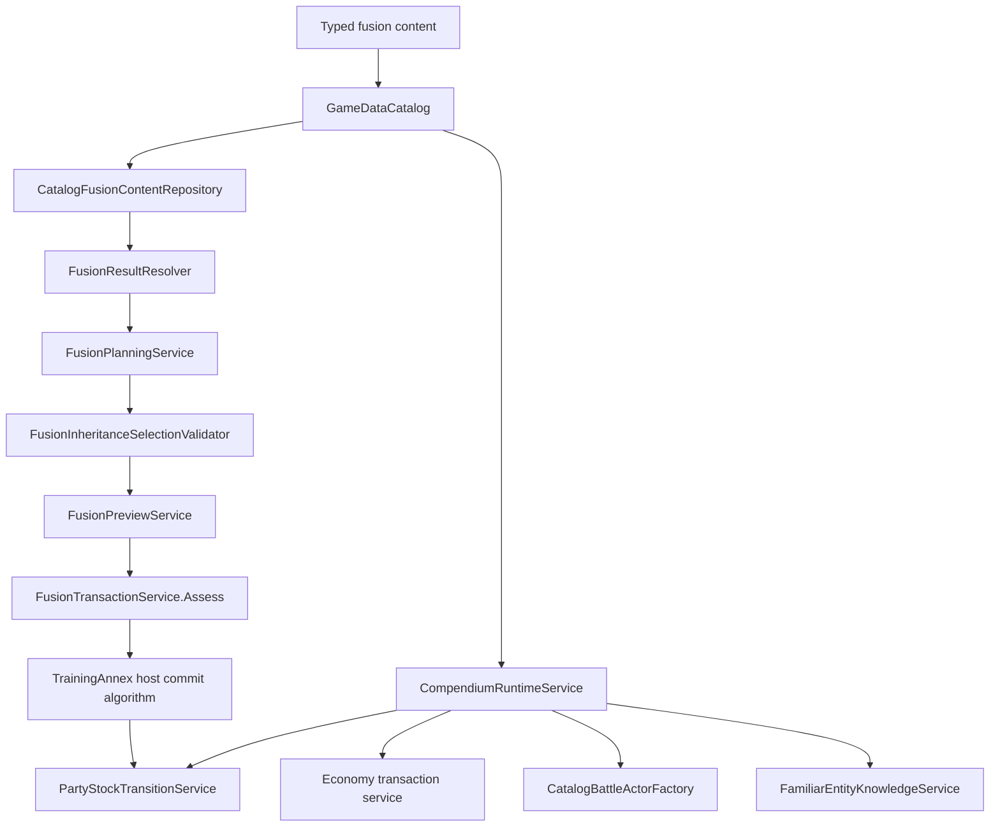

# Phase 7 Code Review And Readiness

> **Status: Initial implementation audit for Phase 7-30 through Phase 7-35, amended after CodeReview-7-1 through CodeReview-7-5. The required Phase 7 review queue is closed for the approved original-content scope.** This review began from source at `00ab189` and is updated from the implementation itself. Review closure does not authorize legacy removal or promote a capability to `clean_parity`.

## Executive Verdict

Phase 7 achieved meaningful framework-first progress:

- original catalog fusion recipes can produce typed results without `fusion_table.json`;
- inheritance planning uses typed entity and skill policies, including the approved passive-fodder behavior;
- preview and final selection share the same inheritance evaluator;
- fusion strategy choices are explicit host-supplied policies rather than hidden Moon Phase, catalyst-name, mutation, or slot assumptions;
- the Training Annex can demonstrate an externally atomic fusion commit through immutable snapshots;
- clean Compendium registration and recall use catalog actors, party/stock transitions, wallet transactions, persistence, and typed diagnostics;
- familiar ownership can explicitly import defenses into persistent player knowledge while ordinary enemy AI knowledge remains encounter-local.

The current sample paths are green and are not false demonstrations. They execute real framework services and mutate real clean runtime snapshots.

The initial review found two high-severity framework contract/integrity gaps and three medium-severity ownership/validation gaps. CodeReview-7-1 resolves the recipe-contract finding. CodeReview-7-2 resolves the runtime-identity finding. CodeReview-7-3 resolves fusion commit ownership by moving preparation, actor construction, parent consumption, typed result placement, and rollback decisions into one injected framework service. CodeReview-7-4 resolves accident-strategy context loss. CodeReview-7-5 resolves Compendium entry and save validation.

**Verdict:** Phase 7 is review-closed for its approved scope and Phase 8-36 may begin. Fusion and Compendium remain `parallel_partial` because the protected legacy consumers still exist and the framework intentionally does not prescribe a complete game-specific fusion design.

## Audit Scope

### Commit range

| Pass | Commit | Capability |
| --- | --- | --- |
| 7-30 | `367d4f3` | Catalog-backed fusion result calculation |
| 7-31 | `790d779` | Inheritance slots, mutation, and accident evidence |
| 7-32 | `8fe6960` | Preview and confirmation |
| 7-33 | `b97eb60` | Fusion transaction proof |
| 7-34 | `660a564` | Explicit fusion strategy policies |
| 7-35 | `00ab189` | Compendium, recall, persistence, and familiar knowledge |

The comparison baseline is `d2e7922`, the last pre-Phase 7 review/follow-up commit.

### Primary implementation reviewed

- `JRPG.Framework/Data/Definitions/ContentSurfaceDefinitions.cs`
- `JRPG.Framework/Data/SkillSystem/Validation/SkillSystemContentValidator.cs`
- `JRPG.Framework/Logic/Fusion/CatalogFusionContentRepository.cs`
- `JRPG.Framework/Logic/Fusion/FusionRuntimeServices.cs`
- `JRPG.Framework/Logic/Fusion/FusionStrategyPolicies.cs`
- `JRPG.Framework/Logic/Fusion/CompendiumRuntimeServices.cs`
- `JRPG.Framework/Logic/Fusion/Inheritance/`
- `JRPG.Framework/Logic/Runtime/PartyStockTransitions.cs`
- `JRPG.Framework/Logic/Runtime/RuntimePersistenceSnapshots.cs`
- `Host/CleanConsole/TrainingAnnex/TrainingAnnexFusionController.cs`
- `Host/CleanConsole/TrainingAnnex/TrainingAnnexCompendiumController.cs`
- `Host/CleanConsole/TrainingAnnex/TrainingAnnexPersistenceController.cs`
- `Logic/Fusion/LegacyFusionStrategyPolicies.cs`
- `Logic/Fusion/LegacyFusionContentAdapter.cs`

### Tests reviewed

- `Convergence.Tests/Runtime/FusionCompendiumRuntimeTests.cs`
- `Convergence.Tests/Runtime/FusionStrategyPolicyTests.cs`
- `Convergence.Tests/Runtime/CompendiumRuntimeServiceTests.cs`
- `Convergence.Tests/Runtime/PartyStockTransitionTests.cs`
- `Convergence.Tests/Runtime/RuntimePersistenceSnapshotTests.cs`
- `Convergence.Tests/SkillSystem/FusionInheritanceTests.cs`
- `Convergence.Tests/SkillSystem/OriginalCleanContentSliceTests.cs`
- `Convergence.Tests/Host/CleanTrainingAnnexPlayHostTests.cs`
- protected Cathedral and fusion regression tests
- framework boundary tests

## Findings

### Critical

None.

### High, resolved by CodeReview-7-1: The catalog fusion adapter loses parent selector kinds and silently drops valid recipe shapes

The authored definition is typed:

- `FusionParentSelectorDefinition` stores both `FusionParentSelectorKind` and `ContentId`.
- validation treats entity and race references differently;
- at the initial review point, validation accepted any recipe with at least two parents.

The runtime adapter does not preserve that contract:

- `CatalogFusionContentRepository.ToRecipeSnapshot(...)` returns `null` when `Parents.Count != 2`;
- the constructor filters those `null` values out without a diagnostic;
- for a two-parent recipe, only `parent.Id` is copied into `FusionRecipeSnapshot`;
- `FusionResultResolver` first compares both IDs against entity IDs, then compares both against race IDs.

Consequences:

1. A schema-valid three-parent recipe loads into `GameDataCatalog` and then disappears from `IFusionContentRepository`.
2. A schema-valid mixed `entity + race` recipe can never match, because the resolver only performs entity/entity and race/race comparisons.
3. If an entity and race use the same qualified textual ID, dropping the selector kind makes the match ambiguous.
4. The failure surfaces later as `NoRecipe`, not as an actionable catalog/runtime diagnostic explaining that the authored shape was unsupported.

There is a second compatibility leak in the same contract. `FusionRecipeSnapshot` still requires a string `ResultToken` even when a structured `FusionRecipeResultSnapshot` exists. The clean catalog adapter fabricates that token through `ToLegacyResultToken(...)`. This keeps legacy representation mandatory in the clean path and lets `TryResolveDirectCreateResult(...)` consult compatibility text before fully respecting the structured operation.

At the initial review point, tests covered one entity/entity recipe and one race/race recipe. They did not cover mixed selector kinds, selector-ID collisions, or more than two parents.

**Required correction: CodeReview-7-1**

- Add a typed runtime parent selector snapshot that preserves `Kind` and `Id`.
- Make structured result data primary and make the unstructured token optional and legacy-only.
- Decide the supported cardinality explicitly:
  - either support the schema's current two-or-more contract in runtime planning;
  - or change validation to reject anything except the approved binary shape.
- Never silently omit a validated recipe.
- Add entity/entity, race/race, entity/race, reversed order, selector-ID collision, and unsupported-cardinality tests.

**CodeReview-7-1 resolution, 2026-07-11:**

- `FusionRecipeSnapshot` now owns two `FusionRecipeParentSelectorSnapshot` values, each preserving `FusionParentSelectorKind` and `ContentId`.
- Schema v1 now explicitly requires exactly two recipe parents. Sacrificial fusion remains a separate planning input and is not represented as a third recipe parent.
- The catalog adapter maps every validated binary recipe and throws if malformed unvalidated catalog data reaches it; it no longer filters recipes out.
- Entity/entity, mixed, and race/race matches are parent-order neutral. More entity-specific matches take precedence, with authored repository order breaking equal-specificity ties.
- Structured `FusionRecipeResultSnapshot` data is authoritative. `CompatibilityResultToken` is optional and populated only by the protected legacy adapter.
- The legacy dataset audit found 460 recipes using 30 unique race selector tokens and 4 unique entity selector tokens, with no unknown or ambiguous parent tokens.
- Regression coverage now proves entity/entity and race/race catalog mapping, mixed selectors, reversed order, selector-ID collision handling, selector specificity, structured-result precedence, one/three-parent rejection, and fail-fast adapter behavior.

This finding is closed. Phase 7 review closure required the separate identity, transaction, policy-context, and Compendium-integrity corrections, all of which are now complete.

### High, resolved by CodeReview-7-2: Compendium recall can return a party snapshot with a duplicate runtime instance ID

`CompendiumRecallTransactionRequest` lets the host supply the recalled actor's `RuntimeInstanceId`. The service checks whether the entity is already owned, but it does not separately check whether that runtime ID is already used by another actor.

The stock transition checks are collection-specific:

- `AddDemonToStock(...)` checks only active party and Demon stock;
- `AddPersonaToStock(...)` checks only active form and Persona stock.

Therefore, a caller can reuse an ID from reserve party, the opposite stock family, or another unchecked collection for a different entity. The entity-duplicate check remains false, actor creation succeeds under the reused ID, the wallet can be charged, and recall can report `Applied` with an invalid identity graph.

The Training Annex host avoids this through its own `NextRecallInstanceId(...)` generator. That protects the sample but not the public framework contract. A Godot host should not need to know every hidden uniqueness rule to prevent state corruption.

`RuntimeSaveValidator` also checks duplicates mostly within individual lists and only selected cross-list overlaps. It does not validate that every party/stock reference's entity ID matches the referenced actor snapshot.

**Required correction: CodeReview-7-2**

- Add a typed duplicate-runtime-ID recall diagnostic.
- Reject a recalled instance ID already present anywhere in owner, active party, reserve party, active form, Persona stock, or Demon stock.
- Harden `AddDemonToStock(...)` and `AddPersonaToStock(...)` around the same global identity invariant, or centralize the invariant in one reusable validator.
- Extend save validation to detect illegal cross-list identity reuse and reference/entity mismatches while preserving the intentional active-party plus Demon-stock overlap for the same actor.
- Test both Demon and Persona recall destinations with collisions in every relevant collection.

**CodeReview-7-2 resolution, 2026-07-11:**

- `RuntimePartyStockIdentityRules` now enumerates owner, active party, reserve party, active form, Persona stock, and Demon stock from one deterministic source.
- `CompendiumRuntimeService.Recall(...)` rejects a proposed recall ID used anywhere in that graph before actor construction, stock placement, recall-cost assessment, or wallet mutation. It returns the typed `DuplicateRuntimeInstanceId` transaction and diagnostic codes.
- `PartyStockTransitionService` rejects cross-role ID reuse through `RuntimeInstanceIdInUse` for Demon/Persona additions and replacements. Existing destination duplicates retain `DuplicateOwned`, preserving the prior public distinction.
- `RuntimeSaveValidator` now verifies every party/stock reference against its actor snapshot's entity ID and rejects illegal cross-role reuse through `ActorReferenceEntityMismatch` and `PartyStockIdentityCollision` diagnostics with authored save paths.
- The deliberate unified-stock model remains legal: an active demon may also appear in Demon stock, and the owner may be both the active party member and owned active demon. Active-form/Persona-stock duplication and active/reserve duplication remain invalid through their existing dedicated diagnostics.
- Demon and Persona recall tests cover collisions in all six ownership locations and assert that party, wallet, and actor output remain unchanged. Save tests cover every reference role, legal overlap, illegal overlap, and mismatched entity references.

This finding is closed. The framework no longer depends on a host-generated ID convention to protect recall integrity.

### Medium, resolved by CodeReview-7-3: Fusion commit orchestration remains host-owned

The full-parity target says parent consumption, result ownership, stock updates, and rollback should be framework transaction decisions.

The current `FusionTransactionService` exposes only `Assess(...)`. It validates selected skill IDs, duplicate result ownership, and a caller-supplied `HasOpenStockSlot` boolean, then returns participant IDs to consume. It does not construct the result actor or apply a transaction to party/stock state.

`TrainingAnnexFusionController.CommitAsync(...)` currently owns the gameplay coordination:

- constructing/restoring the result actor;
- choosing a runtime instance ID;
- consuming parents one by one;
- adding the result to Demon stock;
- choosing the original snapshot as rollback when a later transition fails;
- calculating stock capacity with a new `LegacyStockCapacityPolicy`;
- choosing Demon-specific transitions.

The controller does this safely for its sample because all intermediate snapshots are immutable and it only returns the final snapshot after every operation succeeds. The concern is ownership and reuse: a Godot host would need to reproduce the same rule sequence.

`FusionTransactionRequest.OwnerKind` is currently unused by `FusionTransactionService`, which is evidence that the public transaction shape promises more than the service enforces.

**Required correction: CodeReview-7-3**

- Add a framework commit/prepare service that owns the complete immutable transaction decision.
- Consume a validated inheritance selection rather than reaccepting loose selected IDs.
- Honor Demon versus Persona ownership through the typed owner kind.
- Use an injected stock-capacity/stock-transition policy rather than a host-created legacy default.
- Let the host supply identity generation or a proposed result identity without owning the transaction algorithm.
- Return one typed applied/rejected result containing before/after party state, result actor/snapshot, consumed IDs, and diagnostics.
- Keep presentation and final acceptance host-owned.

**CodeReview-7-3 resolution, 2026-07-11:**

- The old `FusionTransactionRequest` boolean contract and `Assess(...)` method are removed. Callers can no longer claim that a result is not owned or that a slot is available.
- `FusionTransactionService.Prepare(...)` accepts a `ValidatedFusionInheritanceSelection`, the actual immutable party/stock snapshot, typed Demon/Persona owner kind, and a host-proposed result identity.
- Preparation derives duplicate ownership, identity availability, participant/entity consistency, stock capacity, parent consumption, and result placement through the injected `IPartyStockTransitionService`. It returns an immutable `PreparedFusionTransaction`; it does not construct an actor or mutate host state.
- Demon ownership uses Demon consume/add transitions. Persona ownership uses Persona consume/add transitions. No Demon-specific branch remains in the Training Annex controller.
- `Commit(...)` is allowed only against the exact snapshot used during preparation. A stale confirmation returns `PreparationStale` and preserves the newer state.
- Actor creation and preview skill/stat restoration run through the injected `ICatalogBattleActorFactory`. Actor failure returns the original snapshot and typed diagnostics rather than throwing after host mutation.
- The applied/rejected contracts carry before/after party state, consumed participant IDs, attempted stock transitions, result actor and immutable snapshot, and diagnostics. Stat-boost transactions retain the transformed actor identity and consume only the catalyst.
- Training Annex now binds `standard_stock_capacity` through `RuntimeRulesetBindingResolver`, injects that policy into the shared party/stock transition service, and injects the same service into fusion and Compendium paths.
- The host still chooses the proposed runtime ID, presents the preview and confirmation, and decides whether to call `Commit(...)`. Cancellation after preparation creates no actor and applies no prepared state.

**Post-interruption audit hardening, 2026-07-11:**

- repeated runtime IDs across parent or sacrifice slots are rejected as `DuplicateParticipant` instead of being silently collapsed into one consumed actor;
- every intentional active-party plus Demon-stock occurrence is checked against the participant entity, so a correct first reference cannot hide a conflicting owned reference;
- result team/controller ownership and the optional retained stat-boost actor snapshot are bound during preparation. Commit cannot change actor-construction inputs after confirmation, and it rejects a different retained snapshot as stale;
- stat boosts require their retained actor snapshot before stock simulation and preserve separate learned/equipped skill state instead of equipping every learned skill;
- injected preview and actor-factory results are checked against the prepared entity, selection, ownership, progression, stats, and skills;
- rejected commits expose no applied consumed IDs or stock transitions. Their planned evidence remains available explicitly through `PlannedConsumedParticipantIds`, `PlannedStockTransitions`, and the prepared token.

This finding is closed after the follow-up audit. A Godot host can use the same prepare/confirm/commit boundary without reproducing stock math or rollback ordering or supplying mutable result-construction choices after confirmation.

### Medium, resolved by CodeReview-7-4: Accident inheritance dropped the plan's policy context

`FusionPlanningService.CreatePlan(...)` correctly passes `FusionPolicyContext` into:

- fusion result resolution;
- sacrifice assessment;
- inheritance-slot policy calculation.

`CreateAccidentInheritance(...)` later calls `MutateSkill(...)` with `FusionPolicyContext.Empty`. The plan does not retain the context, and the method has no context parameter.

The built-in adjacent-tier mutation policy does not currently inspect context, so all existing tests pass. A developer-supplied mutation policy based on story progress, difficulty, a custom cycle, or another host fact will see the requested context during planning and an empty context during accident inheritance.

This contradicts the Phase 7-34 promise that optional host/session facts flow consistently through strategy policies.

**Required correction: CodeReview-7-4**

- Preserve the immutable `FusionPolicyContext` in `FusionPlanningResult`, or require it explicitly when creating accident inheritance.
- Pass that context to every mutation call.
- Review the context-free `GetInheritanceSlotCount(...)` helper and either mark it deliberately context-free or add an explicit context overload.
- Add a recording mutation policy test that fails unless the exact authored context reaches accident inheritance.

**Resolution, 2026-07-11:**

- `FusionPlanningResult` now retains the exact immutable `FusionPolicyContext` used by planning, including unsuccessful planning results.
- `CreateAccidentInheritance(...)` passes that retained context to every registered mutation-policy invocation. Callers cannot accidentally substitute a different context after preview/planning.
- The existing one-argument `GetInheritanceSlotCount(...)` remains an intentional context-free compatibility helper and delegates through `FusionPolicyContext.Empty`; a second overload requires an explicit context for context-sensitive slot policies.
- Recording slot and mutation policy tests assert object identity and authored flag/numeric values, so a future empty-context substitution will fail even when the built-in adjacent-tier policy would produce the same skill IDs.

This finding is closed. The correction changes no built-in fusion outcome; it makes developer-supplied policies receive consistent host/session facts across planning and accident mutation.

### Medium, resolved by CodeReview-7-5: Compendium save validation did not enforce all entry invariants

Registration through `CompendiumRuntimeService.RegisterActor(...)` rejects non-integral, negative, or out-of-range base stats. A host-owned save can reconstruct `CompendiumEntrySnapshot` directly and bypass that registration path.

Current save validation checks:

- duplicate Compendium entity entries;
- missing or ineligible entities;
- missing skill references;
- equipped skills that are not learned.

It does not check:

- duplicate learned skill IDs;
- duplicate equipped skill IDs;
- negative stat values;
- whether all required/registered stat IDs are structurally sensible for recall.

This matters because recall pricing counts `SkillIds.Count`, so duplicate saved skill IDs can inflate cost, while negative saved stats can reduce the calculated cost and produce invalid actor state. The actor factory may reject some malformed shapes later, but the save validator is supposed to reject invalid records before transaction execution.

**Required correction: CodeReview-7-5**

- Add stable validation codes for duplicate learned/equipped skills and invalid Compendium stat values.
- Validate the entry before recall can spend currency or create an actor.
- Add host-owned JSON corruption tests, not only directly constructed valid entries.
- Keep graph/catalog checks in `RuntimeSaveValidator`; do not put JSON types into framework contracts.

**Resolution, 2026-07-11:**

- one internal serializer-neutral Compendium entry validator now owns duplicate learned/equipped skills, negative values, missing or unknown authored stats, missing catalog skills, and equipped-not-learned checks;
- an empty saved stat block deliberately requests catalog defaults, while a nonempty override must contain exactly the entity's authored stat IDs;
- `RuntimeSaveValidator` maps those issues to stable public save-validation codes and precise authored collection paths;
- `CompendiumRuntimeService` requires both entity and skill repositories and runs the same validator during registration and before recall identity checks, stock simulation, pricing, actor creation, or wallet mutation;
- invalid recall returns typed `InvalidEntry` diagnostics with unchanged party and wallet snapshots, zero cost, and no actor;
- host-owned JSON corruption tests mutate serialized Compendium arrays and stat maps, deserialize through the normal console codec, and prove framework rejection without placing JSON types in framework contracts.

This finding is closed. The check is enforced both when a complete save is validated and when a host calls recall directly without first validating a save.

### Low: Compendium pricing has no narrow policy boundary

`CompendiumService.CalculateRecallCost(...)` currently implements one fixed formula:

```text
base price (default 2000)
+ level * 100
+ stat sum * 50
+ learned skill count * 200
```

A developer can replace the entire `ICompendiumService`, so this is not a mandatory feature or an immediate correctness defect. However, changing only pricing should not require replacing registration, lookup, and recall assessment too.

**Recommended resolution:** introduce an explicit `ICompendiumRecallPricingPolicy` before a production game depends on recall economy. The Training Annex may register the existing sample formula, while another host may use content price, flat price, free recall, progression discounts, or no recall economy.

### Low, corrected during this review: active documentation had stale Phase 7 evidence

The source audit found three documentation/evidence drifts:

- the roadmap table still said Compendium was pending;
- `fusion-independence.md` still recommended implementing Phase 7-35;
- the parity ledger referenced the renamed/nonexistent `ResultResolver_PreservesSpecificRankAccidentAndMitamaRules` test.

This review updates those references. No gameplay behavior or parity status changes as a result.

## Phase-By-Phase Assessment

### 7-30: Fusion result calculation

The structured create and rank-offset sample paths work and use `GameDataCatalog`. Specific entity-pair lookup is attempted before race-pair lookup, and result IDs are catalog-validated.

The initial pass was not contract-complete because the catalog adapter lost selector kinds and cardinality. CodeReview-7-1 resolves that contract gap; the broader capability remains `parallel_partial` until the rest of the Phase 7 review queue is complete.

### 7-31: Slots, mutation, and accidents

The inheritance planner is one of the strongest Phase 7 components:

- it defensively snapshots candidates;
- deduplicates in authored order;
- distinguishes already-known from policy-rejected skills;
- reuses the same evaluator for final validation;
- preserves the approved passive-fodder rule;
- does not inspect display names or descriptions.

Tiered slots and mutation are opt-in policies. CodeReview-7-4 closes the context gap by retaining planning context through accident mutation and by making contextual versus context-free standalone slot calculation explicit.

The clean transaction does not yet commit an actual accident outcome. That remains an honest scope boundary because the owner has not approved a final accident design.

### 7-32: Preview and confirmation

Preview behavior is correct for the approved scope:

- the host presents candidate rows;
- the framework validates selected IDs;
- preview is built only from a successful plan and validated selection;
- cancellation and confirmation do not mutate runtime state.

No independent defect was found in `FusionPreviewService` for the demonstrated create-entity path.

### 7-33: Fusion transactions

The Training Annex sample is now framework-atomic. `FusionTransactionService.Prepare(...)` calculates the complete immutable stock decision through injected transitions, and `Commit(...)` constructs the result actor only after host confirmation. Failed capacity, identity, participant, transition, stale-state, or actor-construction checks return an unchanged authoritative snapshot. The host applies only an `Applied` result.

### 7-34: Strategy policies

This pass successfully removed the most concerning inherited assumptions from `JRPG.Framework`:

- no Moon Phase requirement;
- no Mitama or Element names;
- no fixed accident/mutation probabilities;
- no fixed sacrifice bonus or slot table;
- no display-name-driven catalyst behavior.

Legacy-specific values live in `LegacyFusionStrategyPolicies` under the console host. Clean hosts must provide a `FusionPolicyRegistry`.

The remaining contract issues are the compatibility token retained by clean recipe snapshots and policy-context loss during accident mutation.

### 7-35: Compendium and familiar knowledge

The main Compendium path is well structured:

- registration captures durable catalog actor state into immutable entries;
- recall checks entity eligibility, duplicate entity ownership, capacity, cost, actor reconstruction, and wallet spending;
- rejected results return unchanged party and wallet snapshots;
- learned and equipped skills are preserved separately;
- dynamically recalled actors and Compendium state survive save/load;
- familiar knowledge import is explicit and serializer/host neutral;
- player knowledge persists while ordinary enemy AI knowledge remains fresh per encounter.

The required follow-ups are runtime-ID uniqueness and stronger malformed-save validation. Pricing modularity is recommended before production use.

## Architecture Assessment



The Compendium branch is close to the desired reusable shape. The fusion branch still stops at assessment, leaving commit coordination in the sample host.

## Test Quality Assessment

### What the tests prove well

- Clean catalog recipes resolve the Training Annex entity/entity and race/race samples.
- Missing strategy registrations reject before randomness or mutation.
- typed inheritance precedence and passive fodder work independently of display text;
- preview and selection validation agree;
- duplicate result, cancellation, and successful Training Annex transaction paths preserve external atomicity;
- legacy Cathedral behavior remains characterized after policy extraction;
- Compendium registration snapshots are isolated;
- valid recall restores progression, stats, learned/equipped skills, and full resources;
- insufficient currency, duplicate ownership, and stock-full recall paths do not mutate state;
- familiar imports affect player knowledge and not encounter AI knowledge;
- Compendium and recalled actors survive host-owned JSON save/load;
- public framework boundaries remain free of console, filesystem, serializer, Godot, and legacy DTO types.

### Missing regression coverage

- mixed entity/race recipe selectors;
- three-or-more parent recipe handling or rejection;
- selector-kind collision with equal IDs;
- structured recipes that must not depend on a compatibility result token;
- policy-context propagation into accident mutation;
- framework-owned commit rather than host-owned sequencing;
- use of `FusionParticipantStockKind.Persona`;
- recalled runtime-ID collision across every party/stock collection;
- reference entity-ID mismatch against the actor snapshot;
- duplicate Compendium learned/equipped skills and negative saved stats;
- custom recall pricing without replacing the entire Compendium service.

The existing tests are valuable, but their green result should be read as proof of the implemented sample paths, not proof that every valid schema or host integration is supported.

## Hardcoding And Modularity Review

### Correctly isolated

- Moon Phase accident rates are console compatibility policy data.
- Mitama IDs and Element blocking are console compatibility policy data.
- Training Annex accident/mutation percentages, slot tiers, and sacrifice bonus are explicit host-selected sample policies.
- sample actor IDs and menu flows remain in the Training Annex host.
- familiar knowledge import is opt-in rather than automatic global state.

### After required corrections

- mutation context is retained through accident inheritance;
- malformed Compendium stat and skill state is rejected at save, registration, and recall boundaries;
- Compendium default pricing remains fixed unless the whole service is replaced. This is optional design hardening rather than a Phase 7 correctness gate.

The large `TrainingAnnexFusionController` and `TrainingAnnexCompendiumController` are not themselves reasons to refactor console presentation now. Only the gameplay coordination identified above should move into the framework. Menu text and demonstration evidence can remain host-owned.

## Verification Evidence

Initial review verification on 2026-07-11 produced:

| Check | Result |
| --- | --- |
| Fusion/Compendium-focused tests | `98/98` passed, `0` failed, `0` skipped |
| Full solution tests | `893/893` passed, `0` failed, `0` skipped |
| Framework nonincremental build | succeeded, `0` warnings, `0` errors |
| Full solution nonincremental build | succeeded, `98` protected legacy-host warnings, `0` errors |
| Clean battle demo | passed; player team victory |
| Clean field demo | passed |
| Clean save demo | passed; save contract v5 validated with `0` diagnostics |
| Clean Training Annex demo | passed; victory, reward, and save validation completed |

The build warnings remain in protected legacy console-host code. No new warning was emitted by `JRPG.Framework`.

CodeReview-7-1 follow-up verification on 2026-07-11 produced:

| Check | Result |
| --- | --- |
| Focused typed-recipe/catalog contract tests | `33/33` passed |
| Broad fusion/Compendium regression gate | `113/113` passed |
| Full solution tests | `899/899` passed, `0` failed, `0` skipped |
| Framework nonincremental build | succeeded, `0` warnings, `0` errors |
| Full solution nonincremental build | succeeded, `98` protected legacy-host warnings, `0` errors |
| Clean battle, field, save, and Training Annex demos | all passed |
| Framework forbidden-reference scan | no forbidden production references |
| `git diff --check` | passed |
| Production/prototype `Data/Jsons` | unchanged |

CodeReview-7-2 follow-up verification on 2026-07-11 produced:

| Check | Result |
| --- | --- |
| Focused identity, recall, stock, save, host, and ledger gate | `166/166` passed, `0` failed, `0` skipped |
| Full solution tests | `915/915` passed, `0` failed, `0` skipped |
| Framework nonincremental build | succeeded, `0` warnings, `0` errors |
| Full solution nonincremental build | succeeded, `98` protected legacy-host warnings, `0` errors |
| Clean battle, field, save, and Training Annex demos | all passed; save snapshots validated with `0` diagnostics |
| Framework forbidden-reference scan | no forbidden production references |
| `git diff --check` | passed |
| Production/prototype `Data/Jsons` | unchanged |

CodeReview-7-3 follow-up verification on 2026-07-11 produced:

| Check | Result |
| --- | --- |
| Broad fusion, stock, persistence, host, boundary, and roadmap gate | `198/198` passed, `0` failed, `0` skipped |
| Full solution tests | `930/930` passed, `0` failed, `0` skipped |
| Framework nonincremental build | succeeded, `0` warnings, `0` errors |
| Full solution nonincremental build | succeeded, `98` protected legacy-host warnings, `0` errors |
| Clean battle, field, save, and Training Annex demos | all passed; save snapshots validated with `0` diagnostics |
| Framework forbidden-reference scan | no forbidden production references |
| `git diff --check` | passed |
| Production/prototype `Data/Jsons` | unchanged |

CodeReview-7-4 follow-up verification on 2026-07-11 produced:

| Check | Result |
| --- | --- |
| Focused fusion strategy and transaction tests | `27/27` passed, `0` failed, `0` skipped |
| Broad fusion, stock, persistence, host, boundary, and roadmap gate | `200/200` passed, `0` failed, `0` skipped |
| Full solution tests | `932/932` passed, `0` failed, `0` skipped |
| Framework nonincremental build | succeeded, `0` warnings, `0` errors |
| Full solution nonincremental build | succeeded, `98` protected legacy-host warnings, `0` errors |
| Clean battle, field, save, and Training Annex demos | all passed; save snapshots validated with `0` diagnostics |
| Documentation, parity-ledger, and framework-boundary guard tests | `10/10` passed |
| Framework forbidden-reference and stale-context scans | no forbidden production references; accident inheritance contains no empty-context substitution |
| `git diff --check` | passed |
| Production/prototype `Data/Jsons` | unchanged |

CodeReview-7-5 follow-up verification on 2026-07-11 produced:

| Check | Result |
| --- | --- |
| Focused Compendium runtime, persistence, and host JSON tests | `49/49` passed, `0` failed, `0` skipped |
| Expanded Phase 7 fusion, Compendium, stock, persistence, host, boundary, and roadmap gate | `233/233` passed, `0` failed, `0` skipped |
| Full solution tests | `937/937` passed, `0` failed, `0` skipped |
| Framework nonincremental build | succeeded, `0` warnings, `0` errors |
| Full solution nonincremental build | succeeded, `98` protected legacy-host warnings, `0` errors |
| Clean battle, field, save, and Training Annex demos | all passed; save snapshots validated with `0` diagnostics |
| Documentation, parity-ledger, and framework-boundary guard tests | `10/10` passed |
| Framework runtime forbidden-reference scan | no forbidden production references under `JRPG.Framework/Logic` |
| `git diff --check` | passed |
| Production/prototype `Data/Jsons` | unchanged |

## Readiness Decision

Phase 7 is **implemented and review-closed for the approved original-content scope**. CodeReview-7-1 through CodeReview-7-5 are complete.

It is safe to retain as the current clean demonstration baseline and proceed to Phase 8-36. This does not mean every possible game-specific fusion chart, accident design, pricing model, or Cathedral replacement has been implemented.

No legacy removal is authorized. Every Phase 7 capability remains `parallel_partial`.

## Required Follow-Up Queue

1. **CodeReview-7-1: Preserve the authored fusion recipe contract. Completed 2026-07-11.**
   Runtime selector kinds are preserved, schema v1 is explicitly binary, malformed cardinality is rejected rather than omitted, and legacy result tokens are optional compatibility data.
2. **CodeReview-7-2: Enforce global runtime identity during recall and stock changes. Completed 2026-07-11.**
   Recall and stock transitions reject cross-collection runtime-ID collisions before mutation, while save validation enforces legal overlap and actor/entity reference consistency.
3. **CodeReview-7-3: Move clean fusion commit coordination into the framework. Completed 2026-07-11.**
   Validated preparation and stale-safe commit now honor owner kind and injected stock/actor policies in typed immutable results.
4. **CodeReview-7-4: Preserve strategy context through accident inheritance. Completed 2026-07-11.**
   Planning results retain immutable policy context, every accident mutation receives it, and explicit recording-policy regressions protect both mutation and standalone slot-helper context behavior.
5. **CodeReview-7-5: Harden Compendium entry/save validation. Completed 2026-07-11.**
   Shared serializer-neutral validation rejects duplicate skills and malformed stat overrides at save, registration, and pre-mutation recall boundaries, including host-owned JSON corruption cases.
6. **Optional design hardening:** extract a narrow Compendium recall-pricing policy before production economy depends on the current sample formula.

All required follow-ups are complete. Phase 8-36 can begin from this reviewed Phase 7 baseline; the optional pricing-policy extraction remains a future design choice.
