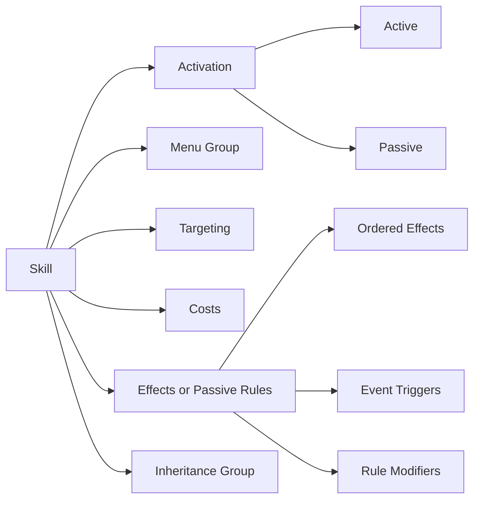

# Skill System GDD

## Status

This document is the design target for the skill system. Runtime code and content schemas may temporarily differ during refactoring, but new design decisions should conform to this model unless this document is deliberately revised.

This document is normative for the redesign. The schema proposal, fixtures, implementation plan, runtime code, and legacy datasets must not contradict it.

## Design Goal

Skills should be composable, understandable without reading code, and classifiable without a miscellaneous `special` category. A skill is described through independent axes rather than one overloaded behavior type.



These axes must remain separate. For example, `passive` describes activation, `recovery` describes menu placement and inheritance, and `restore_resource` describes behavior.

## Elements And Defensive Responses

The complete damage-element vocabulary is:

```text
physical
fire
ice
electric
wind
light
dark
almighty
```

- An **element** is the damage channel used by a `damage` effect.
- An **elemental affinity** is an entity's response to elemental damage: `weak`, `normal`, `resist`, `null`, `repel`, or `absorb`.
- `resist` is one affinity value, not a separate competing elemental system.
- Almighty always resolves with a normal affinity response and cannot be weak, resisted, nulled, repelled, or absorbed.
- Recovery, curing, buffs, debuffs, ailments, and passives are not elements.
- Every ailment uses its own resistance entry, such as `poison`, `sleep`, or `fear`, with one of: `vulnerable`, `normal`, `resistant`, or `immune`.
- Ailment groups may support broad cures or passive modifiers, but they never replace the target's ailment-specific resistance entry.
- Instant death is separate from both elemental affinity and ailment resistance. Hama-line skills check the `light` instant-death channel and Mudo-line skills check the `dark` instant-death channel. Each channel uses `vulnerable`, `normal`, `resistant`, or `immune`.
- Conditional instant death may explicitly bypass those channels. Eternal Rest uses no resistance channel: each sleeping eligible target is defeated, while a target that is not sleeping is skipped.
- Basic weapon attacks deal `physical` damage. Slash, Strike, and Pierce may survive as descriptive weapon or animation metadata, but they are not damage elements or affinities.

## Runtime Combat Resolution

Catalog-backed entities expose one immutable combat-defense profile with three independent maps: elemental affinities by `DamageElement`, ailment resistances by ailment `ContentId`, and instant-death resistances by the fixed Light/Dark channels. A missing entry in any map resolves to its normal value. Almighty always resolves to normal without consulting the elemental-affinity map.

Elemental affinity is resolved in this order:

1. Almighty returns `normal`.
2. A matching physical or magical reflection shield returns `repel`.
3. An active Break normalizes the affected element.
4. A temporary affinity override supplies its authored affinity.
5. The strongest response from the base affinity and applicable passive replacements wins: `absorb > repel > null > resist > normal > weak`.

This resolver returns the six typed affinity outcomes only. Numeric damage multipliers are not part of the Track 7 contract. The legacy console rules that normalize weaknesses while guarding or normalize physical defenses during rigid-body ailments also remain outside the clean resolver until they are reviewed as explicit gameplay rules.

Instant-death resolution selects either a Light/Dark channel and returns that channel's `ResistanceLevel`, or returns an explicit bypass result for a `mode: none` check. It does not assign success-rate multipliers to `vulnerable` or `resistant`; probability policy belongs to active effect execution after those balance values are approved. Eternal Rest therefore bypasses resistance only because its authored resistance check explicitly uses `mode: none`, not because of its name or inheritance group.

Battle knowledge stores elemental-affinity, ailment-resistance, and instant-death-resistance discoveries separately. Elemental discoveries use damage elements and ignore Almighty. Ailment discoveries use ailment IDs, and instant-death discoveries use Light/Dark channels. These stores must not share keys or infer one defense from another.

Player and enemy knowledge have different lifetimes. Ordinary enemy AI knowledge is encounter-local and begins empty for each battle unless a host explicitly supplies a special policy, such as authored boss memory. Player knowledge is persistent host/session state. A host may explicitly import defenses for familiar catalog entities through `FamiliarEntityKnowledgeService` after recruitment, fusion, recall, Compendium registration, or another approved ownership event. This import is optional, definition-driven, and returns a new player knowledge snapshot; it never writes to an enemy AI knowledge store. Each knowledge channel permits one value per typed key: `(entity, element)`, `(entity, ailment)`, or `(entity, instant-death channel)`. Duplicate keys are invalid and must be rejected before restore or import rather than silently merged. Missing entries use the same typed `normal` defaults as combat defense resolution, while Almighty is never recorded.

During compatibility migration, legacy Slash, Strike, and Pierce values may be adapted to the clean `physical` damage element only at an explicit adapter boundary. Existing legacy entity affinity data is not converted because those three authored affinities may disagree. Weapon type remains available as equipment and presentation metadata, while the clean basic-attack element is always `physical`.

## Activation

Every skill has exactly one activation model:

| Activation | Meaning |
| --- | --- |
| `active` | The user deliberately selects and executes the skill. |
| `passive` | The skill continuously modifies a rule or responds to a runtime event. |

Passive is not a behavior category. A passive skill must still declare what it modifies or which event and effects it uses.

## Menu Groups

Active skills use one primary menu group for presentation and AI filtering:

| Menu group | Intended contents |
| --- | --- |
| `offense` | Damage and instant-death skills. |
| `ailment` | Skills primarily intended to inflict ailments. |
| `recovery` | HP/SP restoration, curing, and revival. |
| `buff` | Beneficial stat-stage changes and similar enhancements. |
| `debuff` | Harmful stat-stage changes and similar penalties. |
| `utility` | Analysis, escape, shields, affinity breaks, and other tactical tools. |

Mixed skills use the group that best describes their primary purpose. A physical attack with a poison chance remains `offense`. Every active skill declares exactly one `menuGroup`. Passive skills are displayed separately through `activation: passive`, and must not declare `menuGroup`.

Menu groups organize skills; they do not choose runtime implementations.

## Active Effect Vocabulary

Active skills contain an ordered list of one or more effects.

| Effect | Behavior |
| --- | --- |
| `damage` | Deals damage through one of the eight elements. |
| `instant_kill` | Attempts immediate defeat using instant-death resistance. |
| `apply_ailment` | Attempts to inflict an ailment. |
| `restore_resource` | Restores HP, SP, or another declared resource. |
| `remove_ailment` | Removes specified ailments, ailment groups, or all removable ailments. |
| `revive` | Returns a defeated target and restores a declared amount of HP. |
| `modify_stat_stage` | Raises or lowers one or more stat stages. |
| `grant_charge` | Enhances a future physical or magical attack. |
| `grant_shield` | Grants a temporary reflection or protection shield. |
| `break_affinity` | Temporarily normalizes one or more affected elemental affinities. |
| `override_affinity` | Temporarily replaces one or more elemental affinities with an authored affinity. |
| `remove_status_effect` | Removes buffs, debuffs, charges, shields, or similar runtime effects. |
| `reduce_resource` | Directly reduces HP/SP without using normal damage calculation. |
| `set_resource` | Sets a resource to an exact or bounded value. |
| `analyze` | Reveals combat information. |
| `escape` | Requests escape from an eligible battle or host-controlled area. |
| `custom` | Invokes a registered implementation for a genuinely exceptional mechanic. |

Buff and debuff are two directions of the same effect. A positive `stageDelta` is a buff; a negative `stageDelta` is a debuff.

Recovery, curing, and revival remain distinct effects even though they share the `recovery` menu and inheritance groups. This permits composition such as Salvation restoring HP and curing ailments in one action.

Damage drain, conditional execution, multiple hits, critical behavior, and secondary ailments are properties or additional effects, not new behavior categories.

## Effect Conditions And Failure

Every effect may declare one optional `when` condition tree. Conditions compose through `all`, `any`, and `not` nodes rather than a separate conditions-array format. An effect condition is evaluated independently for each target immediately before that effect executes.

```json
{
  "when": {
    "all": [
      { "type": "target_has_ailment", "ailmentIds": ["sleep"] },
      { "not": { "type": "target_has_skill", "skillId": "sleep_immunity" } }
    ]
  }
}
```

Each effect may declare `onFailure` with one of these values:

| Policy | Result |
| --- | --- |
| `continue` | Continue with the next effect for the same target. This is the default when omitted. |
| `stop_target` | Skip remaining effects for this target, but continue processing other targets. |
| `stop_action` | Stop all remaining effects and targets for the action. |

Effect outcomes are distinguished deliberately:

- `success`: the effect resolved validly, including a heal capped by maximum HP or another valid operation that produces no net state change.
- `failure`: a miss, failed chance roll, or resistance result that prevents the intended effect. The effect's `onFailure` policy applies.
- `skipped`: the effect's `when` condition is false. A skipped effect does not activate `onFailure`; execution continues.
- `interrupted`: a battle rule such as Repel ends or redirects execution. Interruptions override authored failure policy.

This permits a damage-plus-ailment skill to use `stop_target` on its damage effect so Poison is not attempted after a miss, while Salvation can continue from a full-HP restore into ailment removal.

## Passive Vocabulary

Passive skills use one or both of these mechanisms:

### Triggered Passives

A trigger listens for a declared event and executes ordinary effects. Representative events include:

```text
battle_start
owner_turn_start
owner_turn_end
owner_after_damage
owner_would_be_defeated
battle_won
```

This supports auto-buffs, regeneration, counters, endure effects, and post-battle recovery without inventing parallel effect formats.

### Rule Modifiers

A rule modifier continuously changes a bounded calculation or rule:

| Modifier | Examples |
| --- | --- |
| `damage_dealt` | Fire Boost, Almighty Amp, single-target boost. |
| `damage_taken` | General or conditional damage reduction. |
| `accuracy` / `evasion` | Dodge and Evade skills. |
| `critical_chance` | Apt Pupil and similar skills. |
| `ailment_infliction` | Poison Boost or broad ailment boosts. |
| `healing_received` / `healing_given` | Divine Grace-style effects. |
| `resource_cost` | Arms Master and Spell Master. |
| `maximum_resource` | HP/SP capacity increases. |
| `elemental_affinity` | Resist, Null, Repel, or Absorb element passives. |
| `basic_attack` | Change attack element, targeting, or drain behavior. |
| `experience_gain` | Reserve or personal EXP modifiers. |

Numeric modifier stacking must not be inferred from skill names. For every numeric modifier type, applicable values resolve with one code-owned policy:

```text
(base + sum(add modifiers)) * product(multiply modifiers)
```

JSON numeric modifiers declare only their modifier type, operation, value, and optional `when` condition tree. They do not author arbitrary stacking groups or numeric priorities.

`ailment_resistance` is not numeric. It is a dedicated replacement keyed by one ailment ID and one `ResistanceLevel`. Multiple applicable replacements use this order:

```text
immune > resistant > normal > vulnerable
```

Therefore Resist Poison changes only Poison resistance and cannot alter elemental affinities, instant-death resistance, or another ailment.

Elemental-affinity passives use one deterministic effective response. After collecting the base affinity and applicable passive replacements, the strongest response wins in this order:

```text
absorb > repel > null > resist > normal > weak
```

Active reflection/protection shields take priority over that result. When no shield applies, an active Break effect temporarily normalizes the affected affinity. Almighty remains normal regardless of base affinities or passives.

### Passive Runtime Semantics

Each clean battle actor owns one ordered passive collection. The collection accepts only immutable passive `SkillDefinition` records, rejects duplicate IDs, and applies enable, disable, add, and remove operations immediately. Trigger and modifier resolution always follows current collection state.

Trigger dispatch order is deterministic:

```text
passive loadout -> trigger -> selected target -> effect
```

Within a trigger, the passive owner is the condition `actor`; each event-selected actor is the condition `target`. Trigger effects reuse the active effect executors, condition tree, and ordinary `continue`, `stop_target`, and `stop_action` failure policies.

The dispatcher suppresses recursive activation of the same owner, passive, trigger, and event unless the code-owned event policy explicitly permits re-entry. Activation limits are also event-policy rules rather than authored JSON. `owner_would_be_defeated` permits one activation per passive trigger per battle, allowing Endure to restore HP after the owner temporarily reaches zero; a later lethal event leaves the owner defeated.

Battle lifecycle owners dispatch events such as `battle_start` and `owner_turn_end`. Passive activation results remain nested in the originating skill result for presentation, while Press Turn aggregation uses only the original active effect outcomes. Ailment-owned trigger dispatch and passive-duration expiration remain deferred until their lifecycle consumers are migrated.

## Inheritance Groups

Inheritance uses a separate explicit classification:

```text
physical
fire
ice
electric
wind
light
dark
almighty
recovery
ailment
support
utility
passive
```

There is a dedicated `passive` inheritance group. Every skill with `activation: passive` belongs to this group regardless of the element or mechanic it modifies. There is no `special` inheritance group.

This separation is deliberate. An Ice Boost passive may contain `affectedElementId: ice`, but its inheritance group remains `passive`. A demon that cannot inherit active Ice skills may therefore inherit Ice Boost and pass it to a child demon. This supports intentionally building fusion-fodder demons without weakening elemental inheritance restrictions.

Passive inheritance may still be restricted through explicit skill blocks, owner exclusivity, or a rule that denies the entire `passive` group. The element or ailment referenced by a passive modifier does not implicitly restrict its inheritance.

Every skill declares its single `inheritanceGroupId` as a top-level field beside `activation` and, for active skills, `menuGroup`. The nested `inheritance` object contains eligibility and owner-exclusivity data rather than classification.

Entity inheritance checks use this fixed precedence:

1. Reject a skill with `isInheritable: false`.
2. Reject an owner-exclusive skill when the child is not an allowed owner.
3. Reject a skill listed by `blockedSkillIds`.
4. Permit a skill listed by `allowedSkillIds`, even when its group is denied.
5. Apply the entity's group allow-list or deny-list policy.

An explicit allow entry never overrides non-inheritable or owner-exclusive restrictions. Validation rejects a skill ID that appears in both explicit lists.

### Runtime Fusion Inheritance

The clean fusion path evaluates the receiving entity and each candidate `SkillDefinition` through one typed inheritance evaluator. The evaluator returns both an allowed flag and a stable reason code: `allowed`, `skill_not_inheritable`, `owner_exclusive`, `explicitly_blocked`, `explicitly_allowed`, `group_denied`, or `group_not_allowed`. Presentation layers may translate those codes, but they must not reproduce or reinterpret the policy rules.

Inheritance planning preserves the authored candidate order and keeps the first occurrence of each skill ID. A candidate that the result already knows remains visible with an `already_known` availability reason, distinct from policy rejection. Final selection re-evaluates candidates through the plan's retained evaluator, rejects duplicate, unknown, already-known, or ineligible selections, and returns a validated selection only when every choice passes. Preview construction requires that validated token and rejects a token that does not belong to the requested plan; hosts cannot preview raw skill IDs or reconstruct inheritance policy.

The maximum number of inherited skills is supplied by the caller. Track 10 does not define a slot formula or fusion tuning schema; a future fusion profile or host rule may calculate that value before planning. Zero slots and deliberately selecting no skills are both valid.

The runtime fusion pipeline requires an explicit policy registry. The framework does not choose an inheritance-slot table, sacrifice availability or bonus, accident chance, mutation chance, catalyst identity, Moon Phase rule, or special result behavior for the host. Authored accident, mutation, and result-policy IDs must resolve to host-registered policies; missing registrations reject with typed diagnostics rather than selecting a fallback. Optional host/session facts are supplied through a generic policy context, so story progress, difficulty, items, custom cycles, or no contextual mechanic can govern availability without becoming universal schema requirements.

Neutral `create_entity` and `rank_offset` recipe results have framework implementations. A neutral rank offset creates its resolved entity from catalog-authored state and is parent-order neutral. A policy-driven rank operation may retain parent state only when it explicitly identifies the transformed parent. `stat_boost` and `special` results require registered typed handlers. A catalyst handler operates on content IDs and typed stat results, never display names or descriptions. Legacy unstructured result tokens are supported only through an explicit host compatibility policy.

This clean framework path is additive. The legacy Cathedral planner, preview, transaction, datasets, and console UI remain unchanged until runtime consumer migration. They must not be treated as the normative implementation of these typed rules.

| Skill | Activation | Menu group | Inheritance group |
| --- | --- | --- | --- |
| Agi | Active | Offense | Fire |
| Fire Boost | Passive | Not applicable | Passive |
| Dia | Active | Recovery | Recovery |
| Patra | Active | Recovery | Recovery |
| Regenerate | Passive | Not applicable | Passive |
| Poisma | Active | Ailment | Ailment |
| Tarukaja | Active | Buff | Support |
| Tarunda | Active | Debuff | Support |
| Analyze | Active | Utility | Utility |
| Eternal Rest | Active | Offense | Ailment |

Eternal Rest belongs to the `ailment` inheritance group because its defining prerequisite is an existing Sleep ailment. Its effect remains a conditional `instant_kill`; the inheritance classification does not turn instant death into elemental damage or an ailment application.

## Skill Mutation

The existing fusion-accident skill mutation mechanic is preserved. Mutation metadata is independent from activation, menu group, effects, and inheritance group.

```json
{
  "mutation": {
    "familyId": "agi",
    "tier": 1
  }
}
```

- `familyId` identifies skills that may mutate into one another.
- `tier` gives the skill's ordered position within that family.
- Tiers are positive integers starting at one, and each `(familyId, tier)` pair must be unique.
- A mutation may move only to a valid adjacent tier in the same family.
- A skill without mutation metadata does not participate in skill mutation.
- Mutation eligibility does not make a skill inheritable; normal inheritance and exclusivity checks still apply.
- Mutation probability and direction belong to fusion rules, not the skill's inheritance classification.

## Composition Examples

```json
{
  "id": "venom_strike",
  "activation": "active",
  "menuGroup": "offense",
  "inheritanceGroupId": "physical",
  "effects": [
    {
      "type": "damage",
      "elementId": "physical",
      "power": 60,
      "onFailure": "stop_target"
    },
    { "type": "apply_ailment", "ailmentId": "poison", "chance": 40 }
  ]
}
```

```json
{
  "id": "hama",
  "activation": "active",
  "menuGroup": "offense",
  "inheritanceGroupId": "light",
  "effects": [
    {
      "type": "instant_kill",
      "chance": 30,
      "resistanceCheck": { "mode": "channel", "channelId": "light" }
    }
  ]
}
```

```json
{
  "id": "eternal_rest",
  "activation": "active",
  "menuGroup": "offense",
  "inheritanceGroupId": "ailment",
  "effects": [
    {
      "type": "instant_kill",
      "chance": 100,
      "resistanceCheck": { "mode": "none" },
      "when": { "type": "target_has_ailment", "ailmentIds": ["sleep"] }
    }
  ]
}
```

```json
{
  "id": "salvation",
  "activation": "active",
  "menuGroup": "recovery",
  "inheritanceGroupId": "recovery",
  "effects": [
    { "type": "restore_resource", "resourceId": "hp", "amount": { "type": "full" } },
    { "type": "remove_ailment", "scope": "all_removable" }
  ]
}
```

```json
{
  "id": "regenerate_1",
  "activation": "passive",
  "inheritanceGroupId": "passive",
  "triggers": [
    {
      "event": "owner_turn_end",
      "effects": [
        {
          "type": "restore_resource",
          "resourceId": "hp",
          "amount": { "type": "percent_max", "value": 2 }
        }
      ]
    }
  ]
}
```

## Special Mechanics

`special` is not an activation, menu group, effect, or inheritance group. Most unusual skills should be compositions of ordinary effects and conditions:

- Trafuri uses `escape`.
- Analyze uses `analyze`.
- Divine Judgment uses `reduce_resource`.
- Recarmdra composes `set_resource` and `restore_resource`.
- Eternal Rest uses conditional `instant_kill`.

Only a mechanic that cannot be expressed clearly through the shared vocabulary may use `custom`. Every custom effect requires a named registered handler, validated parameters, and dedicated tests. It must not become a general-purpose substitute for extending the common effect model.

## Navigator Boundary

Oracle and other Navigator abilities are not skills available to the player's demon or Persona stock. They belong to a separate Navigator support mechanic comparable to a dedicated support character system. They are excluded from this skill schema, inheritance rules, mutation rules, and ordinary skill menus. A future Navigator contract may reuse shared effects where useful, but it must remain a separate system.

## Content Loading And Host Portability

JSON is an authoring and import format, not the runtime contract presented to a game host. The reusable framework exposes immutable definitions and serializer-neutral loading interfaces. Schema DTOs, JSON converters, `JsonElement`, serializer options, filesystem paths, and engine types must not appear in domain or host-facing APIs.

The redesigned content path uses `System.Text.Json`. Newtonsoft.Json remains temporarily for the legacy `Database` loader only and must not be introduced into redesigned content types. This keeps the new framework on the .NET built-in serializer, reduces its dependency surface, and supports trimming and future ahead-of-time exports more directly. Godot can consume NuGet packages, but that capability does not require the framework to retain a second JSON library. See the [Godot C# documentation on NuGet packages](https://docs.godotengine.org/en/stable/tutorials/scripting/c_sharp/c_sharp_basics.html#using-nuget-packages-in-godot).

All redesigned JSON metadata is source-generated. Reflection fallback is not part of the supported content path. This requirement protects trimming and AOT compatibility and makes every concrete schema DTO an explicit part of the import contract.

Hosts provide JSON text and a diagnostic source name to the framework. The host owns how that text is obtained, including ordinary files, Godot `res://` resources, archives, editor imports, remote content, or tests. Godot resources, scenes, portraits, models, animations, and presentation asset paths remain host-owned and are not embedded into the portable content-loading API.

### Skill Availability

Active skills declare the execution contexts in which a host may offer them:

```json
{
  "availability": {
    "contexts": ["battle", "field"]
  }
}
```

- Contexts are extensible content IDs, not a closed Godot-specific enum.
- `battle` and `field` are the initial registered contexts, but another host may register additional framework-compatible contexts.
- Availability controls whether an active skill can be selected in a context; it does not change the skill's effects, menu group, or inheritance group.
- Passive skills omit availability because their registered triggers determine where they operate.
- Structural deserialization preserves authored context order. Validation requires active availability to be present and nonempty, rejects availability on passives, and checks every context against the runtime registry.

### Validation Boundary

Deserialization does not make content runtime-ready. A host submits the complete text bundle and an explicit registration snapshot to the portable loader, which passes the deserialized pack through the serializer-neutral validation service. Validation returns all independent diagnostics it can establish safely. Only a result with no errors contains a `ValidatedSkillSystemContentPack`; the loader uses that non-constructible token internally before catalog construction.

The registration snapshot contains every host-owned capability used by content: contexts, resources, stats, modifier tracks, events, phases, entity kinds, alignments, negotiation personalities, ailment groups, battle kinds, moon phases, capabilities, actions, statuses, escape rules, supported definition types, formulas, and custom handlers. Validation supplies no hidden defaults. A console host, Godot host, editor, or test harness must state what it supports.

Numeric validation is contract-only:

- probabilities, accuracy, critical chance, recovery chance, and resource-percentage conditions use `0` through `100`, inclusive;
- counts, turn durations, entity levels, ranks, and mutation tiers are positive;
- flat, percentage, power, and cost amounts are nonnegative;
- multiplicative modifiers, charge multipliers, and ailment multipliers are positive;
- minimum values cannot exceed maximum values, and fixed hit counts use equal bounds;
- no balance ceiling is imposed on power, level, rank, stage magnitude, or positive multipliers.

Record IDs are local to their document pack. Local references and references qualified with the current pack ID resolve during validation. References qualified to another pack are retained without resolution until Track 6 validates dependencies and constructs the catalog. Host capability IDs are different: they must be present in the registration snapshot even when qualified, because they do not become valid merely by naming another content pack.

Every diagnostic carries the pack ID, diagnostic source, record type and ID when applicable, authored JSON path, stable error code, message, and optional suggestion. Diagnostics retain authored document and record order. Independent errors are aggregated; checks that depend on a duplicate or otherwise ambiguous target are suppressed when their result would be unreliable.

### Catalog Loading And Pack Dependencies

The portable catalog loader receives all content as host-supplied text bundles. A bundle contains manifest JSON, document JSON keyed by logical path, and diagnostic source names. Loading is synchronous because the host has already acquired every text document before invoking the framework. The loader performs no filesystem, Godot resource, archive, network, or asset access.

Manifest dependencies use explicit exact versions:

```json
{
  "dependencies": [
    { "id": "convergence.core", "version": "1.2.0" }
  ]
}
```

- Versions follow strict Semantic Versioning 2.0. Version ranges are not part of schema v1.
- Dependency matching is exact, including prerelease and build metadata. SemVer precedence still ignores build metadata when versions are ordered.
- Duplicate packs, duplicate dependencies, self-dependencies, missing dependencies, version mismatches, and dependency cycles are load errors.
- A pack may reference another pack only when that target is a direct declared dependency. Transitive dependency visibility is intentionally rejected.
- Independent packs retain caller order; dependency order takes precedence where an edge exists.

Manifest document order is authoritative. Logical document paths must be canonical relative paths using `/`; absolute paths, `.` or `..` segments, backslashes, duplicate paths, missing documents, unexpected documents, and unsupported document types are rejected before catalog construction.

Successful loading qualifies every record ID as `pack.id:local_id`. It also qualifies mutation-family IDs and every reference to a skill, entity, race, or ailment. References already qualified to a resolved direct dependency retain their authored target. Host vocabulary IDs such as resources, stats, events, contexts, groups, handlers, capabilities, and actions remain unchanged because they belong to the registration boundary rather than a content pack.

`GameDataCatalog` exposes immutable qualified-ID dictionaries and repository interfaces for skills, entities, races, and ailments. Repository lookup rejects local IDs so callers cannot accidentally depend on an implicit current pack. Parsing, Track 5 validation, dependency resolution, cross-pack inheritance checks, qualification, and catalog construction report one ordered serializer-neutral diagnostic stream. Any diagnostic prevents catalog exposure.

## Active Skill Runtime Execution

Active skills execute through the serializer-neutral `ISkillExecutor` boundary. The executor consumes a clean `SkillDefinition`, a mutable battle-state actor, the ordered battle participants, registered context IDs, and selected target instance IDs. It never receives schema DTOs, JSON values, Godot nodes or resources, legacy `SkillData`, or the legacy `Combatant` type.

`BattleActorState` is the clean runtime state used by this pipeline. It owns typed resources, immutable base stats and identity sets, the Track 7 defense profile, and separate active stores for ailments, stat stages, charges, shields, affinity overrides, other statuses, and analysis discoveries. It is intentionally independent from the legacy console actor. A host adapter may eventually construct this state from its own scene or entity model, but the framework does not require that host model to inherit from or expose `BattleActorState`.

### Execution Sequence

An active skill follows one deterministic transaction:

1. Require active activation and availability in the requested context.
2. Resolve and validate targeting against the ordered participant snapshot.
3. Verify resources, effect executors, ailments, formulas, escape rules, and custom handlers.
4. Resolve every cost once without mutation. Any diagnostic rejects the complete action and preserves all resources and battle state.
5. Commit the resolved costs in authored order.
6. Execute effects in authored order and targets in resolved target order.
7. Evaluate each effect's `when` tree for the current target immediately before that effect executes.
8. Return immutable effect results, diagnostics, escape requests, and Press Turn inputs to the host.

Single-target selections must contain only unique eligible instance IDs. Random target selection belongs to an explicit host policy and its result is checked against the eligible target set. `none`/`none` targeting is reserved for untargeted mechanics such as escape and registered custom actions. Ordinary target-mutating effects reject untargeted execution before costs are spent.

### Effects And Outcomes

The default effect registry implements the full approved active vocabulary:

- damage and instant kill;
- ailment application and removal;
- resource restoration, reduction, and assignment;
- revival;
- stat-stage modification;
- charge, shield, and affinity-override grants;
- typed status removal;
- analysis;
- escape requests;
- registered custom effects.

An effect returns `success`, `failure`, `skipped`, or `interrupted`. A false condition is `skipped`, not `failure`. A valid operation that produces no state change, such as restoring an already full resource or curing no matching ailment, remains `success` because the authored operation was valid.

Ordinary failures obey the effect's authored policy:

- `continue` proceeds normally;
- `stop_target` suppresses later effects for that target while other targets continue;
- `stop_action` ends the remaining ordered effects.

Battle interruptions override every authored failure policy. Repel reflects resolved damage to the actor and interrupts the action. Absorb restores the target and interrupts the action. Both produce phase-termination input for Press Turn. Miss and Null are failures, Weakness and Critical are successful advantage results, and every per-target outcome remains available to presentation and turn-system adapters.

Temporary affinity Breaks and overrides are runtime statuses, not changes to authored defense data. `break_affinity` names the affected elements and a typed duration; it never infers behavior from a skill name. Affinity resolution keeps the approved precedence: Almighty normality, matching shield, Break normalization, temporary override, then base/passive resolution. Break state ticks through the shared status lifecycle, may suspend while its owner is in reserve when its authored turn duration requests that behavior, clears at battle-end cleanup, and is removable through the `affinity_break` status kind. Track 9 consumes passive affinity replacements, Ice damage modifiers, physical-skill cost modifiers, typed ailment replacements, and registered passive events.

### Host Policy Boundary

The framework does not import the legacy console's balance formulas. A host must explicitly provide policies for:

- damage hit, damage amount, and critical resolution;
- instant-death success using the typed Light/Dark or bypass result;
- ailment success using the ailment-specific resistance level;
- chance checks;
- power-based and registered-formula amounts;
- random target selection;
- escape eligibility;
- registered custom conditions and effects.

This keeps undecided probability curves, damage multipliers, stat formulas, and encounter rules out of the reusable contract. Policies operate only on clean definitions and battle state. Formula and custom handlers are checked before cost commitment, and a custom effect cannot forge its authored effect index or resolved target identity in the returned result.

The legacy `ActionProcessor`, `Combatant`, `CombatMath`, string-driven effect registry, console datasets, and Press Turn engine remain operational and unchanged in this track. They are compatibility code until later consumer-migration tracks replace their call sites.

## Catalog-Backed Battle Runtime

The first complete clean runtime slice begins with `GameDataCatalog`, not the legacy static database. `CatalogBattleActorFactory` receives a qualified entity ID, instance ID, team ID, and positive runtime level. It resolves base skills first, then every unlock at or below the requested level in authored order. Duplicate skill IDs use first-occurrence wins, including multiple unlocks at the same level. Missing entities, missing skills, invalid levels, and invalid host initialization produce typed diagnostics; no placeholder entity is substituted.

The host owns vital-resource initialization. The framework passes the immutable `EntityDefinition` and requested level to `IBattleActorInitializationPolicy`, then constructs a clean `BattleActorState` containing copied stats, typed defenses, ordered active skills, and passive definitions. This keeps HP/SP formulas and engine-specific entity ownership outside the content schema.

### Automated Battle Contract

The serializer-neutral automated runner operates on ordered `CatalogBattleActor` instances:

1. Reset per-battle passive activation counts.
2. Dispatch `battle_start` to every participant in participant order.
3. Process rounds in first-occurrence team order and actors in authored participant order.
4. Start one Press Turn icon for each living active actor on the acting team.
5. Select and execute typed active skills until the phase ends.
6. Dispatch `owner_turn_end` after every committed skill or pass.
7. Stop with victory when one living team remains, draw at the host-supplied round limit, or a typed fault if an action accepted by selection is rejected during execution.

The deterministic selector considers only active skills available in the current context and asks the same `ISkillExecutor.Assess` path used by final execution to resolve targeting and costs. It selects the first eligible living opponent in participant order, prefers known Weak affinities, penalizes known Resist affinities, avoids known Null, Repel, and Absorb, and preserves loadout order for ties. It reads typed effects and `ElementalAffinityKnowledge`; display names and descriptions have no behavioral role.

Damage results expose their resolved elemental affinity so successful and defensive outcomes can update knowledge directly. The clean Press Turn overload consumes typed `PressTurnResolution` while the legacy `HitType` overload remains intact. Ordered runtime events expose actor creation, phases, skills, effects, passive activation, turn icons, resource changes, defeat, faults, and the final outcome to presentation adapters.

### Demo Host Boundary

`--clean-battle-demo` is a host-owned smoke path. It reads JSON text before entering the framework, loads the reference pack plus the dependent `convergence.clean_battle_demo` pack, supplies explicit registrations and deterministic policies, hydrates two actors, runs without input, prints ordered events, and exits. Routing occurs before `ConsoleGameHost` construction, so `Database.LoadData` is not called.

The demo policies are examples, not framework balance rules: HP is `40 + level * 5 + vitality * 3`, SP is `10 + level * 2 + magic * 2`, and base damage is `max(1, power + attacker.magic - target.vitality)` before host-owned Weak/Resist multipliers and passive modifiers. A Godot host may provide entirely different acquisition, initialization, selection, presentation, and balance policies while reusing the same catalog, actor factory, executor, passive runtime, and runner contracts.

## Shared Effects, Items, And Field Actions

`RuntimeActorState` is the shared mutable target for clean effects. `BattleActorState` remains a compatible battle-specific subtype, so battle orchestration can retain its explicit vocabulary while field skills and items reuse the same resources, ailments, statuses, defenses, passives, conditions, and ordered effect executors. This type is still independent from legacy `Combatant` and is not a Godot node or resource contract.

Every clean action supplies an `EffectExecutionEnvironment`. Its context ID is required; battle kind and moon phase are optional. Battle-only conditions evaluate false when their required metadata is absent. A field host therefore does not invent placeholder battle metadata merely to execute a recovery skill or item.

Active skills and items share one internal ordered-effect pipeline. `SkillExecutor` remains responsible for activation, availability, costs, and skill-specific validation. `ItemExecutor` is responsible for item kind, item usage, context, targeting, runtime handler checks, known no-effect rejection, and consumption reporting. Passive damage and healing modifiers are resolved from typed effects and actor state, regardless of whether the source is a skill or item.

### Item Contract

Items are immutable catalog definitions with one of four kinds: `consumable`, `key`, `material`, or `valuable`. Every item has a positive stack limit and nonnegative base value. Consumables require usage; other item kinds omit it. Usage contains registered execution contexts, shared targeting, ordered effects, and the schema-v1 consumption mode `successful_execution`.

The framework never owns or mutates inventory quantities. Item execution returns `ConsumeOne` only when at least one applicable effect produces meaningful success. Failed, skipped, unavailable, rejected, and known no-effect actions return no consumption. Multi-target actions consume once when any target changes. Healing a full resource, curing no matching removable ailment, reviving a living target, setting an unchanged resource, and removing absent statuses are rejected before mutation when that absence is already knowable.

Effect results may contain immutable host-action request IDs. These IDs report an approved transition request without making the framework own a dungeon, scene tree, or navigation API. Goho-M uses the registered `request_dungeon_exit` custom effect; the host decides how that request maps to its dungeon transition. Traesto uses the ordinary typed `escape` effect in the battle context.

`--clean-field-demo` is the host-owned smoke path for this contract. It loads the reference, clean-battle, and shared-effects packs, executes field recovery, Medicine, Dis-Poison, Revival Bead, Traesto Gem, and Goho-M, applies returned consumption decisions to a host dictionary, prints ordered results, and exits without input. The ordinary console inventory, legacy `ItemData`, numeric item IDs, shops, and legacy `Combatant` flows remain compatibility code for Track 13.

## Design Invariants

1. A skill may have multiple effects, so combinations do not require new skill kinds.
2. Elements only describe damage; they do not describe recovery, ailments, or skill menus.
3. Elemental affinities and ailment resistances are separate systems.
4. Activation, menu group, effects, and inheritance group must never be inferred from display names.
5. Active and passive skills reuse the same effects wherever possible.
6. Every gameplay-relevant behavior uses a declared effect, trigger, modifier, or registered custom handler.
7. `special` and generic behavior-driving tags are not part of the model.
8. A passive's inheritance group is always `passive`; the mechanic or element it modifies is separate metadata.
9. Skill mutation metadata is explicit and separate from inheritance metadata.
10. Ailment resistance is keyed by ailment ID, never by a damage element or broad affinity family.
11. Navigator abilities are outside the demon and Persona stock skill contract.
12. Effect conditions use one per-target `when` tree; false conditions skip rather than fail.
13. Authored failure policy controls ordinary effect failures but never overrides battle interruptions.
14. Passive modifier stacking and affinity precedence are fixed subsystem rules, not authored priorities.
15. JSON and engine-specific types remain behind the content-loading boundary; hosts consume immutable definitions.
16. Active availability uses registered context IDs, while passive operation is determined by triggers.
17. Deserialized content is not catalog-ready until semantic validation produces a validated-content token.
18. Validation registrations are explicit host input; the framework does not silently register capabilities.
19. Cross-pack content references are resolved by catalog loading, while host capability references are validated immediately.
20. Catalog identities and content-record references are always pack-qualified; host vocabulary IDs are never pack-qualified by the loader.
21. Cross-pack references require a direct exact-version dependency; transitive visibility is not implicit.
22. Runtime elemental, ailment, and instant-death defense lookups remain separate and default to their normal response when an entry is absent.
23. Clean combat resolution implements only approved GDD rules; legacy guard, rigid-body, and balance multipliers are not inherited implicitly.
24. Active-skill preflight is atomic: no cost or effect mutation occurs when any execution prerequisite fails.
25. Damage, probability, amount, random-target, escape, and custom runtime decisions are explicit host policies rather than hidden console defaults.
26. Numeric passive modifiers use add-then-multiply stacking; ailment resistance and elemental affinity use typed replacement precedence instead of numeric multiplication.
27. Passive trigger re-entry and activation limits are code-owned event policies, never authored content fields.
28. Clean effects execute against `RuntimeActorState`; `BattleActorState` is its battle subtype, and legacy `Combatant` is never a reusable host contract.
29. Catalog actor hydration preserves authored skill order and delegates runtime resource initialization to the host.
30. Automated selection and execution share one assessment path for availability, targeting, and resolved costs.
31. Presentation consumes ordered runtime events; battle behavior never depends on presentation text.
32. Skill and item effects share one ordered execution pipeline; source display text never selects behavior.
33. Item consumption is a returned decision based on meaningful success; framework execution never mutates host inventory.
34. Field execution omits battle metadata, and battle-only conditions evaluate false when that metadata is absent.
35. Host-action request IDs report transitions such as dungeon exit without introducing dungeon or engine APIs into the framework.
