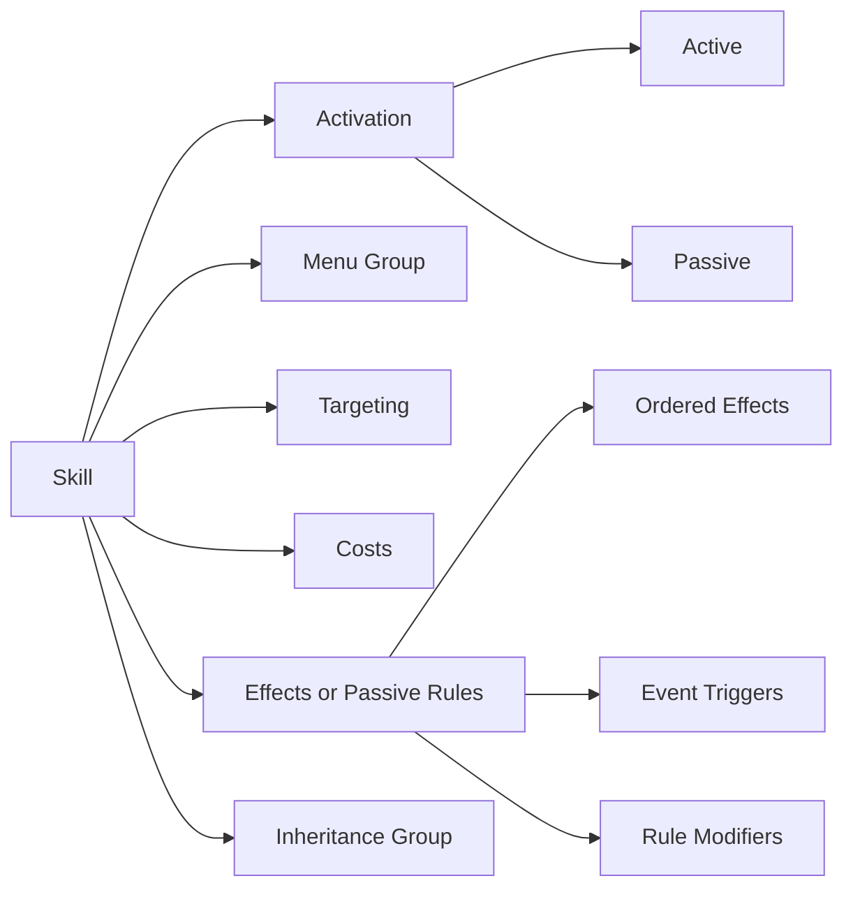

# Skill System GDD

## Status

This document is the design target for the skill system. Runtime code and content schemas may temporarily differ during refactoring, but new design decisions should conform to this model unless this document is deliberately revised.

This document is normative for the redesign. The schema proposal, fixtures, implementation plan, runtime code, and legacy datasets must not contradict it.

## Design Goal

Skills should be composable, understandable without reading code, and classifiable without a miscellaneous `special` category. A skill is described through independent axes rather than one overloaded behavior type.



These axes must remain separate. For example, `passive` describes activation, `recovery` describes menu placement and inheritance, and `restore_resource` describes behavior.

## Elements And Defensive Responses

The complete damage-element vocabulary is:

```text
physical
fire
ice
electric
wind
light
dark
almighty
```

- An **element** is the damage channel used by a `damage` effect.
- An **elemental affinity** is an entity's response to elemental damage: `weak`, `normal`, `resist`, `null`, `repel`, or `absorb`.
- `resist` is one affinity value, not a separate competing elemental system.
- Almighty always resolves with a normal affinity response and cannot be weak, resisted, nulled, repelled, or absorbed.
- Recovery, curing, buffs, debuffs, ailments, and passives are not elements.
- Every ailment uses its own resistance entry, such as `poison`, `sleep`, or `fear`, with one of: `vulnerable`, `normal`, `resistant`, or `immune`.
- Ailment groups may support broad cures or passive modifiers, but they never replace the target's ailment-specific resistance entry.
- Instant death is separate from both elemental affinity and ailment resistance and uses the same four-value resistance vocabulary. Its final channel model remains a Track 1 contract decision.
- Basic weapon attacks deal `physical` damage. Slash, Strike, and Pierce may survive as descriptive weapon or animation metadata, but they are not damage elements or affinities.

## Activation

Every skill has exactly one activation model:

| Activation | Meaning |
| --- | --- |
| `active` | The user deliberately selects and executes the skill. |
| `passive` | The skill continuously modifies a rule or responds to a runtime event. |

Passive is not a behavior category. A passive skill must still declare what it modifies or which event and effects it uses.

## Menu Groups

Active skills use one primary menu group for presentation and AI filtering:

| Menu group | Intended contents |
| --- | --- |
| `offense` | Damage and instant-death skills. |
| `ailment` | Skills primarily intended to inflict ailments. |
| `recovery` | HP/SP restoration, curing, and revival. |
| `buff` | Beneficial stat-stage changes and similar enhancements. |
| `debuff` | Harmful stat-stage changes and similar penalties. |
| `utility` | Analysis, escape, shields, affinity breaks, and other tactical tools. |

Mixed skills use the group that best describes their primary purpose. A physical attack with a poison chance remains `offense`. Passive skills are displayed separately through `activation: passive` and do not require a passive menu group.

Menu groups organize skills; they do not choose runtime implementations.

## Active Effect Vocabulary

Active skills contain an ordered list of one or more effects.

| Effect | Behavior |
| --- | --- |
| `damage` | Deals damage through one of the eight elements. |
| `instant_kill` | Attempts immediate defeat using instant-death resistance. |
| `apply_ailment` | Attempts to inflict an ailment. |
| `restore_resource` | Restores HP, SP, or another declared resource. |
| `remove_ailment` | Removes specified ailments, ailment groups, or all removable ailments. |
| `revive` | Returns a defeated target and restores a declared amount of HP. |
| `modify_stat_stage` | Raises or lowers one or more stat stages. |
| `grant_charge` | Enhances a future physical or magical attack. |
| `grant_shield` | Grants a temporary reflection or protection shield. |
| `override_affinity` | Temporarily changes an elemental affinity, including Break effects. |
| `remove_status_effect` | Removes buffs, debuffs, charges, shields, or similar runtime effects. |
| `reduce_resource` | Directly reduces HP/SP without using normal damage calculation. |
| `set_resource` | Sets a resource to an exact or bounded value. |
| `analyze` | Reveals combat information. |
| `escape` | Requests escape from an eligible battle or host-controlled area. |
| `custom` | Invokes a registered implementation for a genuinely exceptional mechanic. |

Buff and debuff are two directions of the same effect. A positive `stageDelta` is a buff; a negative `stageDelta` is a debuff.

Recovery, curing, and revival remain distinct effects even though they share the `recovery` menu and inheritance groups. This permits composition such as Salvation restoring HP and curing ailments in one action.

Damage drain, conditional execution, multiple hits, critical behavior, and secondary ailments are properties or additional effects, not new behavior categories.

## Passive Vocabulary

Passive skills use one or both of these mechanisms:

### Triggered Passives

A trigger listens for a declared event and executes ordinary effects. Representative events include:

```text
battle_start
owner_turn_start
owner_turn_end
owner_after_damage
owner_would_be_defeated
battle_won
```

This supports auto-buffs, regeneration, counters, endure effects, and post-battle recovery without inventing parallel effect formats.

### Rule Modifiers

A rule modifier continuously changes a bounded calculation or rule:

| Modifier | Examples |
| --- | --- |
| `damage_dealt` | Fire Boost, Almighty Amp, single-target boost. |
| `damage_taken` | General or conditional damage reduction. |
| `accuracy` / `evasion` | Dodge and Evade skills. |
| `critical_chance` | Apt Pupil and similar skills. |
| `ailment_infliction` | Poison Boost or broad ailment boosts. |
| `ailment_resistance` | Resist Poison or ailment immunity. |
| `healing_received` / `healing_given` | Divine Grace-style effects. |
| `resource_cost` | Arms Master and Spell Master. |
| `maximum_resource` | HP/SP capacity increases. |
| `elemental_affinity` | Resist, Null, Repel, or Absorb element passives. |
| `basic_attack` | Change attack element, targeting, or drain behavior. |
| `experience_gain` | Reserve or personal EXP modifiers. |

Modifier stacking rules must be defined by the affected subsystem. They must not be inferred from skill names.

## Inheritance Groups

Inheritance uses a separate explicit classification:

```text
physical
fire
ice
electric
wind
light
dark
almighty
recovery
ailment
support
utility
passive
```

There is a dedicated `passive` inheritance group. Every skill with `activation: passive` belongs to this group regardless of the element or mechanic it modifies. There is no `special` inheritance group.

This separation is deliberate. An Ice Boost passive may contain `affectedElementId: ice`, but its inheritance group remains `passive`. A demon that cannot inherit active Ice skills may therefore inherit Ice Boost and pass it to a child demon. This supports intentionally building fusion-fodder demons without weakening elemental inheritance restrictions.

Passive inheritance may still be restricted through explicit skill blocks, owner exclusivity, or a rule that denies the entire `passive` group. The element or ailment referenced by a passive modifier does not implicitly restrict its inheritance.

| Skill | Activation | Menu group | Inheritance group |
| --- | --- | --- | --- |
| Agi | Active | Offense | Fire |
| Fire Boost | Passive | Not applicable | Passive |
| Dia | Active | Recovery | Recovery |
| Patra | Active | Recovery | Recovery |
| Regenerate | Passive | Not applicable | Passive |
| Poisma | Active | Ailment | Ailment |
| Tarukaja | Active | Buff | Support |
| Tarunda | Active | Debuff | Support |
| Analyze | Active | Utility | Utility |
| Eternal Rest | Active | Offense | Ailment |

Eternal Rest belongs to the `ailment` inheritance group because its defining prerequisite is an existing Sleep ailment. Its effect remains a conditional `instant_kill`; the inheritance classification does not turn instant death into elemental damage or an ailment application.

## Skill Mutation

The existing fusion-accident skill mutation mechanic is preserved. Mutation metadata is independent from activation, menu group, effects, and inheritance group.

```json
{
  "mutation": {
    "familyId": "agi",
    "tier": 1
  }
}
```

- `familyId` identifies skills that may mutate into one another.
- `tier` gives the skill's ordered position within that family.
- A mutation may move only to a valid adjacent tier in the same family.
- A skill without mutation metadata does not participate in skill mutation.
- Mutation eligibility does not make a skill inheritable; normal inheritance and exclusivity checks still apply.
- Mutation probability and direction belong to fusion rules, not the skill's inheritance classification.

## Composition Examples

```json
{
  "id": "venom_strike",
  "activation": "active",
  "menuGroup": "offense",
  "inheritanceGroupId": "physical",
  "effects": [
    { "type": "damage", "elementId": "physical", "power": 60 },
    { "type": "apply_ailment", "ailmentId": "poison", "chance": 40 }
  ]
}
```

```json
{
  "id": "salvation",
  "activation": "active",
  "menuGroup": "recovery",
  "inheritanceGroupId": "recovery",
  "effects": [
    { "type": "restore_resource", "resourceId": "hp", "amount": { "type": "full" } },
    { "type": "remove_ailment", "scope": "all_removable" }
  ]
}
```

```json
{
  "id": "regenerate_1",
  "activation": "passive",
  "inheritanceGroupId": "passive",
  "triggers": [
    {
      "event": "owner_turn_end",
      "effects": [
        {
          "type": "restore_resource",
          "resourceId": "hp",
          "amount": { "type": "percent_max", "value": 2 }
        }
      ]
    }
  ]
}
```

## Special Mechanics

`special` is not an activation, menu group, effect, or inheritance group. Most unusual skills should be compositions of ordinary effects and conditions:

- Trafuri uses `escape`.
- Analyze uses `analyze`.
- Divine Judgment uses `reduce_resource`.
- Recarmdra composes `set_resource` and `restore_resource`.
- Eternal Rest uses conditional `instant_kill`.

Only a mechanic that cannot be expressed clearly through the shared vocabulary may use `custom`. Every custom effect requires a named registered handler, validated parameters, and dedicated tests. It must not become a general-purpose substitute for extending the common effect model.

## Navigator Boundary

Oracle and other Navigator abilities are not skills available to the player's demon or Persona stock. They belong to a separate Navigator support mechanic comparable to a dedicated support character system. They are excluded from this skill schema, inheritance rules, mutation rules, and ordinary skill menus. A future Navigator contract may reuse shared effects where useful, but it must remain a separate system.

## Design Invariants

1. A skill may have multiple effects, so combinations do not require new skill kinds.
2. Elements only describe damage; they do not describe recovery, ailments, or skill menus.
3. Elemental affinities and ailment resistances are separate systems.
4. Activation, menu group, effects, and inheritance group must never be inferred from display names.
5. Active and passive skills reuse the same effects wherever possible.
6. Every gameplay-relevant behavior uses a declared effect, trigger, modifier, or registered custom handler.
7. `special` and generic behavior-driving tags are not part of the model.
8. A passive's inheritance group is always `passive`; the mechanic or element it modifies is separate metadata.
9. Skill mutation metadata is explicit and separate from inheritance metadata.
10. Ailment resistance is keyed by ailment ID, never by a damage element or broad affinity family.
11. Navigator abilities are outside the demon and Persona stock skill contract.
