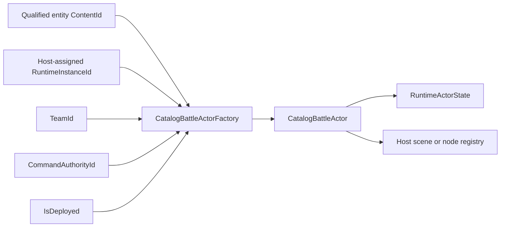
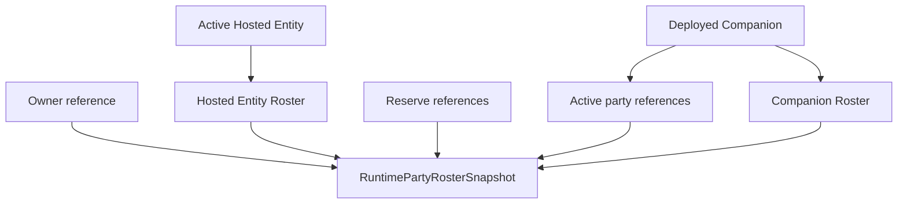
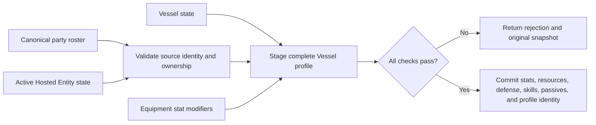
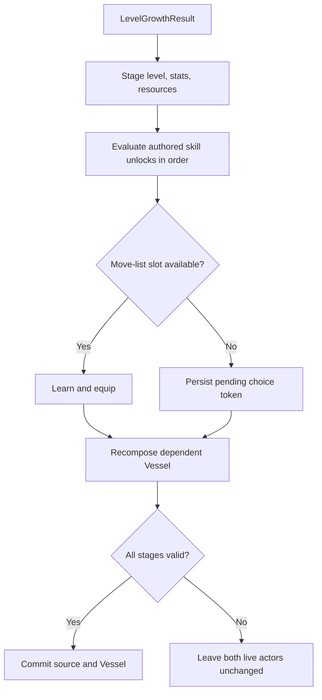
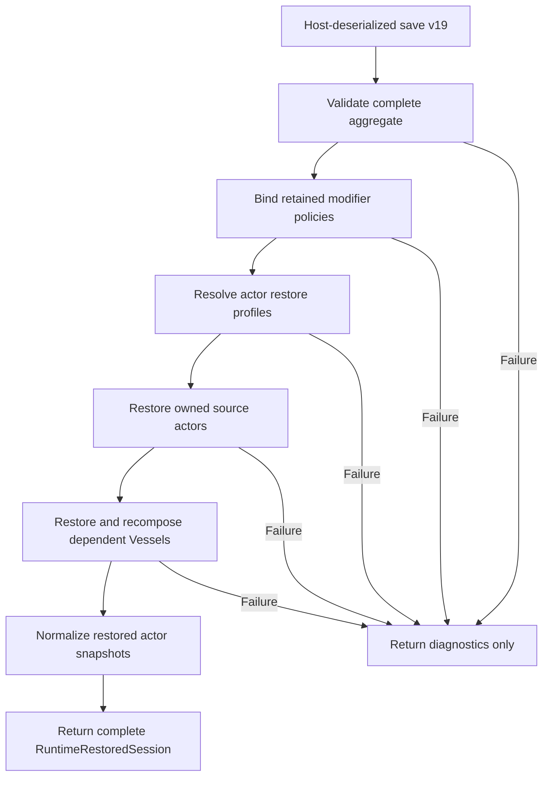

# Actors And Runtime State

## What This Guide Covers

This guide shows how a host creates actors, owns party and roster state,
composes a Vessel from an Active Hosted Entity, applies progression, presents a
full move-list decision, and restores a saved session.

The framework owns validation and state transitions. A Godot, console, test, or
other application host owns input, scene objects, presentation, serialization,
and the decision about when each service is called.

The confirmed rules are recorded in
[Actor Composition, Progression, And Rosters](../decisions/actor-composition-progression-and-rosters.md).

## Current Review Status

The D1-D6 design is confirmed and the demonstrated paths are green. The
[completion code review](../reviews/actor-runtime-completion-code-review-2026-07-16.md)
identified integration gaps around roster authority, live validation,
high-level move-list capacity, prepared growth, direct pending-skill restore
validation, and the Godot sample restore boundary. Every medium-severity gap
and the Godot aggregate boundary are now corrected. Direct actor restore now
also validates pending-skill definitions, authored provenance, and level
availability.

Keep party snapshots sourced from validated session state, supply the current
owner actor snapshot to roster transitions, and prefer aggregate session
restoration when loading a complete game session.

## Runtime Roles

Convergence uses one entity-definition family and assigns runtime roles through
state and aggregate relationships:

- **Independent Actor:** resolves its combat profile from its own actor state.
- **Vessel:** resolves its effective combat profile from an Active Hosted
  Entity selected by the party roster.
- **Hosted Entity:** an owned actor that can be selected as a Vessel's combat
  profile source.
- **Companion:** an owned actor that may also occupy an active party slot.

Hosted Entity and Companion are ownership roles, not different definition
classes. A game can use either roster, both, or neither.

## Identity And Authority

Every live actor has a unique `RuntimeInstanceId`. Its authored definition uses
a qualified `ContentId`.

`CatalogBattleActorCreationRequest` also requires:

- `TeamId`, which Framework uses for targeting and encounter affiliation;
- `CommandAuthorityId`, which the host uses to route commands;
- `IsDeployed`, which states whether the actor currently participates in an
  encounter.

`CommandAuthorityId` is opaque to Framework. Values such as `local_player`,
`enemy_ai`, or a network peer ID are host vocabulary.



The host maps `RuntimeInstanceId` to its scene object. Scene paths, Nodes,
animations, and input objects never enter `Convergence.Framework`.

## Create A Catalog Actor

Construct one `CatalogBattleActorFactory` from the loaded catalog and an
`IBattleActorInitializationPolicy`. Then submit a qualified entity ID and
host-owned runtime identity:

```csharp
CatalogBattleActorCreationResult created = actorFactory.Create(
    new CatalogBattleActorCreationRequest(
        entityId,
        RuntimeInstanceId.Parse("player_actor"),
        ContentId.Parse("player_team"),
        level: 3,
        IsDeployed: false,
        ContentId.Parse("local_player")));

if (!created.IsSuccess)
{
    Present(created.Diagnostics);
    return;
}

CatalogBattleActor actor = created.RequireActor();
```

Creation loads authored base skills and unlocks available at the requested
level. It returns typed diagnostics instead of substituting a fallback actor.

## Build The Canonical Party Roster

`RuntimePartyRosterSnapshot` is the authority for:

- the owner;
- active party order;
- reserve party order;
- the selected Active Hosted Entity;
- the complete Hosted Entity Roster;
- the complete Companion Roster;
- active-party capacity.

The roster does not cache the owner's level. Capacity-aware transitions receive
the current owner actor snapshot and derive the level from its progression.

An Active Hosted Entity remains in `HostedEntityRoster`. A deployed Companion
remains in `CompanionRoster` while also appearing in `ActiveParty`.



Use `PartyRosterTransitionService` to change this graph. For example:

```csharp
PartyRosterTransitionResult selected =
    rosterService.SelectActiveHostedEntity(
        new SelectActiveHostedEntityRequest(
            partyRoster,
            ownerActor.State.ToSnapshot(),
            hostedEntityInstanceId));

if (selected.Applied)
{
    partyRoster = selected.After;
}
else
{
    Present(selected.Diagnostics);
}
```

Do not edit individual lists and reconstruct an unchecked graph in application
code. Transition results preserve `Before` on rejection and identify affected
runtime IDs.

## Party Placement Versus Encounter Presence

Party placement and encounter participation are deliberately separate:

- `ActiveParty` and `ReserveMembers` belong to the party aggregate.
- `RuntimeEncounterPresenceSnapshot.IsDeployed` belongs to actor encounter
  state.

A Godot host might put an actor in `ActiveParty` when the player configures a
team, then set `IsDeployed` only when an encounter scene starts. Framework does
not infer one from the other.

## Compose A Vessel

To use the standard Vessel model:

1. create the Vessel and its owned Hosted Entity as separate runtime actors;
2. include the Hosted Entity in `HostedEntityRoster`;
3. select it as `ActiveHostedEntity`;
4. resolve the current equipment profile once from inventory ownership, actor
   instance references, catalog definitions, and the selected slot layout;
5. call `IRuntimeActorCombatProfileCompositionService.Compose`.

```csharp
RuntimeActorCombatProfileCompositionResult composition =
    compositionService.Compose(
        new RuntimeActorCombatProfileCompositionRequest(
            vessel.State,
            RuntimeStatSourceKind.ActiveHostedEntity,
            MissingHostedEntityBehavior.RejectStatResolution,
            partyRoster,
            runtimeActors: [hostedEntity.State],
            equipmentStatModifiers));
```

On success, the Vessel keeps its identity, own progression, current resources,
equipment, affiliation, encounter presence, statuses, and host command
authority. It receives the source actor's:

- effective core-stat source;
- defense profile;
- equipped active skills;
- equipped passive skills.

The same atomic commit advances the Vessel's
`RuntimeCombatProfileIdentitySnapshot`. Its source runtime ID and source entity
ID identify the Hosted Entity supplying that profile; its revision distinguishes
this composition from every earlier profile on the same Vessel. Pass this exact
identity to profile-sensitive systems such as Battle Knowledge. After a
successful source change, invalidate that target's prior encounter knowledge
before presenting another target panel or requesting another command.

The acting Vessel's battle stages remain its own. Current resources are
preserved and capped when recalculated maxima become smaller.

Composition stages the full result before committing. If any stat, resource,
roster, skill, or identity check fails, `Applied` is false and the live Vessel
remains unchanged.



`MissingHostedEntityBehavior.UseActorBaseStats` is available for an explicitly
designed pre-awakening or separation state. It is not an implicit fallback.

## Switch The Active Hosted Entity

A host should treat selection and composition as two deliberate steps:

1. assess and apply `SelectActiveHostedEntity`;
2. compose the Vessel from the resulting roster and selected actor state;
3. publish the accepted result to presentation.

If composition fails, do not present the new selection as active. An
application may stage both operations in its own orchestration transaction or
retain the previous roster until composition succeeds. The Training Annex
sample demonstrates this host-owned coordination.

## Apply Growth And Skill Unlocks

The growth owner is explicit. For a Vessel configuration, the Hosted Entity is
normally the actor that gains levels and unlocks authored skills.

`RuntimeActorGrowthCompositionService` combines:

- an already assessed `LevelGrowthResult`;
- mutation of the growth actor;
- authored skill-unlock planning;
- the configured move-list capacity policy;
- dependent Vessel recomposition;
- final all-or-nothing commit.

`LevelGrowthResult.Source` captures the progression, stats, resources, and
base-resource values used during assessment. Applying it to changed state, or
applying the same result twice, returns
`RuntimeMutationErrorCode.ProgressionSourceStateChanged` without mutation.



The standard `SharedRuntimeMoveListCapacityPolicy` permits eight equipped
skills total. `SeparatedRuntimeMoveListCapacityPolicy` supports separate active
and passive capacities. A game can implement `IRuntimeMoveListCapacityPolicy`
for another design.

Use the same policy when creating the actor factory and save validator.
Base skills must fit the selected capacity. Authored unlocks available at an
actor's requested starting level run through the same planner used by live
growth, so excess moves become persisted pending choices rather than bypassing
the configured limit.

## Present A Pending Skill Choice

Pending choices belong to the owned source actor and survive save/load. Each
choice contains:

- a `RuntimeSkillChoiceToken`;
- the authored unlock level;
- the pending skill ID.

Build presentation from the current snapshot. When the player responds, submit
the token plus the expected actor level and skill revision:

```csharp
var command = new ReplacePendingSkillCommand(
    pending.Token,
    source.State.Progression.Level,
    source.State.Skills.Revision,
    replacedSkillId);

RuntimeSkillChoiceTransactionResult result =
    skillChoiceService.Apply(
        new RuntimeSkillChoiceTransactionRequest(
            source.State,
            command,
            dependentVesselCompositionRequest));
```

Use `ForgetPendingSkillCommand` to keep the current move list and discard the
new skill. To defer, perform no transaction. The pending choice remains in the
snapshot.

The expected level and revision reject stale menus. A host should rebuild its
menu from current state after any rejection.

The standard replacement policy forgets the old skill completely. Inject
`RetainLearnedRuntimeSkillPolicy` when a game keeps unequipped learned skills
for later loadout editing.

## Save And Restore

The host serializes `RuntimeSaveGameSnapshot`; Framework does not own the file
format. Save contract v18 includes actors, the canonical party roster, pending
skill choices, complete selected-policy stat-modifier state, combat-profile
source/revision identity, inventory-owned equipment instances with actor
loadout references, and the remaining session modules.

Restore through `RuntimeSessionRestoreService`:

```csharp
RuntimeSessionRestoreResult restored =
    restoreService.Restore(deserializedSnapshot, catalog);

if (!restored.IsSuccess)
{
    Present(restored.Diagnostics);
    return;
}

RuntimeRestoredSession session = restored.RequireSession();
```

The host supplies `IRuntimeActorRestoreProfileResolver` to state whether each
actor uses its own profile or the Active Hosted Entity profile, plus the
current equipment profile's stat modifiers and granted skill IDs.

Resolve those modifiers through the same `RuntimeEquipmentProfileResolver`
used after creation and after equipment changes. For a restored actor, pass its
saved `RuntimeEquipmentSnapshot` together with the restored aggregate inventory
and catalog. This rebuilds Defense, Evasion, and accessory contributions from
the same source that supplies weapon attacks and equipped-only skill grants;
do not serialize a second derived equipment profile. Active grants are checked
live during command authorization, while restored passive grants are loaded
into the actor's passive collection without entering its learned or equipped
move-list IDs.



No partial live session is returned. Hosts should apply scene changes and host
context only after `IsSuccess` is true.

## Stage Scaling Configuration

The standard stat ruleset accepts optional `stageTables`. Each override must
name one supported track, one calculation channel, and every stage from `-4`
through `+4`.

```json
{
  "trackId": "physical_attack",
  "channel": "physical_damage_dealt",
  "multipliers": [
    { "stage": -4, "multiplier": 0.5 },
    { "stage": -3, "multiplier": 0.625 },
    { "stage": -2, "multiplier": 0.75 },
    { "stage": -1, "multiplier": 0.875 },
    { "stage": 0, "multiplier": 1.0 },
    { "stage": 1, "multiplier": 1.25 },
    { "stage": 2, "multiplier": 1.5 },
    { "stage": 3, "multiplier": 1.75 },
    { "stage": 4, "multiplier": 2.0 }
  ]
}
```

For direct composition, construct `StandardStatStageScalingPolicy` with
`StatStageScalingTable` overrides. For a different stage range or formula,
implement `IStatStageScalingPolicy` and pass it to
`ProductionCombatRuleset` or the appropriate registered ruleset factory.

## Godot Integration Checklist

- Keep a dictionary from `RuntimeInstanceId` to Nodes or scene handles.
- Keep the current `RuntimePartyRosterSnapshot` in host session state.
- Build commands from input and submit typed IDs, never display strings.
- Present diagnostics and events after framework services return.
- Recompose a Vessel after selecting a Hosted Entity or changing source
  progression.
- Store pending skill choices in the save snapshot, not only in UI state.
- Apply restored scene state only after aggregate restoration succeeds.
- Never place Godot types, `res://` access, or JSON serializer types in
  Framework contracts.

## Source Evidence

- `Runtime/RuntimeActorCombatProfileComposition.cs`
- `Runtime/RuntimeActorGrowthComposition.cs`
- `Runtime/RuntimeSkillProgression.cs`
- `Runtime/PartyRosterTransitions.cs`
- `Runtime/RuntimeSessionRestoration.cs`
- `Encounters/CatalogBattleActorFactory.cs`

Focused examples are exercised by `RuntimeActorGrowthCompositionTests`,
`RuntimeSkillProgressionTests`, `PartyRosterTransitionTests`,
`RuntimePersistenceSnapshotTests`, and the Training Annex DemoHost tests.
