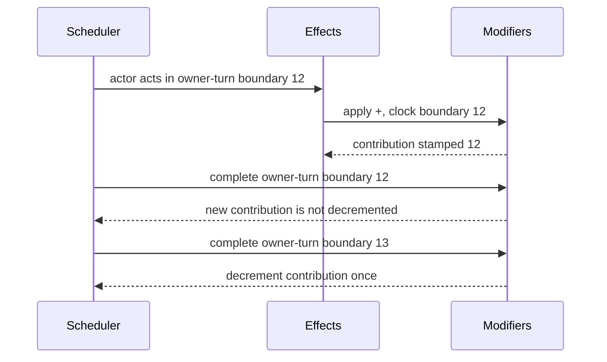

# Using Stat Modifier Policies

## Status

This guide describes the confirmed composition model and identifies which parts
are available today:

- shared immutable policy contracts and `StatModifierPolicyService`: available;
- `PersistentStagedStatModifierPolicy`: available;
- timed-exclusive and timed-contribution policies: confirmed, under active
  implementation;
- effect/lifecycle integration: M1-5;
- authored ruleset selection: M1-6;
- aggregate save and restore: M1-7.

Do not build a host-side timed modifier store while those checkpoints are in
progress. The Framework remains the intended rule and state authority.

## Composition Boundary

A selected `IStatModifierPolicy` owns:

- application and applicability;
- reapplication and opposition;
- duration ticking and reserve suspension;
- positive, negative, selected, and complete removal;
- cleanup behavior;
- compatible retained-state shape.

`StatModifierPolicyService` wraps that policy. It validates neutral state,
contains extension faults, validates the policy's result, derives ordered
events, and returns unchanged before/after snapshots on rejection.

`IStatStageScalingPolicy` is separate. It translates the resolved stage into
numeric multipliers but does not decide how the stage accumulated or expired.

## Current Persistent Example

Until M1-6 adds authored selection, a host or runtime composition root supplies
an explicit policy ID:

```csharp
using Convergence.Content;
using Convergence.Runtime;

ContentId policyId = ContentId.Parse("example_persistent_modifiers");
IStatModifierPolicy policy = new PersistentStagedStatModifierPolicy(
    policyId,
    minimumStage: -4,
    maximumStage: 4);
IStatModifierPolicyService modifiers = new StatModifierPolicyService(policy);

RuntimeStatModifierStateSnapshot state = new(policyId);
var request = new StatModifierApplicationRequest(
    state,
    ContentId.Parse("attack"),
    stageDelta: 1);

StatModifierTransitionResult assessment = modifiers.AssessApplication(request);
if (assessment.StateChanged)
{
    StatModifierTransitionResult applied = modifiers.Apply(request);
    state = applied.After;
}
```

Assessment and application are immutable evaluations. M1-5 connects accepted
state to the staged `RuntimeActorState` transaction; a Godot host should consume
the result rather than mutating actor internals.

At a cap, the persistent policy returns `Unchanged`. An item or skill must use
that canonical result when deciding meaningful success. It must not consume an
item merely because the authored delta was nonzero.

## Timed-Exclusive Configuration

The supplied timed-exclusive policy will implement the confirmed five-signal
scale. Its important integration behavior is:

- equal signal: accepted timer refresh;
- stronger same-sign signal: accepted replacement;
- weaker same-sign signal: typed already-in-effect rejection;
- opposite signal: arithmetic offset;
- neutral result: remove the track.

The host presents the diagnostic and returns to command selection after a
weaker rejection. It does not charge costs or consume turn economy because the
Framework rejects before commitment.

Custom timed-exclusive policies may use different coherent rules. They must use
the shared immutable contracts and cannot add a second live actor mutation path.

## Counted Duration And Clock Selection

`TurnDurationDefinition` currently carries a value, a `TickEventId`, and
`SuspendWhileReserve`. Despite the historical type name, the event ID determines
the counted lifecycle clock. M1-6 will ensure authored ruleset registration
selects supported clock IDs explicitly.

Reference clock meanings are:

```text
owner_turn_completed
team_phase_completed
round_completed
action_completed
```

The supplied timed-policy default is `owner_turn_completed`. A phase-oriented
game can author `team_phase_completed` instead. A custom scheduler may register
another typed event, provided it emits deterministic monotonic boundaries.

## Boundary Sequences

A clock name alone cannot distinguish an effect applied during the current turn
from one applied before the target's next turn. Timed runtime state therefore
needs a monotonic boundary sequence.

The confirmed M1-3 contract revision is:

1. A lifecycle clock occurrence has an event ID and sequence.
2. Application records the active sequence for the selected clock when one is
   currently open.
3. Completion of that same sequence does not decrement the new contribution.
4. A later matching sequence may decrement it.
5. Reserve suspension is checked before decrement.



The encounter scheduler, not the presentation host, emits these boundaries. A
Godot scene may animate one action as several clips without creating several
turn completions.

## Bonus Actions, Skips, And Cancellation

The scheduler decides whether an action continues the current turn window or
starts another one:

- an immediate bonus inside the same window does not produce another owner-turn
  completion;
- a newly scheduled turn does;
- a committed pass, guard, forced action, or skipped action completes the
  window;
- backing out before command commitment does not.

This distinction lets an individual-turn scheduler and a team-phase scheduler
use the same modifier policy without pretending their clocks are identical.

## Removal Effects

Use typed removal intent rather than special-casing a skill name:

```csharp
var removeNegative = new StatModifierRemovalRequest(
    state,
    StatModifierRemovalMode.Negative);

StatModifierTransitionResult result = modifiers.Remove(removeNegative);
```

Selected tracks, selected contribution sequences, positive state, negative
state, and all state have separate removal modes. The action's normal targeting
definition decides which actors receive the removal effect.

M1-5 connects these operations to the typed effect pipeline. Until then, this
request demonstrates the runtime policy boundary rather than a complete battle
content recipe.

## Godot Responsibilities

Godot owns:

- input and command presentation;
- icons, labels, animations, and remaining-duration displays;
- scene-node mapping by runtime instance ID;
- host save-file encoding.

Convergence owns:

- policy selection and validation;
- retained modifier contributions;
- application, rejection, ticking, removal, and cleanup;
- immutable events and diagnostics;
- snapshot compatibility and restoration after M1-7.

Do not decrement timers from `_Process`, animation completion, frame counts, or
button presses. Send commands to the encounter/runtime services and present the
typed lifecycle results they return.

## Related Documentation

- [Player And Designer Rules](../mechanics/stat-modifier-policies.md)
- [Runtime Authority](../technical/stat-modifier-policy-runtime.md)
- [Confirmed Decision](../decisions/stat-modifier-policy-family.md)
- [Policy Family Design Pattern](../policy-family-design-pattern.md)
