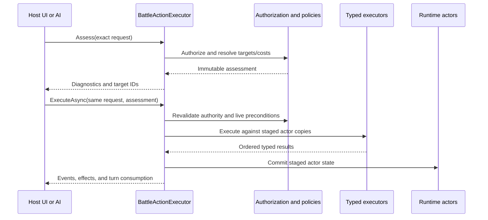

# Typed Actions And Effects

## Purpose

This guide shows how a host composes and calls the canonical Convergence battle
action boundary. It applies equally to a Godot scene, another engine, a server,
or a test host. Presentation remains host-owned.

## Compose The Services

`BattleActionExecutor` coordinates the lower-level skill, item, targeting,
effect, roster, and turn-consumption contracts. It also requires an explicit
authorization policy.

```csharp
using Convergence.Catalog;
using Convergence.Content;
using Convergence.Execution;

TargetingDefinition basicTargeting = new(
    TargetRelation.Enemy,
    TargetSelection.Single,
    TargetLifeState.Alive,
    AllowSelf: false);

IBattleBasicAttackProfileSource basicAttacks =
    new EquipmentBattleBasicAttackProfileSource(catalog, basicTargeting);

IBattleActionAuthorizationPolicy authorization =
    new CatalogBattleActionAuthorizationPolicy(catalog, catalog, basicAttacks);

var skillExecutor = new SkillExecutor(executionServices);
var itemExecutor = new ItemExecutor(executionServices);
IBattleActionExecutor actions = new BattleActionExecutor(
    skillExecutor,
    itemExecutor,
    executionServices,
    authorization);
```

Use `NoBattleBasicAttackProfileSource.Instance` for actors that intentionally
have no basic attack. Games with natural attacks should implement
`IBattleBasicAttackProfileSource` and resolve a profile from typed actor/game
state. Do not manufacture profiles from display text.

`BattleExecutionServices` must receive the game's explicit policies and
registrations, including random-target selectors. Convergence does not silently
replace a missing random policy with first-candidate selection.

## Build Only Authorized Commands

A skill command must carry the same canonical definition returned by the
catalog, and the actor must have its qualified ID equipped.

```csharp
SkillDefinition skill = catalog.GetRequiredSkill(skillId);
var command = new SkillBattleActionCommand(skill, [targetId]);
```

For a basic attack, resolve the actor profile and build the command from that
profile without changing any component:

```csharp
BattleBasicAttackProfile profile = basicAttacks.Resolve(actor)
    ?? throw new InvalidOperationException("Actor has no basic attack.");

var command = new BasicAttackBattleActionCommand(
    profile.BasicAttack,
    profile.Targeting,
    [targetId],
    profile.ActionId);
```

The Framework compares skill catalog identity and the complete resolved basic
profile. Reconstructing a same-ID skill, replacing damage, or changing targeting
is rejected with `ActionNotAuthorized`.

## Assess, Present, Then Execute

Create one request and retain that exact object while the assessment is being
presented. The prepared decision belongs to one executor, one request, and one
execution attempt.

```csharp
var request = new BattleActionExecutionRequest(
    command,
    actor,
    participants,
    environment,
    itemInventory);

BattleActionAssessment assessment = actions.Assess(request);
if (!assessment.CanExecute)
{
    ShowDiagnostics(assessment.Diagnostics);
    return;
}

ShowResolvedTargets(assessment.TargetIds);
BattleActionExecutionResult result = await actions.ExecuteAsync(
    request,
    assessment,
    cancellationToken);

Render(result.Events, result.Effects);
ApplyTurnConsumption(result.TurnConsumption);
```

Do not rebuild the request after assessment and do not execute one assessment
twice. Random targets are already fixed in `TargetIds`. Execution rechecks
target eligibility, resource affordability, equipped skills, canonical item
identity, and basic-attack authority before mutation.

Cancellation is checked before action execution and before item reservation or
commit. `OperationCanceledException` is a host cancellation signal, not a
gameplay diagnostic.

## Implement Inventory Reservations

Item commands have no quantity option: each command attempts one use. They
require an `IItemActionInventory` on the request.

Resolve the `ItemDefinition` from the same catalog supplied to
`CatalogBattleActionAuthorizationPolicy` before constructing the command. The
policy compares the command definition with that repository again during
assessment and immediately before execution. The inventory port separately
validates ownership and reservation identity by content ID.

Your inventory adapter must satisfy these rules:

- `HasAvailable(itemId, 1)` reflects current owned quantity;
- `Reserve(itemId, 1)` either returns a live reservation or fails without
  changing inventory;
- the reservation reports the exact `ItemId` and `Quantity` requested;
- a new reservation has neither `IsCommitted` nor `IsRolledBack` set;
- `Commit` and `Rollback` are each atomic and idempotence/rejection is reported
  through `ItemActionReservationTransitionResult`;
- a rejected transition must not partially alter inventory.

```csharp
var itemCommand = new ItemBattleActionCommand(item, [targetId]);
var itemRequest = new BattleActionExecutionRequest(
    itemCommand,
    actor,
    participants,
    environment,
    inventory);
```

The facade reserves one item before typed effects. It commits only when
`ItemExecutor` returns `ConsumeOne`; otherwise it rolls back. Actor changes are
published only after the required inventory transition succeeds.

Directly calling `ItemExecutor` runs typed item effects but performs no
ownership or inventory transaction. Directly calling `SkillExecutor` likewise
bypasses the actor-loadout authorization supplied by `BattleActionExecutor`.
Use those lower-level services only when the caller deliberately owns those
missing policy boundaries.

The supplied `AutomatedBattleRunner` deliberately composes `SkillExecutor`, but
does not trust its `IBattleActionSelector` as an authority. Before execution it
requires the prepared assessment to match the exact current actor,
participants, encounter environment, selected skill, and resolved targets. It
also verifies that the skill is the equipped canonical definition from that
`CatalogBattleActor`'s repository. A custom selector may rank legal actions; it
cannot grant itself an arbitrary skill.

## Dispatch Host-Mediated Work

Use a typed host-mediated command when an operation belongs to the application
instead of the Framework, such as a presentation-specific interaction or a
scripted scene operation. The result returns host action IDs and turn intent;
the host performs the external work.

Do not expect the actor transaction to roll back file writes, scene changes,
network calls, or other side effects performed by host/custom callbacks. Keep
such work after accepted Framework results whenever possible.

For stat-stage effects, also read
[Stat Modifier Policies](stat-modifier-policies.md). That guide separates the
implemented persistent policy from the confirmed timed designs and identifies
the remaining action-integration checkpoint explicitly.

## Call Sequence



## Related Reading

- [Actions, Targeting, And Effects](../mechanics/actions-targeting-and-effects.md)
- [Typed Action And Effect Execution](../technical/typed-action-and-effect-execution.md)
- [Battle Action Ownership And Inventory Authority](../decisions/battle-action-ownership-and-inventory-authority.md)
- [Godot Integration Contract](../godot-integration-contract.md)
