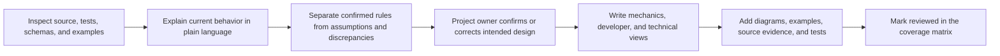

# Documentation Design Pattern

## Purpose

This document defines how Convergence documentation is researched, discussed,
written, reviewed, and maintained.

Tests can prove that code behaves consistently. They cannot by themselves explain
why a rule exists, whether it is optional, whether it reflects the intended game
design, or how another developer should use it. Documentation therefore has two
jobs:

1. make the implemented framework understandable; and
2. preserve the project owner's intended design so future implementation does not
   drift from it.

This process is collaborative. Existing code is evidence of current behavior,
not automatic proof that the behavior is the intended final design.

## Authority Order

Different artifacts answer different questions:

| Question | Authority |
|---|---|
| What does the current build actually do? | Active source and executable tests |
| What behavior is intended? | Confirmed mechanics documents and decision records |
| What may content authors write? | Checked-in schemas and semantic validation |
| How does a host integrate a feature? | Developer guides and public contracts |
| Why is an internal ordering or invariant required? | Technical documentation |
| What was previously reviewed? | Review reports, as evidence only |
| What did the retired prototype do? | Archive material, as unsupported history only |

When these sources disagree, the discrepancy must be presented to the project
owner. It must not be resolved silently by favoring either old code or prose.

## Documentation Audiences

### Mechanics

Location: `docs/mechanics`

Mechanics pages explain rules in language suitable for the project owner,
designers, and eventually players. They answer:

- what the mechanic accomplishes;
- whether it is mandatory or optional;
- what the player can observe;
- exact formulas, limits, outcomes, and timing;
- how mechanics interact;
- which behavior is fixed, configured, or host-owned;
- examples of successful and rejected outcomes.

Mechanics pages should not require knowledge of C# types to be useful.

### Developer Guide

Location: `docs/developer-guide`

Developer guides explain how a Godot game or another host composes the framework.
They answer:

- which services, policies, snapshots, and repositories are required;
- how commands enter and events leave the framework;
- which state the framework owns and which state the host owns;
- how to provide content, randomness, persistence, and presentation;
- how cancellation and rejection must be handled;
- which extension points are optional or replaceable;
- complete focused integration examples.

Developer guides may name public types, but should not depend on internal
implementation details.

### Technical

Location: `docs/technical`

Technical pages explain implementation invariants across files and modules. They
answer:

- state-machine phases and legal transitions;
- mutation and rollback boundaries;
- validation and restoration ordering;
- event sequencing and liveness guarantees;
- identity, ownership, and collection invariants;
- arithmetic domains and failure containment;
- relationships among public contracts and internal authorities;
- source and test evidence.

Technical pages are for maintainers of Convergence itself.

## Concept First, File Inventory Second

Documentation follows stable concepts rather than mirroring every `.cs` file.
A one-document-per-source-file system would duplicate code and become stale
whenever implementation moves.

Convergence instead uses:

- concept documents for behavior and integration;
- the tested Framework source inventory for file ownership;
- the public API baseline for exact exported signatures;
- source and test links as supporting evidence.

Every source file remains accounted for without requiring a prose clone.

## Collaborative Workflow

Each capability is documented through the following sequence:

### Step 1: Inspect

Read the live implementation and tests. Identify:

- state owners;
- inputs and outputs;
- execution order;
- mutations;
- rejection paths;
- formulas and numeric limits;
- configured policies;
- host callbacks;
- persistence implications.

Earlier summaries may help locate code but are not accepted as behavioral proof.

### Step 2: Explain

Present the mechanic to the project owner before rewriting it. Use plain examples
and diagrams. Explain surprising or inconsistent behavior directly.

### Step 3: Classify

Every meaningful statement should be classifiable as one of:

- **Framework rule:** enforced by reusable framework code.
- **Configured rule:** selected by content, registration, or an injected policy.
- **Host responsibility:** presentation, input, scenes, storage, scheduling, or composition.
- **Confirmed design decision:** explicitly approved by the project owner.
- **Current implementation detail:** true today but not promised as design.
- **Unresolved decision:** requires discussion before behavioral change.
- **Historical behavior:** retained only for context and never active authority.

### Step 4: Confirm

The project owner confirms the intended behavior or supplies a correction.
Important decisions receive a record under `docs/decisions`.

### Step 5: Write

Update every applicable audience. Some capabilities are not player-facing and may
legitimately have no mechanics page, but the coverage matrix must state why.

### Step 6: Verify

Documentation verification includes:

- links resolve inside the active product boundary;
- referenced documents and tests exist;
- diagrams match the described order;
- formulas match executable policies;
- examples use valid IDs and outcomes;
- optional modules are not described as mandatory;
- no display text is presented as rule authority.

### Step 7: Promote

Only source-verified and owner-confirmed documentation becomes `reviewed`.
Writing a page or passing a link test is not enough.

## Coverage States

The machine-readable documentation matrix uses four states:

| State | Meaning |
|---|---|
| `reviewed` | Verified against current source and explicitly confirmed by the project owner |
| `existing_unreviewed` | Relevant prose exists but still requires the collaborative review process |
| `missing` | This audience needs documentation and no adequate page exists |
| `not_applicable` | This capability does not need that audience view; a reason is required |

The coverage state is independent from framework implementation maturity. A
capability can be fully implemented while its documentation remains unreviewed.

## Standard Mechanic Questions

Every capability review should answer, where applicable:

1. What problem does it solve?
2. Is it mandatory or optional?
3. What state does it own?
4. What input does it require?
5. What is the exact execution order?
6. What formulas and limits apply?
7. What can cause rejection or interruption?
8. What does the framework mutate?
9. What remains host-owned?
10. How does a Godot host integrate it?
11. How is it saved and restored?
12. Which policies can a developer replace?
13. Which tests prove the current behavior?
14. Which decisions remain unresolved?

## Diagram Standards

Use Mermaid diagrams when they clarify:

- state transitions;
- command and event sequences;
- transaction or rollback boundaries;
- module ownership;
- save and restore dependencies;
- content-to-runtime data flow.

Diagrams are explanatory evidence, not an alternative implementation. Node labels
should use domain language, and the surrounding text must state whether each step
is framework-owned, configured, or host-owned.

For state and transaction diagrams:

- use state nodes only for values that the runtime actually retains;
- show rejection, cancellation, diagnostics, and rollback as command or result
  paths rather than inventing stored states for them;
- when an aggregate contains independent entries, diagram one entry's lifecycle
  and explain aggregate cardinality separately;
- avoid rejected-command self-transitions that can be mistaken for re-entry,
  duration refresh, or another mutation;
- prefer a top-to-bottom decision flow over a densely connected state diagram
  when the behavior is an application matrix rather than a small state machine;
- split application, lifecycle, and transaction publication into separate
  diagrams when combining them would obscure the commit boundary.

## Decision Records

Use `docs/decisions` for choices that materially shape behavior or public
contracts. A decision record contains:

- status: `proposed`, `confirmed`, `superseded`, or `rejected`;
- context and the problem being decided;
- the confirmed decision;
- alternatives considered;
- behavioral and compatibility consequences;
- affected mechanics, developer, and technical pages;
- source or content changes required.

Superseded decisions remain readable and link to their replacement.

## Change Rules

- A player-visible rule change updates mechanics documentation.
- A host-boundary change updates developer documentation.
- A state, ordering, atomicity, or invariant change updates technical documentation.
- A confirmed design change updates or adds a decision record.
- A capability documentation change updates the coverage matrix.
- A source move updates the tested source inventory.
- Review reports are filed under `docs/reviews`.
- Current priorities and completion records are filed under `docs/roadmap`.
- Active documents never depend on `ArchiveDocs`.

## Definition Of Documented

A capability is not considered fully documented merely because a page exists.
It is fully documented only when:

- every applicable audience has a reviewed page;
- diagrams and examples agree with current behavior;
- source and test evidence is identified;
- optionality and host responsibility are explicit;
- unresolved questions are recorded rather than guessed;
- the project owner has confirmed the intended mechanic;
- the coverage matrix records the reviewed state.
