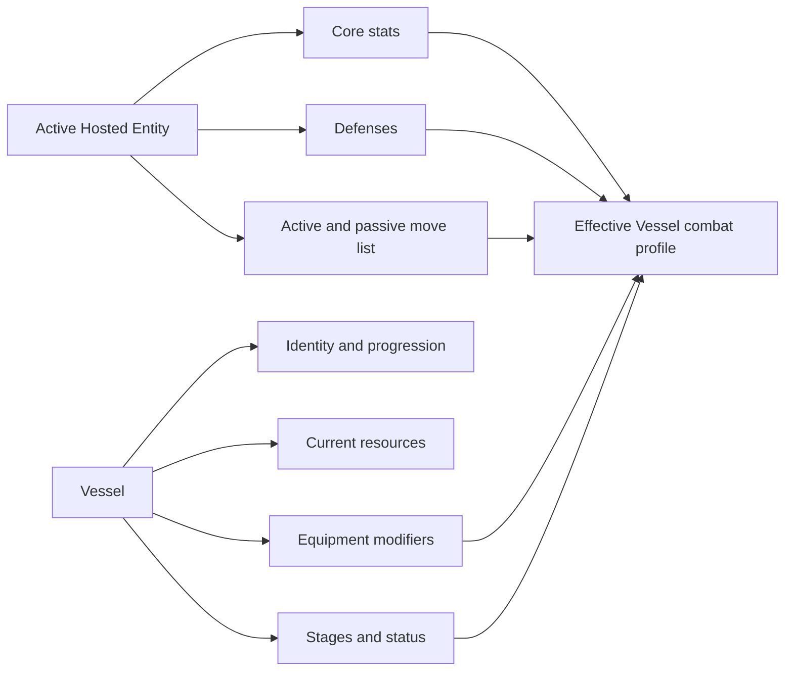
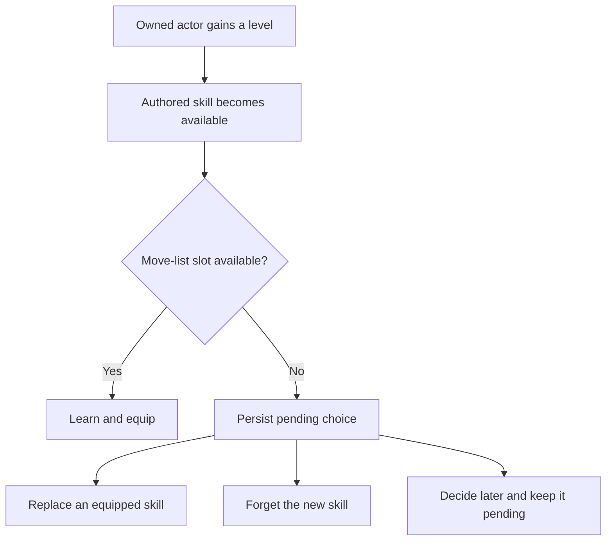

# Actors, Stats, Resources, And Progression

## Actor Identity

**Framework rule:** every live actor has one unique `RuntimeInstanceId`. The
authored entity it represents has a qualified `ContentId`. Two actors may use
the same entity definition, but they cannot share one runtime ID.

An actor owns its identity, progression, resources, equipment, statuses,
skills, combat affiliation, command authority, and current encounter presence.
It does not own active/reserve party placement or owned-actor rosters. Those
belong to the party aggregate described in
[Party, Rosters, Inventory, Equipment, And Economy](party-inventory-and-economy.md).

**Host responsibility:** associate the runtime ID with the corresponding scene
object, visual model, controller, or other presentation object.

## Actor Roles

Convergence supplies generic roles rather than a fixed game cast:

- An **Independent Actor** fights using its own combat profile.
- A **Vessel** can fight using the combat profile of an Active Hosted Entity.
- A **Hosted Entity** is an owned actor selected as that source.
- A **Companion** is an owned actor that can also be deployed as a party member.

Hosted Entity and Companion are ownership roles. They use the same entity
definitions and runtime actor contracts.

## Vessel Combat Profile

**Framework rule:** the standard Vessel model takes its effective core stats,
defenses, active skills, and passive skills from its Active Hosted Entity.

The Vessel still owns:

- its identity and displayed actor;
- its own level and progression state;
- current HP, SP, and other resources;
- equipment;
- buffs, debuffs, ailments, and other timed state;
- team and command authority;
- encounter presence.

The acting Vessel's current battle stages affect the composed profile. Existing
equipment stat modifiers are applied after the selected stat source.

**Framework rule:** composition is atomic. If the selected source is missing,
not owned, mismatched, or invalid, the complete operation is rejected and the
Vessel remains unchanged.

**Configured rule:** a game chooses whether a Vessel without an Active Hosted
Entity rejects composition or explicitly falls back to actor base stats. The
supplied Vessel behavior rejects by default.

## Stats

The supplied core stat vocabulary is Strength, Magic, Vitality, Agility, and
Luck. A game may define additional typed stat IDs when its selected policies
support them.

**Configured rule:** `IStatResolutionPolicy` decides how a selected source stat,
equipment modifier, and cap produce the final value. The standard policy uses
either the actor or the Active Hosted Entity as an explicit source. It does not
infer behavior from names or descriptions.

## Buff And Debuff Stages

Convergence supplies multiple optional modifier-lifecycle policies. Persistent
stages and timed contributions use configurable signed bounds with a reference
domain of `-4` through `+4`. Timed-exclusive signals use only `--`, `-`, neutral,
`+`, and `++`, represented internally as `-2..+2`. Their application, timing,
and removal rules are defined in
[Stat Modifier Policies](stat-modifier-policies.md).

**Framework rule:** when the supplied scaling table receives a stage in its
supported domain, each magnitude has a distinct effect.

| Stage | -4 | -3 | -2 | -1 | 0 | +1 | +2 | +3 | +4 |
|---|---:|---:|---:|---:|---:|---:|---:|---:|---:|
| offense dealt | 0.50 | 0.625 | 0.75 | 0.875 | 1.00 | 1.25 | 1.50 | 1.75 | 2.00 |
| damage taken | 2.00 | 1.75 | 1.50 | 1.25 | 1.00 | 0.875 | 0.75 | 0.625 | 0.50 |
| hit chance | 0.50 | 0.625 | 0.75 | 0.875 | 1.00 | 1.25 | 1.50 | 1.75 | 2.00 |
| evasion | 0.50 | 0.625 | 0.75 | 0.875 | 1.00 | 1.25 | 1.50 | 1.75 | 2.00 |

Standard track mapping:

- `physical_attack` changes physical damage dealt;
- `magical_attack` changes magical damage dealt;
- `attack` changes both physical and magical damage dealt;
- `defense` changes damage taken;
- `agility` changes hit chance and evasion.

More than one applicable track multiplies together. Luck has no implicit stage
mapping.

**Configured rule:** these are supplied defaults, not a mandatory formula.
Ruleset content may replace supported tables, and a developer may replace the
complete stage-scaling policy.

## Resources

Resources use typed IDs. `hp` and `sp` are conventional example IDs rather than
required display terms.

Each resource has current and maximum values. Base resource values remain
separate so growth and stat changes can recalculate the maximum.

**Framework rule:** accepted resource state cannot remain below zero or above
its maximum. Overflow and invalid negative operations are rejected.

**Configured rule:** `IResourceGrowthPolicy` decides maximum-resource formulas.
The supplied policy derives HP from base HP and Vitality and SP from base SP
and Magic.

Ordinary stat or equipment changes preserve the current value and cap it when
the maximum falls. Growth may use a different explicit current-value adjustment
mode.

## Experience And Levels

**Configured rule:** `IExperienceCurve` decides the experience required for a
level. `ILevelGrowthPolicy` decides what a level grants. `IRandomSource`
provides any random growth rolls.

The supplied growth profiles distinguish:

- Independent Actor growth;
- Vessel growth;
- owned-entity growth.

A Vessel does not receive manual core-stat points in the supplied profile.
Owned entities can receive their own level and stat growth. This keeps the
Vessel and Hosted Entity as separate progression subjects.

One experience award may cross multiple levels. The result contains ordered
level-up events. Invalid or negative awards reject without mutation.

**Framework rule:** a prepared growth result records the progression, stats,
resources, and base-resource values from which it was calculated. If any of
those values change before application, or the same result is submitted twice,
the transaction rejects without overwriting newer state.

## Authored Skill Unlocks

Entity content may list skills unlocked at specific levels.

**Framework rule:** when an owned actor crosses those levels, unlocks are
evaluated in authored order. Duplicates, already learned skills, and already
pending skills are not added again.

**Configured rule:** the supplied move-list policy permits eight equipped
skills total. Active and passive skills share those slots. A game may supply a
different capacity or separate active and passive lists.

**Framework rule:** the selected capacity policy applies during actor creation,
live growth, direct restore, and aggregate save validation. Base skills must
fit. Starting-level authored unlocks are evaluated in authored order through
the same planner as live growth, with excess unlocks becoming pending choices.

When a slot is available, the skill is learned and equipped immediately. When
the move list is full, level growth still succeeds and the new skill becomes a
persisted pending choice.

## Full Move-List Decisions

**Framework rule:** a pending choice survives menu cancellation, suspend, save,
and restore. It does not disappear because presentation was interrupted.

The standard decision offers:

- **Replace:** forget one selected equipped skill, then learn and equip the new
  skill;
- **Forget New:** discard the pending new skill and retain the current move
  list;
- **Decide Later:** a host action that performs no transaction, leaving the
  choice pending.

**Configured rule:** a game with later loadout editing may keep the replaced
skill in the learned set by using another retention policy.

Skill-choice commands include the expected actor level and skill-state revision.
If state changed after the menu was shown, the stale command is rejected rather
than overwriting newer progression.

## Growth And Vessel Recomposition

When the Active Hosted Entity grows:

1. its own level, stats, and resources are staged;
2. authored skill unlocks are staged;
3. the dependent Vessel combat profile is recomposed;
4. source and Vessel changes commit together.

If recomposition fails, neither live actor receives a partial update.

Pending choices belong only to the Hosted Entity. The Vessel receives the
equipped result of that move list and does not copy the source's pending-choice
queue.

## Save And Restore

**Framework rule:** save contract v11 persists complete source actor progression,
move lists, pending choices, complete selected-policy stat-modifier state, the
canonical party roster, and the other selected session modules.

Aggregate restoration:

1. validates the complete save and each retained modifier policy state;
2. restores an Active Hosted Entity before its dependent Vessel;
3. recomposes the Vessel from restored source state;
4. returns either one complete restored session or diagnostics with no partial
   session.

**Host responsibility:** choose a save-file format, deserialize the snapshot,
provide actor restore profiles, and apply scene state only after restoration
succeeds.

## Player-Facing Expectations

- A Vessel's displayed combat stats, defenses, and moves should reflect the
  currently selected Hosted Entity.
- Switching Hosted Entities can change those values without changing the
  Vessel's own level or identity.
- Buff and debuff magnitude matters at every supported stage.
- An earned level is not lost because the move list is full.
- A deferred skill choice remains available after saving and loading.
- Rejected composition, growth, or skill decisions do not partially change the
  live actor.

## Related Guidance

- [Actors And Runtime State](../developer-guide/actors-and-runtime-state.md)
- [Runtime Actor State And Restoration](../technical/runtime-actor-state-and-restoration.md)
- [Ruleset Policy Contracts](../ruleset-policy-contracts.md)
- [Confirmed Actor Decision](../decisions/actor-composition-progression-and-rosters.md)
