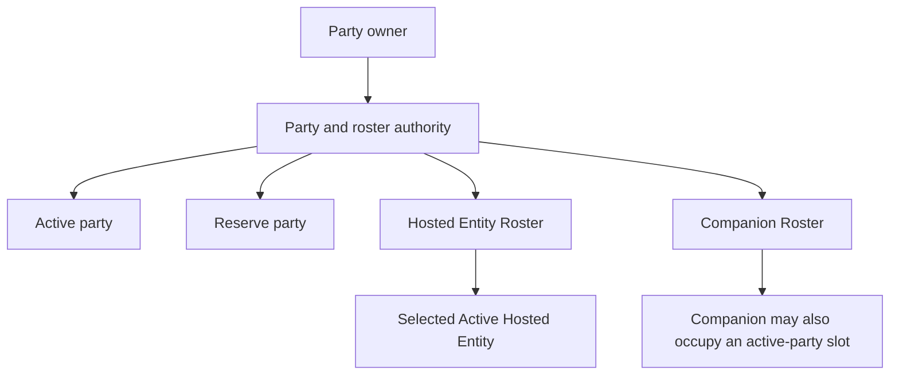

# Party, Rosters, Inventory, Equipment, And Economy

> **Review state:** `existing_unreviewed`. O7-R11 completed against `a21a6dcb`.
> The independent audit at `6f4b2f0c` reopened Order 7; O7-R12 hardened custom
> economy service bundles, O7-R13 reconciled the audience callouts, and O7-R14
> corrected and guards the developer purchase sample. Formal closure remains
> pending O7-R15.

## What This System Means To A Player

Inventory and economy actions are exact and all-or-nothing. The game identifies
the particular item, equipment copy, currency, shop offer, and actor involved.
If the complete operation is legal, every affected state advances together. If
anything rejects, the player's inventory, equipment, currency, and shop stock
remain unchanged.

The framework fixes ownership and transaction safety. Each game chooses its
slot layout, currencies, pricing rules, stock behavior, recovery rules, menu
presentation, and names.

## Party And Owned Actors

A game can use active party members, reserve members, an Active Hosted Entity,
a Hosted Entity Roster, and a Companion Roster. These are optional generic
roles; games use only the roles they need.

An Active Hosted Entity remains owned in its roster. A Companion deployed into
the active party likewise remains owned in the Companion Roster. This overlap
means an active owned actor does not disappear from ownership while it is being
used. It can later be recalled, replaced, consumed by an approved mechanic, or
restored from a save without inventing a temporary owner.

One actor cannot occupy contradictory roles or appear twice in the same list.
A rejected party or roster change leaves the previous arrangement intact.
Party and roster capacities are game-configured rather than fixed by
Convergence.

Being listed in the active party does not itself place an actor in a battle.
The encounter system separately decides who is deployed for that encounter.

## Items And Equipment Copies

Stackable items have quantities and may have authored stack limits. A use,
purchase, or sale that asks for an unavailable quantity, exceeds a stack limit,
or overflows the supported quantity range is rejected without changing the
inventory.

Every equipment copy has its own runtime identity. Two copies of the same sword
are therefore two owned objects: two actors may equip one each, and selling one
does not sell the other. Buying an equipment copy adds it to inventory; it does
not silently equip it.

Equipping selects one exact owned copy and one compatible authored slot. That
same copy cannot be equipped by two actors or assigned to two slots. An equipped
copy cannot be removed or sold as though it were free. The player must first
unequip the exact copy. Missing, stale, incompatible, or already-assigned copies
reject atomically.

Games may use the supplied weapon, armor, boots, and accessory layout or define
a different slot layout. The selected game rule decides which equipment profile
fits which slot; the framework does not force those four positions on every
game.

## What Equipped Gear Provides

The currently equipped copies form one live equipment profile. Depending on
their authored definitions, that profile can provide:

- a weapon basic attack;
- stat modifiers;
- armor Defense;
- armor or boots Evasion; and
- active or passive skills granted while equipped.

Equipment-granted skills are temporary availability, not learned skills. They
do not occupy move-list slots and are not written into the actor's learned-skill
record. Unequipping the granting copy removes the skill immediately. Even an
action selected before unequipping is checked again before execution, so it
cannot spend resources or apply effects after its grant has vanished.

Defense and Evasion feed the same combat calculations as the actor's other
stats. Equipment does not run a separate damage or hit formula. An absent
equipment contribution is exactly zero, so an unequipped actor is not given a
hidden bonus or penalty.

## Currency

A game may define one currency or several. Every balance is tied to a specific
currency ID, and every purchase, sale, recovery payment, or other transaction
names the currency it changes. Updating one balance preserves all unrelated
balances.

The common one-currency case remains simple. The game can ask for its single
currency and balance, but that request explicitly rejects an empty or
multi-currency ledger instead of guessing which currency was intended.

Balances cannot be negative. Missing currency, insufficient funds, invalid
amounts, and arithmetic overflow reject without changing any balance.

## Shop Prices

Each shop offer has its own stable identity, authored content, purchase-price
input, and stock behavior. The game resolves that offer before presenting or
executing a transaction. Execution checks the current state again, so a stale
menu quote cannot force a purchase after funds, ownership, or stock changed.

The supplied standard pricing rule charges the authored purchase price. Its
resale price is a configurable percentage of that price, with a default of 50
percent; fractional results are truncated toward zero. Convergence also
supplies an optional Luck-adjusted rule for games that deliberately select it.
Other games may register another pricing rule.

A custom or configured price is never a hidden fallback. Invalid pricing
configuration rejects the offer rather than silently switching to the standard
formula.

## Shop Stock And Transactions

An offer may be unlimited or track a remaining quantity. A successful purchase
of limited stock removes one offered unit and decrements its quantity together.
At zero, another purchase is rejected. The supplied standard stock rule does not
replenish stock when the player sells; a game may explicitly select a different
stock rule that does.

Buying updates inventory, the named currency, and tracked stock as one
transaction. Selling updates the exact owned item or equipment copy, the named
currency, and any policy-selected stock change as one transaction. A rejection
updates none of them.

This means a UI may safely show the rejection reason and redisplay current
state. It must not manually apply the successful pieces of a failed operation.

## Recovery

Recovery is optional. The selected game rule decides:

- which resources are fully restored;
- how missing amounts contribute to cost;
- which currency pays that cost;
- which ailments are legally removable there; and
- which temporary states are cleared.

The supplied standard hospital-style rule fully restores each configured
resource to its current maximum. It totals the configured per-unit costs and
truncates once after aggregation. It cures only ailments that explicitly allow
recovery-facility removal and clears only the selected temporary-state
categories.

An actor at full configured resources may still have a valid zero-cost
treatment if a removable ailment or selected temporary state remains. The game
should present the framework's assessment instead of duplicating a simpler
"missing health" eligibility check.

Recovery first stages every legal actor change and the named-currency payment.
Only a fully accepted treatment changes the live actor and balance. An
individually protected ailment remains on the actor, but it does not block an
otherwise legal resource restoration, ailment cure, or temporary-state cleanup.
If protected state is the only condition left, the result is `NoRecoveryNeeded`
and no currency is spent. Missing configured resources, missing or insufficient
currency, invalid policy output, cancellation, or another whole-treatment
rejection leave both actor and balance unchanged.

## Saving This State

Current save contract v19 stores:

- every owned equipment copy once in inventory;
- each actor's equipped-copy references under authored slot IDs;
- every named currency balance; and
- remaining quantities for tracked shop offers.

It does not store a second list claiming to own the same equipment. Loading
first rejects malformed currency ledgers, then aggregate restore validates
ownership, slot compatibility, assignments, and stock before exposing a live
session.

## Fixed Rules And Game Choices

| Fixed framework rule | Selected by the game |
|---|---|
| Each equipment copy has one identity and one inventory owner | Equipment slot vocabulary and compatibility |
| Equipped grants are temporary and consume no move-list slot | Currency IDs and player-facing names |
| Defense and Evasion use the canonical combat formulas | Pricing formula and resale percentage |
| Every transaction names exact state and is all-or-nothing | Stock limits and sale replenishment |
| Rejected operations preserve their complete before-state | Recovery resources, costs, legal cleanup, and availability |
| Save/restore validates the combined authority graph | Menus, animations, sounds, scene objects, and input |

## Related Guidance

- [Actors And Runtime State](../developer-guide/actors-and-runtime-state.md)
- [Typed Actions And Effects](../developer-guide/typed-actions-and-effects.md)
- [Runtime Actor State And Restoration](../technical/runtime-actor-state-and-restoration.md)
- [Ruleset Policy Contracts](../ruleset-policy-contracts.md)
- [Content Contract](../content-contract.md)
