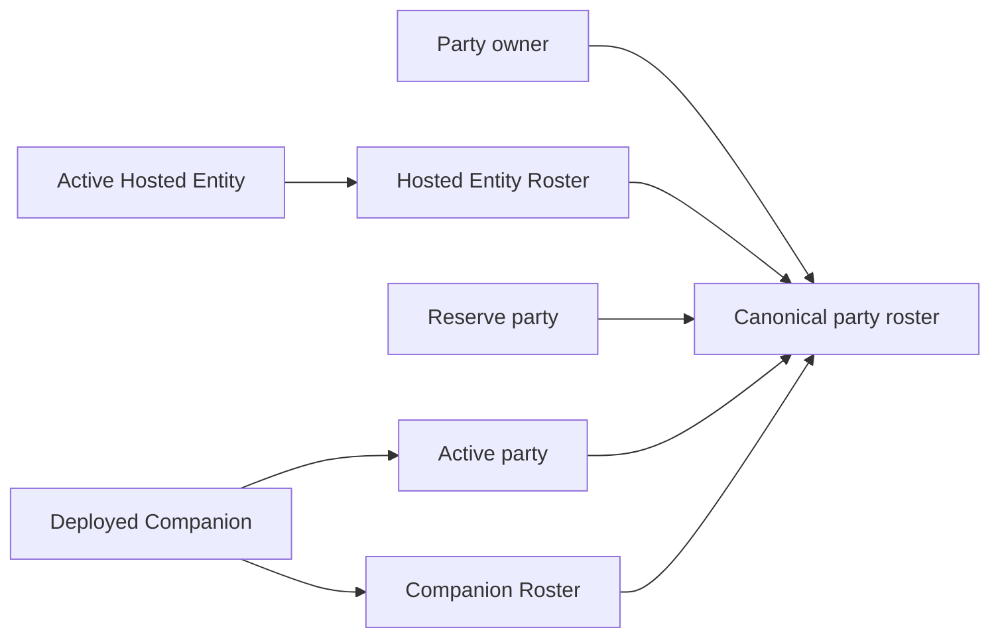

# Party, Rosters, Inventory, Equipment, And Economy

> **Order 7 status:** O7-R1 and O7-R2 establish the approved tracking and
> equipment-instance ownership model. Authored slot layouts, equipped skills
> and combat contributions, stateful shop stock, explicit pricing, generic
> recovery, and typed currencies remain pending. This page remains unreviewed
> until the complete
> [Order 7 roadmap](../reviews/inventory-equipment-economy-order-7-source-review-2026-08-10.md)
> is implemented and independently closed.

## Party And Ownership Graph

Framework party state distinguishes active party members, reserve members, an
Active Hosted Entity, a Hosted Entity Roster, and a Companion Roster. These are
generic runtime roles; a game may use only the roles it needs.

**Framework rule:** `RuntimePartyRosterSnapshot` is the only ownership and party
placement authority. Actor snapshots do not contain copies of these rosters.

An Active Hosted Entity remains present in the Hosted Entity Roster. A deployed
Companion remains present in the Companion Roster while also occupying an
active-party slot. This deliberate overlap prevents an active owned actor from
falling outside the ownership graph during recall, replacement, consumption,
fusion, or save restoration.

One runtime instance ID cannot occupy incompatible roles or appear twice in the
same collection. Active/reserve membership, Hosted Entity ownership, Companion
ownership, allowed overlaps, reference identity, and capacity are validated on
transitions and restore.

## Placement And Encounter Presence

**Framework rule:** active and reserve placement belongs only to the party
aggregate. Encounter participation belongs only to
`RuntimeEncounterPresenceSnapshot.IsDeployed`.

An actor may be configured in the active party before an encounter starts while
still having `IsDeployed = false`. The host or encounter planner explicitly
sets encounter presence when battle begins. Party menus and scene labels do not
silently change lifecycle eligibility.

## Party And Roster Commands

Transition services support adding a party member; swapping active and reserve positions; deploying, swapping, recalling, dismissing, replacing, and consuming owned Companions; and swapping, consuming, or replacing an Active Hosted Entity.

Each request returns `Before`, `After`, a stable code, diagnostics, and ordered affected IDs. Rejection preserves `Before` exactly.

Selecting another Active Hosted Entity changes the canonical roster reference.
A Vessel game then recomposes the owner through the actor combat-profile
composition service before presenting the selection as complete.

**Configured rule:** maximum party size and roster capacity come from policies. Capacity may be unlimited or tiered by level. Convergence does not require a particular number of party, Hosted Entity, or Companion slots.

## Inventory

Items are stored as typed content IDs and integer quantities. Stack limits come from clean item definitions when provided. Negative quantities, missing ownership, overflow, and stack-limit violations are rejected.

Every owned equipment copy is an immutable `RuntimeEquipmentInstanceSnapshot`
containing a unique runtime instance ID and one equipment definition ID.
Inventory is the sole ownership authority. Multiple instances may reference
the same definition; repeating one instance ID is rejected.

## Equipment

Actor equipment maps the current typed slots to inventory-owned equipment
instance IDs. Equip and unequip transitions validate ownership, slot
compatibility, and aggregate assignment evidence. A missing instance or an
instance already assigned to another actor rejects with unchanged before/after
equipment state. Selling a specific equipped instance is blocked by the
transaction service.

Save contract v16 stores owned instances only in inventory and actor loadout
references only in actor snapshots. There is no separate root equipment
snapshot.

Basic attack profiles may come from equipped weapon data, but a host can supply another clean basic-attack profile. Presentation metadata does not decide damage behavior.

## Wallet And Economy

Currency is represented by a nonnegative wallet balance. Credit and debit operations are atomic, checked for overflow, and reject insufficient funds or negative transaction values.

The Framework treats currency as an unnamed numeric resource. DemoHost labels its sample currency Credits; each game owns its player-facing terminology.

## Shops

Shop definitions identify offered items/equipment, categories, price or pricing-policy IDs, stock policy, and availability. Runtime transactions assess ownership, stock, stack limits, equipped-sale restrictions, and wallet balance before mutation. The host supplies a fresh runtime instance ID when purchasing equipment and identifies the exact owned instance when selling it.

Buy and sell prices are policy outcomes. The supplied standard/example policies can use base price and actor stats, but a game may provide fixed, regional, reputation-based, or other pricing.

## Recovery Facilities

Hospital/restoration services assess a cost, payment, resource restoration, ailment removal, and encounter-persistence cleanup as one transaction. A host decides which actors can be selected and how the facility is presented.

An ailment-only treatment may be valid even when HP/SP are full if the selected policy permits it. A game should not duplicate eligibility logic in its UI; it should present the assessment result.

## Related Guidance

- [Actors And Runtime State](../developer-guide/actors-and-runtime-state.md)
- [Runtime Actor State And Restoration](../technical/runtime-actor-state-and-restoration.md)
- [Confirmed Actor Decision](../decisions/actor-composition-progression-and-rosters.md)
