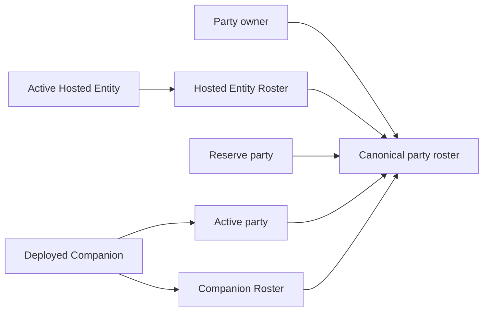

# Party, Rosters, Inventory, Equipment, And Economy

> **Order 7 status:** O7-R1 through O7-R8 establish the approved tracking,
> equipment-instance ownership, authored slot-layout model, equipped-only skill
> grants, Defense/Evasion combat contributions, and typed currency-ledger
> authority, plus explicit pricing, durable policy-owned shop stock, and generic
> policy-bound recovery. This page remains
> unreviewed until the complete
> [Order 7 roadmap](../reviews/inventory-equipment-economy-order-7-source-review-2026-08-10.md)
> is implemented and independently closed.

## Party And Ownership Graph

Framework party state distinguishes active party members, reserve members, an
Active Hosted Entity, a Hosted Entity Roster, and a Companion Roster. These are
generic runtime roles; a game may use only the roles it needs.

**Framework rule:** `RuntimePartyRosterSnapshot` is the only ownership and party
placement authority. Actor snapshots do not contain copies of these rosters.

An Active Hosted Entity remains present in the Hosted Entity Roster. A deployed
Companion remains present in the Companion Roster while also occupying an
active-party slot. This deliberate overlap prevents an active owned actor from
falling outside the ownership graph during recall, replacement, consumption,
fusion, or save restoration.

One runtime instance ID cannot occupy incompatible roles or appear twice in the
same collection. Active/reserve membership, Hosted Entity ownership, Companion
ownership, allowed overlaps, reference identity, and capacity are validated on
transitions and restore.

## Placement And Encounter Presence

**Framework rule:** active and reserve placement belongs only to the party
aggregate. Encounter participation belongs only to
`RuntimeEncounterPresenceSnapshot.IsDeployed`.

An actor may be configured in the active party before an encounter starts while
still having `IsDeployed = false`. The host or encounter planner explicitly
sets encounter presence when battle begins. Party menus and scene labels do not
silently change lifecycle eligibility.

## Party And Roster Commands

Transition services support adding a party member; swapping active and reserve positions; deploying, swapping, recalling, dismissing, replacing, and consuming owned Companions; and swapping, consuming, or replacing an Active Hosted Entity.

Each request returns `Before`, `After`, a stable code, diagnostics, and ordered affected IDs. Rejection preserves `Before` exactly.

Selecting another Active Hosted Entity changes the canonical roster reference.
A Vessel game then recomposes the owner through the actor combat-profile
composition service before presenting the selection as complete.

**Configured rule:** maximum party size and roster capacity come from policies. Capacity may be unlimited or tiered by level. Convergence does not require a particular number of party, Hosted Entity, or Companion slots.

## Inventory

Items are stored as typed content IDs and integer quantities. Stack limits come from clean item definitions when provided. Negative quantities, missing ownership, overflow, and stack-limit violations are rejected.

Every owned equipment copy is an immutable `RuntimeEquipmentInstanceSnapshot`
containing a unique runtime instance ID and one equipment definition ID.
Inventory is the sole ownership authority. Multiple instances may reference
the same definition; repeating one instance ID is rejected.

## Equipment

Actor equipment maps authored slot `ContentId` values to inventory-owned
equipment instance IDs. The selected `IEquipmentSlotLayoutPolicy` determines
which definition profiles and assignments are compatible. The supplied
standard policy retains weapon, armor, boots, and accessory positions; games
may select a different layout. Equip and unequip transitions validate
ownership, policy compatibility, and aggregate assignment evidence. A missing instance or an
instance already assigned to another actor rejects with unchanged before/after
equipment state. Selling a specific equipped instance is blocked by the
transaction service.

Save contract v19 stores owned instances only in inventory and actor loadout
references only in actor snapshots, all under authored slot IDs. There is no
separate root equipment snapshot.

`RuntimeEquipmentProfileResolver` derives one immutable profile from the
current actor equipment, inventory ownership, definitions, and selected slot
layout. That profile supplies:

- the equipped weapon's basic attack;
- accessory stat modifiers;
- armor Defense;
- armor and boots Evasion; and
- distinct skill IDs granted by currently equipped instances.

Granted skills are derived availability, not learned state. Active grants enter
canonical action authorization; passive grants enter the canonical passive
collection and therefore use the existing modifier and lifecycle dispatch.
Neither kind is copied into learned skills or occupies a move-list slot. Both
disappear as soon as the granting instance is unequipped. Active authorization
is repeated at execution, so an assessment prepared before unequip cannot spend
resources or apply an effect afterward.

Defense and Evasion are ordinary numeric inputs. Defense joins target Vitality
inside the existing standard damage formula; Evasion joins the target's
existing hit-resolution modifiers. Equipment does not own another combat
formula. A missing contribution is exactly zero. Basic attacks may come from
equipped weapon data, but a host can supply another clean basic-attack profile.
Presentation metadata does not decide behavior.

## Currency Ledger And Economy

Currency state is an immutable ledger keyed by qualified currency `ContentId`.
Every credit and debit names the affected currency explicitly. Transactions are
atomic, preserve every unrelated balance, use checked integer arithmetic, and
return typed diagnostics for a missing currency, negative amount, insufficient
funds, or overflow.

Ledger construction rejects invalid or duplicate currency IDs and negative
balances. `GetSingleCurrency()` is a convenience for the common one-currency
game: it returns that one ID and balance, but explicitly rejects an empty or
multi-currency ledger rather than choosing a default. DemoHost registers one
`credits` ID; other games own both their currency IDs and player-facing names.

Save contract v19 retains the complete typed ledger introduced by version 18.
Version 17's unnamed single balance is unsupported unless a host deliberately
supplies a migration.

## Shops

Shop definitions identify offered items/equipment, categories, an authored
purchase price, stock policy, and availability. Every offer has a stable
shop-local ID; durable stock keys are the qualified shop ID plus that offer ID,
not content identity or menu position. Runtime transactions assess
ownership, stock, stack limits, equipped-sale restrictions, pricing, and the
explicitly selected currency balance before mutation. The host supplies a
fresh runtime instance ID when purchasing equipment and identifies the exact
owned instance when selling it.

The economy ruleset explicitly selects the default shop-pricing policy. A
fixed-price offer applies that default to its authored purchase price. A
policy-shaped offer supplies `purchasePrice`, selects one registered pricing
factory, and may configure it for that offer. Invalid explicit configuration
rejects that offer; it never silently falls back to the economy default.

The supplied `standard_shop_pricing` policy charges exactly the authored
purchase price. Its resale price is the purchase price multiplied by a
configurable nonnegative resale percentage, defaulting to `0.50`; fractional
results truncate toward zero. The optional
`luck_adjusted_shop_pricing` policy preserves the sample's Luck-sensitive
rule: buying uses `max(0.50, 1.00 - Luck * 0.01)`, selling uses
`0.50 + Luck * 0.01`, and both truncate toward zero. Games choose this policy
explicitly; it is not hidden standard behavior.

One resolved pricing profile drives menu assessment and the committed
transaction. Negative input, overflow, unavailable currency, unaffordability,
and a failing custom policy reject before inventory or currency mutation.

Unlimited offers create no durable quantity. Fixed limited offers bind
`standard_shop_stock`; policy-shaped offers carry a positive initial quantity
and bind an explicitly registered `IShopStockPolicyFactory` without fallback.
The standard policy decrements one unit per successful purchase, rejects at
zero, and does not replenish on sale. A custom policy may replenish on sale.
Inventory, currency, and the immutable `RuntimeShopStockSnapshot` are returned
as one atomic result: all three advance on success, and all three remain the
original snapshots on any rejection. Save contract v19 persists the remaining
quantity for every tracked offer.

## Recovery Facilities

Recovery is optional. A selected `IRecoveryPolicy` plans from immutable actor
state and explicitly names the currency, resources, cost, legal ailment
treatment, and temporary-state categories. `IRecoveryService` assesses without
mutation, re-evaluates at execution, stages the actor candidate and named
currency debit, and returns equal before/after snapshots on rejection. A host
adopts the returned currency ledger only from an applied execution result and
decides which actors can be selected and how a facility is presented.

The supplied `StandardHospitalRecoveryPolicy` fully restores each configured
resource to its existing maximum. Its cost is the sum of each missing amount
times its configured unit cost, truncated once after aggregation. It cures only
ailments whose removal profile permits `RecoveryEvent` and clears only selected
temporary categories. A zero-cost ailment-only or temporary-state-only
treatment may therefore be valid even when all configured resources are full.
A game should not duplicate eligibility logic in its UI; it should present the
assessment result.

## Related Guidance

- [Actors And Runtime State](../developer-guide/actors-and-runtime-state.md)
- [Runtime Actor State And Restoration](../technical/runtime-actor-state-and-restoration.md)
- [Confirmed Actor Decision](../decisions/actor-composition-progression-and-rosters.md)
