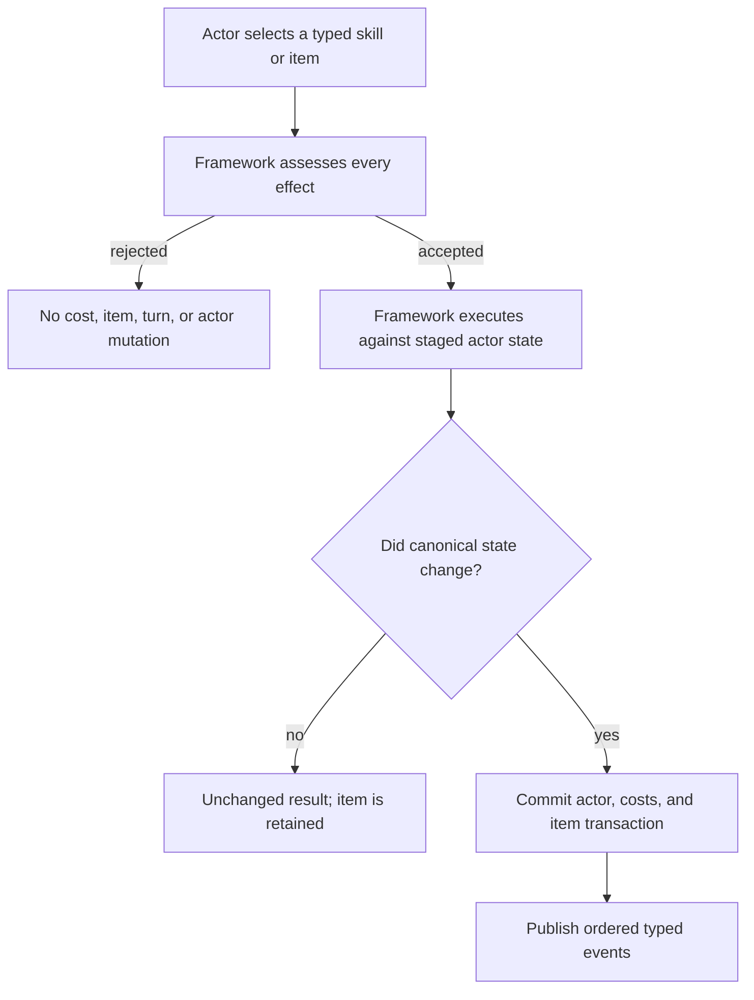

# Stat Modifier Policies

## Purpose And Optionality

Stat modifiers change an actor's combat performance without changing the
actor's permanent stats. A game selects one modifier policy for a runtime
scope. Convergence supplies three policies, but none is mandatory and a game
may register its own.

Two decisions remain separate:

1. the **modifier policy** decides how applications accumulate, expire, oppose,
   and clear;
2. the **stage-scaling policy** decides what the resolved stage means to damage,
   defense, accuracy, or evasion.

Changing a duration rule does not silently change combat multipliers, and
changing a multiplier table does not alter duration state.

## Shared Player-Visible Rules

All supplied policies follow these rules:

- Each modifier affects a typed track such as physical attack, magical attack,
  generic attack, defense, or agility.
- A rejected application changes nothing. It does not spend a skill cost,
  consume an item, or consume the actor's turn.
- An accepted but unchanged application is not meaningful success. For
  example, an item used against a persistent stage already at its cap is not
  consumed.
- Positive and negative removal are typed operations. Behavior is never
  inferred from a skill's name or description.
- Swapping an actor preserves modifier state. Actor departure, encounter end,
  and field transition clear it under the supplied policies.
- Timed state records the lifecycle boundary it has already observed, so one
  completed boundary cannot be counted twice.



## Policy One: Persistent Stages

The persistent staged policy keeps one signed stage per track until explicit
cleanup. Its supplied range is `-4..+4`; authored rulesets may choose narrower
or asymmetric negative and positive bounds within that domain. Bounds outside
`-4..+4` require a custom modifier policy paired with a custom scaling policy.

- Positive applications move toward the positive cap.
- Negative applications move toward the negative cap.
- Opposite applications move through neutral.
- Reaching a cap prevents further movement in that direction.
- No natural duration is stored or ticked.

```text
neutral -> apply +2 -> +2
+2      -> apply -1 -> +1
+1      -> apply -1 -> neutral
neutral -> apply -3 -> -3
```

This policy suits games where modifiers last for the encounter unless removed.

## Policy Two: Timed Exclusive Signals

The timed-exclusive policy stores one timed signal per track. Its fixed scale
is:

| Stored value | Suggested display | Meaning |
|---:|:---:|---|
| `-2` | `--` | strong negative change |
| `-1` | `-` | negative change |
| `0` | `~` | no active change |
| `+1` | `+` | positive change |
| `+2` | `++` | strong positive change |

The host may display arrows, icons, colors, or words instead of these symbols.

### Same Direction

- Reapplying the same signal restarts its full authored duration.
- A stronger incoming signal replaces the weaker signal and starts its own
  full duration.
- A weaker incoming signal is rejected with `AlreadyInEffect`. The player may
  choose another command without losing resources or a turn.

```text
current + with 1 remaining; apply +  -> + with a fresh duration
current +; apply ++                  -> ++ with a fresh duration
current ++; try to apply +           -> rejected and unchanged
```

### Opposite Direction

Opposite signals offset arithmetically:

```text
+  plus -  -> neutral
++ plus -  -> +
+  plus -- -> -
```

When the existing side remains stronger, its remaining timer survives. When
the incoming side becomes stronger, the incoming effect's fresh timer is used.
Equal strength removes the track and timer. A weak counter-effect therefore
cannot accidentally refresh the stronger effect it opposed.

## Policy Three: Timed Contributions

The timed-contribution policy retains every accepted application separately.
The visible stage is the bounded sum of all live signed contributions.

```text
resolved stage = clamp(sum of live contributions, minimum, maximum)
```

An authored `+2` application is one `+2` contribution with one timer. It is not
split into two hidden `+1` entries. Positive and negative contributions coexist
and expire independently.

### Confirmed Rolling Example

Assume one actor, one action per turn, a `+1` application, and a three-owner-turn
duration:

| Turn | Result after due expiry and the new application | Resolved stage |
|---:|---|---:|
| 1 | `[expires in 3]` | `+1` |
| 2 | `[expires in 2, expires in 3]` | `+2` |
| 3 | `[expires in 1, expires in 2, expires in 3]` | `+3` |
| 4 | oldest expires; `[expires in 1, expires in 2, expires in 3]` | `+3` |

The fourth application does not blindly extend one shared timer. A fourth
stage is reachable only when four contributions overlap, for example through
additional actors, additional scheduled actions, or a stronger authored
application.

At the same-direction cap, another application refreshes the oldest live
contribution of that sign. It does not create unlimited invisible stacks.

## Counted Duration

A timed effect stores:

- a positive remaining count;
- a typed lifecycle event ID, such as the active content's
  `owner_turn_end` event;
- whether the count suspends while the actor is in reserve;
- the latest monotonic boundary sequence already observed.

The scheduler decides which lifecycle event represents a clock. The supplied
encounter lifecycle follows these confirmed rules:

- A committed attack, skill, item, guard, pass, forced action, or skipped action
  completes a turn window.
- Cancelling command selection before commitment does not.
- A bonus action that continues the current turn window does not advance the
  owner-turn clock a second time.
- Every authored lifecycle event has one battle-wide sequence stream. The
  sequence does not restart for each actor or team.

A newly applied modifier is anchored to the current matching boundary and does
not immediately lose one count when that same boundary closes:

```text
event sequence 12: actor applies duration 3 to itself
The same turn completes -> modifier remains at 3
That actor's next matching turn completes at a later sequence -> becomes 2
```

Cross-target application uses the same rule:

```text
sequence 20: source applies duration 3 to another actor
source turn closes at sequence 20 -> target is not the actor being ticked, so it remains 3
an unrelated actor closes at sequence 21 -> target still remains 3
target closes its next matching turn at sequence 22 -> target becomes 2
```

The jump from `20` to `22` is identity evidence, not two elapsed duration
units. One matching lifecycle call decrements the selected target once.
Repeated delivery of sequence `22` is idempotent. Delivery of an older boundary
is rejected rather than silently shortening state.

If two teams deliberately map their phase completion to the same event ID,
those phase completions are consecutive occurrences in that one event stream.
Games that want independent clocks should author distinct event IDs.

If reserve suspension is enabled, a matching boundary records that it was
observed but does not decrement the duration. This prevents deployment from
replaying already completed boundaries.

## Removing And Cleaning Up

Typed removal can remove:

- all positive contributions;
- all negative contributions;
- selected modifier tracks;
- selected contribution identities;
- all modifier state.

Targeting determines who receives removal. A game can therefore author one
effect that removes negative state from allies and another that removes
positive state from enemies without special names in Framework code.

The supplied policies preserve state across `Swap`. They clear state on
`ActorDeparture`, `EncounterEnd`, and `FieldTransition`.

## Default Combat Scaling

The supplied `StandardStatStageScalingPolicy` maps stages independently from
the selected lifecycle policy.

| Stage | Offense, hit, and evasion | Damage taken with defense track |
|---:|---:|---:|
| `-4` | `0.50` | `2.00` |
| `-3` | `0.625` | `1.75` |
| `-2` | `0.75` | `1.50` |
| `-1` | `0.875` | `1.25` |
| `0` | `1.00` | `1.00` |
| `+1` | `1.25` | `0.875` |
| `+2` | `1.50` | `0.75` |
| `+3` | `1.75` | `0.625` |
| `+4` | `2.00` | `0.50` |

The standard mappings are physical attack to physical damage, magical attack
to magical damage, generic attack to both damage channels, defense to damage
taken, and agility to hit and evasion. Developers may replace tables or the
whole scaling policy.

## Persistence

Save contract version `13` retains the selected policy ID, every ordered track,
every contribution identity and magnitude, remaining duration, reserve flag,
and lifecycle cursor. Restore validates the state against the authored policy
before any actor or aggregate session becomes live. A mismatch rejects the
restore without publishing a partial session.

## Related Documentation

- [Using Stat Modifier Policies](../developer-guide/stat-modifier-policies.md)
- [Stat Modifier Runtime Authority](../technical/stat-modifier-policy-runtime.md)
- [Stat Modifier Policy Family Decision](../decisions/stat-modifier-policy-family.md)
- [Actors, Stats, Resources, And Progression](actors-progression-and-resources.md)
