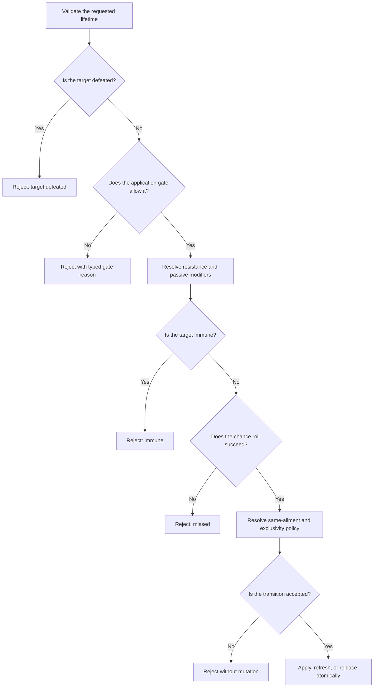

# Status And Passive Lifecycle

## Purpose And Optionality

Convergence supplies an optional status-lifecycle module for ailments, timed
state, turn restrictions, recovery, cleanup, and passive triggers. A game that
does not use these mechanics does not need to compose the module.

**Framework rule:** behavior comes from typed definitions and policies. An
ailment's display name does not decide whether it deals damage, prevents an
action, changes defenses, recovers naturally, or persists after battle.

**Configured rule:** content supplies ailment behavior, groups, durations,
triggers, recovery, and passive targets. Injected policies select application,
replacement, restriction, reserve-aging, and stat-modifier behavior.

**Host responsibility:** the game presents icons, messages, animations, target
prompts, and scene changes from typed results and events.

## Applying An Ailment

One application attempt follows this order:

The supplied application gate blocks ailments while the target is guarding.
A game may instead inject the supplied allow-all gate or its own policy.

The supplied transition policy behaves as follows:

| Current state | Candidate | Result |
|---|---|---|
| No conflict | New ailment | Apply |
| Same ailment active | Same ailment | Refresh its lifetime |
| Different ailment in the same exclusivity group | New ailment | Replace the old ailment |
| Conflicting ailment forbids exclusivity replacement | New ailment | Reject |

Convergence also supplies policies that reject every existing conflict, or
refresh the same ailment while rejecting a different exclusive ailment.

An exclusivity group can model "only one major ailment" without preventing
unrelated status groups from coexisting.

## Ailment Combat Modifiers

An active ailment may change combat without adding a turn restriction. Its
typed modifier record can:

- multiply all damage dealt;
- multiply damage taken;
- multiply evasion;
- add a flat critical-chance vulnerability; and
- mark the actor as rigid-bodied for rules that care about that state.

When several ailments coexist, their three multipliers stack by multiplication,
critical vulnerability stacks by addition, and rigid body is active when any
ailment supplies it. For example, damage-dealt multipliers of `1.5` and `2.0`
produce `3.0`; they do not add to `3.5`.

Combat stat stages are resolved before these generic ailment modifiers. Attack
stages retain separate physical and magical channels. Defense and evasion stage
multipliers become the starting values that ailment multipliers then modify.
Saturating arithmetic prevents an authored stack from wrapping around at the
numeric limit.

Names and descriptions do not create these effects. A content author must set
each modifier explicitly, and a host should display the resulting typed state
rather than recalculate it.

## Turn-Start Restrictions

At the start of an actor's turn, Guard clears before ailment restrictions are
resolved. The lifecycle can produce:

- `CanAct`: no restriction;
- `LimitedAction`: only the listed action IDs are legal;
- `ForcedBasicAttack`: use the actor's typed basic attack;
- `ForcedConfusion`: use the game's configured confusion command path;
- `Skip`: consume the turn without a selected command;
- `FleeBattle`: remove the actor through the encounter's flee path; or
- `RecallToRoster`: recall an eligible Companion instead of fleeing.

A chance-based flee restriction explicitly chooses whether an eligible
Companion is recalled or escapes the battle. A recall choice still becomes
`FleeBattle` when that actor cannot be recalled. These are the only two authored
outcomes; an undefined value is invalid content and never acts as an implicit
escape choice.

The supplied most-restrictive policy uses this precedence:

1. flee or roster recall;
2. skip;
3. forced confusion;
4. forced basic attack;
5. limited action;
6. can act.

If equally strong limited-action effects coexist, their allowed action sets are
intersected. An empty intersection becomes `Skip`. Ties are deterministic by
the source ailment ID.

The ailments present when turn-start resolution begins receive ordered
restriction slots. Before each slot, the framework checks that the same
ailment instance is still active. If an earlier custom behavior removes,
refreshes, or replaces a later ailment, that stale slot is skipped. An ailment
newly added during turn start waits until the next turn-start boundary.
Surviving slots keep their boundary-start order.

## Turn-End Order

For a deployed actor, one owner-turn-end boundary runs in this exact order:

1. passive skill triggers;
2. active ailment trigger effects;
3. authored recovery events or natural-recovery checks;
4. ailment, status, and matching stat-modifier duration ticks.

This order matters. A passive recovery can occur before poison-like damage,
and recovery is evaluated before a duration expires at that same boundary.
Every accepted mutation and every rejection is returned as typed evidence.

The ailments present when the trigger step begins receive ordered trigger
slots. Before each slot, the framework checks that the same ailment instance is
still active. An ailment removed, cured, refreshed, or replaced by an earlier
trigger does not execute its old slot. An ailment newly applied during this
step waits until the next matching owner-turn boundary. Surviving ailments keep
their original order.

An undeployed reserve actor does not receive owner-turn-end effects. Reserve
aging, when desired, occurs through a separately configured encounter clock;
it is never inferred from the number of actions taken.

## Durations And Clocks

| Duration | Meaning |
|---|---|
| Instant | Expires at the end of the outermost ordered-effect execution scope |
| Counted turns | Decrements only when its authored event ID occurs |
| Phase | Expires when its authored phase ID completes |
| Battle | Expires during battle-end cleanup |
| Permanent | Has no automatic clock expiry |

An outermost ordered-effect scope is one complete framework effect sequence.
That may be a selected skill or item, a passive trigger, or an ailment trigger.
An Instant state can affect later effects inside the same sequence, then expires
before a separately selected command begins. Nested effects do not create extra
expiry boundaries. A host that runs effects outside the standard executors must
dispatch the explicit action-end lifecycle boundary itself.

Instant state is therefore not a legal save-and-restore state. A host must
capture a save only after the outer action-end boundary has committed. A
snapshot taken while Instant state is still active is rejected rather than
restored into the middle of an already-started effect sequence. Counted, Phase,
Battle, and Permanent state may be retained when their other validation rules
are satisfied.

Team IDs, phase IDs, and lifecycle event IDs are separate identifiers. A host
must map them explicitly when composing an encounter. Timed stat modifiers use
one monotonic sequence stream per lifecycle event ID across the complete
battle. Sharing one event ID between two team phases means both phase endings
are occurrences of the same clock; using different event IDs creates
independent clocks.

An actor-turn event still advances state only for the actor whose turn ended.
The battle-wide sequence identifies the occurrence; it does not make every
actor's duration tick. This distinction lets a buff applied to another actor
retain its full duration until that target reaches its own next matching turn.

The supplied reserve policy suspends reserve state by default. A game may use
the supplied advancing policy for one exact owning-team phase event or round
event. Even then, a counted duration authored with
`suspendWhileReserve: true` remains frozen.

Field time does not advance battle state automatically. A host must explicitly
dispatch a lifecycle clock if its game design allows field-time aging.

## Lifetime And Removal

A status lifetime has two independent parts:

- **expiration:** when its clock runs out; and
- **removal profile:** which causes are allowed to remove it.

This separation allows a three-turn status to also end on battle cleanup, or a
long-lived condition to survive battle and field transitions.

Removal causes include cure, dispel, natural recovery, authored recovery,
duration expiry, exclusivity replacement, deployment swap, defeat, flee,
roster recall, battle end, field transition, consumption, and scripted removal.

The supplied profiles are:

| Profile | Behavior |
|---|---|
| Standard | Allows every supplied removal cause |
| Uncurable | Rejects ordinary cure and recovery, but still permits dispel, cleanup, expiry, and scripted removal |
| Protected | Allows only duration expiry and scripted removal |

The supplied common lifetimes are:

| Lifetime | Not removed by |
|---|---|
| Deployment | Nothing extra; uses the Standard profile |
| Encounter | Deployment swap or roster recall |
| Field | Deployment swap, defeat, flee, roster recall, battle end, or field transition |
| Persistent | Same Field permissions with no automatic duration |
| Protected persistent | Everything except scripted removal |

Schema-v9 content authors both lifetime decisions directly. An ailment or
status-producing effect selects its expiration and the exact causes allowed to
remove it. The supplied profiles above remain convenient programmatic defaults;
JSON content is not forced to choose one of them.

Typed dispel effects report one removal transition for every charge, shield,
affinity Break, affinity override, or other status they actually remove. A
protected or absent state produces no removal event and no hidden mutation.

## Cleanup

Cleanup is requested with one typed departure reason: deployment swap, defeat,
flee, roster recall, battle end, or field transition. The lifecycle removes
only state whose removal profile permits the corresponding cause.

Changing a Vessel's Active Hosted Entity is not actor departure. A host should
not run departure cleanup merely because the composed combat profile changed.

Cleanup also clears Guard and coordinates the selected stat-modifier policy.
Its result identifies each expired or removed status and the cause; a host does
not need to compare mutable state or parse debug text.

The canonical runner, when composed with the supplied status lifecycle port,
performs this cleanup automatically for causes it owns and can identify: a turn
restriction that commits flee, a turn restriction that commits roster recall,
or an actor newly observed as defeated. Cleanup evidence is published before
defeat narration or battle completion. Manual deployment swaps and roster
commands remain host-owned operations, so the host must request their matching
cleanup until those commands are executed inside the canonical encounter
transaction.

## Passive Skills

Passive skills are distinct from active skills. An actor's passive collection
rejects active skills and duplicate passive IDs. Passives can be enabled,
disabled, added, or removed immediately.

An authored trigger explicitly selects:

- its event ID;
- owner, event targets, owner team, opposing teams, or all participants;
- alive, defeated, or any targets;
- whether reserve actors are included;
- an optional condition; and
- ordered typed effects.

Event policy separately decides whether the passive's **owner** may initiate a
trigger. The canonical encounter lifecycle supplies `DeployedOnly` for battle
start, so reserve-owned battle-start passives do not fire by default. A game
can explicitly select `AllParticipants` for reserve auras or similar rules.
This does not change trigger targeting: `includeReserveActors` still decides
whether reserve actors may be **targets**.

Execution order is passive loadout, trigger index, resolved target order, then
effect order. Duplicate target IDs are removed. Each matching trigger's eligible
target set is fixed when dispatch begins, before any passive effect runs. An
effect that defeats or revives an actor does not retroactively remove or add
that actor to the activation that is already being resolved.

Re-entry is blocked by default. If a game permits a trigger to re-enter itself,
it must also configure a positive finite per-battle limit. Limits may count:

- **per dispatch:** one accepted fan-out counts once; or
- **per target:** each target has an independent count.

A condition that is not met does not consume an activation. Results distinguish
executed, condition-not-met, recursion-suppressed, and limit-reached outcomes.
The supplied defeat-prevention event allows one activation per battle only when
the game has not registered its own policy. An explicit host policy remains
authoritative and may choose another finite limit.

Persistence records one enabled or disabled state for every equipped passive.
Loading rejects a missing state instead of silently enabling the passive.
Saved activation counts remain meaningful only while their passive and authored
trigger still exist. Loading rejects a count whose trigger index is missing or
whose event differs from that trigger's authored event. A game that counts per
target also preserves the referenced actor; the selected event policy still
decides whether a particular event counts per dispatch or per target. Loading
also rejects two active ailments from the same exclusivity group because live
application could not produce that state.

## Atomicity

Application, turn lifecycle, cleanup, passive dispatch, and encounter lifecycle
ingress use staged actor state. A rejected policy decision, malformed extension
result, exception, or cancellation before commit does not publish a partial
actor mutation.

A replacement passive dispatcher may evaluate conditions differently, but its
evidence must still identify an enabled passive, one of that passive's authored
triggers for the requested event, and a participant target that was eligible
when dispatch began. Eligibility is not recomputed from actor state after
effects run.
Non-executed outcomes cannot claim committed effects. Incoherent evidence is
rejected before the staged actor graph commits. If the complete replacement
result contains no `Executed` activation, every staged actor mutation is
discarded; an empty or wholly non-executed result cannot hide a state change.

This guarantee covers framework actor state, not external host work. An event
sink may fail after a lifecycle transaction has committed; the encounter then
reports a typed fault, but it cannot rewind an animation, file write, network
call, or other side effect already performed by the host. Custom handlers and
event sinks should therefore defer irreversible work, make it idempotent, or
provide their own compensation.

## Examples

### Counted ailment that pauses in reserve

An ailment has three `owner_turn_end` ticks and
`suspendWhileReserve: true`. Two deployed turns reduce it to one. Recalling the
actor preserves one remaining tick. The ailment expires after the actor returns
and completes one matching turn.

### Team recovery passive

A passive targets living members of the owner's team and excludes reserves.
When its event occurs, all eligible deployed allies are resolved in stable
participant order. Under a per-dispatch limit, that fan-out consumes one
activation; under a per-target limit, each ally is counted separately.

## Related Documentation

- [Stat Modifier Policies](stat-modifier-policies.md)
- [Battle Knowledge](battle-knowledge.md)
- [Developer: Status And Passive Lifecycle](../developer-guide/status-passive-lifecycle.md)
- [Technical: Status And Passive Lifecycle](../technical/status-passive-lifecycle.md)
