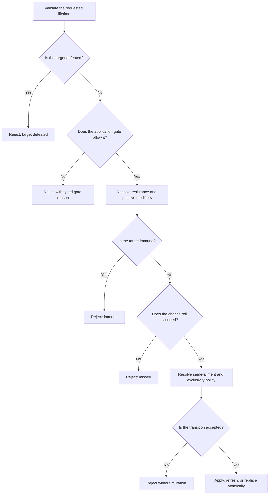

# Status And Passive Lifecycle

## Purpose And Optionality

Convergence supplies an optional status-lifecycle module for ailments, timed
state, turn restrictions, recovery, cleanup, and passive triggers. A game that
does not use these mechanics does not need to compose the module.

**Framework rule:** behavior comes from typed definitions and policies. An
ailment's display name does not decide whether it deals damage, prevents an
action, changes defenses, recovers naturally, or persists after battle.

**Configured rule:** content supplies ailment behavior, groups, durations,
triggers, recovery, and passive targets. Injected policies select application,
replacement, restriction, reserve-aging, and stat-modifier behavior.

**Host responsibility:** the game presents icons, messages, animations, target
prompts, and scene changes from typed results and events.

## Applying An Ailment

One application attempt follows this order:

The supplied application gate blocks ailments while the target is guarding.
A game may instead inject the supplied allow-all gate or its own policy.

The supplied transition policy behaves as follows:

| Current state | Candidate | Result |
|---|---|---|
| No conflict | New ailment | Apply |
| Same ailment active | Same ailment | Refresh its lifetime |
| Different ailment in the same exclusivity group | New ailment | Replace the old ailment |
| Conflicting ailment forbids exclusivity replacement | New ailment | Reject |

Convergence also supplies policies that reject every existing conflict, or
refresh the same ailment while rejecting a different exclusive ailment.

An exclusivity group can model "only one major ailment" without preventing
unrelated status groups from coexisting.

## Turn-Start Restrictions

At the start of an actor's turn, Guard clears before ailment restrictions are
resolved. The lifecycle can produce:

- `CanAct`: no restriction;
- `LimitedAction`: only the listed action IDs are legal;
- `ForcedBasicAttack`: use the actor's typed basic attack;
- `ForcedConfusion`: use the game's configured confusion command path;
- `Skip`: consume the turn without a selected command;
- `FleeBattle`: remove the actor through the encounter's flee path; or
- `RecallToRoster`: recall an eligible Companion instead of fleeing.

The supplied most-restrictive policy uses this precedence:

1. flee or roster recall;
2. skip;
3. forced confusion;
4. forced basic attack;
5. limited action;
6. can act.

If equally strong limited-action effects coexist, their allowed action sets are
intersected. An empty intersection becomes `Skip`. Ties are deterministic by
the source ailment ID.

## Turn-End Order

For a deployed actor, one owner-turn-end boundary runs in this exact order:

1. passive skill triggers;
2. active ailment trigger effects;
3. authored recovery events or natural-recovery checks;
4. ailment, status, and matching stat-modifier duration ticks.

This order matters. A passive recovery can occur before poison-like damage,
and recovery is evaluated before a duration expires at that same boundary.
Every accepted mutation and every rejection is returned as typed evidence.

An undeployed reserve actor does not receive owner-turn-end effects. Reserve
aging, when desired, occurs through a separately configured encounter clock;
it is never inferred from the number of actions taken.

## Durations And Clocks

| Duration | Meaning |
|---|---|
| Instant | Expires at the next action boundary |
| Counted turns | Decrements only when its authored event ID occurs |
| Phase | Expires when its authored phase ID completes |
| Battle | Expires during battle-end cleanup |
| Permanent | Has no automatic clock expiry |

Team IDs, phase IDs, and lifecycle event IDs are separate identifiers. A host
must map them explicitly when composing an encounter.

The supplied reserve policy suspends reserve state by default. A game may use
the supplied advancing policy for one exact owning-team phase event or round
event. Even then, a counted duration authored with
`suspendWhileReserve: true` remains frozen.

Field time does not advance battle state automatically. A host must explicitly
dispatch a lifecycle clock if its game design allows field-time aging.

## Lifetime And Removal

A status lifetime has two independent parts:

- **expiration:** when its clock runs out; and
- **removal profile:** which causes are allowed to remove it.

This separation allows a three-turn status to also end on battle cleanup, or a
long-lived condition to survive battle and field transitions.

Removal causes include cure, dispel, natural recovery, authored recovery,
duration expiry, exclusivity replacement, deployment swap, defeat, flee,
roster recall, battle end, field transition, consumption, and scripted removal.

The supplied profiles are:

| Profile | Behavior |
|---|---|
| Standard | Allows every supplied removal cause |
| Uncurable | Rejects ordinary cure and recovery, but still permits dispel, cleanup, expiry, and scripted removal |
| Protected | Allows only duration expiry and scripted removal |

The supplied common lifetimes are:

| Lifetime | Not removed by |
|---|---|
| Deployment | Nothing extra; uses the Standard profile |
| Encounter | Deployment swap or roster recall |
| Field | Deployment swap, defeat, flee, roster recall, battle end, or field transition |
| Persistent | Same Field permissions with no automatic duration |
| Protected persistent | Everything except scripted removal |

Schema-v8 content authors both lifetime decisions directly. An ailment or
status-producing effect selects its expiration and the exact causes allowed to
remove it. The supplied profiles above remain convenient programmatic defaults;
JSON content is not forced to choose one of them.

## Cleanup

Cleanup is requested with one typed departure reason: deployment swap, defeat,
flee, roster recall, battle end, or field transition. The lifecycle removes
only state whose removal profile permits the corresponding cause.

Changing a Vessel's Active Hosted Entity is not actor departure. A host should
not run departure cleanup merely because the composed combat profile changed.

Cleanup also clears Guard and coordinates the selected stat-modifier policy.
Its result identifies each expired or removed status and the cause; a host does
not need to compare mutable state or parse debug text.

## Passive Skills

Passive skills are distinct from active skills. An actor's passive collection
rejects active skills and duplicate passive IDs. Passives can be enabled,
disabled, added, or removed immediately.

An authored trigger explicitly selects:

- its event ID;
- owner, event targets, owner team, opposing teams, or all participants;
- alive, defeated, or any targets;
- whether reserve actors are included;
- an optional condition; and
- ordered typed effects.

Execution order is passive loadout, trigger index, resolved target order, then
effect order. Duplicate target IDs are removed.

Re-entry is blocked by default. If a game permits a trigger to re-enter itself,
it must also configure a positive finite per-battle limit. Limits may count:

- **per dispatch:** one accepted fan-out counts once; or
- **per target:** each target has an independent count.

A condition that is not met does not consume an activation. Results distinguish
executed, condition-not-met, recursion-suppressed, and limit-reached outcomes.

## Atomicity

Application, turn lifecycle, cleanup, passive dispatch, and encounter lifecycle
ingress use staged actor state. A rejected policy decision, malformed extension
result, exception, or cancellation before commit does not publish a partial
actor mutation.

This guarantee covers framework actor state, not external host work. An event
sink may fail after a lifecycle transaction has committed; the encounter then
reports a typed fault, but it cannot rewind an animation, file write, network
call, or other side effect already performed by the host. Custom handlers and
event sinks should therefore defer irreversible work, make it idempotent, or
provide their own compensation.

## Examples

### Counted ailment that pauses in reserve

An ailment has three `owner_turn_end` ticks and
`suspendWhileReserve: true`. Two deployed turns reduce it to one. Recalling the
actor preserves one remaining tick. The ailment expires after the actor returns
and completes one matching turn.

### Team recovery passive

A passive targets living members of the owner's team and excludes reserves.
When its event occurs, all eligible deployed allies are resolved in stable
participant order. Under a per-dispatch limit, that fan-out consumes one
activation; under a per-target limit, each ally is counted separately.

## Related Documentation

- [Stat Modifier Policies](stat-modifier-policies.md)
- [Battle Knowledge](status-passives-and-knowledge.md)
- [Developer: Status And Passive Lifecycle](../developer-guide/status-passive-lifecycle.md)
- [Technical: Status And Passive Lifecycle](../technical/status-passive-lifecycle.md)
