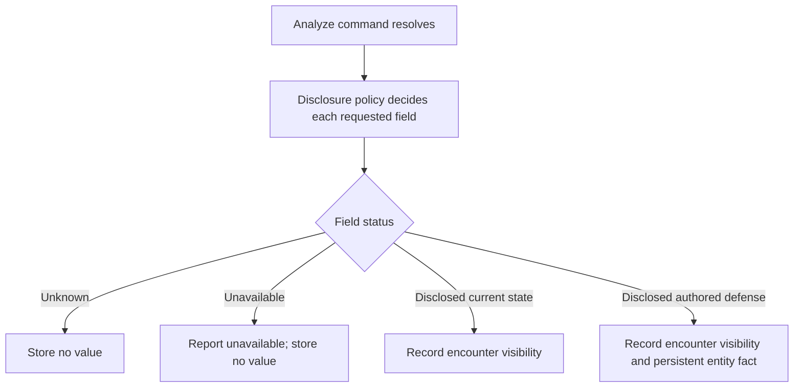

# Battle Knowledge

## Purpose

Battle knowledge lets a game distinguish what the player or an AI side has
actually learned from what the framework can privately calculate. A host may
present known facts as icons, target annotations, analysis panels, or text.
Unknown facts remain unknown even though the target's definition exists in the
catalog.

The feature is optional. A game may execute battles without retaining any
knowledge, may keep only encounter knowledge, or may save player knowledge
between encounters.

## Two Scopes

Convergence has two deliberately separate knowledge scopes.

| Scope | Identity | Typical owner | Lifetime |
|---|---|---|---|
| Persistent entity knowledge | Entity definition ID | Player session | Included in a save until a game replaces or removes it |
| Encounter knowledge | Runtime target ID plus entity definition ID | One battle team | Discarded after the encounter unless a host explicitly retains diagnostic evidence |

Persistent knowledge answers a question such as, "What did the player learn
about Ashling as an entity type?" Encounter knowledge answers, "What does this
team know about this particular Ashling right now?"

This distinction prevents a temporary shield, affinity override, Break,
guarding state, or passive replacement from rewriting a permanent entity
record.

## Knowledge Domains

Both scopes may describe:

- elemental affinities;
- ailment resistances; and
- instant-defeat resistances.

Encounter analysis may additionally disclose current HP, current SP, core
stats, and skills. Those values belong to the current runtime target and never
become persistent entity knowledge.

`Almighty` is not stored as an elemental discovery because it always resolves
as normal in the supplied rules.

## What Ordinary Actions Teach

The framework derives knowledge only from typed execution evidence.

| Executed outcome | Encounter knowledge | Persistent knowledge |
|---|---|---|
| Elemental hit makes contact | Effective affinity for that runtime target | Authored affinity only when no temporary defense influenced resolution |
| Every hit misses | Nothing | Nothing |
| Ailment is successfully applied | Nothing exact about the hidden tier | Nothing |
| Ailment fails its chance roll | Nothing exact about the hidden tier | Nothing |
| Ailment is explicitly blocked as immune | Effective immunity | Authored immunity only when the result was not temporarily modified |
| Instant defeat succeeds | No exact hidden tier is inferred | Nothing |
| Instant defeat fails a random roll | Nothing exact about the hidden tier | Nothing |
| Instant defeat is explicitly blocked by immunity | Effective immunity | Authored immunity only when the result was not temporarily modified |

A success does not prove whether an ailment target was vulnerable, normal, or
resistant. Likewise, an ordinary random failure does not prove resistance.
Convergence records an exact tier only when typed evidence establishes that
tier.

### Temporary Defense Example

Suppose the player already knows that an entity is naturally weak to Ice. A
particular instance receives a temporary Ice-repelling shield and is then hit
by Ice.

- Encounter knowledge records `Repel` for that runtime instance.
- Persistent knowledge remains `Weak` for the entity definition.
- A target UI may show the encounter fact while the shield lasts.
- The temporary result cannot corrupt the saved entity record.

## Analyze

Analyze asks an injected disclosure policy about each requested field. The
standard policy discloses available fields. A restricted policy may return a
typed `Unknown` result without exposing the hidden value.

The approved boss profile hides:

- current HP;
- current SP;
- skills;
- elemental affinities;
- ailment resistances; and
- instant-defeat resistances.

Core stats are a separate field and the game may choose whether that boss
profile hides them. Constructing the supplied restricted policy without an
explicit field list hides every analysis field. Restriction is selected by
policy, not by an entity name, description, or hard-coded boss ID. Repeated
Analyze attempts cannot bypass the policy.

Disclosed defenses enter persistent entity knowledge. Disclosed current
resources, stats, and skills remain encounter-only. If a complete defense
profile is disclosed, omitted sparse entries are known to be `Normal`; the
persistent snapshot records that the corresponding profile was analyzed.

## Familiar Entities

A game may choose to reveal authored defenses when the player first acquires
or registers an entity. The supplied familiar-knowledge policy imports all
authored elemental, ailment, and instant-defeat defenses after an explicit
acquisition or Compendium hook.

The import is optional and replaceable. A disabled supplied policy imports
nothing. A custom policy may distinguish direct requests, acquisitions,
explicit Compendium registration, and synchronization from already registered
entries.

Familiarity affects player knowledge only. It never trains ordinary enemy AI.

## AI Knowledge

Every team in an ordinary automated battle starts with empty encounter
knowledge. When one teammate establishes a fact, later teammates on that side
can use it during the same encounter. The final team snapshots are diagnostic
results; they are not automatically saved.

A boss or scripted encounter may receive an explicit team seed. The seed must
reference participating teams and matching runtime targets. Supplying a seed
does not promote it into player knowledge and does not make it survive a later
ordinary encounter.

## Battle End

Persistent knowledge remains available to the player session. Encounter
knowledge is discarded. A host may keep an immutable final encounter snapshot
for logs or testing, but it must not treat that snapshot as the next battle's
starting state unless it deliberately supplies it as a new seed.

## Presentation Rules

- Query typed knowledge; never parse damage messages or animations.
- Prefer an encounter fact over a persistent fact for the same current target.
- Treat a missing fact as unknown, not normal, unless a complete analyzed
  profile explicitly establishes the default.
- Show restricted Analyze fields as unknown without revealing their values.
- Do not expose framework-private catalog data merely because a host can access
  the catalog.

## Related Rules

- [Combat, Defenses, And Turn Economy](combat-defenses-and-turns.md)
- [Status And Passive Lifecycle](status-passive-lifecycle.md)
- [Fusion, Inheritance, Acquisition, And Compendium](fusion-acquisition-and-compendium.md)
- [Saving, Loading, And Suspend Saves](saving-loading-and-suspend.md)
