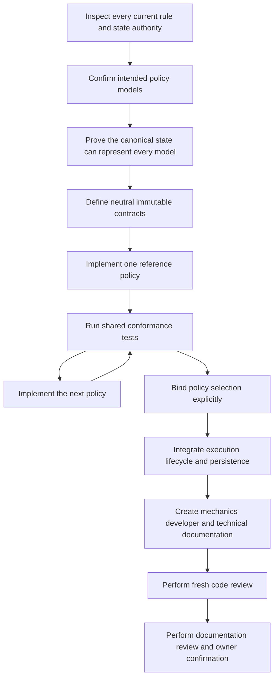

# Policy Family Design Pattern

## Purpose

This document defines how Convergence develops mechanics that can have more
than one coherent rules model.

Convergence is a framework, not one fixed game. A developer should be able to
select a supplied mechanic, replace it with another supplied mechanic, or
register an original implementation without presentation code or unrelated
runtime systems deciding the rule implicitly.

This pattern is mandatory when two intended mechanics answer the same gameplay
question differently. It prevents an early implementation from becoming a
hidden universal rule merely because it was written first.

## Decision Status

**Status:** confirmed
**Confirmed by:** project owner
**Date:** 17 July 2026

The first governed application is the stat-modifier policy family. Existing
turn-economy contracts provide a useful precedent, but future turn economies
must still complete the same feasibility process before being advertised as
supported.

## Core Vocabulary

| Term | Meaning |
|---|---|
| Policy family | A gameplay question with multiple valid, mutually exclusive rule models. |
| Policy contract | The neutral request/result boundary shared by every implementation in the family. |
| Reference policy | A complete supplied implementation with documented defaults and direct tests. |
| Policy configuration | Validated immutable values used by one policy implementation. |
| Policy authority | The one selected implementation allowed to decide that rule for a runtime scope. |
| Composition root | Host code that selects and injects policies before gameplay starts. |

A policy family is not a bag of unrelated switches. Each supplied policy must
be a coherent model whose rules can be explained and tested as a whole.

## Required Principles

### One Authority Per Scope

Exactly one policy implementation owns a policy-family decision within its
declared runtime scope. A menu, AI selector, effect executor, lifecycle hook,
or host adapter must not bypass it with a second copy of the rule.

The scope may be a battle, session, actor, transaction, or another explicitly
documented boundary. Selection must never come from display text or an actor's
name.

### Explicit Selection

A host selects the policy directly or binds it through an authored ruleset.
Missing registration, an unknown policy ID, invalid configuration, or a state
created by an incompatible policy produces typed diagnostics. There is no
silent fallback to whichever implementation happens to be convenient.

### Immutable Decisions Before Mutation

Extension policies receive immutable requests and immutable state snapshots.
They return immutable assessments or transitions. Framework-owned services
validate those results and commit them through the existing transaction
boundary.

A host-supplied policy must not receive a live mutable actor merely because it
is easier to implement. That would make rollback and cross-policy conformance
unverifiable.

### Separate State Evolution From Numeric Interpretation

Two policy families must not be combined accidentally. For example:

- a stat-modifier lifecycle policy decides how modifiers are applied, retained,
  ticked, removed, and restored;
- a stat-stage scaling policy converts the resolved stage into combat
  multipliers.

A game may reuse the same scaling table with different lifecycle policies or
reuse one lifecycle policy with different scaling tables.

### State Must Represent Every Supplied Policy

The canonical runtime and save shape must be able to represent every supplied
reference policy without discarding information. An aggregate value is not
enough when one policy requires independently expiring contributions.

Derived projections may be cached, but the authoritative state must retain the
information required to reproduce application, ticking, cleanup, and restore.

### Policy Identity Travels With Retained State

If policy-owned state can survive a frame, battle command, checkpoint, or save,
the framework must be able to detect restoration under an incompatible policy.
The selected policy identity and compatibility rules therefore belong at the
appropriate retained-state boundary.

### Meaningful Success Comes From The Policy

Callers must not infer success from the authored request. The policy result
states whether canonical state changed and identifies the exact change.

This distinction controls effect events, item consumption, cost commitment,
and host presentation without conflating them with turn consumption.

### Host Neutrality

Policies may decide rules. They do not read input, print messages, access
scenes, serialize files, or schedule animation. Hosts translate typed policy
events into presentation and provide commands through existing host contracts.

## Development Sequence

Every new policy family follows this sequence:

### Feasibility Review

Before changing public contracts, inspect:

1. every mutation entry point;
2. assessment and execution paths;
3. lifecycle and cleanup hooks;
4. runtime and save snapshots;
5. restoration and validation;
6. event payloads;
7. ruleset binding and registrations;
8. host composition;
9. public API and schema consequences;
10. existing tests that accidentally encode one policy as universal.

The review must say whether the current representation is sufficient. If it is
not, state migration precedes reference-policy implementation.

### Shared Contract Checkpoint

The shared checkpoint establishes:

- immutable requests, assessments, transitions, diagnostics, and events;
- canonical policy-owned state;
- policy identity and compatibility validation;
- atomic commit ownership;
- deterministic ordering;
- conformance tests that every implementation must pass.

It must not secretly implement one reference policy as the interface default.

### One Checkpoint Per Reference Policy

Each supplied policy receives an isolated commit and focused tests. A policy is
not complete merely because the shared interface can theoretically express it.

Tests cover application, rejection, boundaries, opposite-direction behavior,
expiry, cleanup, restoration, immutability, and meaningful-success reporting.

### Integration Checkpoint

After individual policies pass their unit contracts, integrate the selected
policy through every real consumer. Searches and adversarial tests must prove
that old direct mutation paths cannot bypass the authority.

### Review Checkpoints

Code review and documentation review are separate gates:

- code review traces current source without trusting roadmap completion claims;
- documentation review checks diagrams, examples, policy optionality, and host
  responsibilities against the corrected source;
- owner confirmation is required before intended behavior becomes `reviewed`.

## Required Conformance Tests

Every policy implementation in a family must prove:

- deterministic results for identical requests and state;
- immutable inputs and outputs;
- rejection without mutation;
- no arithmetic overflow or invalid enum/ID escape;
- explicit behavior at all configured limits;
- compatible capture and restore;
- typed events that do not require message parsing;
- framework neutrality;
- no hidden fallback when the policy is missing;
- no bypass through another public runtime method.

Cross-policy tests must run the same scenario under each supplied policy and
show that only the documented policy-dependent outcomes differ.

## Application To Stat Modifiers

The approved stat-modifier family contains three reference policies:

1. **Persistent staged:** signed stages stack to configured bounds and do not
   expire naturally during the encounter.
2. **Timed exclusive:** one modifier occupies a track and follows one duration
   and an explicit reapplication rule.
3. **Timed contributions:** applications retain independent signed
   contributions and independent durations; the resolved stage is derived from
   currently active contributions.

The lifecycle policy does not own combat multipliers. Existing stat-stage
scaling remains a separate replaceable policy.

The detailed migration is governed by the
[Stat Modifier Policy Roadmap](roadmap/stat-modifier-policy-roadmap.md).

## Application To Turn Economies

`IBattleTurnEconomy` already allows Standard Action and Action Token economies
to share encounter orchestration. That does not prove that every future economy
fits the current interface.

For example, a bonus-action economy may need to identify which actor receives
the next action rather than only how many actions remain. The encounter runner
currently rotates actors independently from `IBattleTurnEconomy`. A future
bonus-action policy must therefore complete a feasibility review before code is
written; the correct solution may extend actor scheduling as a related policy
family instead of forcing actor identity into an unsuitable counter API.

## Anti-Patterns

Do not:

- add booleans until one class impersonates several incompatible mechanics;
- expose a live mutable actor to a custom policy;
- keep an old direct mutation method as an undocumented bypass;
- silently select a default when authored binding fails;
- call an extension point supported before a second implementation passes the
  shared contract tests;
- embed presentation or engine objects in policy results;
- store only a derived aggregate when a supplied policy needs source entries;
- combine lifecycle, scaling, targeting, and turn economy into one universal
  policy object;
- promote documentation before source review and owner confirmation.

## Versioning

Policy-family work may affect several independent contracts:

- public C# API;
- authored content schema;
- runtime save snapshot;
- host composition;
- example content.

Each contract is versioned deliberately. A schema bump is required only if the
authoring shape changes. A save bump is required when retained runtime meaning
or shape changes. Neither follows automatically from a class rename.

Convergence is currently pre-release, but breaking work still receives an
explicit migration note and isolated green commits so the future stable-release
process has an auditable precedent.

## Definition Of Complete

A policy family is complete only when:

- the neutral contract and canonical state are implemented;
- every promised reference policy passes shared and focused tests;
- policy selection is explicit and validated;
- every runtime consumer delegates to the selected authority;
- saves reject incompatible policy state predictably;
- at least one clean host demonstrates selection without owning the rule;
- mechanics, developer, and technical documentation are reviewed;
- a fresh code review finds no unresolved correctness finding;
- the project owner confirms the final documented behavior.
