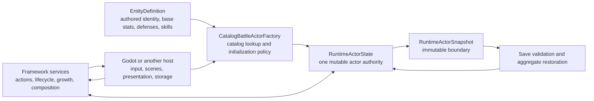

# Actors And Runtime State Collaborative Review

## Status

**Decision review complete: D1-D6 confirmed. Runtime correction work is tracked
by the active actor composition, progression, roster, and stage roadmap.**

This review records the first collaborative documentation pass over actor identity,
runtime state, stats, resources, progression, ownership, rosters, and restoration.
It does not change framework behavior and it does not promote the related
documentation-coverage entries to `reviewed`.

The implementation sequence and remaining default choices are recorded in the
[Actor Composition, Progression, Roster, And Stage Roadmap](../roadmap/actor-composition-progression-roster-roadmap.md).

The active Framework source and tests define what the current build does. The
archived console prototype is used only to identify behavior that may have been
preserved, deliberately redesigned, or accidentally omitted.

## Scope And Evidence

Primary active authorities:

- `src/Convergence.Framework/Execution/BattleRuntimeState.cs`
- `src/Convergence.Framework/Runtime/RuntimeStateSnapshots.cs`
- `src/Convergence.Framework/Runtime/RuntimeActorStatComposition.cs`
- `src/Convergence.Framework/Runtime/RuntimeActorGrowthComposition.cs`
- `src/Convergence.Framework/Runtime/ProgressionPolicies.cs`
- `src/Convergence.Framework/Runtime/PartyRosterTransitions.cs`
- `src/Convergence.Framework/Runtime/RuntimePersistenceSnapshots.cs`
- `src/Convergence.Framework/Runtime/RuntimeSessionRestoration.cs`
- `src/Convergence.Framework/Encounters/CatalogBattleActorFactory.cs`
- the corresponding Framework runtime and catalog tests.

Historical comparison evidence:

- the archived universal actor and owned-entity sources;
- the archived actor factory and progression adapter;
- the archived party manager;
- archived progression and party characterization tests.

## Current Runtime Model

`RuntimeActorState` is the canonical live object. Battle resource mutation,
growth commits, lifecycle changes, equipment identity, roster identity, status,
passive activation, and snapshot generation all operate on that same instance.
`RuntimeStateSnapshotTests.CanonicalActorState_GrowthResourcesAndBattleLifecycleMutateOneObject`
proves that the old current-value copy loop is no longer the state authority.

An authored `EntityDefinition` is not a live actor. Many runtime actors may share
one definition while retaining different instance IDs, levels, resources,
skills, equipment, statuses, ownership, and progression.

## Verified Preserved Or Deliberately Improved Behavior

| Concern | Current conclusion |
|---|---|
| Live state authority | Improved deliberately. The old broad `Combatant` object has been replaced by one framework-owned `RuntimeActorState` with immutable snapshot boundaries. |
| Identity | Improved deliberately. Authored `ContentId` and live `RuntimeInstanceId` are separate, and runtime IDs are validated across encounters, parties, rosters, and saves. |
| Death | Preserved and generalized. Defeat is derived from the configured vital resource reaching zero rather than a hardcoded `CurrentHP` property. |
| Stat source | Intentionally redesigned. A request explicitly selects actor stats or Active Hosted Entity stats. Actor-kind names do not silently select a formula. |
| Weighted Vessel stats | Intentionally removed. The Active Hosted Entity contributes its complete base stat block, without the archived percentage weights. |
| Missing Hosted Entity | Improved deliberately. The host explicitly selects rejection or actor-base fallback; missing state never silently becomes zero. |
| Stat composition | Improved deliberately. Source stats, implemented equipment modifiers, cap, stage modifiers, and resource recalculation are staged before one commit. |
| Current resource preservation | Preserved. Recomposition keeps current resource amounts and caps them to reduced maxima. Level-up mode may instead heal by the maximum-resource increase. |
| Progression | Preserved and generalized. Current experience, lifetime experience, level, and unspent points have typed snapshots and transaction results. |
| Companion ownership | Preserved. A deployed Companion remains in the Companion Roster while also appearing in the active party. Recall removes only active deployment; dismissal or consumption removes ownership. |
| Hosted Entity exchange | Preserved structurally. Swapping exchanges the Active Hosted Entity with a roster entry and returns an immutable transition. The host must then recompose the Vessel. |
| Ailments and rigid-body behavior | Improved deliberately. The archive inferred rigid state from ailment display names; clean ailment definitions carry typed modifiers and recovery rules. |
| Enemy/allied initialization | Generalized deliberately. The archived factory embedded separate resource formulas and a fallback actor. The clean factory requires an injected initialization policy and returns diagnostics instead of a fake fallback. |
| Control and presentation | Generalized deliberately. Controller IDs are metadata; command sources, AI selection, scene ownership, and visible party slots remain host responsibilities. |
| Restoration | Improved deliberately. Save validation precedes actor construction, Hosted Entity dependencies restore before their Vessels, and rejection exposes no partial session. |

## Historical Behavior That Is Not Automatically Authoritative

The archive mixed several independent concepts:

- `Combatant` owned identity, party slots, controller mode, progression,
  resources, ailments, buffs, equipment, internal-entity ownership,
  deployable-ally ownership, and combat state.
- a separate owned-entity object held stats, affinities, rank, skills, skill
  unlocks, and progression.
- class labels selected stat formulas.
- active owned-entity skills plus actor-specific extra skills formed the usable
  skill list.
- active owned-entity affinities formed the combat defense profile.
- enemy and allied-actor creation used different hardcoded resource formulas.
- missing entity data created a `Glitch` fallback actor.

The current framework should not restore these couplings merely because they
existed. They are useful evidence when deciding whether the clean model has an
equivalent, configurable concept.

## Confirmed Decision 1: A Hosted Entity Supplies The Vessel Combat Profile

### Current implementation

`RuntimeActorStatCompositionService` reads the Active Hosted Entity's
`BaseStats`. It does not compose:

- learned or equipped skills;
- passive skills;
- elemental, ailment, or instant-death defenses;
- basic-attack profile;
- other capability IDs.

`RuntimeActorState.DefenseProfile` is created from the Vessel's own entity
definition and is not replaced during stat composition. `CatalogBattleActor`
also retains the Vessel's creation-time skill loadout.

### Historical comparison

The archived actor used its active owned entity for both consolidated skills and
affinity lookup. That does not prove the clean framework should reproduce every
old coupling, but it shows that stats-only composition is narrower than the old
playable behavior.

### Confirmed design

For the supplied Vessel module, the Active Hosted Entity provides:

- the Vessel's core battle stats;
- elemental, ailment, and instant-death defenses;
- active and passive skills;
- its own level, experience, stat growth, and skill-unlock progression.

The Vessel continues to own:

- current and maximum character resources;
- equipment and the equipment-derived basic attack;
- ailments, stages, guarding, charges, shields, and other live battle state;
- controller, team, deployment, and presentation identity.

Swapping the Active Hosted Entity must atomically recompose stats, defenses,
skills, and passive state, then recalculate character resources while preserving
and capping current values. A failed composition leaves both the Vessel and
party/roster state unchanged.

Hosted Entities remain an optional module. Games that do not use Vessels do not
construct this composition path. The framework does not infer composition from
display text.

## Confirmed Decision 2: Runtime Skill Learning On Level Up

### Current implementation

`CatalogBattleActorFactory.Create` includes base skills and every authored
`SkillUnlockDefinition` available at the requested level. Live level growth,
however, changes progression, stats, base resources, and current resources only.
It does not evaluate newly crossed skill-unlock levels or update
`RuntimeSkillStateSnapshot`.

`CatalogBattleActor.SkillLoadout` is also a creation/restore-time immutable list,
while `RuntimeActorState.Skills` is the saved runtime skill state. Introducing
live skill learning without defining which view is authoritative would allow
them to diverge.

### Historical comparison

The archived owned-entity recalculation learned every skill whose required level
had been reached.

### Confirmed design

1. add a typed runtime skill-progression service;
2. compare the old and new level;
3. return newly available skills in authored order;
4. fill an available move slot when one exists;
5. when the move list is full, return a typed pending choice that permits
   replacing one equipped skill or forgetting the new skill;
6. keep presentation and input host-owned;
7. commit growth and all resulting skill decisions atomically;
8. make action selection consume the runtime equipped-skill state rather than a
   second creation-time list.

The move-slot limit is a configured rule rather than an implicit constant. No
skill is selected, replaced, or forgotten based on display text.

## Confirmed Decision 3: Owned Actors Remain In Their Rosters While Active

### Current implementation

Two related structures exist:

- each `RuntimeActorSnapshot` contains a `RuntimeActorRosterSnapshot`;
- the session contains one `RuntimePartyRosterSnapshot`, which repeats the
  Active Hosted Entity, Hosted Entity Roster, and Companion Roster for its owner.

Save validation checks both structures independently but does not require the
party owner's actor-local roster to match the session party roster. DemoHost
currently constructs and synchronizes both.

### Risk

A valid save can describe one Active Hosted Entity in the owner actor and another
in the session party roster. Restoration profiles currently use the session
party roster, while other actor operations may read `RuntimeActorState.Rosters`.

### Confirmed design

Party and owned-actor placement form one canonical aggregate.

- Every owned Hosted Entity remains in the Hosted Entity Roster.
- `ActiveHostedEntity` points to one entry already present in that roster.
- Selecting a different active entry changes the active reference; it does not
  remove or exchange roster entries.
- Every owned Companion remains in the Companion Roster.
- A deployed Companion also appears in the active party.
- Recall removes the Companion from active deployment but preserves its roster
  entry.
- Dismissal, consumption, or fusion removes the roster entry and any active
  reference in one transaction.
- Roster capacity counts each owned runtime actor once. Active/equipped roles do
  not duplicate the ownership count.

The current rule that rejects an Active Hosted Entity for also appearing in its
roster conflicts with this design and must be reversed. The duplicated
actor-local and session roster representations must be replaced by one
authoritative aggregate rather than synchronized manually.

## Confirmed Decision 4: Party Placement And Encounter Presence

### Current implementation

`RuntimeActorDeployment` contains `Active`, `Reserve`, and `Deployed`.
`RuntimeActorDeploymentSnapshot` separately contains `IsActive` and
`HasSwappedThisTurn`.

The runtime uses `IsActive` to decide target eligibility, encounter
participation, and reserve-suspended lifecycle ticking. The enum value is mostly
descriptive, and contradictory combinations are not rejected.

Examples currently representable:

- `Deployment = Reserve`, `IsActive = true`;
- `Deployment = Deployed`, `IsActive = false`;
- `Deployment = Active`, `IsActive = false`.

### Confirmed design

The runtime will use this exact separation:

- party membership: active party or reserve party;
- encounter participation: deployed or not deployed;
- lifecycle eligibility: derived from encounter participation;
- per-turn swap state: encounter-local state.

The party aggregate remains the sole authority for active and reserve placement.
Actor encounter state will use one `IsDeployed` value plus encounter-local swap
state. The current deployment enum and separate `IsActive` flag will be removed,
making contradictory combinations unrepresentable.

## Confirmed Decision 5: Ownership, Command Authority, And Team

### Current implementation

`RuntimeActorOwnershipSnapshot` stores:

- `ControllerId`;
- `TeamId`;
- optional `OwnerInstanceId`.

Team membership is consumed by targeting and encounters. `ControllerId` and
`OwnerInstanceId` are largely metadata. Save validation checks
`OwnerInstanceId` syntax but does not require it to reference a saved actor.

### Confirmed design

- `OwnerInstanceId` will be removed from individual actor snapshots.
- The party and roster aggregate will be the ownership authority.
- `ControllerId` will become `CommandAuthorityId`.
- `CommandAuthorityId` is an opaque host-routing key. Framework will not infer
  local, AI, network, or presentation behavior from its text.
- `TeamId` remains the framework-consumed targeting and encounter affiliation.

## Confirmed Decision 6: Policy-Driven Stat-Stage Magnitude

### Current implementation

Stage state is clamped to `-4..+4`, but `StandardStatResolutionPolicy` applies
one buff multiplier for any positive stage and one debuff multiplier for any
negative stage. A stage of `+1` and `+4` therefore produce the same stat value
under the supplied policy.

### Historical comparison

The archived `Buffs` dictionary often stored remaining duration rather than a
true numeric stage. The clean runtime introduced explicit stage deltas and a
stage range, so the archive cannot resolve the new meaning.

### Confirmed design

Buffs and debuffs are a core combat mechanic. Repeated applications change a
numeric stage, and the resulting magnitude must affect the resolved stat. A
stage of `+4` cannot behave identically to `+1`.

### Confirmed standard

The supplied policy uses explicit tables for every stage from `-4` through `+4`.
Offense, damage taken, accuracy, and evasion remain separate channels. The
approved values and track mappings are recorded in the active implementation
roadmap. Developers may replace an individual table or register another stage
policy.

## Known Deferred Cross-Cutting Work

The actor model stores equipment IDs, and the current equipment profile resolves
accessory stat modifiers and weapon basic attacks. Armor defense/evasion,
equipment-granted skills or passives, basic-attack modifiers, and typed
secondary equipment effects remain incomplete. This is an existing roadmap gap,
not a newly discovered actor-state defect.

## Proposed Documentation Set After Decisions

Once the unresolved decisions are confirmed, this capability should produce:

- revised `docs/mechanics/actors-progression-and-resources.md`;
- `docs/developer-guide/actors-and-runtime-state.md`;
- `docs/technical/runtime-actor-state-and-restoration.md`;
- one or more confirmed records under `docs/decisions`;
- reviewed coverage entries for `runtime_actor_state` and
  `progression_and_resources`.

The final technical page should include:

- content definition to runtime actor hydration;
- actor mutation and snapshot boundaries;
- Vessel composition order;
- roster and ownership invariants;
- growth and skill-learning transaction order;
- save-validation and Hosted Entity restoration dependencies;
- explicit Godot host responsibilities.

## Owner Review Checklist

- [x] Confirm the combat dimensions an Active Hosted Entity supplies.
- [x] Confirm how level-up skill unlocks are learned and equipped.
- [x] Confirm the active-plus-owned roster invariant.
- [x] Define party membership versus encounter deployment.
- [x] Define ownership, command authority, and team affiliation.
- [x] Confirm that stat-stage magnitude affects combat results.
- [x] Confirm that the archived weighted-stat model remains rejected.
- [x] Confirm that enemy/allied resource initialization remains policy-owned.
- [x] Confirm that no fallback actor should be created for missing catalog data.
