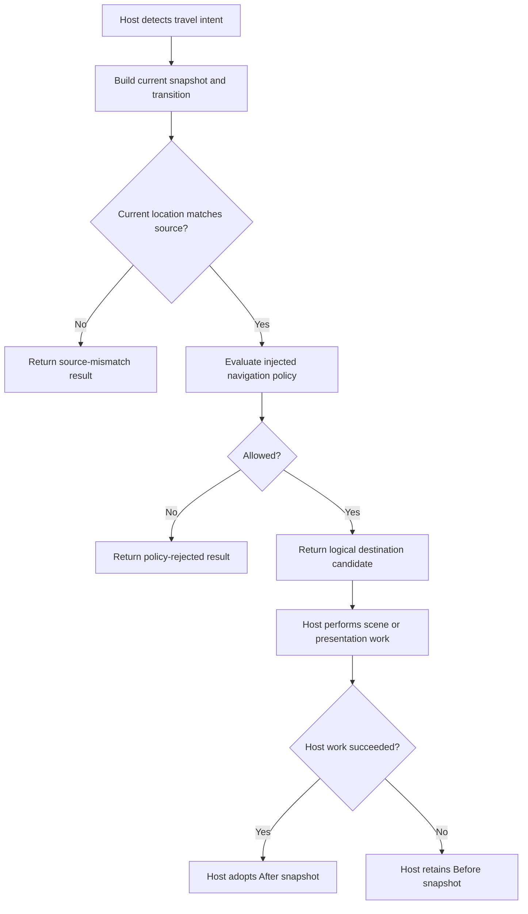

# Navigation Order 8 Source Review And Proposed Roadmap

**Date:** 14 September 2026

**Capability:** `navigation`

**Source baseline:** `a1f91e68` (`docs: distinguish implementation from order closure`)

**Implementation state after this review:** `partial`

**Order state after this review:** `open`

**Owner-decision status:** O8-D1 through O8-D10 confirmed by the owner on
18 September 2026, including O8-D6 option 1 (retain save v19). The active
[navigation decision](../decisions/navigation-and-host-adoption.md) records
approved intent; only completed checkpoints describe implemented behavior.

## Purpose

This document is the active source review and proposed implementation roadmap
for Documentation Order 8. It records what the current source actually does,
separates confirmed defects from product choices, and defines isolated
checkpoints that can later be implemented and reviewed one at a time.

It is not a claim that the proposed target behavior already exists. Current
behavior is established by source and tests. Proposed behavior becomes design
authority only after owner confirmation, implementation, focused evidence,
audience documentation, and an independent closure review agree.

## Review Method

This review was performed from current source rather than from prior summaries.
The inspected boundaries were:

- `Runtime/NavigationTransitions.cs`;
- `Runtime/RuntimeFieldSnapshot.cs`;
- the field and identifier validation in `RuntimePersistenceSnapshots.cs`;
- aggregate restore exposure in `RuntimeSessionRestoration.cs`;
- `RuntimeNavigationTests` and the navigation-related persistence tests;
- Training Annex transition definitions, policy, presenter, command loop, save
  context, restore checks, and host tests;
- the real Godot sample and `GodotIntegrationContractTests`;
- the shipped public API baseline; and
- the active mechanics, architecture, project-vision, persistence, capability,
  and documentation-coverage records.

The archived prototype was not treated as current authority. Order 8's approved
direction is generic host-triggered navigation, not restoration of the old
city/menu model.

## Plain-English Scope

Navigation answers one narrow question:

> Given the current logical location and a requested transition, may the game
> move to the requested logical destination?

The host detects the request. A Godot host may use an Area3D, door interaction,
world-map selection, scripted event, or UI signal. A console host may use a menu
command. Both can submit the same framework transition.

The framework does not move a Node, load a scene, animate a door, select a map,
traverse a dungeon node, or start an encounter. Those responsibilities remain
host-owned or belong to later Orders.

## Source-Verified Current Behavior

### Framework authority

`RuntimeNavigationService` currently:

1. requires a non-null `IRuntimeNavigationPolicy`;
2. accepts a current `RuntimeNavigationSnapshot` and a
   `RuntimeNavigationTransition`;
3. rejects a source mismatch before calling the policy;
4. calls the injected policy exactly once when the source matches;
5. returns the same snapshot as both `Before` and `After` when rejected;
6. returns a new snapshot containing the destination when approved; and
7. records one immutable structural event for the standard success or rejection
   path.

The service is synchronous and does not own mutable session state. It computes a
candidate result from supplied immutable values.

### Host authority

The Training Annex host defines its own location IDs, enter/leave transitions,
and whitelist policy. Its command loop calls the navigation service explicitly,
publishes console presentation, and then adopts the returned snapshot. It also
creates or retains dungeon progress separately from the navigation call.

The real Godot sample does not currently execute a live navigation transition.
The Godot contract test proves that navigation state can be stored in a
host-owned save envelope, but not the full trigger -> policy -> scene mapping ->
adoption path.

### Persistence authority

`RuntimeSaveGameSnapshot.Field` is nullable. When present,
`RuntimeFieldSnapshot` requires navigation and permits optional dungeon
traversal. Save structural validation rejects an empty current-location ID and
validates dungeon IDs separately. It deliberately does not require a navigation
location to exist in `GameDataCatalog`; locations are currently host-owned IDs,
not catalog definitions.

Aggregate restore returns the validated field snapshot. It does not execute a
navigation policy or load a host scene. The Training Annex adds its own
location/node allow-list checks before adopting a restored session.

## Healthy Boundaries To Preserve

1. **Generic identity:** no city, dungeon, world-map, or scene enum is embedded
   in navigation.
2. **Explicit invocation:** the framework never travels merely because a floor,
   encounter, or scene event exists.
3. **Injected access rules:** the framework supplies no hidden route graph or
   story assumptions.
4. **Explicit reverse travel:** an outbound transition does not manufacture its
   inverse.
5. **Non-mutating evaluation:** source and policy rejection preserve the
   supplied snapshot.
6. **Host presentation ownership:** the same logical transition can be driven
   by Godot, console, VN, test, or script input.
7. **Module separation:** navigation does not process dungeon nodes or start
   combat.
8. **Host-owned serialization:** framework snapshots contain IDs and state, not
   scene paths, Nodes, serializer types, or files.

## Confirmed Findings

### O8-M1: Live navigation accepts empty identifiers

**Invariant:** a navigation service must never approve or emit a transition with
an empty current-location, transition, source, or destination ID.

**Reachable path:** `ContentId` is a value type, so `default(ContentId)` exists
without running its validating string constructor. `RuntimeNavigationSnapshot`
and `RuntimeNavigationTransition` accept those values without validation. When
the current location and transition source are both default, source equality
passes. An allowing custom policy then produces an `Applied` result whose
destination and event identifiers are empty.

**Consequence:** malformed host or deserialized state can become live navigation
state and fail only later at save validation. The policy receives invalid input,
and presentation receives structurally invalid event evidence.

**Proposed correction:** add a typed `InvalidRequest` transition result. Validate
the current location and all three transition IDs before source matching or
policy evaluation. Rejection must preserve state, must not invoke the policy,
and must identify the invalid field through stable typed evidence. Constructor
checks alone are insufficient because default value-type instances cannot be
prevented.

### O8-M2: The public result contract permits contradictory states

**Invariant:** every public navigation result must describe one coherent
transition outcome.

**Reachable path:** `RuntimeNavigationResult` has a public constructor accepting
any enum value, any before/after pair, any transition, arbitrary events, and
optional reason/message values. A custom `IRuntimeNavigationService` can
therefore return `Applied` while preserving the source, return `PolicyRejected`
with a changed destination, use an undefined enum value, or pair an applied code
with a rejection event.

**Consequence:** a host that trusts `Applied`, `After`, or `Events` can receive
mutually contradictory authority from an implementation accepted by the public
extension contract.

**Proposed correction:** retain custom-service extensibility but enforce
constructor/factory invariants. Define the legal code, state, reason, and
structural-event combinations explicitly. Reject undefined enum values and
clone-malformed records at the consuming boundary where necessary.

### O8-M3: The custom-policy failure contract is undefined

**Invariant:** a host should know whether a navigation policy programming fault
is represented as a typed outcome or deliberately propagated.

**Reachable path:** `IRuntimeNavigationPolicy.Evaluate` is a public host-supplied
extension point. If it throws, the exception escapes `Navigate`. If a faulty
implementation returns `null`, the service throws `NullReferenceException`
while reading `IsAllowed`.

**Consequence:** navigation can terminate the host flow outside the typed result
contract. This is a robustness and integration-boundary issue, not a remote
security vulnerability.

**Proposed correction:** owner decision O8-D4 selects the contract. The
recommended supplied behavior is a typed, non-mutating `PolicyFaulted` result
with stable fault evidence. The framework should not add asynchronous policy or
cancellation machinery to a pure local decision merely to solve this boundary.

### O8-L1: Training Annex confuses retained dungeon progress with active location

**Invariant:** host save context should describe where the player currently is,
not merely whether historical dungeon progress exists.

**Reachable path:** leaving the Training Annex changes navigation back to
`staging_area` while intentionally retaining `DungeonTraversal`. The
Training Annex `CurrentSaveContext` helper selects `dungeon_menu` whenever
`DungeonTraversal` is non-null.

**Consequence:** after returning to the Staging Area, subsequent save-policy
evaluation can be labelled as a dungeon-menu context. Both contexts currently
allow the same sample save operations, so this does not corrupt state, but it is
semantically wrong and would become behaviorally visible if their policies
diverge.

**Proposed correction:** derive the sample's active save context from the
current navigation location or an explicit host mode. Retained dungeon progress
must remain available for re-entry without pretending the player is currently
inside it.

### O8-L2: Direct evidence does not cover the full public boundary

`RuntimeNavigationTests` currently contains two tests. They prove arbitrary IDs,
explicit reverse transitions, source mismatch, dynamic allow/reject decisions,
state preservation, policy-call count in those paths, and collection
immutability. They do not prove:

- empty-ID rejection;
- malformed policy decisions or policy faults;
- public result invariants and undefined enums;
- same-location transitions;
- stale-result adoption guidance;
- diagnostic-only message usage;
- retained dungeon progress with a staging-area save context; or
- live Godot trigger/event/scene-handle separation.

The persistence suite proves no-field and navigation-only saves. Its test named
`AllowsNavigationAndDungeonModulesToBeOmittedIndependently` does not construct a
dungeon-only field snapshot, because the current field contract cannot express
one. The name overstates what it proves even if the current aggregate shape is
retained.

## Documentation Findings

The executable documentation ledger accurately records:

- mechanics: `existing_unreviewed`;
- developer guide: `missing`;
- technical: `existing_unreviewed`.

The mechanics page states the correct high-level separation, but it does not
define same-location behavior, result adoption, fault behavior, identifier
validity, or diagnostic-message authority. `gameplay-systems.md` gives only one
summary paragraph. There is no dedicated developer integration guide or
technical state-machine page. The real Godot guide does not currently show a
navigation trigger integration.

One wording issue also needs resolution: active persistence guidance calls
navigation and dungeon progress "optional," while the wire aggregate permits
only no field, navigation only, or navigation plus dungeon. The project vision
explicitly says service optionality does not necessarily mean independent
nullability inside a broad save aggregate. The documentation must state the
selected interpretation precisely instead of implying both.

## Owner Decision Ledger

### O8-D1: Navigation remains logical and host-triggered

**Existing active direction:** retain.

The framework applies a transition only when called. Godot owns Nodes, movement,
collisions, Areas, scene loading, animation, and spatial exploration. Console,
VN, and scripted hosts remain equally valid.

### O8-D2: Locations and transitions remain host-authored

**Existing active direction:** retain.

Do not require a world/location JSON family, route graph, or catalog lookup in
Order 8. A game may build such a content layer on top. The navigation service
continues to accept arbitrary valid `ContentId` values and delegates route
availability to the injected policy.

### O8-D3: Invalid identifiers use typed non-mutating rejection

**Owner decision:** approved; implementation pending.

Add `InvalidRequest`, reject before policy evaluation, preserve before/after
state, and report the invalid field through typed evidence. This is a direct
validity correction, not a configurable policy.

### O8-D4: Custom policy faults become typed results

**Owner decision:** approved; implementation pending.

Add `PolicyFaulted` and stable fault detail for a throwing or null-returning
policy. Preserve the original snapshot. Do not add an async navigation policy;
remote work and scene loading remain host orchestration before or after the pure
rule call.

### O8-D5: Public result shapes are validated

**Owner decision:** approved; implementation pending.

Keep `IRuntimeNavigationService` replaceable, but make every returned result
obey one documented state/event matrix. Undefined enum values and contradictory
before/after/event combinations are invalid framework contract values.

### O8-D6: Retain or change the combined field aggregate

**Owner decision:** option 1 approved for Order 8. Two choices were considered:

1. **Retain the current v19 aggregate (recommended for Order 8):** `Field` is
   optional; when present, it contains required navigation and optional dungeon
   progress. Runtime services remain independently composable. A dungeon-only
   game supplies a stable neutral logical location if it adopts the broad save
   contract. Correct the overstated test name and documentation. Reconsider the
   aggregate comprehensively in Order 13 rather than changing it piecemeal.
2. **Make both snapshots independently nullable now:** permit navigation-only,
   dungeon-only, both, or neither, reject an empty aggregate, advance save v19
   to v20, and migrate Framework, DemoHost, Godot, DTOs, tests, and API baseline.

The owner chose option 1 for a hybrid visual-novel overworld and 3D dungeon:
both logical navigation and retained traversal progress are meaningful in that
game. This fresh source review does not classify the existing shape as a defect
because `project-vision.md` explicitly distinguishes service composition from
save nullability. Dungeon-only save composition remains an Order 13 decision.

### O8-D7: Same-location transitions remain legal when policy-approved

**Owner decision:** approved; implementation pending.

A transition whose source and destination are equal can represent re-entry,
refresh, a scripted threshold, or a scene reload. The framework should not
invent a prohibition. The selected policy remains the authority, and focused
tests should pin the behavior.

### O8-D8: Codes and reason IDs are authoritative; messages are diagnostic

**Owner decision:** approved; implementation pending.

`RuntimeNavigationTransitionCode` and typed reason/fault evidence drive host
logic. `Message` may help logs and the DemoHost, but a production UI should map
typed values to its own localized text. Framework English must not become the
only explanation of a failure.

### O8-D9: `Applied` means logical application, not scene-load commitment

**Owner decision:** approved; implementation pending.

The service may return an applied `After` candidate before a Godot scene is
loaded because it owns no mutable session. A host should perform fallible scene
work, then adopt `After` only if that work succeeds. On host failure it may
retain `Before`. No framework event proves that a Godot scene loaded.

### O8-D10: Retained traversal progress does not define current host context

**Owner decision:** approved; implementation pending.

The Training Annex should retain dungeon progress on return but derive current
menu/save context from logical location. This is a sample-host correction and
does not alter framework navigation or dungeon rules.

## Proposed Ordered Checkpoints

Each checkpoint is isolated, receives focused verification and review, and is
committed separately. A checkpoint stops if implementation reveals an
unapproved product decision or requires Order 9 traversal-rule work.

| Checkpoint | State | Work | Intended commit |
|---|---|---|---|
| O8-R1 | `complete` | Record this source review, open Order 8, mark the capability partial with named gaps, and align active tracking. No runtime behavior changes. | `docs: open navigation order 8 review` |
| O8-R2 | `complete` | Implement typed live identifier validation before source/policy evaluation. Add default-value and field-specific adversarial tests. | `runtime: validate navigation requests` |
| O8-R3 | `complete` | Seal public result, event, decision, and enum invariants while retaining custom service implementations. | `runtime: enforce navigation result authority` |
| O8-R4 | `complete` | Establish the selected custom-policy fault boundary and prove throwing/null policies preserve state. | `runtime: contain navigation policy faults` |
| O8-R5 | `complete` | Retain save v19 and correct misleading optional-world-state test and documentation wording; defer broad independent-nullability design to Order 13. | `runtime: clarify optional world state` |
| O8-R6 | `complete` | Correct Training Annex active-context derivation, document candidate adoption, and add focused Godot trigger/event/scene-separation evidence without moving scenes into Framework. | `host: prove generic navigation adoption` |
| O8-R7 | `complete` | Reconcile the mechanics page, add a developer guide, add a technical state-machine page, update indexes and matrices, and include Godot/console examples and diagrams. | `docs: document generic navigation` |
| O8-R8 | `pending` | Perform a fresh source-first code and documentation review, run the retained release gate, clear only resolved gaps, and close Order 8 only if no realistic reachable defect or contradiction remains. | `review: close navigation order 8` |

## Required Test Matrix

### Framework service

- arbitrary valid local and qualified location IDs;
- approved outbound and separately authored reverse transitions;
- source mismatch before policy evaluation;
- dynamic policy approval and rejection;
- same-location transition under policy control;
- invalid current, transition, source, and destination IDs;
- invalid optional reason ID from a custom policy;
- throwing and null-returning custom policy under the selected fault contract;
- undefined enums and every invalid public result combination;
- unchanged state and exact ordered event evidence for every rejection/fault;
- collection immutability and record-clone adversarial cases.

### Persistence and restore

- no world state;
- navigation state under the selected O8-D6 shape;
- navigation plus retained dungeon progress;
- dungeon-only state if and only if O8-D6 selects independent nullability;
- empty current-location rejection;
- host-owned location acceptance without catalog registration;
- aggregate restore preserves the exact navigation snapshot without evaluating a
  travel policy;
- sequential save-contract and host JSON migration if the wire shape changes.

### Host integration

- console command -> transition -> policy -> output -> state adoption;
- rejection does not change state or publish success presentation;
- retained dungeon progress survives return while active context becomes the
  staging context;
- fallible host work can retain `Before` rather than adopting `After`;
- Godot trigger maps to a transition and runtime IDs/scene handles remain outside
  Framework state;
- player-facing text maps typed result evidence rather than parsing Framework
  messages.

## Documentation Deliverables

1. **Mechanics:** explain logical locations, explicit transitions, rejection,
   reverse travel, same-location behavior, and separation from traversal.
2. **Developer guide:** show policy composition, transition construction,
   Console and Godot trigger mapping, candidate adoption, localization, save,
   restore, and fault handling.
3. **Technical:** define the result/event matrix, validation order, policy call
   boundary, snapshot ownership, persistence shape, and host commit boundary.
4. **Diagrams:** include the logical state machine, host adoption transaction,
   and navigation-versus-dungeon ownership split.

## Scope Guard

Order 8 does not add or change:

- dungeon node traversal, barriers, checkpoints, bosses, or floor events;
- encounter triggering, preparation, or battle startup;
- a world/location content schema or required route graph;
- Godot scene assets, spatial movement, pathfinding, or presentation framework;
- asynchronous navigation policies or network travel;
- save-slot UI or general persistence redesign beyond an owner-approved O8-D6
  correction;
- legacy prototype compatibility; or
- proprietary game content.

Order 9 remains responsible for dungeon traversal. Order 13 remains responsible
for the broad persistence contract unless O8-D6 explicitly approves the narrow
world-state shape change here.

## Verification Gate

Every implementation checkpoint must run:

- focused `RuntimeNavigationTests` and new Order 8 tests;
- relevant persistence, aggregate restore, DemoHost, and Godot contract tests;
- `dotnet test Convergence.sln --configuration Release --no-restore`;
- strict nonincremental .NET 8 solution build with zero warnings;
- formatting verification;
- all functional DemoHost modes and scripted Training Annex play when affected;
- real Godot headless smoke when Godot sample code changes;
- documentation-link and executable-matrix checks;
- framework forbidden-reference searches;
- `git diff --check`; and
- a clean scope check for content and unrelated capabilities.

Order 8 closes only after a fresh review identifies the intended invariant, a
realistic reachable path, consequence, and evidence for any finding. Purely
theoretical hardening and alternative product designs remain labelled as such.

## Review Baseline Evidence

Before this document was written, the focused navigation and persistence filter
passed 83 Framework tests with zero failures or skips on baseline `a1f91e68`.
That green result confirms the current tested behavior; it does not disprove the
uncovered extension and validity paths listed above.

## O8-R1 Completion Record

**Baseline:** `a1f91e68` (`docs: distinguish implementation from order closure`)

**Actual destination:** this source review, the active capability and
documentation matrices, the active product/documentation roadmaps, and their
executable synchronization guard.

**Changed files:**

- `docs/reviews/navigation-order-8-source-review-2026-09-14.md`;
- `docs/reviews/README.md`;
- `docs/roadmap/README.md`;
- `docs/roadmap/actor-composition-progression-roster-roadmap.md`;
- `docs/roadmap/documentation-completion-roadmap.md`;
- `docs/roadmap/framework-capability-matrix.md`;
- `docs/roadmap/product-roadmap.md`;
- `tests/Convergence.Framework.Tests/Architecture/FrameworkCapabilityMatrixTests.cs`;
- `tests/Convergence.Framework.Tests/Fixtures/documentation-coverage-matrix.json`;
  and
- `tests/Convergence.Framework.Tests/Fixtures/framework-capability-matrix.json`.

**Review result:** the source inspection found three medium and two low
findings. It also separated O8-D6, a legitimate persistence-shape decision,
from confirmed defects. Navigation moved from `implemented` to `partial`, and
Order 8 moved from `not_started` to `open`; no earlier Order changed state.

**Scope evidence:** no file under `src`, `samples`, `content`, `schemas`, or
`ArchiveDocs` changed. R1 changes documentation, executable tracking fixtures,
and the architecture test that guards those records. It changes no runtime,
host, schema, save contract, or content behavior.

**Verification:**

- baseline navigation plus persistence filter: 83 passed, 0 failed, 0 skipped;
- post-review focused architecture, documentation, navigation, and persistence
  filter: 107 passed, 0 failed, 0 skipped;
- full solution: 2,053 passed, 0 failed, 0 skipped;
- strict nonincremental Release build: 0 warnings, 0 errors;
- formatting verification: passed; and
- `git diff --check`: passed.

These totals verify the tracking checkpoint, not the proposed runtime fixes.
Owner approval was recorded separately before implementation began.

## O8-R2 Completion Record

**Baseline:** `681f5538` (`docs: confirm navigation order 8 decisions`).

**Actual destination:** `RuntimeNavigationService.Navigate` now validates the
current location, transition ID, source, and destination, in that order, before
source comparison and policy evaluation. `InvalidRequest` carries the first
invalid `RuntimeNavigationRequestField`; it preserves the exact input snapshot
as both `Before` and `After`, invokes no policy, and records no structural
transition event with malformed IDs. Valid requests retain their old path.

**Changed files:** `NavigationTransitions.cs`, `RuntimeNavigationTests.cs`,
`PublicAPI.Shipped.txt`, `docs/public-api-contract.md`, and this review.

**Focused evidence:** four field-specific invalid-ID cases and an all-invalid
ordering case assert typed field evidence, zero policy calls, unchanged state,
and empty events. Existing valid, source-mismatch, and policy-rejected cases
assert `InvalidField` is absent. The navigation/public-API focused filter passed
13 tests, with no failures or skips.

**Gate:** the full solution passed 2,058 tests (Framework 1,867; DemoHost 184;
ContentValidator 7), with zero failures or skips. The strict nonincremental
Release build had zero warnings/errors; formatting verification and
`git diff --check` passed. All four noninteractive clean DemoHost modes and
scripted Training Annex play exited 0. `content`, `schemas`, and `ArchiveDocs`
were unchanged. The Framework source search found no Godot, filesystem,
Newtonsoft, archived namespace, or legacy-adapter reference; its existing
internal content JSON deserializer is unrelated to the public navigation
boundary.

**Remaining:** R3 must enforce the public result/event/decision matrix,
including the new `InvalidField` combination. R4 must define policy fault
results. Neither was silently included in R2.

## O8-R3 Completion Record

**Baseline:** `5b4d757b` (`runtime: validate navigation requests`).

**Actual destination:** `RuntimeNavigationResult` validates defined outcome and
field enums, required state relationships, exactly matching structural events,
reason/message consistency, and the special no-event invalid-request shape.
`RuntimeNavigationEvent` validates kind and IDs. Event and policy-decision
records retain equality and deconstruction but expose no clone-writable
properties. The shared request-validity helper is used by both service and
result validation. Custom `IRuntimeNavigationService` implementations remain
supported, but cannot construct contradictory results through the public
constructor.

**Changed files:** `NavigationTransitions.cs`, `RuntimeNavigationTests.cs`,
`PublicAPI.Shipped.txt`, `docs/public-api-contract.md`, and this review.

**Parity and adversarial evidence:** existing applied, source-mismatch, and
policy-rejected results still pass. A dynamic policy may return approval while
retaining diagnostic metadata; the standard service still ignores that
metadata on approval. Same-location travel succeeds when policy-approved.
Focused tests reject undefined enums, conflicting before/after values, wrong
event kinds or transition IDs, invalid reasons/fields, missing events, and
invalid-request contradictions. Event input is defensively copied, its exposed
collection is read-only, and event/decision/result properties lack public
setters. The focused navigation suite passed 12 tests.

**Gate:** the full solution passed 2,063 tests (Framework 1,872; DemoHost 184;
ContentValidator 7), zero failed or skipped. The strict nonincremental Release
build had zero warnings/errors; formatting verification and
`git diff --check` passed. All four noninteractive DemoHost modes and scripted
Training Annex play exited 0. No content, schema, or archive file changed;
Framework source acquired no Godot, filesystem, Newtonsoft, archived namespace,
or legacy-adapter reference.

**Remaining:** R4 owns throwing/null custom-policy behavior and its typed
fault outcome. R3 did not alter that boundary.

## O8-R4 Completion Record

**Baseline:** `128f9295` (`runtime: enforce navigation result authority`).

**Actual destination:** a custom policy exception produces `PolicyFaulted`
with `FaultKind.Exception`; a null decision produces `FaultKind.NullDecision`.
Both preserve the input snapshot, use stable `navigation_policy_faulted` reason
evidence, and record one matching rejected event. The public result validates
fault-kind/code coherence. Operational cancellation and out-of-memory failures
continue to propagate rather than masquerading as policy programming faults.

**Changed files:** `NavigationTransitions.cs`, `RuntimeNavigationTests.cs`,
`PublicAPI.Shipped.txt`, `docs/public-api-contract.md`, the confirmed
navigation decision record, and this review.

**Adversarial evidence:** focused tests cover a throwing policy, a null-returning
policy, cancellation propagation, undefined fault kinds, missing fault kinds,
and a fault kind attached to ordinary policy rejection. The focused navigation
suite passed 16 tests, zero failed/skipped.

**Gate:** the full solution passed 2,067 tests (Framework 1,876; DemoHost 184;
ContentValidator 7), zero failed/skipped. The strict nonincremental Release
build had zero warnings/errors. Formatting verification and
`git diff --check` passed. All four noninteractive DemoHost modes and scripted
Training Annex play exited 0. Content, schemas, and archive remained unchanged;
Framework source gained no Godot, filesystem, Newtonsoft, archived namespace,
or legacy-adapter reference.

## O8-R5 Completion Record

**Baseline:** `68a3c0e6` (`runtime: contain navigation policy faults`).

**Actual destination:** save contract v19 is unchanged. Its field aggregate
supports no `Field`, navigation only, or navigation with retained dungeon
progress. A present `Field` cannot contain dungeon progress without a
navigation snapshot. Independent save-field nullability remains an Order 13
question, not an Order 8 wire change.

**Changed files:** `RuntimePersistenceSnapshotTests.cs`, `docs/architecture.md`,
`docs/project-vision.md`, `docs/godot-integration-contract.md`, the active
documentation-completion roadmap, and this review. No runtime source, host,
schema, active content, or archive file changed.

**Evidence:** the formerly overstated test now names the actual contract and
validates all three supported shapes, plus constructor rejection of a missing
navigation snapshot. The focused persistence, restoration, and Godot-contract
filter passed 84 tests. Full solution: 2,067 passed (Framework 1,876;
DemoHost 184; ContentValidator 7), zero failed/skipped. Strict nonincremental
Release build: zero warnings/errors. Formatting and `git diff --check` passed.

## O8-R6 Completion Record

**Baseline:** `b36f9729` (`runtime: clarify optional world state`).

**Actual destination:** Training Annex save/load context now follows
`field.Navigation.CurrentLocationId`, not whether dungeon progress is
retained. A return to staging can keep the dungeon snapshot while producing a
`field_menu` save context. The Godot-shaped contract test routes a signal
selection to a framework transition, records typed events, and adopts `After`
only after host-owned scene work succeeds. It proves a host integration
pattern, not live navigation in the real Godot smoke scene.

**Changed files:** `TrainingAnnexPersistenceController.cs`,
`CleanTrainingAnnexPlayHostTests.cs`, `GodotIntegrationContractTests.cs`,
`docs/godot-integration-contract.md`, and this review. Framework source,
save contract v19, active content, schemas, and archive were unchanged.

**Parity and boundary evidence:** direct and scripted DemoHost tests prove
retained dungeon progress does not mislabel the current staging context. The
Godot contract test proves policy rejection skips scene work, approved travel
with failed scene work retains `Before`, successful scene work adopts `After`,
cancelled input performs no additional navigation, and ordered events remain
typed. Only the test host holds scene handles; Framework has no Godot assembly
reference. No traversal rule or encounter trigger changed.

**Gate:** focused new host and Godot tests passed 3 tests. The full solution
passed 2,070 tests (Framework 1,877; DemoHost 186; ContentValidator 7), zero
failed/skipped. Strict nonincremental Release build: zero warnings/errors.
Formatting verification and `git diff --check` passed. Four noninteractive
DemoHost modes and scripted Training Annex play exited 0.

## O8-R7 Completion Record

**Baseline:** `c366d37c` (`host: prove generic navigation adoption`).

**Actual destination:** the world mechanics page now distinguishes fixed
transition rules, injected access policy, and host scene responsibility. A new
developer guide demonstrates policy composition and candidate adoption. A new
technical page records validation order, result/event matrix, save shape, and
three ownership/sequence diagrams. Audience indexes, gameplay overview,
documentation matrix and its count reference, and active roadmaps point to the
new pages without promoting them to `reviewed` prematurely.

**Changed files:** `docs/mechanics/world-encounters-and-rewards.md`,
`docs/mechanics/README.md`, `docs/developer-guide/generic-navigation.md`,
`docs/developer-guide/README.md`, `docs/technical/generic-navigation-runtime.md`,
`docs/technical/README.md`, `docs/gameplay-systems.md`,
`docs/reference/documentation-coverage.md`, the product, capability, and
documentation roadmaps, the executable documentation-coverage matrix, and this
review. No runtime, host, content, schema, or save contract changed.

**Evidence:** the focused documentation synchronization/foundation and
navigation filter passed 33 tests. The full solution passed 2,070 tests
(Framework 1,877; DemoHost 186; ContentValidator 7), zero failed/skipped.
Strict nonincremental Release build had zero warnings/errors; formatting
verification and relative-link checks passed. A temporary full-disk failure
damaged only generated Framework reference outputs; they were rebuilt from
source, and the successful gate above ran after that recovery. The three
navigation audience entries remain `existing_unreviewed` until R8.
