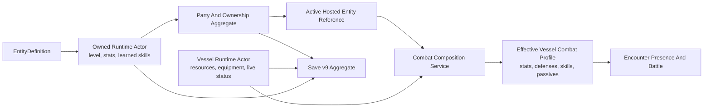

# Actor Composition, Progression, Roster, And Stage Roadmap

## Status

**Completed implementation authority. D1-D6 are approved, implemented, and
verified across Checkpoints 0-8.**

**Current product state:** runtime save contract v17 is authoritative; the
Framework Capability Matrix records 22 complete, 1 partial, and 2 intentionally
deferred capabilities. O6-R29 through O6-R31 corrected the two bounded
encounter paths and reconciled their documentation; O6-R32 independently
verified and closed them. O4-R42 corrected the narrow status/passive validation
boundary, O4-R43 and O4-R43A corrected current save-v13 guidance, and O4-R44
independently closed Order 4. This actor roadmap itself remains completed.
Save v10 and earlier capability counts below are preserved only as labelled
checkpoint history. Sections written in proposal or future tense describe the
implementation plan that produced the current actor code, not unfinished actor
work.

This roadmap converts the confirmed actor-design direction into isolated,
reviewable implementation checkpoints. It covers:

- Vessel combat composition from an Active Hosted Entity;
- runtime skill learning and move-list decisions;
- one authoritative party and owned-actor roster aggregate;
- unambiguous party placement and encounter presence;
- explicit command authority, team affiliation, and ownership semantics;
- configurable stage scaling for buffs and debuffs;
- save and restoration changes required by those contracts.

The roadmap does not restore the archived weighted-stat model. It does not make
Hosted Entities or Companions mandatory modules. It does not add presentation
rules to Framework.

## Implementation Progress

| Checkpoint | State | Commit or pending commit |
|---|---|---|
| 0. Decisions and maturity | complete | `6cb8228` |
| 1. Policy-driven stages | complete | `34ccdc9` |
| 2. Canonical owned rosters | complete | `0a43acd` |
| 3. Encounter presence | complete | `5ede43e` |
| 4. Authority and affiliation | complete | `979946d` |
| 5. Vessel combat profiles | complete | `58a72ae` |
| 6. Runtime skill unlocks | complete | `725c902` |
| 7. Save v8 foundation and restoration | complete | `35661bb` |
| 7a. Save v9 owner-derived capacity correction | complete | `864beec` |
| 8. Documentation and review | complete | `7aefd87` |

## Why This Work Exists

The active implementation is internally consistent enough to run, but the
collaborative actor review exposed six places where the current contracts are
narrower or less precise than the confirmed design:

1. a Hosted Entity supplies only core stats to a Vessel;
2. live level growth does not process authored skill unlocks;
3. actor-local rosters duplicate the session party roster;
4. party placement and encounter presence can contradict one another;
5. ownership and command-routing metadata are not defined precisely;
6. stage magnitude is stored as `-4..+4`, but the supplied policy uses only the
   sign.

These are design corrections, not requests to imitate the archived prototype.
The archive remains historical evidence only.

## Authority And Research Rules

Implementation decisions use this authority order:

1. confirmed project-owner decisions;
2. current Framework source and executable tests for implemented behavior;
3. active mechanics and decision documents;
4. external references as comparison evidence only;
5. archived sources as unsupported historical evidence only.

The two supplied community calculation references describe materially different
stage systems:

- [Reference calculation guide A](https://steamcommunity.com/sharedfiles/filedetails/?id=2503470293)
  describes a four-stage offense and defense model with separate tables.
- [Reference calculation guide B](https://steamcommunity.com/sharedfiles/filedetails/?id=3279836265)
  describes a two-stage model and separate attack, defense, accuracy, and
  evasion multipliers.

Neither reference is normative for Convergence. Their disagreement is evidence
that stage behavior belongs behind typed policy contracts rather than inside
general actor state or effect execution.

## Confirmed Design Direction

### Hosted Entity And Vessel

The supplied Vessel module uses the Active Hosted Entity as the source of:

- core combat stats;
- elemental affinities;
- ailment resistances;
- instant-defeat resistances;
- active skills;
- passive skills;
- Hosted Entity level, experience, stat growth, and skill-unlock progression.

The Vessel remains the source of:

- current and maximum character resources;
- equipment and equipment-derived basic attack;
- ailments, stages, guarding, charges, shields, and other live status;
- display identity;
- command authority;
- team affiliation;
- encounter presence.

Swapping the Active Hosted Entity must atomically recompose the Vessel combat
profile. Rejection must leave the Vessel, active selection, and roster
unchanged.

### Owned Actors And Active Roles

Ownership and current use are different facts:

- every owned Hosted Entity remains in the Hosted Entity Roster;
- `ActiveHostedEntity` points to one entry in that roster;
- every owned Companion remains in the Companion Roster;
- a deployed Companion also appears in the active party;
- recall removes active deployment but not ownership;
- dismissal, consumption, or fusion removes ownership and any active role in
  one transaction.

Roster capacity counts owned actors. An active role does not create a second
owned copy or consume a second roster-capacity unit.

### Framework And Host Responsibility

Framework owns:

- immutable requests, snapshots, plans, results, and diagnostics;
- stage bounds and policy execution;
- roster and identity invariants;
- skill-unlock detection and legal decisions;
- atomic combat-profile composition;
- growth, skill, roster, and restoration transactions.

The host owns:

- menus, prompts, animations, scenes, and input;
- deciding when to present pending skill choices;
- mapping command-authority IDs to local, AI, or network command sources;
- save-file encoding;
- selecting which optional modules to construct.

## Proposed Target Model



The owned Hosted Entity remains the authority for its progression and move
list. The Vessel receives an effective combat profile through one framework
composition transaction. The save aggregate records source state and enough
identity to rebuild and validate the effective profile.

## Decision Lock

Checkpoint 1 must not begin until the project owner confirms every default.
The extension points will remain replaceable regardless of the chosen standard
values.

### D1. Supplied Stage Baseline

**Approved:** retain the current `-4..+4` stage domain and use the four-stage
baseline below:

| Stage | -4 | -3 | -2 | -1 | 0 | +1 | +2 | +3 | +4 |
|---|---:|---:|---:|---:|---:|---:|---:|---:|---:|
| offense dealt | 0.50 | 0.625 | 0.75 | 0.875 | 1.00 | 1.25 | 1.50 | 1.75 | 2.00 |
| defense damage taken | 2.00 | 1.75 | 1.50 | 1.25 | 1.00 | 0.875 | 0.75 | 0.625 | 0.50 |
| accuracy | 0.50 | 0.625 | 0.75 | 0.875 | 1.00 | 1.25 | 1.50 | 1.75 | 2.00 |
| evasion | 0.50 | 0.625 | 0.75 | 0.875 | 1.00 | 1.25 | 1.50 | 1.75 | 2.00 |

Reasons:

- every stage has a distinct meaning;
- four positive and four negative applications have meaningful cumulative
  impact;
- positive offense stages and negative defense stages can combine as separate
  strategic multipliers;
- accuracy and evasion remain separate channels even though the supplied
  baseline uses the same stage table for each;
- the table is explicit, easy to test, and easy to replace;
- developers may author another table or register another policy.

Standard track mapping:

- `physical_attack` affects physical damage dealt;
- `magical_attack` affects magical damage dealt;
- `attack` affects both physical and magical damage dealt;
- `defense` affects damage taken;
- `agility` affects accuracy and evasion.

Developers may replace individual tables, use another stage range, use formulas
instead of tables, or register a completely different policy.

### D2. Standard Move-List Capacity

**Approved:** the supplied standard policy permits eight equipped skills.
Active and passive skills share that capacity. A custom policy may use another
capacity or separate skill categories.

### D3. Full Move List And Interrupted Presentation

**Approved:** level and stat growth commit normally. A skill whose unlock
level was crossed:

1. is learned and equipped immediately when a slot is available;
2. becomes a persisted pending choice when the move list is full;
3. cannot silently disappear because a host closes, cancels, or saves before
   presenting the choice.

Resolving a pending choice is its own atomic transaction.

### D4. Replacement And Forgetting

**Approved standard behavior:**

- `Replace`: remove the selected old skill from both learned and equipped
  skills, then add the new skill to both;
- `ForgetNew`: discard the pending new skill and retain the current move list.

A custom retention policy may keep unequipped learned skills for games that
support later loadout editing.

### D5. Ownership And Command Metadata

**Approved:**

- remove `OwnerInstanceId` from individual actor snapshots;
- make the party and roster aggregate the ownership authority;
- replace `ControllerId` with `CommandAuthorityId`;
- document `CommandAuthorityId` as an opaque host-routing key;
- retain `TeamId` as the framework-consumed targeting and encounter
  affiliation.

### D6. Party Placement And Encounter Presence

**Approved:**

- active-party and reserve-party placement exist only in the party aggregate;
- `RuntimeActorDeployment` and its `Active`, `Reserve`, and `Deployed` values
  are removed;
- `RuntimeActorDeploymentSnapshot` is replaced by
  `RuntimeEncounterPresenceSnapshot`;
- encounter presence uses one `IsDeployed` value;
- lifecycle eligibility derives from `IsDeployed`;
- `HasSwappedThisTurn` remains encounter-local state;
- the host or encounter planner explicitly establishes encounter presence;
  Framework does not infer it merely from a menu, scene, or party label.

This removes currently representable contradictions such as:

- reserve placement with `IsActive = true`;
- deployed placement with `IsActive = false`;
- active placement with `IsActive = false`.

After the correction:

- the party aggregate says whether an actor is in `ActiveParty` or
  `ReserveMembers`;
- encounter presence says whether that actor is participating in the current
  battle;
- an actor may be in the active field party while no encounter exists;
- a specialized game mode may explicitly deploy a reserve actor without
  changing permanent party organization;
- leaving an encounter clears encounter-local deployment and swap state without
  rewriting party or ownership state.

## Ordered Checkpoints

Each checkpoint must be one independently green commit. Later checkpoints may
depend on earlier contracts, but no checkpoint may leave an intentionally broken
solution for the next one to repair.

### Checkpoint 0: Lock Decisions And Correct Maturity

**Commit:** `docs: define actor runtime correction roadmap`

Changes:

- confirm D1-D6 in decision records;
- update the collaborative actor review;
- add this roadmap to the active roadmap index;
- mark affected capability-matrix entries `partial` while correction work is
  underway;
- record exact starting tests, warnings, content count, schema version, save
  version, and API baseline state.

Affected capabilities:

- `runtime_actor_state`;
- `progression_and_resources`;
- `combat_resolution`;
- `party_and_rosters`;
- `persistence_snapshots`.

Why first:

The current capability matrix reports these contracts as complete. Once their
intended behavior is explicitly corrected, continuing to report them as
complete would hide known work.

### Checkpoint 0 Starting Baseline

Measured on `main` at `5703554` before implementation:

- 959 passing tests: 789 Framework, 163 DemoHost, and 7 ContentValidator;
- 0 failed tests and 0 skipped tests;
- strict nonincremental Release solution build: 0 warnings and 0 errors;
- 36 active JSON content documents across 6 manifests;
- active content schema version 3 and pack version `0.3.0`;
- runtime save contract version 7;
- API baseline: 9,474 shipped entries and an empty unshipped baseline;
- capability matrix before correction work: 23 complete, 0 partial, and 2
  deferred.

Checkpoint 0 changes the five affected capability states to `partial`. It does
not change Framework behavior, the content contract, the save contract, or the
public API.

### Checkpoint 1: Policy-Driven Stage Scaling

**Commit:** `runtime: make stage scaling policy driven`

Framework changes:

- remove positive/negative sign-only multiplication from
  `StandardStatResolutionPolicy`;
- keep raw stat composition responsible for source stats, implemented equipment
  modifiers, and caps;
- introduce a typed stage-scaling request, result, and policy;
- keep stage state as typed track IDs and integer stages;
- resolve stage impact at combat-profile construction;
- provide a standard table policy using the approved D1 values;
- permit custom policy factories to replace the supplied behavior.

Standard channels:

- physical damage dealt;
- magical damage dealt;
- damage taken;
- hit chance;
- evasion.

Ruleset binding:

- expose authored standard-stage parameters through a typed factory;
- reject missing rows, duplicate stages, unsupported tracks, nonpositive
  multipliers, incomplete stage domains, and unknown parameters;
- permit omitted parameters to select the supplied default;
- never infer a track from display text.

Tests:

- every stage from minimum through maximum has a distinct expected result;
- clamping still occurs at the approved bounds;
- attack, defense, accuracy, and evasion affect only their intended channels;
- custom tables and custom policy factories replace the standard;
- malformed authored tables return deterministic diagnostics;
- stage duration remains independent from stage magnitude;
- zero stage is exactly neutral.

Compatibility:

- content schema structure does not need to change because ruleset parameters
  already have a typed validation boundary;
- active packs need no edit when they accept the supplied default;
- the public API baseline changes and must be reviewed.

### Checkpoint 2: One Authoritative Ownership And Roster Aggregate

**Commit:** `runtime: unify owned actor roster authority`

Framework changes:

- remove `RuntimeActorRosterSnapshot` from `RuntimeActorState` and
  `RuntimeActorSnapshot`;
- keep one session-level party and roster aggregate;
- require `ActiveHostedEntity` to reference an existing Hosted Entity Roster
  entry;
- preserve active-plus-owned Companion overlap;
- replace exchange-style Hosted Entity swapping with active-reference
  selection;
- add an explicit transition for selecting or clearing the Active Hosted
  Entity;
- update add, select, deploy, recall, dismiss, replace, consume, fusion,
  acquisition, and Compendium transitions.

Invariants:

- no duplicate runtime ID within one roster;
- no runtime actor appears in both Hosted Entity and Companion roles;
- active Hosted Entity is owned;
- deployed Companion is owned;
- roster capacity counts each owned actor once;
- removing an active owned actor clears or replaces its active role atomically;
- rejected transitions preserve the exact before snapshot.

Tests:

- active Hosted Entity remains in its roster;
- selection changes only the active reference;
- Companion deploy and recall preserve ownership;
- active removal, replacement, fusion consumption, and acquisition are atomic;
- capacity is unaffected by active-role overlap;
- actor-local and session roster disagreement is impossible because the former
  no longer exists.

### Checkpoint 3: Separate Party Placement From Encounter Presence

**Commit:** `runtime: separate party placement and encounter presence`

Framework changes:

- remove the contradictory deployment enum and `IsActive` pair;
- derive active and reserve party placement from the party aggregate;
- introduce explicit encounter presence with `IsDeployed`;
- keep swap-per-turn state in encounter presence;
- update targeting, lifecycle suspension, participant refresh, defeat, recall,
  encounter completion, snapshots, and events to use the new meaning.

Tests:

- reserve party membership does not imply encounter deployment;
- deployed actors are targetable and receive lifecycle ticks;
- nondeployed actors are not targetable and suspend configured durations;
- every previously contradictory combination becomes unrepresentable;
- deployment changes publish typed events and preserve participant identity;
- party reorganization outside battle does not mutate encounter-local state
  implicitly.

### Checkpoint 4: Clarify Command Authority, Team, And Ownership

**Commit:** `runtime: clarify actor authority and affiliation`

Framework changes:

- apply approved D5;
- make ownership relationships derive from the canonical aggregate;
- make command authority an opaque host-supplied ID;
- keep team affiliation as the only one of these values interpreted by battle
  targeting;
- update actor creation, encounter participants, fusion result creation,
  restoration profiles, DemoHost, and Godot sample mappings.

Tests:

- the framework never interprets command-authority text;
- different command authorities may control actors on the same team;
- one command authority may control actors on different teams when a host
  deliberately supplies that mapping;
- roster ownership does not require duplicated actor metadata;
- missing aggregate references fail save validation;
- command and team IDs remain valid through creation, action execution, fusion,
  save, and restore.

### Checkpoint 5: Compose The Complete Vessel Combat Profile

**Commit:** `runtime: compose vessel combat profiles`

Framework changes:

- replace stats-only composition with a combat-profile composition service;
- resolve the Active Hosted Entity from the canonical roster aggregate and
  runtime actor map;
- source core stats, defenses, active skills, and passive skills from that
  Hosted Entity;
- retain Vessel resources, equipment, equipment-derived basic attack, status,
  command authority, team, and encounter presence;
- preserve current resource amounts and cap them when maximums fall;
- atomically commit or reject the complete profile;
- record the source runtime ID in typed composition evidence;
- remove creation-time skill-loadout lists as action authority.

State-authority rule:

- the Hosted Entity owns its progression and learned/equipped skill state;
- the Vessel combat profile is derived from that state;
- save and restore rebuild and validate derived Vessel state rather than
  allowing it to become a second independent authority.

Tests:

- changing the Active Hosted Entity changes Vessel stats, defenses, active
  skills, and passives together;
- the Vessel keeps resources, equipment, basic attack, and live statuses;
- missing source state, identity mismatch, missing definitions, invalid
  equipped skills, or failed resource recalculation reject without mutation;
- action assessment, execution, affinity lookup, passive dispatch, and status
  UI projections consume the same composed profile;
- a direct actor or Companion remains usable without the Vessel module.

### Checkpoint 6: Runtime Skill Unlocks And Move Decisions

**Commit:** `runtime: add hosted entity skill progression`

Framework changes:

- introduce an immutable skill-unlock plan in authored order;
- compare pre-growth and post-growth levels;
- suppress duplicate or already-known unlocks;
- apply the approved move-list capacity policy;
- auto-learn when capacity exists;
- create persisted pending choices when capacity is full;
- add typed replace and forget-new commands;
- reject stale choices when the source level, move list, or pending token has
  changed;
- make growth, skill state, and Vessel recomposition use one transaction
  coordinator.

Tests:

- one-level and multi-level growth discover every crossed unlock exactly once;
- authored ordering is deterministic;
- empty slots auto-fill;
- active and passive skills share or separate capacity according to policy;
- replacement and forget-new follow D4;
- invalid replacement, duplicate resolution, stale token, and host
  cancellation do not corrupt state;
- direct actors, Companions, and Hosted Entities may use different policies;
- the acting Vessel immediately receives the updated Hosted Entity move list
  after a successful decision.

### Checkpoint 7: Save Contract V8 And Aggregate Restoration

**Commit:** `runtime: restore canonical actor ownership and composition`

> **Historical checkpoint specification:** this section records the save-v8
> implementation delivered by Checkpoint 7. Save v10 is current; the v9
> owner-derived roster-capacity correction is recorded after Checkpoint 8.

Contract changes:

- bump `RuntimeSaveGameSnapshot.CurrentContractVersion` from `7` to `8`;
- reject v7 snapshots through the existing migration seam unless a host
  supplies an explicit migration;
- remove actor-local roster fields;
- replace ambiguous deployment fields;
- replace ownership metadata according to D5;
- persist pending skill choices;
- preserve canonical party and roster state;
- restore owned actors before Vessels that depend on them;
- recompose Vessel combat profiles after source actors and ownership aggregates
  are available.

Validation:

- active Hosted Entity exists and is owned;
- deployed Companion exists and is owned;
- active and reserve party references are valid and disjoint;
- pending skill IDs and replacement candidates exist in the catalog;
- pending choices match the source actor and unlock level;
- command-authority and team IDs are valid;
- no partial session is returned after any failure.

Host updates:

- update DemoHost JSON DTOs;
- update the Godot save codec;
- keep serialization and filesystem APIs outside Framework;
- add v8 round-trip, invalid-v7, and dependency-order tests.

**Completion record (2026-07-16):** save contract v8 is active. Pending
skill-choice tokens, unlock metadata, and revisions round-trip through the
DemoHost and Godot-owned codecs. Aggregate restoration derives its Hosted
Entity dependency from the canonical party roster, restores that source before
the Vessel, preserves retained passive runtime state, and replaces stale saved
Vessel combat-profile data with the normalized restored state. V7 is rejected
unless a host supplies an explicit migration step. Verification passed with
1,014 tests (843 Framework, 164 DemoHost, 7 ContentValidator), zero skipped
tests, zero build warnings, all DemoHost modes, scripted Training Annex exit,
content validation, and the Godot 4.7.1 headless smoke reporting contract v8.

> **Historical result:** the preceding paragraph was accurate at Checkpoint 7.
> It is not a statement of the current save version.

### Checkpoint 8: Documentation, Samples, And Completion Review

**Commit:** `docs: document actor composition and progression`

Documentation:

- confirm decision records;
- rewrite actor/progression mechanics;
- add `docs/developer-guide/actors-and-runtime-state.md`;
- add `docs/technical/runtime-actor-state-and-restoration.md`;
- document stage-policy authoring and custom factory examples;
- add diagrams for ownership, composition, growth, pending skill choice, and
  restoration;
- update public API, ruleset, Godot, save, and content guidance;
- update the documentation coverage matrix.

Demo evidence:

- keep DemoHost presentation narrow;
- demonstrate one Hosted Entity selection;
- demonstrate one defense and move-list change;
- demonstrate one level unlock with an empty slot;
- demonstrate one full-list pending decision through scripted input;
- demonstrate save and restore after the decisions;
- do not build a second game UI.

Completion review:

- inspect current source rather than relying on checkpoint summaries;
- verify every D1-D6 decision against code and tests;
- promote affected capability entries back to `complete` only after review;
- record any remaining product choice separately from runtime defects.

**Completion record (2026-07-16):** current source and focused tests were
inspected for every D1-D6 decision. The confirmed decision record, mechanics
page, developer guide, technical reference, ruleset authoring guidance, Godot
save guidance, architecture, and public API overview now agree.

Training Annex demonstrates one empty-slot unlock, one full-list pending
choice, replace, forget, defer, and a canonical save/restore after a resolved
choice. Its presentation remains a narrow host example over framework
transactions.

At this checkpoint, the framework capability matrix recorded 23 complete, 0
partial, and 2 deferred capabilities. Documentation coverage recorded 11 reviewed audience
entries. Verification passed with 1,017 tests (843 Framework, 167 DemoHost, 7
ContentValidator), zero skipped tests, zero build warnings, formatting
verification, all DemoHost modes, scripted Training Annex exit, validation of
6 packs/36 documents/94 definitions, and the Godot 4.7.1 headless smoke
reporting save contract v8.

> **Historical result:** this checkpoint completed against save v8 before the
> post-completion corrections advanced the contract to v9.

Remaining product choices are not defects in this roadmap:

- migrations between future released save contracts remain deferred;
- deterministic replay remains deferred;
- broader equipment behavior remains separate work;
- documentation for unrelated capabilities remains unreviewed until each
  subsystem completes the collaborative workflow.

**Historical intermediate review state (superseded):** the source-based review
of revision `7aefd87`
confirmed the D1-D6 direction but found reachable integration gaps in roster
owner-level authority, live transition validation, high-level move-list
capacity, stale prepared growth, direct pending-skill restore validation, and
the Godot sample's aggregate-restore boundary.
The executable capability matrix temporarily recorded 20 complete, 3 partial,
and 2 deferred capabilities until those follow-ups were corrected. See the
[Actor Runtime Completion Code Review](../reviews/actor-runtime-completion-code-review-2026-07-16.md).

**M1 correction:** save contract v9 removes `OwnerLevel` from the canonical
roster. Live transitions receive the current owner actor snapshot, and save
validation derives capacity from the saved owner actor's progression. The same
immutable roster therefore observes a level-gated capacity change without
being reconstructed.

**M2 correction:** one owner-aware, capacity-aware roster validator now serves
live transitions, actor composition, and save validation. It rejects malformed
incoming snapshots and invalid proposed results without mutation, including
invalid IDs, duplicate or conflicting roles, ownership mismatches, and active
or roster capacity violations.

**M3 correction:** high-level actor creation and restoration now use an
explicit move-list capacity policy. Base moves must fit; starting-level
authored unlocks use the same unlock planner as live growth and become pending
when full; direct actor and aggregate save restoration reject equipped lists
outside the selected policy.

**M4 correction:** `LevelGrowthResult` now retains its complete immutable
progression/stat/resource source precondition. Direct and composed growth
transactions reject stale or repeated results before mutation.

**M5 correction:** the real Godot codec now decodes complete host-owned actor
and party snapshots before invoking `IRuntimeSessionRestoreService`. Its
headless smoke proves source-first Vessel restoration and proves malformed
aggregate state exposes no live session.

**L1 correction:** direct catalog actor restoration now applies the same
pending-skill catalog, authored-unlock provenance, and actor-level availability
checks as aggregate save validation.

All completion-review findings were corrected. At that checkpoint, the
capability matrix returned to 23 complete, 0 partial, and 2 intentionally
deferred capabilities. Later policy-family work is tracked independently.

## Expected File Ownership

Likely Framework files to change:

- `Execution/BattleRuntimeState.cs`
- `Runtime/ProgressionPolicies.cs`
- `Runtime/RuntimeActorCombatProfileComposition.cs`
- `Runtime/RuntimeActorGrowthComposition.cs`
- `Runtime/RuntimeStateSnapshots.cs`
- `Runtime/RuntimeActorRosterInvariants.cs`
- `Runtime/PartyRosterTransitions.cs`
- `Runtime/RuntimeRulesetPolicyFactories.cs`
- `Runtime/RuntimeRulesetBindings.cs`
- `Runtime/RuntimePersistenceSnapshots.cs`
- `Runtime/RuntimeSessionRestoration.cs`
- `Battle/ProductionCombatRuleset.cs`
- `Encounters/CatalogBattleActorFactory.cs`
- `Encounters/BattleEncounterRunner.cs`
- fusion and Compendium transaction files that consume roster state.

New Framework files should be concept-oriented rather than one type per file:

- stage-scaling policy and standard implementation;
- actor combat-profile composition;
- skill-unlock planning and decision transactions.

Likely host files to change:

- Training Annex actor creation and party controller;
- Training Annex growth and battle adapters;
- DemoHost save DTO mapping;
- Godot save codec and smoke composition.

Required metadata updates:

- `PublicAPI.Shipped.txt` / `PublicAPI.Unshipped.txt`;
- Framework source inventory;
- capability and documentation matrices;
- ruleset documentation;
- active roadmap and decision indexes.

## Quality Gate Per Checkpoint

Every implementation commit must run:

```powershell
dotnet test Convergence.sln --no-restore --configuration Release
dotnet build Convergence.sln --configuration Release --no-restore --no-incremental -warnaserror
dotnet format Convergence.sln --verify-no-changes --no-restore
git diff --check
```

Run focused tests before the full gate. Also run, when affected:

- all noninteractive DemoHost modes;
- scripted Training Annex play;
- content schema and semantic validation;
- Godot headless smoke;
- API baseline validation;
- documentation link and terminology checks;
- Framework forbidden-reference checks.

Acceptance remains:

- zero failed tests;
- zero skipped tests;
- zero compiler warnings;
- no active dependency on archived code;
- no framework dependency on console, filesystem, Godot, or host serializers;
- no mutation after typed rejection;
- no display-text inference;
- no unreviewed public API drift.

## Commit And Staging Discipline

The roadmap is implemented sequentially.

1. Begin from a clean worktree.
2. Make only one checkpoint's changes.
3. Run its focused and full gates.
4. Review the diff for unrelated edits.
5. stage and commit that checkpoint.
6. Confirm the worktree is clean before beginning the next checkpoint.

The phrase "separate staged commit" means an isolated Git commit whose staged
diff contains only that checkpoint. Multiple unrelated checkpoints will not be
left mixed in the index.

## Explicit Non-Goals

- no restoration of weighted Vessel stats;
- no hidden actor-kind formulas;
- no mandatory Vessel, Companion, fusion, or roster module;
- no hardcoded host menu or scene behavior;
- no presentation-driven skill selection;
- no automatic formula inference from external game names or skill text;
- no rewriting of archived sources;
- no equipment-system expansion beyond the behavior needed by combat
  composition;
- no save-file serializer inside Framework.
