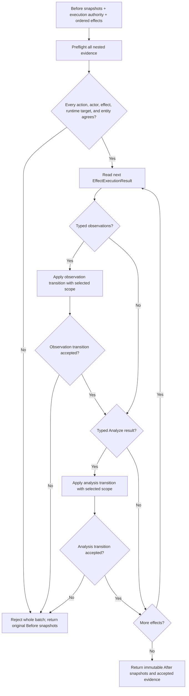

# Battle Knowledge Runtime Authority

## Scope

This reference defines the invariants linking effect execution, Analyze,
persistent entity knowledge, encounter knowledge, automated strategy views,
familiarity import, and session persistence.

It does not define UI presentation or encounter scheduling. Those remain host
and encounter-runner responsibilities respectively.

## Canonical Authorities

| Authority | Type | Key | Durable |
|---|---|---|---|
| Persistent facts | `RuntimeKnowledgeSnapshot` | Entity definition plus defense-domain key | Yes |
| Encounter facts | `RuntimeEncounterKnowledgeSnapshot` | Runtime target plus entity definition and defense-domain key | No |
| Combined query | `IBattleKnowledgeView` / `BattleKnowledgeView` | Both identities | Read-only |
| Execution evidence | `BattleKnowledgeObservation` and `BattleAnalysisResult` | Source action/effect and target identities | Result evidence only |
| Accepted execution identity | `BattleKnowledgeExecutionAuthority` | Action, actor, and runtime-target-to-entity bindings | Request lifetime |

`RuntimeKnowledgeSnapshot` is sparse. Its analyzed-defense markers indicate
that an entire authored defense domain was disclosed, allowing a missing sparse
entry to resolve as known `Normal`. Without that marker, a missing entry means
unknown.

`RuntimeEncounterKnowledgeSnapshot` validates one entity identity per runtime
target across elemental, ailment, instant-defeat, and analysis collections. A
runtime ID cannot silently change entity meaning within one encounter.

> **Order 5 correction status:** O5-R15 removed actor-local Analyze state from
> runtime actors and save v14. O5-R16 removed the three disconnected mutable
> dictionary-backed stores. The immutable persistent snapshot and transition
> service are now the only durable discovery authority. O5-R17 makes the
> standalone transition and view reject record-cloned undefined enum values and
> invalid persistent analysis fields before dictionary or result construction.

## Execution Transition

`BattleKnowledgeExecutionTransitionService` is the canonical bridge from an
accepted action execution to knowledge state.

The transition is aggregate-atomic because every lower transition produces new
immutable snapshots. If any later effect rejects, no mutable persistent or
encounter state has been committed and the aggregate result returns the
original references as both `Before` and `After`.

`BattleKnowledgeExecutionAuthority` snapshots the accepted source action,
acting runtime actor, and a read-only map from participant runtime IDs to
entity-definition IDs. The aggregate transition validates the complete effect
batch before invoking either lower transition:

- observation effect index equals the enclosing result index;
- observation and Analyze runtime target equal the enclosing result target;
- observation source action equals the accepted action;
- observation and Analyze actor equal the acting runtime actor; and
- observation and Analyze entity identity equals the authoritative binding for
  the runtime target.

An absent target binding is a mismatch, not permission to trust the nested
entity ID. Preflight means a valid early observation is never sent to a lower
transition when later evidence is malformed. A rejecting custom transition
that omits diagnostics is still converted into a deterministic typed aggregate
diagnostic rather than escaping through diagnostic construction.

Callers must not apply an intermediate snapshot themselves. They publish only
the aggregate `After` snapshots when status is not `Rejected`.

## Observation Rules

### Elemental

Damage execution emits authored affinity, effective affinity, contact status,
and temporary-defense flags. A miss is explicit evidence but is not accepted as
a discovery. Contact writes the effective value to encounter knowledge.
Persistent promotion requires:

1. `EncounterAndPersistent` scope;
2. a non-`Almighty` element;
3. contact; and
4. `BattleDefenseInfluence.None`.

Persistent promotion uses the authored value, never the effective value.

### Ailment

Execution records application status and available resistance evidence. Only
an explicit immune result establishes an exact tier. Encounter knowledge stores
effective immunity. Persistent promotion additionally requires no temporary
influence and authored immunity.

### Instant defeat

Execution distinguishes bypassed checks, random failure, defeat, and confirmed
resistance blocking. Only a confirmed checked immunity establishes an exact
tier. Untyped custom instant-defeat policies cannot claim a typed immunity
block.

## Analyze Transition

`BattleAnalysisService` expands requested layers to independent
`BattleAnalysisField` values, asks `IBattleAnalysisDisclosurePolicy` for one
decision per field, and captures data only for `Disclosed` fields.

The policy may return `Disclosed` or `Unknown`. `Unavailable` is reserved for
the service after a disclosed field cannot exist, currently a target without an
SP resource. Missing, duplicate, extra, or pre-emptively unavailable policy
decisions fault before a result is produced.

`BattleAnalysisKnowledgeTransitionService` then:

- records every disclosed field against the encounter runtime target;
- stores disclosed elemental, ailment, and instant-defeat profiles in
  encounter knowledge;
- promotes those authored defense profiles and analyzed-profile markers only
  under `EncounterAndPersistent`; and
- never promotes current HP, SP, core stats, or skills.

Unknown and unavailable fields mutate neither scope.

## Query Precedence

`BattleKnowledgeView` queries encounter knowledge first. If the current target
has no encounter fact, it queries persistent knowledge by entity definition.
The returned `BattleKnowledgeFactSource` identifies which scope answered, and
the encounter result includes any `BattleDefenseInfluence` flags.

Every combined query supplies both runtime and entity identity. Encounter
identity conflict throws rather than returning knowledge for the wrong entity.

## Automated Team Knowledge

`AutomatedBattleRunner` constructs one mutable slot containing an immutable
encounter snapshot per participating team. Selection receives an aggregate
read-only view. After an accepted normal or lifecycle-restricted action, the
runner applies that action's complete typed effect list through the canonical
execution transition service under `EncounterOnly` scope.

Consequences:

- teammates share discoveries during that run;
- opposing teams never share snapshots;
- every unseeded run starts empty;
- an explicit seed must match participating teams and runtime/entity pairs;
- final snapshots are returned in `AutomatedBattleResult.TeamKnowledge`; and
- no automated path writes persistent player knowledge.

The supplied `DeterministicBattleActionSelector` uses stable elemental facts for
weakness preference and blocking-affinity avoidance. It deliberately does not
score a fact whose `BattleDefenseInfluence` is non-`None`: the knowledge
snapshot records what was observed, but it does not prove that a temporary
guard, shield, Break, override, or conditional passive is still active when a
later turn is selected. A custom strategy may combine those flags with its own
live-state policy when it can prove that the influence remains current.

## Familiarity Import

`FamiliarEntityKnowledgeService` asks `IFamiliarKnowledgeImportPolicy` which
authored defense domains may be imported for each entity and typed source. It
then routes the resulting facts through
`PersistentBattleKnowledgeTransitionService` rather than rebuilding a snapshot
ad hoc.

This preserves existing analyzed-profile markers, validates identifiers and
duplicates, and provides immutable before/after results. Acquisition,
Compendium registration, and registered-entry synchronization remain explicit
call sites; the service does not observe ownership transactions implicitly.

## Persistence Boundary

`RuntimeSaveValidator` validates:

- unique elemental keys by entity and element;
- unique ailment keys by entity and ailment;
- unique instant-defeat keys by entity and channel;
- one analyzed-defense profile per entity;
- catalog or saved-actor existence for every knowledge entity;
- catalog existence for every referenced ailment; and
- valid enum and content-ID domains.

Save v14 contains no actor-local Analyze field. Persistent defense disclosure
belongs only in `RuntimeSaveGameSnapshot.Knowledge`; current-target analysis
belongs only in `RuntimeEncounterKnowledgeSnapshot` and ends with its
encounter.

The save contract advances to version 14 because O5-R15 removes the obsolete
actor-local field from the serialized aggregate shape.

## Failure Containment

- Invalid content and runtime IDs reject at public construction or transition
  boundaries. Undefined knowledge enums and invalid persistent analysis fields
  reject at ordinary construction, standalone view/transition boundaries, and
  aggregate save validation even when a host-supplied record clone bypassed a
  validating constructor.
- Duplicate or conflicting keys reject before dictionary materialization.
- Transition results snapshot every public collection.
- Execution authority defensively snapshots target identities and rejects
  invalid or duplicate runtime bindings.
- Every evidence batch passes full action, actor, effect, target, and entity
  provenance preflight before a lower knowledge transition runs.
- A later effect failure rolls the aggregate back to its original immutable
  snapshots.
- Host presentation evidence is derived from accepted observations and typed
  analysis data; it is not a second rule authority.

## Source Ownership

| Concern | Primary source |
|---|---|
| Typed execution evidence | `Execution/ExecutionContracts.cs`, `Knowledge/BattleKnowledgeObservations.cs` |
| Persistent transitions and view | `Knowledge/PersistentBattleKnowledge.cs` |
| Encounter snapshots and transitions | `Knowledge/EncounterBattleKnowledge.cs` |
| Analyze policy and transition | `Knowledge/BattleAnalysis.cs` |
| Complete execution coordinator | `Knowledge/BattleKnowledgeExecutionTransitions.cs` |
| Automated team integration | `Encounters/AutomatedBattleRunner.cs` |
| Familiar import | `Fusion/FamiliarKnowledgeImportPolicies.cs`, `Fusion/CompendiumRuntimeServices.cs` |
| Save validation | `Runtime/RuntimeKnowledgeIntegrity.cs`, `Runtime/RuntimePersistenceSnapshots.cs` |

## Test Evidence

- `PersistentBattleKnowledgeTests`
- `BattleKnowledgeObservationTransitionTests`
- `BattleAnalysisTests`
- `BattleKnowledgeExecutionTransitionTests`
- `CatalogBattleRuntimeTests`
- `CompendiumRuntimeServiceTests`
- `RuntimePersistenceSnapshotTests`
- `CleanTrainingAnnexPlayHostTests`

## Related Documentation

- [Battle Knowledge](../mechanics/battle-knowledge.md)
- [Battle Knowledge Integration](../developer-guide/battle-knowledge.md)
- [Typed Action And Effect Execution](typed-action-and-effect-execution.md)
- [Combat Resolution Pipeline](combat-resolution-pipeline.md)
