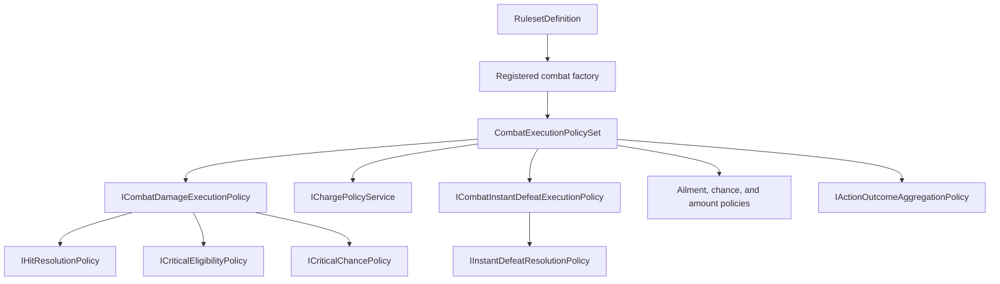
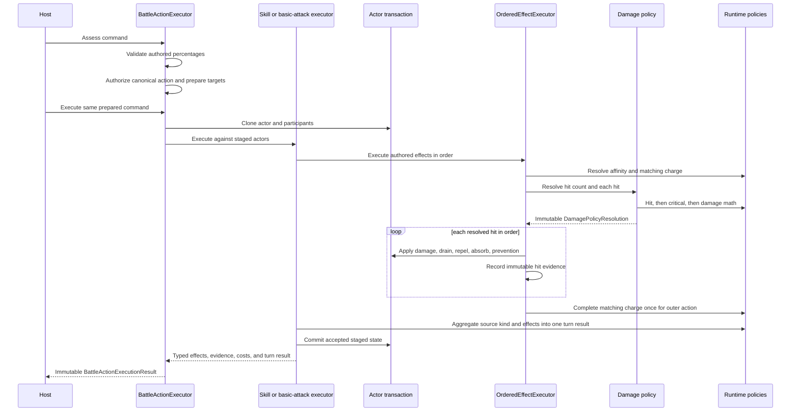
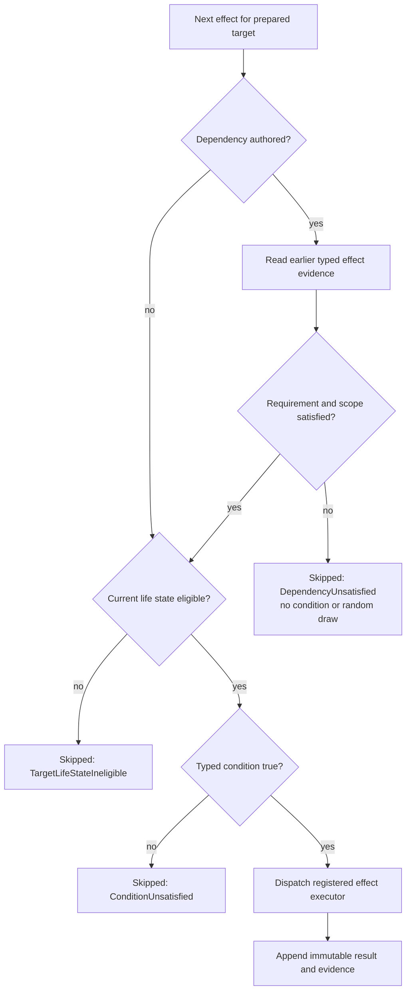
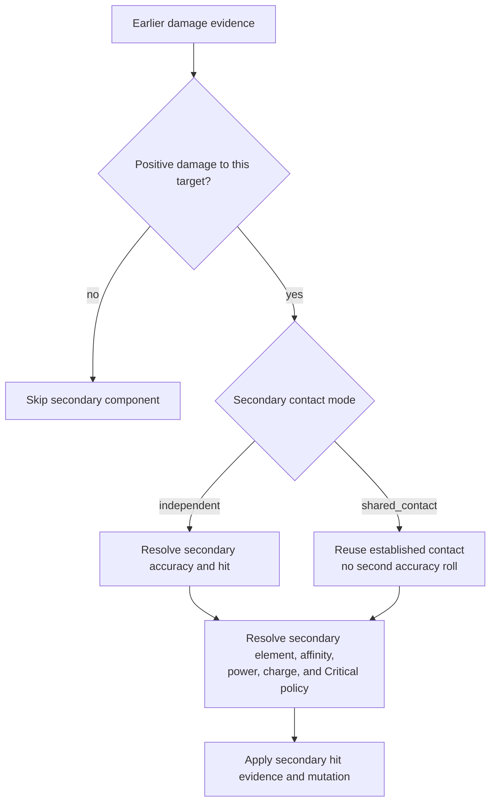
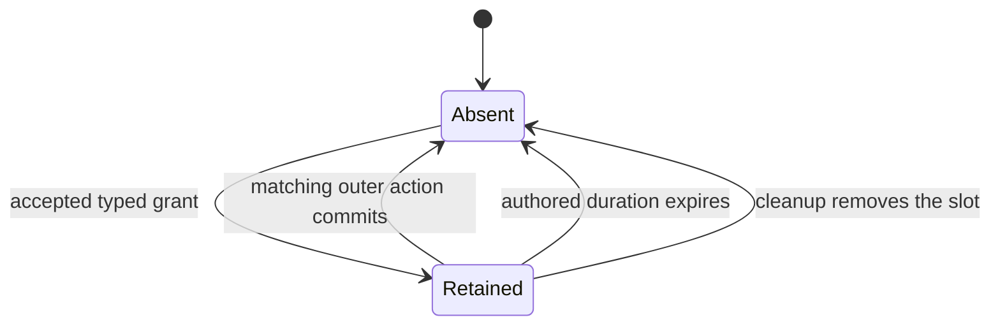
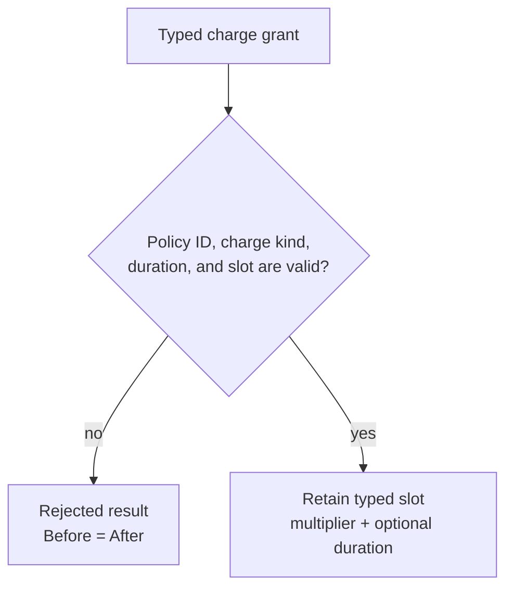
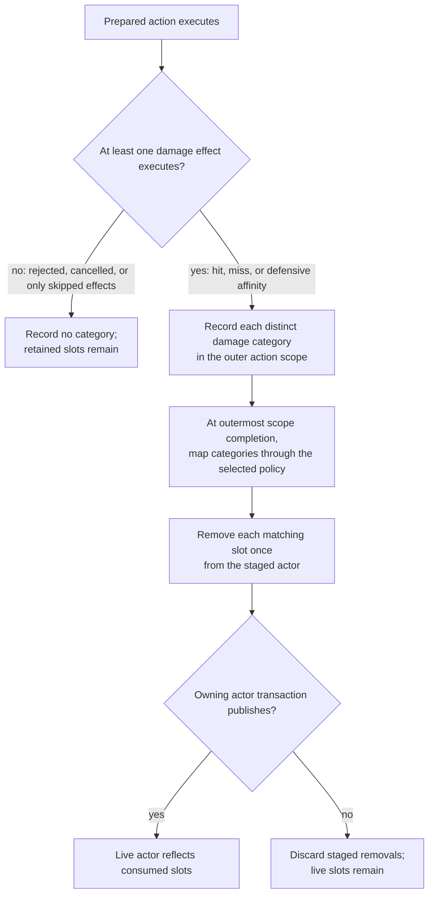
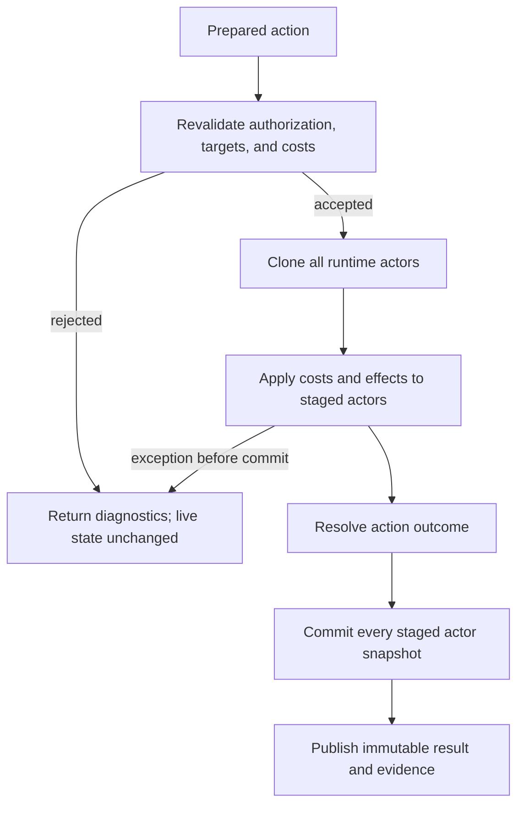

# Combat Resolution Pipeline

## Scope

This reference defines the implementation invariants behind the Order 2 combat
policy family. It covers authored binding, policy coherence, random boundaries,
damage sequencing, charge lifetime, action aggregation, atomic mutation, and
save restoration.

## Composition Boundary

`RuntimeRulesetBindingResolver.BindCombatPolicies` resolves one registered
`IRuntimeCombatRulesetPolicyFactory`. The result is an immutable
`CombatExecutionPolicySet`.

The composed interfaces are an integrity constraint. The hit/critical policies
advertised by the aggregate are properties of the exact damage executor passed
to `BattleExecutionServices`. The advertised instant-defeat resolver is a
property of the exact instant-defeat executor. A factory cannot pass unrelated
objects into separate descriptive fields.

Direct `BattleExecutionServices` composition remains lower level and accepts
the narrower execution interfaces. It does not claim authored aggregate
introspection.

## Damage Sequence

Hit is resolved before critical on every attempted hit. A miss has no critical
roll. The supplied damage policy calculates every hit first; the effect
executor then applies landed hit records sequentially to staged runtime actors.
This separation preserves deterministic policy evidence while allowing defeat
prevention and drains to observe the current staged resource value at each hit.

## Ordered Effect Dependency Gate

Effect IDs and dependencies are local to one authored sequence. The executor
finishes every target for effect `N` before beginning effect `N + 1`, so an
`any_target` dependency has the complete source-effect evidence available.

An unmet dependency is a skip, not an authored failure, so it does not trigger
`StopTarget` or `StopAction`. `positive_damage` requires an earlier damage hit
whose committed resource delta removes a positive amount from that same target.
Calculated damage, a zero delta, reflection, and absorption do not satisfy it.

## Secondary Damage Contact

Dependent damage selects one of two explicit contact modes. Neither mode copies
the source Critical result.

Shared contact still records the secondary authored accuracy but has no
accuracy roll. It carries the source effect ID and index in
`DamageHitExecutionEvidence` so a host can associate animations without parsing
messages. The supplied production ruleset implements this behavior; a custom
damage policy receives `ContactMode` and owns equivalent semantics.

The first supported rider cardinality is once per qualifying target. A
multi-hit source does not repeat the later effect for each landed source hit.

## Standard Arithmetic

For one landed hit, `ProductionCombatRuleset` performs these operations with
saturating arithmetic:

1. choose Strength for Physical or Magic otherwise;
2. apply general and category-specific outgoing multipliers;
3. divide by `max(1, Vitality + Defense)`;
4. calculate `scalar * sqrt(power * attack / defense)`;
5. apply target incoming-damage, critical, guard, affinity, charge, and
   variance multipliers;
6. floor the result;
7. apply typed outgoing/incoming rule modifiers at execution; and
8. mutate the vital resource through its bounded runtime API.

Hit/evasion and critical policy requests carry all explicit modifiers.
`ProductionCombatantProfile.Luck` is retained as neutral profile data but none
of the supplied Order 2 probability or damage policies read it.

## Authored Numeric Safety Boundary

Hit-count limits are applied at two layers. Schema v6 and semantic validation
accept only `1..1024` for one damage effect. The supplied standard policy then
compares the authored maximum with its configured
`MaximumHitsPerDamageEffect`, default `64`, before random selection, list
allocation, hit resolution, or staged mutation. A range above either applicable
ceiling is rejected as one operation.

Authored probabilities use one inclusive `0..100` domain. Assessment walks the
complete effect, including recursively nested `all`, `any`, and `not`
conditions, before target preparation or cost handling. Public policy and
lifecycle request constructors enforce the same domain, including record
cloning through `with`. Only a chance derived from a valid authored base may be
clamped after resistance or modifier arithmetic.

The two validation failures have different public shapes. Skill, item, and
effect-backed action assessment returns the stable
`AuthoredPercentageOutOfRange` diagnostic and no turn consumption. A malformed
direct supplied-policy or lifecycle request is a programming error and throws
`ArgumentOutOfRangeException` before random or live-state work.

## Random Boundary

`IRandomSource` is host-owned. Every Framework-supplied consumer routes a draw
through the internal validated random boundary before the value becomes
authoritative:

| Method | Required range | Supplied Framework uses |
|---|---|---|
| `NextUnitDecimal()` | `[0, 1)` | hit, critical, instant defeat, ailment, variance, initiative, rewards |
| `NextInt32(min, max)` | `[min, max)` | hit count, negotiation, lifecycle, progression, and fusion selection |

Zero- and one-hundred-percent outcomes do not consume a random unit. Variable
hit count validates the returned integer offset before adding it to the
authored minimum. Invalid host random output throws inside staged execution and
is converted to a typed rejection or fault by the owning boundary.

## Charge State Machine

Charge is not one binary actor flag. An actor retains a policy identity and a
collection of typed charge slots. The following state machine describes one
slot, not the complete actor collection:

`Absent` means that particular slot is not retained. It does not mean the
actor's selected charge-policy identity has been erased. A rejected grant is a
command result rather than a runtime state: its `Before` and `After` snapshots
are identical, and a duplicate grant does not refresh the existing slot's
duration.

Application and consumption use separate boundaries. Grant assessment is one
small transaction:

Consumption is scoped to the complete action rather than to an individual hit
or nested effect:

One actor's retained charge state has one policy ID. `SplitChargePolicy` permits
independent Physical and Magical slots at the same time. It maps Physical
damage to Physical and every other damage element to Magical.
`UnifiedChargePolicy` permits only one General slot and maps every damage
element to it. Validation and restoration resolve the policy ID through
`IChargePolicyResolver` and reject unsupported kinds, duplicate keys, invalid
durations, or a mismatched policy.

`OrderedEffectExecutor` owns an async-local outer action scope. Nested passive
or ailment effects join that scope. It records distinct damage elements by
acting actor and calls `CompleteAction` once when the outermost effect sequence
finishes. Because execution uses staged actors, a later exception discards any
charge removal along with other actor mutations.

## Outcome Aggregation

`IActionOutcomeAggregationPolicy` receives an immutable request containing the
action source kind and ordered effect result list. For Skill, BasicAttack, and
effect-driven Item requests, the supplied policy applies this precedence:

1. first Repel or Absorb interrupts and terminates the phase;
2. any Null applies the Null result;
3. any all-hit target evasion plus any Critical normalizes to Normal;
4. an all-hit target evasion applies Miss;
5. Weakness applies Weakness;
6. Critical applies Critical; otherwise Normal.

Damage evidence is grouped by target across all effects before the evasion
check. A missed Physical component followed by a landed Fire component against
the same target is therefore not a target evasion. Conversely, a separate
target whose every damage component misses still supplies the action-level
evasion fact. `AnyCritical` remains evidence only; Action Token consumes the
final aggregate `Outcome` and does not re-promote a normalized Critical.

An effect with damage evidence counts as evaded only when every hit is false.
Typed custom effects without damage evidence may still use a Miss outcome for
compatibility. A failed ailment or instant-defeat probability reports normal
no effect and does not masquerade as damage evasion.

For Item requests, the supplied configuration defaults to Normal regardless of
those effect facts. `itemActionOutcomeBehavior: "effect_driven"` opts into the
precedence above. A normal-cost item returns no action-level Critical reward or
phase termination but does not alter any `EffectExecutionResult`. Escape items keep
their explicit no-turn path.

The policy returns a neutral `TurnEconomyResolution`. `IBattleTurnEconomy`
decides what that means for its own state. Action Token is one consumer, not a
dependency of damage execution. The original list-only aggregation method is
retained as a compatibility dispatch for existing custom policy
implementations.

## Atomicity And Failure

Actor resources, status, stat modifiers, charge state, and combat knowledge are
inside `RuntimeActorExecutionTransaction`. Inventory is a separate
transactional port coordinated by `BattleActionExecutor`. Custom handlers must
represent host work as requests; a file, scene, network, or other side effect
performed directly by a handler cannot be rolled back by Framework actor
transactions.

## Source And Test Evidence

Primary source:

- [`ProductionCombatRuleset.cs`](../../src/Convergence.Framework/Battle/ProductionCombatRuleset.cs)
- [`HitResolutionPolicies.cs`](../../src/Convergence.Framework/Battle/HitResolutionPolicies.cs)
- [`CriticalResolutionPolicies.cs`](../../src/Convergence.Framework/Battle/CriticalResolutionPolicies.cs)
- [`InstantDefeatResolutionPolicies.cs`](../../src/Convergence.Framework/Battle/InstantDefeatResolutionPolicies.cs)
- [`ChargePolicies.cs`](../../src/Convergence.Framework/Execution/ChargePolicies.cs)
- [`ActionOutcomeAggregationPolicies.cs`](../../src/Convergence.Framework/Execution/ActionOutcomeAggregationPolicies.cs)
- [`EffectExecutors.cs`](../../src/Convergence.Framework/Execution/EffectExecutors.cs)
- [`OrderedEffectExecutor.cs`](../../src/Convergence.Framework/Execution/OrderedEffectExecutor.cs)
- [`ExecutionPolicies.cs`](../../src/Convergence.Framework/Execution/ExecutionPolicies.cs)

Focused tests:

- [`ProductionCombatRulesetTests.cs`](../../tests/Convergence.Framework.Tests/Runtime/ProductionCombatRulesetTests.cs)
- [`HitResolutionPolicyTests.cs`](../../tests/Convergence.Framework.Tests/Runtime/HitResolutionPolicyTests.cs)
- [`CriticalResolutionPolicyTests.cs`](../../tests/Convergence.Framework.Tests/Runtime/CriticalResolutionPolicyTests.cs)
- [`InstantDefeatResolutionPolicyTests.cs`](../../tests/Convergence.Framework.Tests/Runtime/InstantDefeatResolutionPolicyTests.cs)
- [`ChargePolicyTests.cs`](../../tests/Convergence.Framework.Tests/Runtime/ChargePolicyTests.cs)
- [`ActionOutcomeAggregationPolicyTests.cs`](../../tests/Convergence.Framework.Tests/Runtime/ActionOutcomeAggregationPolicyTests.cs)
- [`ActiveSkillExecutionTests.cs`](../../tests/Convergence.Framework.Tests/SkillSystem/ActiveSkillExecutionTests.cs)
