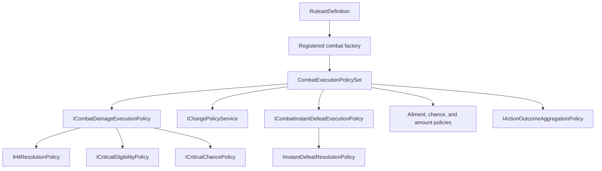
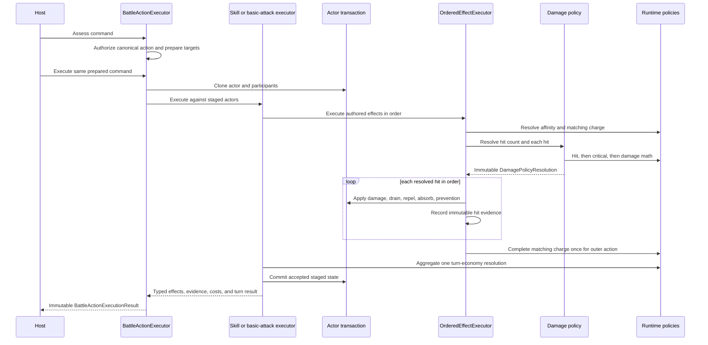
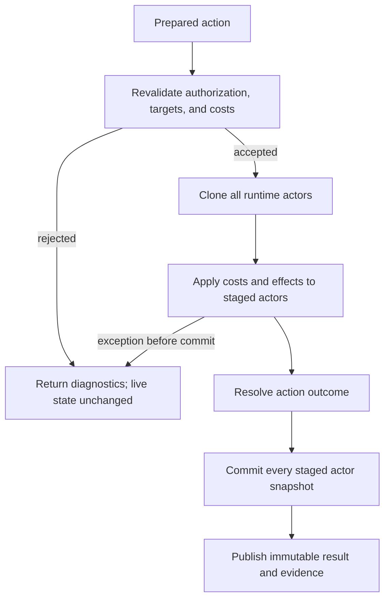

# Combat Resolution Pipeline

## Scope

This reference defines the implementation invariants behind the Order 2 combat
policy family. It covers authored binding, policy coherence, random boundaries,
damage sequencing, charge lifetime, action aggregation, atomic mutation, and
save restoration.

## Composition Boundary

`RuntimeRulesetBindingResolver.BindCombatPolicies` resolves one registered
`IRuntimeCombatRulesetPolicyFactory`. The result is an immutable
`CombatExecutionPolicySet`.

The composed interfaces are an integrity constraint. The hit/critical policies
advertised by the aggregate are properties of the exact damage executor passed
to `BattleExecutionServices`. The advertised instant-defeat resolver is a
property of the exact instant-defeat executor. A factory cannot pass unrelated
objects into separate descriptive fields.

Direct `BattleExecutionServices` composition remains lower level and accepts
the narrower execution interfaces. It does not claim authored aggregate
introspection.

## Damage Sequence

Hit is resolved before critical on every attempted hit. A miss has no critical
roll. The supplied damage policy calculates every hit first; the effect
executor then applies landed hit records sequentially to staged runtime actors.
This separation preserves deterministic policy evidence while allowing defeat
prevention and drains to observe the current staged resource value at each hit.

## Standard Arithmetic

For one landed hit, `ProductionCombatRuleset` performs these operations with
saturating arithmetic:

1. choose Strength for Physical or Magic otherwise;
2. apply general and category-specific outgoing multipliers;
3. divide by `max(1, Vitality + Defense)`;
4. calculate `scalar * sqrt(power * attack / defense)`;
5. apply target incoming-damage, critical, guard, affinity, charge, and
   variance multipliers;
6. floor the result;
7. apply typed outgoing/incoming rule modifiers at execution; and
8. mutate the vital resource through its bounded runtime API.

Hit/evasion and critical policy requests carry all explicit modifiers.
`ProductionCombatantProfile.Luck` is retained as neutral profile data but none
of the supplied Order 2 probability or damage policies read it.

## Random Boundary

`IRandomSource` is host-owned. Every consumer must validate its promised range
at the point where the value becomes authoritative:

| Method | Required range | Current combat uses |
|---|---|---|
| `NextUnitDecimal()` | `[0, 1)` | hit, critical, instant defeat, ailment, variance, initiative, rewards |
| `NextInt32(min, max)` | `[min, max)` | variable hit count and host/policy selection |

Zero- and one-hundred-percent outcomes do not consume a random unit. Variable
hit count validates the returned integer offset before adding it to the
authored minimum. Invalid host random output throws inside staged execution and
is converted to a typed rejection or fault by the owning boundary.

## Charge State Machine

```mermaid
stateDiagram-v2
    [*] --> Empty
    Empty --> Charged: accepted grant
    Charged --> Charged: duplicate grant rejected; state unchanged
    Charged --> Empty: committed matching damage action completes
    Charged --> Empty: authored duration expires
    Charged --> Empty: battle or cleanup boundary removes it
```

One actor's retained charge state has one policy ID. Split state permits
Physical and Magical keys; unified state permits only General. Validation and
restoration resolve that policy ID through `IChargePolicyResolver` and reject
unsupported kinds, duplicate keys, invalid durations, or a mismatched policy.

`OrderedEffectExecutor` owns an async-local outer action scope. Nested passive
or ailment effects join that scope. It records distinct damage elements by
acting actor and calls `CompleteAction` once when the outermost effect sequence
finishes. Because execution uses staged actors, a later exception discards any
charge removal along with other actor mutations.

## Outcome Aggregation

`IActionOutcomeAggregationPolicy` receives the ordered immutable effect result
list. The supplied policy applies this precedence:

1. first Repel or Absorb interrupts and terminates the phase;
2. any Null applies the Null result;
3. any all-hit target evasion plus any Critical normalizes to Normal;
4. an all-hit target evasion applies Miss;
5. Weakness applies Weakness;
6. Critical applies Critical; otherwise Normal.

An effect with damage evidence counts as evaded only when every hit is false.
Typed custom effects without damage evidence may still use a Miss outcome for
compatibility. A failed ailment or instant-defeat probability reports normal
no effect and does not masquerade as damage evasion.

The policy returns a neutral `TurnEconomyResolution`. `IBattleTurnEconomy`
decides what that means for its own state. Action Token is one consumer, not a
dependency of damage execution.

## Atomicity And Failure

Actor resources, status, stat modifiers, charge state, and combat knowledge are
inside `RuntimeActorExecutionTransaction`. Inventory is a separate
transactional port coordinated by `BattleActionExecutor`. Custom handlers must
represent host work as requests; a file, scene, network, or other side effect
performed directly by a handler cannot be rolled back by Framework actor
transactions.

## Source And Test Evidence

Primary source:

- [`ProductionCombatRuleset.cs`](../../src/Convergence.Framework/Battle/ProductionCombatRuleset.cs)
- [`HitResolutionPolicies.cs`](../../src/Convergence.Framework/Battle/HitResolutionPolicies.cs)
- [`CriticalResolutionPolicies.cs`](../../src/Convergence.Framework/Battle/CriticalResolutionPolicies.cs)
- [`InstantDefeatResolutionPolicies.cs`](../../src/Convergence.Framework/Battle/InstantDefeatResolutionPolicies.cs)
- [`ChargePolicies.cs`](../../src/Convergence.Framework/Execution/ChargePolicies.cs)
- [`ActionOutcomeAggregationPolicies.cs`](../../src/Convergence.Framework/Execution/ActionOutcomeAggregationPolicies.cs)
- [`EffectExecutors.cs`](../../src/Convergence.Framework/Execution/EffectExecutors.cs)
- [`OrderedEffectExecutor.cs`](../../src/Convergence.Framework/Execution/OrderedEffectExecutor.cs)
- [`ExecutionPolicies.cs`](../../src/Convergence.Framework/Execution/ExecutionPolicies.cs)

Focused tests:

- [`ProductionCombatRulesetTests.cs`](../../tests/Convergence.Framework.Tests/Runtime/ProductionCombatRulesetTests.cs)
- [`HitResolutionPolicyTests.cs`](../../tests/Convergence.Framework.Tests/Runtime/HitResolutionPolicyTests.cs)
- [`CriticalResolutionPolicyTests.cs`](../../tests/Convergence.Framework.Tests/Runtime/CriticalResolutionPolicyTests.cs)
- [`InstantDefeatResolutionPolicyTests.cs`](../../tests/Convergence.Framework.Tests/Runtime/InstantDefeatResolutionPolicyTests.cs)
- [`ChargePolicyTests.cs`](../../tests/Convergence.Framework.Tests/Runtime/ChargePolicyTests.cs)
- [`ActionOutcomeAggregationPolicyTests.cs`](../../tests/Convergence.Framework.Tests/Runtime/ActionOutcomeAggregationPolicyTests.cs)
- [`ActiveSkillExecutionTests.cs`](../../tests/Convergence.Framework.Tests/SkillSystem/ActiveSkillExecutionTests.cs)
