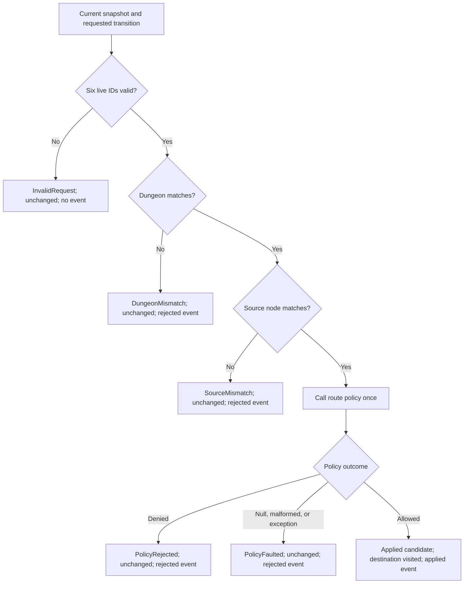
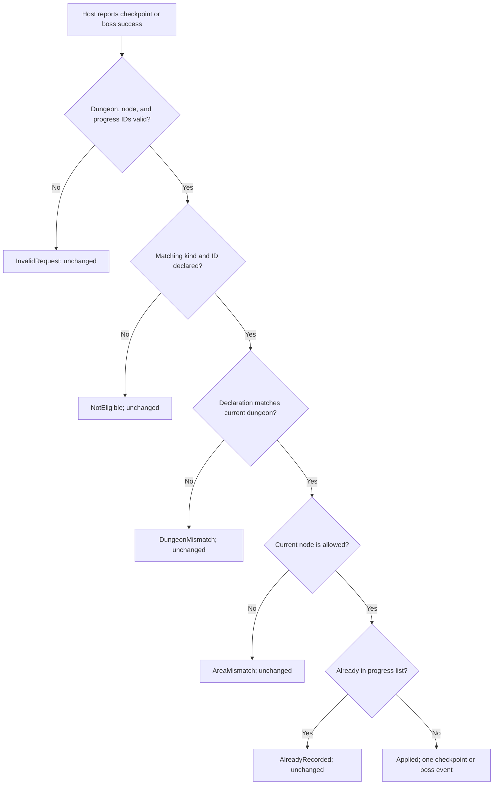
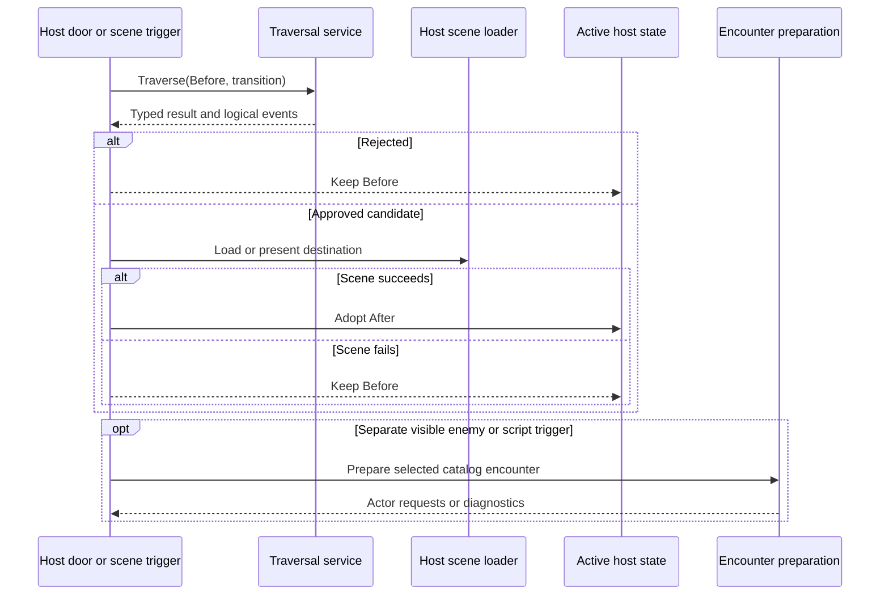

# Dungeon Traversal Runtime Authority

## Scope And State

`RuntimeDungeonTraversalService` is stateless. It receives an immutable
`RuntimeDungeonTraversalSnapshot`, a requested transition or progress ID, an
injected `IRuntimeDungeonTraversalPolicy`, and an immutable
`RuntimeDungeonProgressRegistry`. The host owns the live snapshot reference
and its adoption boundary. The snapshot stores dungeon ID, current meaningful
node, visited nodes, unlocked checkpoints, and defeated bosses. Construction
includes the current node in visited nodes and defensively copies the lists.
The public snapshot constructor is not a route authorization operation; live
requests and saves validate IDs at their respective boundaries.

Generic navigation has a separate logical-location snapshot. Neither service
calls the other, loads a scene, selects an encounter, or changes a battle.

## Transition State Machine

The six IDs are current dungeon, current node, transition, transition dungeon,
source node, and destination node, in that validation order. A custom policy
is not called for invalid or mismatched requests. `OperationCanceledException`
and `OutOfMemoryException` propagate rather than becoming policy faults.
`RuntimeDungeonTraversalResult` validates code, request, before/after state,
event kind and IDs, and diagnostic consistency even when built by a custom
service. Its ordered event list is defensively copied; event records expose
get-only values, so cloning cannot rewrite evidence.

## Progress State Machine

The registry defensively copies its declarations and each allowed-node list;
empty, invalid, duplicate-node, or duplicate declaration shapes are rejected.
Eligibility runs before idempotence. Non-applied reports emit no progress event
and preserve the before snapshot. Applied reports add exactly the reported ID
to the corresponding progress list and emit one event. The public
`RuntimeDungeonStateChangeResult` validates its progress kind/ID, state, and
event coherence. No battle proof is required: only the host knows whether a
battle, puzzle, or script met the game's success condition. Merely entering a
node cannot register a boss defeat.

## Host Adoption And Encounter Ordering

An applied structural event means rule approval, not successful host scene
activation. The host must not treat a candidate snapshot as committed before
its scene work succeeds. Encounter preparation is independent and explicit;
the same authored fixed-floor encounter may be selected by distinct host
triggers more than once, with distinct runtime actor instance IDs. Optional
`DungeonDefinition` floor metadata is directly readable from the catalog.
The validator rejects out-of-range or duplicate fixed-floor numbers within a
block and unresolved encounter references. It permits an empty encounter
pool. No floor-to-node resolver or automatic combat exists.

## Navigation, Save, And Re-Entry

| Logical location | Dungeon progress | Interpretation |
|---|---|---|
| Outside | Absent | Ordinary field state. |
| Outside | Present | Retained history only; host disables active dungeon controls. |
| Inside | Present | Host checks node and scene compatibility before active traversal. |
| Inside | Absent | Generic Framework field state is legal; a host requiring a dungeon position rejects or initializes before adoption. |

Save contract v19 permits `Field` to be absent. If present, it requires a
navigation snapshot and may retain a dungeon snapshot. Framework save
validation checks nonempty IDs and a catalog dungeon reference; aggregate
restore does not replay traversal or validate a host-specific scene graph.
Training Annex rejects an inside save lacking its dungeon node before adopting
restored session state. Its `CurrentSaveContext` follows navigation location,
not mere progress presence. On leaving, progress may remain saved but inactive.
On re-entry, the host selects an entrance or an unlocked checkpoint and maps
that selection to a node, rather than silently using the last current node.
Independent navigation/dungeon nullability in the broad save aggregate is an
Order 13 question, not a hidden Order 9 wire change.

**Source and tests:**
[`DungeonTraversal.cs`](../../src/Convergence.Framework/Runtime/DungeonTraversal.cs),
[`NavigationTransitions.cs`](../../src/Convergence.Framework/Runtime/NavigationTransitions.cs),
[`RuntimeFieldSnapshot.cs`](../../src/Convergence.Framework/Runtime/RuntimeFieldSnapshot.cs),
[`RuntimePersistenceSnapshots.cs`](../../src/Convergence.Framework/Runtime/RuntimePersistenceSnapshots.cs),
[`RuntimeDungeonTraversalTests.cs`](../../tests/Convergence.Framework.Tests/Runtime/RuntimeDungeonTraversalTests.cs),
[`GodotIntegrationContractTests.cs`](../../tests/Convergence.Framework.Tests/Hosting/GodotIntegrationContractTests.cs),
and [`CleanTrainingAnnexPlayHostTests.cs`](../../tests/Convergence.DemoHost.Tests/Host/CleanTrainingAnnexPlayHostTests.cs).
