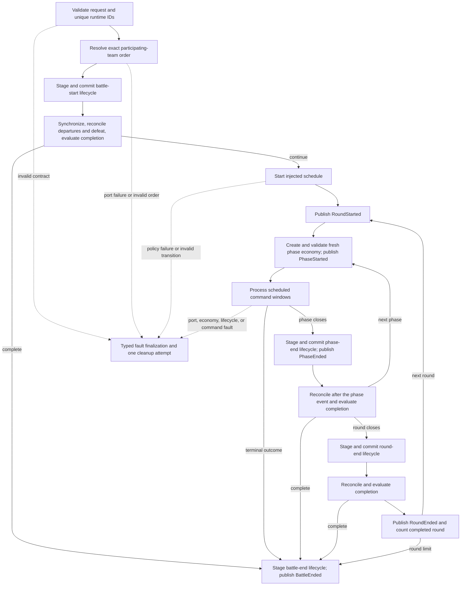
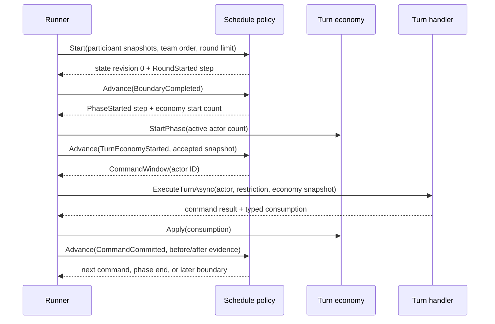
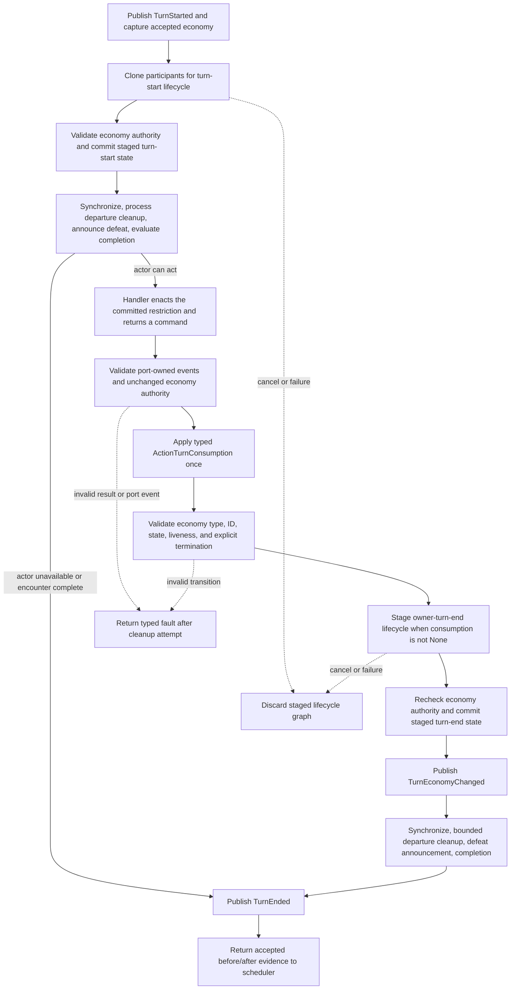

# Encounter Orchestration Runtime

## Scope

This document defines the internal authority, state machine, transaction
boundaries, event ordering, and fault containment of
`BattleEncounterRunner`.

It covers:

- initiative and scheduling;
- phase-scoped turn economy;
- lifecycle and command ports;
- reconciliation and completion;
- canonical events;
- cancellation and faults;
- automated encounter composition.

It does not define action math, status rules, rewards, recruitment, or scene
presentation.

> **Review state:** `existing_unreviewed` after O6-R48. The prose remains
> source-aligned, but the command transaction diagram omits the valid cancelled,
> rejected, and faulted handler-result branches. O6-R50 owns that correction.

## Authority Map

| Authority | Owns | Must not own |
|---|---|---|
| Runner | orchestration, validation, event sequence, economy application, reconciliation, termination | host input, action math, scheduler policy |
| Initiative policy | initial exact team permutation | actor windows or mutation |
| Schedule policy | immutable structural cursor and next actor/boundary | live actors, command execution, economy mutation |
| Turn economy | opportunity state and consumption transition | actor order |
| Lifecycle port | staged status/passive/cleanup mutation at named boundaries | structural event forgery |
| Turn handler | command selection/execution and typed consumption result | applying economy or ending a phase directly |
| Completion policy | terminal evaluation over reconciled participants | cleanup, rewards, or event publication |
| Event sink | asynchronous observation | runtime mutation authority |
| State synchronizer | host adapter synchronization | completion or scheduling decisions |

## Outer State Machine



The round limit is scheduler state. `completedRounds` advances only after
round-end lifecycle and reconciliation commit; `finalRoundNumber` advances at
round start.

## Scheduler Protocol

`IBattleEncounterSchedulePolicy` is a pure transition authority over detached
data:



The runner validates:

- policy and encounter identity remain unchanged;
- revisions and step sequences advance exactly once;
- returned steps match the supplied policy ID and round;
- active state satisfies `CompletedRounds == CurrentRound - 1`;
- non-round-end steps preserve both round counters;
- `RoundStarted` advances only to `PhaseStarted` or `RoundEnded`;
- `PhaseStarted` and `CommandWindow` advance only within the same team to a
  command window or phase end;
- `PhaseEnded` advances only to another phase start or round end;
- `RoundEnded` advances exactly one round to `RoundStarted`, or completes
  exactly at the configured round limit;
- command-window actors exist and belong to the selected team;
- step outcomes match the step being completed;
- economy evidence is present only where required; and
- a phase-start or committed-command outcome reporting no remaining
  opportunities cannot select another command window.

Rejected scheduling transitions become `ScheduleTransitionInvalid`; policy
exceptions become `ScheduleExecutionFailed`. Neither route executes another
command.

Accepted scheduler transitions increment one encounter-wide counter before the
next step is interpreted. `BattleEncounterProgressPolicy` faults the encounter
before accepting a transition that would exceed its configured maximum. This
closes structural loops that can cycle through round or phase boundaries
without opening a command window. It is independent from
`BattlePhaseProgressPolicy`, which bounds accepted turn windows and consecutive
free actions only inside the current phase. `MaximumCommands` retains its
pre-release name, but the counter increments after the selected actor passes
the initial availability check and immediately before `TurnStarted` and
turn-start lifecycle. Pre-turn unavailability does not increment it; departure
committed by turn-start lifecycle does. Once the configured maximum has already
been accepted, the next command-window step faults before processing.

### Supplied Team Scheduler

`TeamPhaseRoundRobinBattleEncounterSchedulePolicy` stores team index, stable
team-ring offset, round counters, and immediate-repeat count. It scans the
unfiltered team participant order from that offset and selects the first
available actor. Deployment and defeat therefore affect eligibility without
compacting the ring or redistributing its cursor.

Its optional post-command extension receives accepted immutable economy
evidence. `RetainActor` is legal only when an opportunity remains and the
configured consecutive-repeat bound has not been reached.

### Supplied Agility Scheduler

`AgilityOrderedBattleEncounterSchedulePolicy` resolves and freezes a descending
ordering-stat permutation at each round boundary. Its state stores the frozen
runtime-ID order and next index. It rejects missing or negative ordering stats
and any tie-break result that is not an exact permutation.

Each frozen actor owns a one-actor phase. Remaining economy opportunities
repeat that actor; unavailable frozen entries are skipped. Mid-round
deployments wait until the next ordering pass.

A scheduler may close a phase while its economy still has an opportunity when
no eligible recipient exists. It may not do the reverse: accepted exhausted
economy evidence followed by another command window is rejected before the
window reaches lifecycle or handler execution.

## Command Transaction



The handler executes action mutation before returning. The runner therefore
guards the boundaries it owns:

- the handler cannot mutate the retained economy;
- the returned consumption is validated before acceptance;
- `None` consumption requires exactly equal before/after economy snapshots;
- every nonterminal `None` result counts against free-action liveness by its
  validated consumption kind;
- lifecycle work is staged in `BattleEncounterLifecycleTransaction`;
- cancellation is checked before every staged commit;
- a non-`None` consumption invokes owner-turn-end lifecycle;
- each event is recorded in canonical sequence after the relevant commit and
  before optional sink publication.

Action-level atomicity remains owned by `BattleActionExecutor` and its staged
actor graph.

The turn-start lifecycle owns restriction decision and commit. The turn handler
owns restriction enactment. For the supplied automated path,
`AutomatedRestrictedActionIdentity` derives one canonical identity from the
typed command: Skill and Item definition IDs, the basic-attack action ID, or
the fixed `guard`, `pass`, `analyze`, and `escape` IDs. Both selection
construction and resolver execution reject any detached label mismatch before
assessment. `LimitedAction` authorization compares only this canonical value.

Custom turn handlers and state synchronizers are trusted mutation ports. The
runner contains a thrown exception as a typed fault, but it is not a
transaction over arbitrary external side effects or direct live-state changes
performed by those ports. Framework-provided action and lifecycle services use
the staged boundaries described here; a custom mutating port must supply an
equivalent atomic boundary.

The supplied `BattleStatusEncounterLifecyclePort` retains one committed
sequence counter per lifecycle event ID. It is mutable lifecycle authority, not
a stateless singleton: overlapping encounters must not share one instance.
Sequential reuse deliberately continues the same event-keyed sequence stream.
Replacing the port starts a new clock stream and must coincide with a lifecycle
boundary that does not retain modifier cursors from the previous authority.

## Reconciliation Fixed Point

`ReconcileAsync` runs after:

- battle-start lifecycle;
- turn-start lifecycle;
- each committed command and turn-end lifecycle;
- phase-end lifecycle;
- round-end lifecycle.

It performs:

1. host state synchronization;
2. select at most one exact defeat, flee, or roster-recall reason per actor;
3. run departure lifecycle against one staged participant graph;
4. synchronization after departure mutation;
5. another departure scan;
6. bounded repetition until stable;
7. one defeat announcement per uninterrupted defeated period;
8. completion evaluation.

The pass bound is participant count plus the final stability check. A lifecycle
that continually creates new departure work faults rather than looping
forever.

The runner releases defeat-cleanup and announcement membership whenever a
synchronization boundary observes that participant living again. Stable
reconciliation while the participant remains defeated is idempotent; a later
living-to-defeated transition receives both operations again.

Explicit Flee and Roster Recall reasons are inserted before inferred Defeat.
After their staged mutation commits, any actor that is currently defeated and
had a selected departure reason is marked processed for the complete current
defeat period. The fixed-point pass therefore cannot append Defeat cleanup to
the same explicit departure. Defeat announcement is tracked separately and may
still occur once. Recovery releases both authorities for a later period.

The completion policy receives `LastActor` only after that actor committed a
command. Lifecycle-only completion checks receive no fabricated acting actor.

## Canonical Event Authority

`BattleEncounterEvent` pairs:

- one positive, continuous encounter sequence;
- one `BattleEncounterEventKind`;
- the matching immutable `BattleEncounterEventPayload`;
- optional non-authoritative debug text.

The result retains the complete canonical sequenced event history. The runner
assigns a sequence and appends the event before invoking the sink. A sink that
throws before acceptance or after enqueueing cannot remove the event and cannot
cause its sequence to be reused. Fault finalization then appends result-only
terminal evidence rather than recursively publishing through the failed sink.
The automated runner does not translate or resequence either form.

### Runner-Owned Structural Order

For a normal turn:

```text
TurnStarted
turn-start port events
TurnRestricted (when applicable)
command port events
turn-end port events (when turn-consuming)
TurnEconomyChanged
departure/status/defeat reconciliation events
TurnEnded
```

`PhaseEnded` follows committed phase-end lifecycle events; reconciliation then
runs before the scheduler advances. `RoundEnded` follows committed round-end
lifecycle events and reconciliation.
`BattleEnded` follows committed battle-end lifecycle events.

Ports may publish only command, action, effect, passive, status, resource,
presence, and host-request events. Structural event forgery is rejected before
the returned batch is added.

Port evidence is also correlated with the frozen participant graph before
publication. Top-level and nested actor or target IDs in effect, damage,
resource, knowledge, analysis, passive, and lifecycle evidence must identify
encounter participants. Selected, passed, rejected, and host-request evidence
must identify the scheduled actor. `ActionExecuted` must also identify that
actor unless `ActionEventKind` is `PartyRosterTransitioned`; only that canonical
actorless shape bypasses scheduled-actor correlation. Any other missing actor is
rejected by payload validation and crosses the port boundary as a typed
turn-handler fault. Presence evidence must use the participant's
encounter team. A combat-profile source ID is retained as provenance and is not
treated as a deployed routing target, allowing a Vessel to derive its profile
from a Hosted Entity outside the encounter graph.

## Terminal Shape Validation

Completion and command terminal outputs are validated before acceptance:

| Outcome | Winner | Fault code |
|---|---|---|
| `Victory` | required participating team | none |
| `Defeat` | required participating team | none |
| `Escape` | none | none |
| `Draw` | none | none |
| `Cancelled` | none | none |
| `Faulted` | none | required in final event/result |

An incomplete completion result must not carry outcome-specific metadata.
Unknown enums, unknown winners, missing winners, and contradictory metadata
become typed faults.

The supplied `LastTeamStandingCompletionPolicy` is complete for both terminal
cardinalities: no deployed living teams produces `Draw`, while exactly one
produces `Victory` for that team. Two or more living teams remains incomplete.

## Cancellation And Fault Boundary

Operational cancellation is not a gameplay result:

1. `CancellationToken` is checked before each port;
2. awaited ports receive the same token;
3. staged lifecycle mutation is not committed after cancellation;
4. `OperationCanceledException` propagates;
5. no synthetic terminal event is appended.

Typed command cancellation is a gameplay result. It emits one terminating
`TurnEnded`, skips economy and owner-turn-end lifecycle, commits battle-end
cleanup once, and returns `Cancelled`.

Port exceptions are wrapped with port name, actor when available, and a stable
`BattleEncounterFaultCode`. Fault finalization:

1. records `BattleFaulted`;
2. attempts battle-end lifecycle once if the structural `BattleStarted` event
   was accepted before the fault;
3. records cleanup failure separately if needed;
4. records one `BattleEnded(Faulted)` result.

Faulted and rejected command results enter this same finalizer. Their command
fault is recorded once as the primary code. If battle-end lifecycle also fails,
the lifecycle fault is secondary evidence and the result plus `BattleEnded`
retain the original command code.

The cleanup boundary opens after `BattleStarted` sink publication completes and
before battle-start lifecycle is invoked. The event is already present in the
canonical result while publication is attempted, but publication failure does
not open cleanup. A later fault in battle-start lifecycle receives one cleanup
attempt.

If the event sink itself failed, final evidence remains in the returned result
without recursively trusting the failed sink.

## Result Snapshot Boundary

`BattleEncounterResult` does not expose live participants. It captures
`BattleEncounterParticipantSnapshot` values containing detached
`RuntimeActorSnapshot` state and immutable event collections.

Its terminal metadata is shape-checked at construction. `Victory` and `Defeat`
require one winner; the other outcomes reject a winner. Every non-fault outcome
has null `FaultMessage` and `FaultCode`. `Faulted` requires a defined fault code
and nonblank fault message. A normal completion policy message survives only as
optional `BattleEnded.DebugText`.

Callers that own live actors already possess those actors through the request.
Consumers of the result cannot mutate completed encounter state by retaining a
participant from the result.

## Automated Composition

`AutomatedBattleRunner.RunAsync` adapts catalog actors to
`BattleEncounterParticipant`, supplies the canonical runner services, and
returns canonical events directly.

The supplied `ISkillExecutor` owns automated action execution. The runner does
not accept a separate `BattleExecutionServices` value, preventing two apparently
competing execution-policy graphs from entering the same composition.

`AutomatedBattleRequest` rejects an empty or null-containing participant set,
invalid context or battle-kind IDs, an invalid optional moon-phase ID, and a
non-positive round limit at construction. Duplicate runtime IDs intentionally
flow to the canonical encounter runner so callers receive its typed
`DuplicateParticipantInstanceId` fault.

The automated result preserves every canonical terminal outcome:
`Victory`, `Defeat`, `Escape`, `Draw`, `Faulted`, and `Cancelled`.

Its command adapter does not fabricate a target for an untargeted skill. It
publishes ordered `HostActionRequested` events for every host request returned
by skill execution and converts a successful escape request into the canonical
`Escape` command outcome before the encounter advances another boundary.

Its deterministic selector:

- assesses authored equipped skills;
- uses stable authored order for ties;
- consumes team-local encounter knowledge;
- does not persist AI knowledge after the request unless a host explicitly
  chooses to do so.

The synchronous wrapper clears and restores the caller's synchronization
context, but remains a non-UI compatibility API.

## Source And Test Evidence

Primary source:

- `src/Convergence.Framework/Encounters/BattleEncounterRunner.cs`
- `src/Convergence.Framework/Encounters/BattleEncounterScheduling.cs`
- `src/Convergence.Framework/Encounters/AgilityOrderedBattleEncounterScheduling.cs`
- `src/Convergence.Framework/Encounters/BattleEncounterPostCommandScheduling.cs`
- `src/Convergence.Framework/Encounters/BattleEncounterEvents.cs`
- `src/Convergence.Framework/Encounters/AutomatedBattleRunner.cs`

Primary tests:

- `tests/Convergence.Framework.Tests/SkillSystem/BattleEncounterRunnerTests.cs`
- `tests/Convergence.Framework.Tests/Encounters/TeamPhaseRoundRobinScheduleTests.cs`
- `tests/Convergence.Framework.Tests/Encounters/AgilityOrderedBattleEncounterScheduleTests.cs`
- `tests/Convergence.Framework.Tests/Encounters/BattleEncounterPostCommandSchedulingTests.cs`
- `tests/Convergence.Framework.Tests/SkillSystem/CatalogBattleRuntimeTests.cs`
- `tests/Convergence.Framework.Tests/Hosting/GodotIntegrationContractTests.cs`
