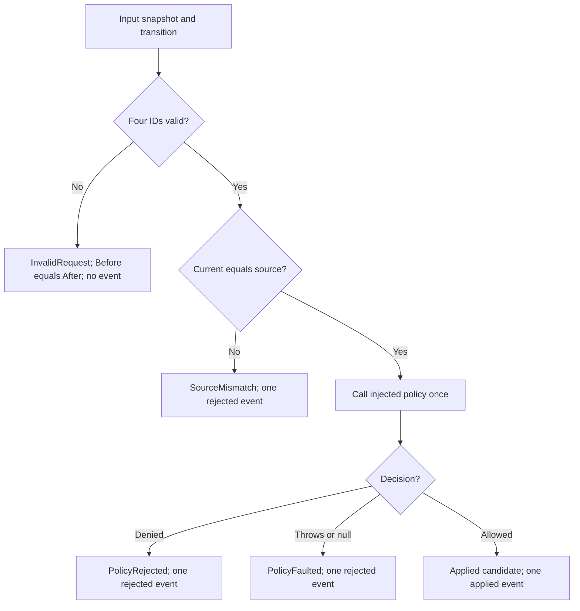
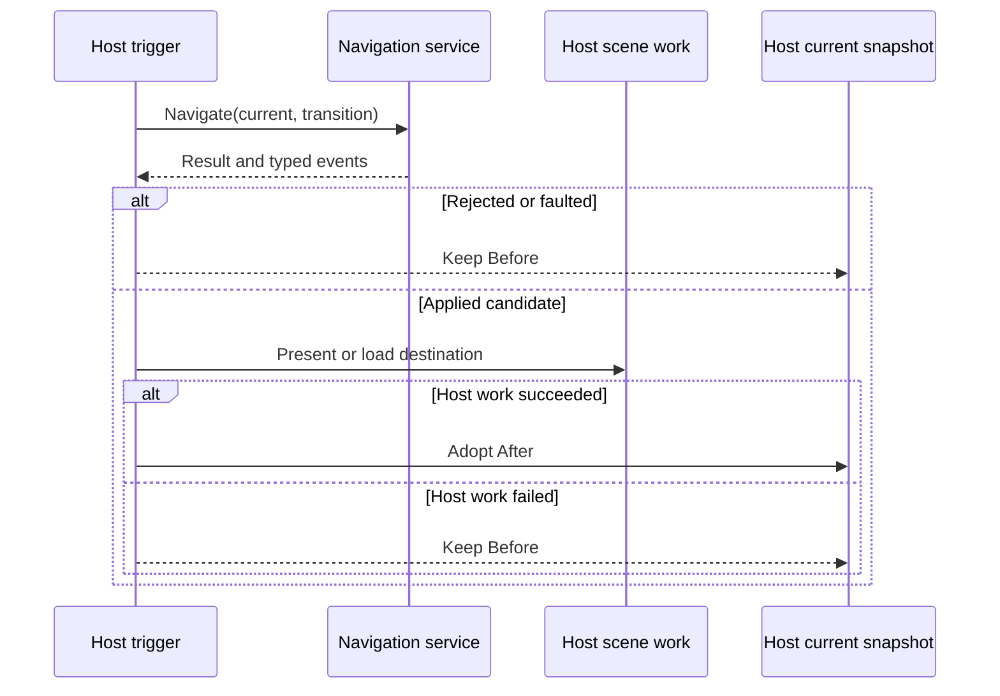
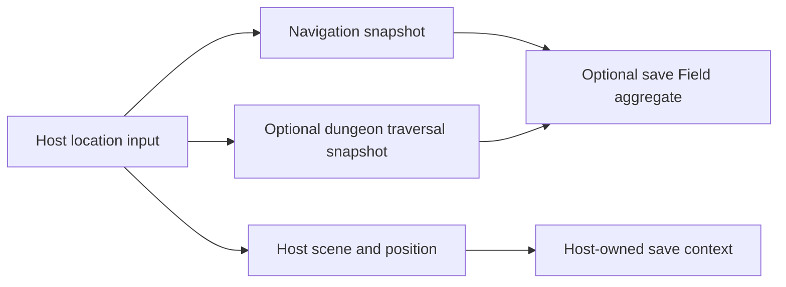

# Generic Navigation Runtime Authority

## Scope And State Owner

`RuntimeNavigationService` is a synchronous, stateless rule service. It receives
a `RuntimeNavigationSnapshot` and `RuntimeNavigationTransition`, evaluates an
explicit `IRuntimeNavigationPolicy` only when the request is valid and starts
at the current location, and returns an immutable candidate result. The host
owns the live current-snapshot variable and the scene commit boundary. Dungeon
traversal, encounters, and scene movement are different authorities.

Null arguments throw before result construction. For non-null inputs, the
service tests current-location ID, transition ID, source ID, and destination
ID in that order, returning the first invalid field. It performs source
matching next, then policy evaluation once. A throwing or null-returning
policy produces a typed fault without changing state. `OperationCanceledException`
and `OutOfMemoryException` propagate rather than becoming policy faults.

## Result And Event Matrix

| Code | After | Events | Distinct evidence |
|---|---|---|---|
| `InvalidRequest` | Same as Before | None | First `InvalidField`, `invalid_navigation_request` reason |
| `SourceMismatch` | Same as Before | One `TransitionRejected` | `source_mismatch` reason |
| `PolicyRejected` | Same as Before | One `TransitionRejected` | Policy reason and diagnostic message, if supplied |
| `PolicyFaulted` | Same as Before | One `TransitionRejected` | `FaultKind` (`Exception` or `NullDecision`) and `navigation_policy_faulted` reason |
| `Applied` | New destination snapshot | One `TransitionApplied` | No rejection reason or fault |

The result constructor validates code, before/after relationship, request
validity, event count/kind/IDs, reason and message agreement, invalid field,
and fault-kind coherence. Event collections are defensively copied; event and
policy-decision records do not offer public clone-writable properties. A
custom `IRuntimeNavigationService` can replace the supplied service, but it
cannot create a contradictory public result. Equal source and destination IDs
are legal: a policy may approve a same-location transition, in which case
`Applied` still records one event and returns a destination snapshot.

## Host Adoption Transaction

`Applied` is logical rule approval, not proof of a Godot scene load. The
framework does not atomically commit a scene and a snapshot. A host that
chooses to publish the structural applied event before scene work must not
label it a completed scene transition. The Training Annex sample adopts after
its console presentation completes; the Godot-shaped contract test explicitly
exercises scene success and failure. The real Godot smoke scene does not yet
perform live navigation.

## Navigation, Traversal, And Persistence

The diagram shows ownership, not automatic coupling: navigation does not
advance dungeon nodes or request battles. Save contract v19 permits `Field`
to be null. A present `RuntimeFieldSnapshot` requires navigation and may
contain dungeon progress. Save validation checks a nonempty location ID;
locations are host-authored and need no catalog registration. Aggregate
restoration preserves that snapshot without replaying transitions or
consulting the travel policy. Independent navigation/dungeon nullability in
the broad save aggregate is deferred to Order 13.

**Source and tests:** `src/Convergence.Framework/Runtime/NavigationTransitions.cs`,
`RuntimeFieldSnapshot.cs`, `RuntimePersistenceSnapshots.cs`,
`tests/Convergence.Framework.Tests/Runtime/RuntimeNavigationTests.cs`,
`RuntimePersistenceSnapshotTests.cs`, and
`tests/Convergence.Framework.Tests/Hosting/GodotIntegrationContractTests.cs`.
