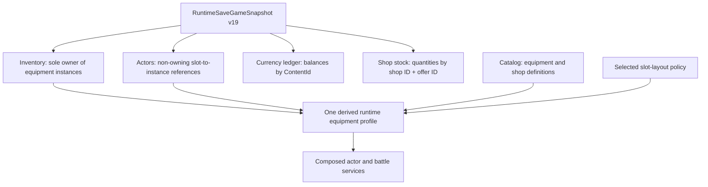
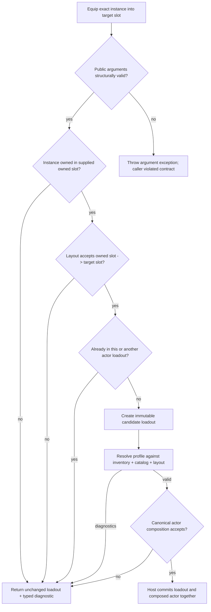
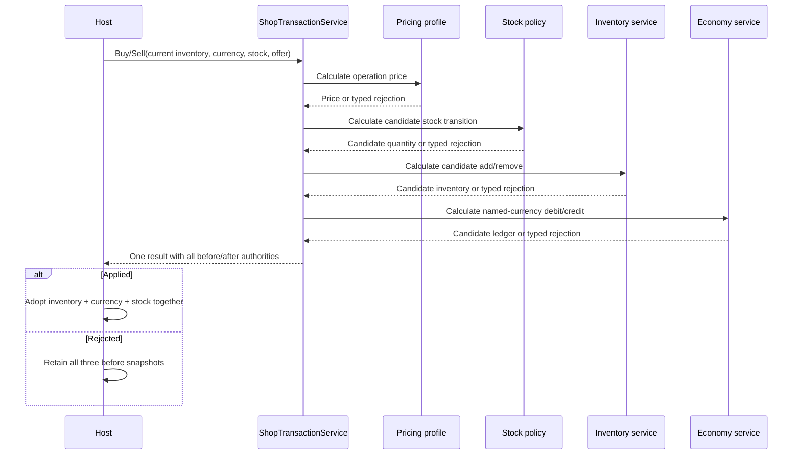
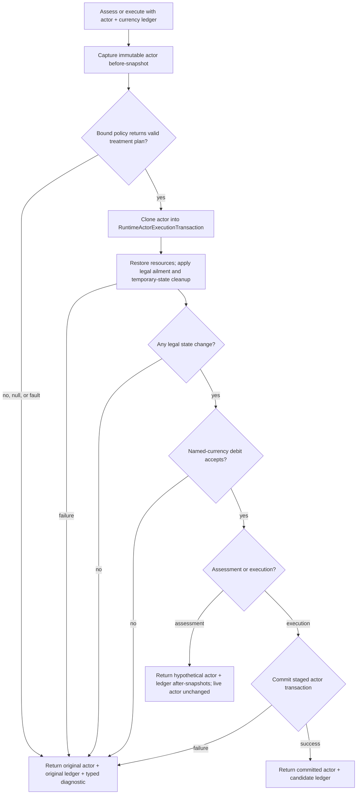
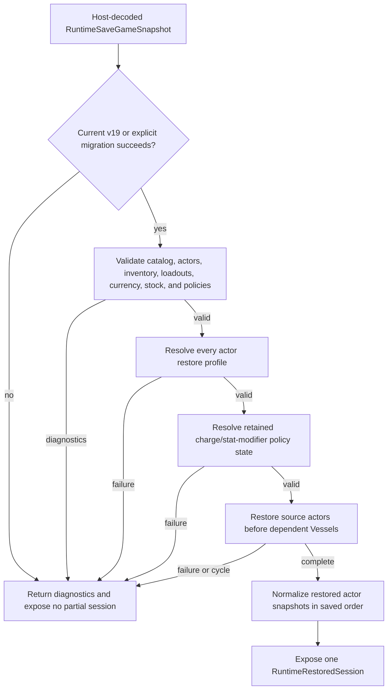

# Inventory, Equipment, And Economy Runtime

## Scope

This document defines the internal authority graph, invariants, policy
boundaries, transaction ordering, and restore dependencies for inventory,
equipment, currency, shops, and recovery.

It does not define menu presentation, player input, scene ownership, save-file
serialization, or game-specific currency names.

> **Review state:** `existing_unreviewed` during O7-R10. Promotion requires a
> final source/test/diagram reconciliation across all three Order 7 audiences.

## Authority Map

| Authority | Owns | Must not own |
|---|---|---|
| `RuntimeInventorySnapshot` | item quantities and every owned equipment instance | actor assignment, pricing, shop stock |
| `RuntimeEquipmentSnapshot` | one actor's slot-to-instance references | equipment ownership or definitions |
| `IEquipmentSlotLayoutPolicy` | slot vocabulary and profile/assignment compatibility | ownership, combat formulas, grants |
| `RuntimeEquipmentProfileResolver` | current projection of equipped definitions, basic attack, modifiers, and grants | learned skills, durable ownership, combat math |
| `RuntimeCurrencyLedgerSnapshot` | nonnegative balances keyed by currency ID | pricing formulas or presentation names |
| `RuntimeShopOfferSnapshot` | resolver-created immutable offer identity, content, pricing, and stock profile | durable stock quantity or host presentation |
| `RuntimeShopStockSnapshot` | remaining quantities for tracked offer identities | offered content or pricing |
| Pricing policy | purchase/resale calculation from typed inputs | currency mutation, stock mutation, inventory mutation |
| Stock policy | one tracked offer's candidate quantity transition | durable commit or other transaction state |
| `ShopTransactionService` | coordinated inventory/currency/stock result | host state adoption or UI |
| Recovery policy | immutable treatment plan | live actor or currency mutation |
| `RecoveryService` | staged actor cleanup and named-currency debit | patient selection or presentation |
| `RuntimeSaveGameSnapshot` v19 | one serializer-neutral aggregate authority graph | file format or scene objects |

## Aggregate Ownership Graph

There is no root equipment-owner collection besides inventory. A loadout is a
reference set, not ownership. The same equipment instance may not be referenced
by two slots or two actors.

## Equipment Instance Invariants

`RuntimeEquipmentInstanceSnapshot` contains:

- a valid `RuntimeInstanceId`; and
- a valid equipment-definition `ContentId`.

`RuntimeInventorySnapshot` enforces unique equipment instance IDs across every
owned slot collection while allowing multiple distinct instances to reference
the same definition. Aggregate save validation additionally rejects an
equipment instance ID that collides with any actor instance ID.

Actor loadouts map authored slot IDs to instance IDs. A valid aggregate
requires:

1. every referenced instance is inventory-owned;
2. the inventory slot, actor slot, and definition profile are compatible under
   the selected layout;
3. no instance is assigned more than once across all actors and slots; and
4. every definition is present in the active catalog.

### Where Slot Validation Occurs

The boundaries have different available evidence and therefore perform
different parts of the check:

| Boundary | Validation |
|---|---|
| Content semantic validation | authored definition profile against the selected layout |
| `EquipmentTransitionService.Equip` | inventory ownership and owned-slot to target-slot assignment, including cross-actor collision evidence |
| `RuntimeEquipmentProfileResolver` | inventory ownership, definition lookup, definition profile, inventory assignment, and actor assignment |
| Save validation/restore | the complete definition, inventory, actor, and cross-actor graph |

The equip transition cannot validate a definition profile because its public
request deliberately contains no catalog repository. A host must not treat an
accepted assignment as a substitute for resolving the resulting equipment
profile before committing actor composition.

## Equip And Unequip Transition

`Unequip` validates the target slot and returns a candidate loadout with that
slot removed. Profile resolution then removes grants and numeric contributions.
The host session must not publish success between loadout replacement and
canonical actor recomposition.

## One Equipment Profile

`RuntimeEquipmentProfileResolver` iterates equipped slot references in stable
slot-ID order and derives:

- compatible equipped definitions by slot;
- one weapon basic-attack profile;
- additive stat modifiers;
- distinct granted skill IDs; and
- ordered diagnostics.

Armor contributes Defense and Evasion; boots contribute Evasion; accessories
contribute their authored stat modifiers. Values are combined with checked
decimal arithmetic. The profile layer does not interpret Defense or Evasion:
actor composition feeds them into the existing production damage and hit
policies. No contribution means no modifier entry, which is an exact zero
input.

Granted skill IDs remain outside learned and move-list state. Active action
authorization and passive collection use the current profile. Execution-time
authorization resolves it again, closing a stale assessment window after
unequip.

`RuntimeActorEquipmentProfileSource` captures an immutable inventory snapshot.
A host that adopts a new inventory must replace the source; mutating a stale
source is impossible and reusing it would deliberately continue projecting the
old snapshot.

## Currency Ledger

`RuntimeCurrencyLedgerSnapshot` validates at construction:

- every currency ID is valid;
- IDs are unique; and
- balances are nonnegative.

`EconomyTransactionService.Credit` and `.Debit` require an explicit currency
ID and positive amount, use checked integer arithmetic, and change only that
entry. Missing currency, insufficient funds, invalid amounts, and overflow
return typed rejection with equal before/after ledgers.

`GetSingleCurrency()` is a read convenience. It rejects zero or multiple
entries through `RuntimeCurrencyLedgerException`; it does not create an
implicit transaction currency.

## Runtime Shop Offer Authority

An authored `ShopOfferDefinition` is not executable transaction authority.
`RuntimeShopOfferResolver` combines it with:

- the qualified containing shop ID;
- item/equipment catalog lookup;
- the selected equipment slot layout;
- the economy ruleset's bound default pricing policy;
- an explicitly selected per-offer pricing policy where authored; and
- unlimited, standard limited, or explicitly selected stock behavior.

Only successful resolution produces a complete `RuntimeShopOfferSnapshot`.
Its construction and members are not public mutation boundaries. Invalid
content kind, missing definitions, incompatible slots, malformed pricing, or
unsupported stock policy returns typed diagnostics without a fallback.

Tracked stock identity is `RuntimeShopOfferIdentity(qualifiedShopId,
localOfferId)`. Content ID and menu index are not durable stock keys.
`RuntimeShopStockSnapshot.CreateInitial` creates one entry for each tracked
offer and none for unlimited offers.

## Shop Transaction State Machine

Both purchase and resale calculate detached candidates. No supplied snapshot is
mutated during assessment.

The code order is pricing, stock candidate, inventory candidate, then currency
candidate. Stock and inventory candidates remain detached until the returned
result is adopted. Any later rejection rebuilds the result with all three
original before-snapshots, not the earlier candidates.

Equipment purchase requires a valid host-supplied instance ID. Equipment sale
requires the exact owned instance, matching offer definition and slot, plus all
actor loadouts so an equipped instance cannot be removed.

The standard pricing policy preserves authored purchase price and calculates
resale by configurable nonnegative percentage. The standard stock policy
decrements purchase, rejects zero, and leaves resale quantity unchanged.
Policies are deterministic, side-effect-free candidate calculators; the shop
service owns cross-authority coordination.

## Recovery Transaction State Machine

Recovery separates immutable policy planning from live execution:

The plan names currency, cost, resource IDs, ailment removal, and temporary
categories. Resource restoration uses each current maximum. Ailment and status
removal still pass through canonical `RecoveryEvent` legality. Stat-modifier
cleanup requires the matching policy service only when retained modifier state
is nonempty.

Assessment performs the complete staging and debit calculation but does not
commit the live actor. Its after-ledger is hypothetical and must not be adopted.
Execution commits the actor transaction and returns the corresponding ledger;
the host adopts that ledger only when `Applied` is true.

`OperationCanceledException` is rethrown. Other policy failures become typed
fault/rejection results with original before-state.

## Save V19 Validation And Restore

Save contract v19 contains inventory, actor loadouts, currency ledger, and shop
stock in the same aggregate. Validation occurs before actor factory calls:

Inventory validation checks definition existence, layout compatibility,
instance uniqueness, and actor-ID collisions. Actor equipment validation checks
ownership, assignment compatibility, and cross-actor reuse. Stock validation
requires exactly one nonnegative entry for every tracked current-catalog offer
and none for unlimited offers. Currency construction has already enforced its
ID/balance domain.

`RuntimeSessionRestoreService` returns either one complete
`RuntimeRestoredSession` or diagnostics. It never exposes the actors restored
before a later dependency failed.

## Atomicity Boundaries

| Operation | Framework atomic boundary | Host adoption requirement |
|---|---|---|
| Item/equipment inventory transition | one immutable inventory result | replace inventory only when applied |
| Equip/unequip | one immutable loadout result | coordinate accepted loadout with successful actor recomposition |
| Currency credit/debit | one immutable ledger result | replace ledger only when applied |
| Shop transaction | inventory + currency + stock result | adopt all three after-snapshots together |
| Recovery assessment | staged actor + hypothetical ledger | present only; adopt neither |
| Recovery execution | committed actor + returned ledger | adopt ledger only from the same applied result |
| Aggregate restore | entire live session | rebuild scene mappings only after success |

Framework result records defensively copy exposed collections. A host must not
infer success from messages or compare display names; it uses typed codes,
`Applied`, and exact runtime/content IDs.

## Policy Boundaries

Order 7 provides policies only where games have known legitimate alternatives:

- equipment slot layout;
- shop pricing;
- shop stock; and
- recovery planning.

Equipment instance ownership, equipped-only grants, Defense/Evasion entering
canonical combat inputs, and typed currency identity are fixed rules. Adding a
policy around those would create competing authorities without a supported
second behavior.

## Failure And Cancellation Rules

- Constructor misuse of validated identity/value objects throws argument
  exceptions.
- Expected gameplay rejection returns a typed immutable result.
- Host policy cancellation is propagated as `OperationCanceledException`.
- Non-cancellation custom-policy faults are contained as typed diagnostics at
  their binding or execution boundary.
- Rejected shop and recovery operations preserve every supplied before-state.
- Presentation messages are never authoritative transaction or restore input.

## Source And Test Map

| Concern | Source | Primary tests |
|---|---|---|
| Inventory, currency, equipment, shops | `Runtime/ResourceManagementServices.cs` | `ResourceManagementServiceTests`, `EquipmentInstanceOwnershipTests` |
| Slot layout | `Runtime/EquipmentSlotLayouts.cs` | `EquipmentSlotLayoutTests` |
| Equipment projection | `Runtime/RuntimeEquipmentProfiles.cs` | resource-management and equipment-combat tests |
| Pricing | `Runtime/ShopPricingPolicies.cs` | `ShopPricingPolicyTests` |
| Stock | `Runtime/ShopStockPolicies.cs` | `ShopStockPolicyTests` |
| Recovery | `Runtime/RecoveryPolicies.cs` | `RecoveryPolicyTests` |
| Save validation | `Runtime/RuntimePersistenceSnapshots.cs` | `RuntimePersistenceSnapshotTests` |
| Aggregate restore | `Runtime/RuntimeSessionRestoration.cs` | `RuntimePersistenceSnapshotTests` |
| Godot-shaped boundary | host-neutral runtime contracts | `GodotIntegrationContractTests` |

## Related Guidance

- [Player Mechanics](../mechanics/party-inventory-and-economy.md)
- [Developer Integration](../developer-guide/inventory-equipment-and-economy.md)
- [Runtime Actor State And Restoration](runtime-actor-state-and-restoration.md)
- [Stat Modifier Policy Runtime](stat-modifier-policy-runtime.md)
- [Public API Contract](../public-api-contract.md)
- [Content Contract](../content-contract.md)
- [Godot Integration Contract](../godot-integration-contract.md)
