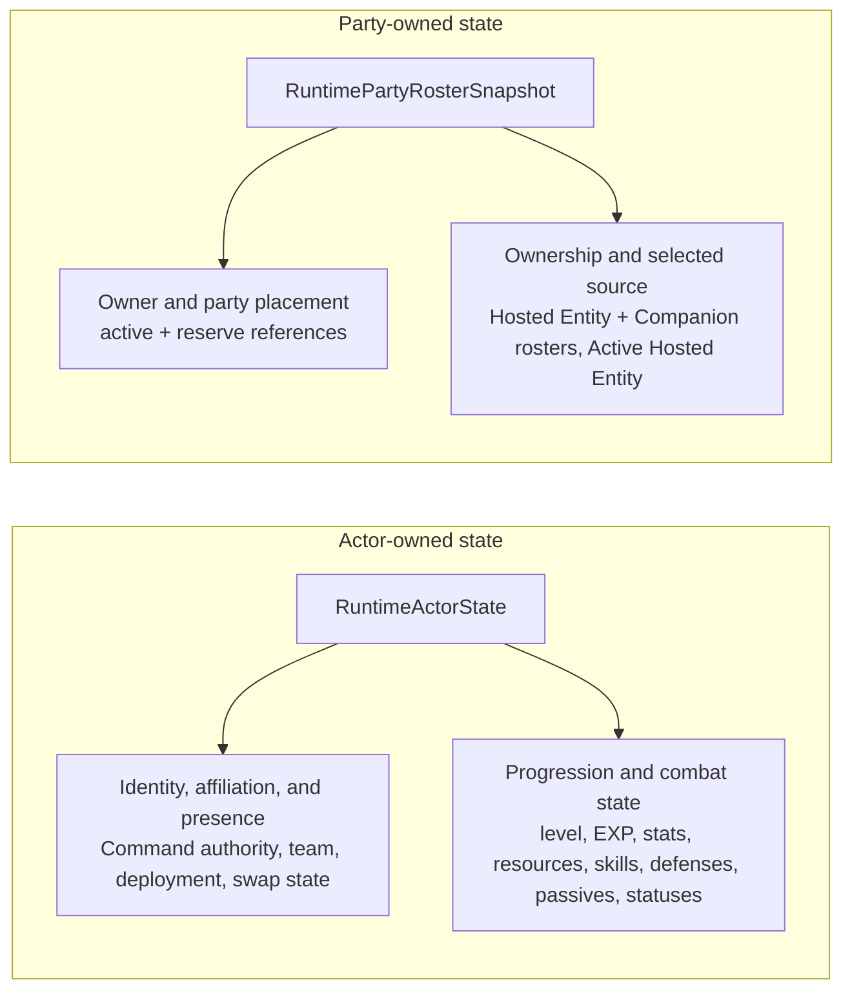
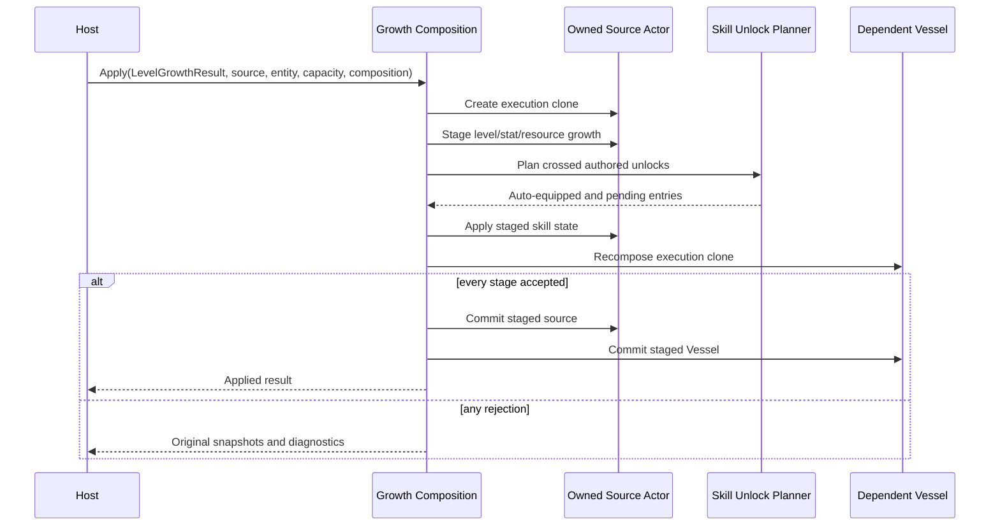
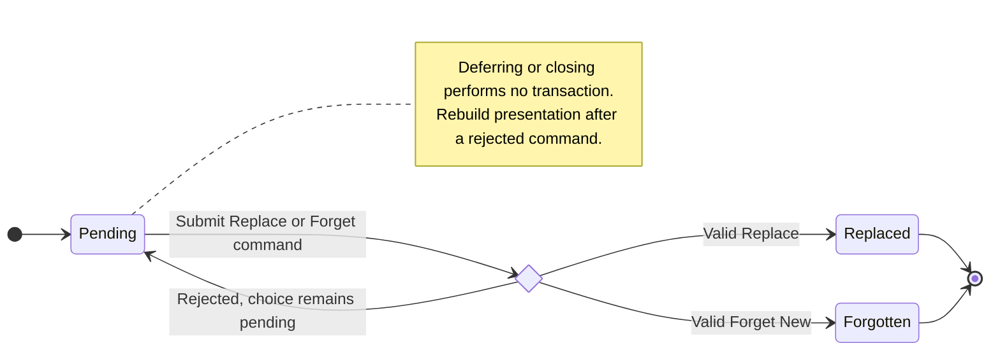
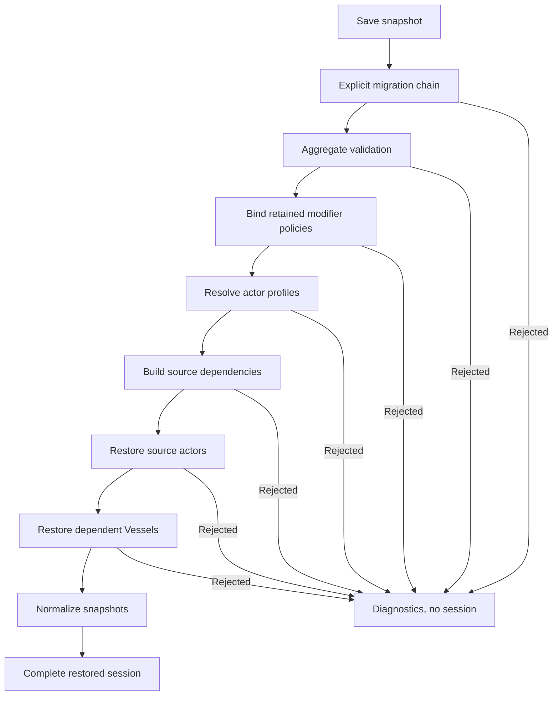

# Runtime Actor State And Restoration

## Scope

This document defines the internal authorities and transaction boundaries for
actors, party and roster state, Vessel composition, progression, skill-choice
resolution, and aggregate restoration.

It is maintainer documentation. The task-oriented integration path is in
[Actors And Runtime State](../developer-guide/actors-and-runtime-state.md), and
the approved design is in
[Actor Composition, Progression, And Rosters](../decisions/actor-composition-progression-and-rosters.md).

## Current Review Status

The source-based
[Actor Runtime Completion Code Review](../reviews/actor-runtime-completion-code-review-2026-07-16.md)
confirmed the composition, skill-choice, stage, and original save-v8
transaction design. Subsequent corrections advanced actor restoration through
save v9, later lifecycle work advanced it through v13, and Battle Knowledge
authority cleanup advances the current contract to save v14.

The duplicated roster owner level was removed in the first correction. Live
transitions now receive the current owner actor, and save validation derives
capacity from the saved owner actor. A shared aggregate validator now governs
live transitions, composition, and saves. High-level actor creation, direct
restore, and save validation now apply the selected move-list capacity policy;
starting-level authored unlocks use the same pending-choice planner as live
growth. Prepared level-growth results now retain their complete source
progression, stats, resources, and base-resource values; stale or repeated
application rejects before mutation.
The Godot sample now decodes complete host-owned snapshots before invoking the
same aggregate restore service and exposes no live session after rejection.
Direct catalog actor restore now applies the same pending-skill catalog,
authored-unlock, and actor-level checks as aggregate save validation.

The actor-runtime capabilities are therefore complete. Future released-save
migrations and deterministic replay remain intentionally deferred product
work, not gaps in the D1-D6 actor model.

## State Authorities

The runtime has deliberately separate authorities:

| State | Authority |
|---|---|
| actor identity and definition | `RuntimeActorIdentitySnapshot` |
| command routing and combat team | `RuntimeActorAffiliationSnapshot` |
| encounter participation | `RuntimeEncounterPresenceSnapshot` |
| actor progression and owned move list | the owning `RuntimeActorState` |
| active/reserve placement and owned rosters | `RuntimePartyRosterSnapshot` |
| selected Hosted Entity | `RuntimePartyRosterSnapshot.ActiveHostedEntity` |
| effective Vessel combat profile | composed `RuntimeActorState` |
| serialized session graph | `RuntimeSaveGameSnapshot` |

Actor snapshots do not own rosters or active/reserve placement. The party
aggregate does not duplicate complete actor state; it stores immutable
references containing runtime ID, entity-definition ID, and display metadata.

## Identity Invariants

`RuntimeInstanceId` must be unique throughout one session. The same runtime
instance may appear in two aggregate roles only for approved overlap pairs:

- Active Hosted Entity plus Hosted Entity Roster;
- active-party Companion plus Companion Roster;
- party owner plus active party where the game includes the owner in the
  active lineup.

Other overlaps are rejected by `RuntimePartyRosterInvariantRules`,
`RuntimePartyRosterIdentityRules`, transition services, and save validation.

When a reference points to an actor snapshot, both runtime ID and entity
definition ID must match. Display metadata is not identity authority.

## Affiliation And Presence

`RuntimeActorAffiliationSnapshot` contains:

- `CommandAuthorityId`: opaque host command routing;
- `TeamId`: framework combat affiliation.

Neither field means ownership.

`RuntimeEncounterPresenceSnapshot` contains:

- `IsDeployed`: lifecycle, targeting, and encounter participation;
- `HasSwappedThisTurn`: encounter-local swap state.

Party placement never changes `IsDeployed` implicitly. Encounter preparation or
host orchestration must establish presence.

## Combat Profile Composition

`RuntimeActorCombatProfileCompositionService` uses a staged transaction:

1. snapshot the live actor;
2. validate the canonical party roster when supplied;
3. resolve the requested source actor;
4. validate runtime and definition identity;
5. resolve every standard core stat;
6. recalculate resources with `PreserveCurrent`;
7. validate learned, equipped, and pending skill state;
8. resolve every equipped skill definition;
9. stage stats, resources, defense, move list, and passives;
10. commit the complete staged profile.

For `RuntimeStatSourceKind.ActiveHostedEntity`, the request must provide the
canonical party roster and matching runtime source state. The roster owner must
be the Vessel being composed.

The source contributes:

- core-stat inputs;
- `CombatDefenseProfile`;
- learned and equipped skill authority;
- active and passive definitions selected by the equipped move list.

The target Vessel retains:

- identity and entity definition;
- its own progression;
- base resource values and current resource amounts subject to recalculation;
- equipment;
- affiliation;
- encounter presence;
- active statuses and timed state;
- passive runtime counters for passive IDs that remain in the new profile.

`RuntimeActorState.ApplyCombatProfile` preserves retained passive runtime state
instead of resetting activation counts whenever a profile is recomposed.

### Atomicity

Every validation and calculation occurs before `ApplyCombatProfile`. Expected
domain failures become typed diagnostics. A rejected result returns the same
`Before` and `After` snapshot.

The commit call itself is guarded. A commit rejection is reported as
`CommitFailed`; no caller should apply fields from the proposed result
individually.

## Stage Scaling

`StandardStatStageScalingPolicy` owns a read-only table for each supported
track/channel pair. Each table must:

- use an unqualified track ID;
- use a defined `StatStageScalingChannel`;
- contain exactly one row for every stage from `-4` through `+4`;
- use positive decimal multipliers.

Multiple applicable tracks multiply together using saturating decimal
arithmetic. Stage zero and unsupported track/channel combinations contribute no
multiplier.

`ProductionCombatRuleset` queries separate channels for physical damage,
magical damage, damage taken, hit chance, and evasion. This prevents a defense
stage from being mistaken for an outgoing-stat mutation.

Authored `standard_stat` rulesets may override supported tables through the
`stageTables` parameter. Unknown keys, incomplete tables, duplicate mappings,
unsupported channels, and invalid values reject the complete ruleset binding.

## Growth Transaction

`RuntimeActorGrowthCompositionService` coordinates growth and dependent combat
composition:

The service never calls a presentation port. Host interruption therefore
cannot roll back committed level growth or discard a pending decision.

## Skill Unlock Planning

`RuntimeSkillUnlockPlanner` evaluates `EntityDefinition.SkillUnlocks` in
authored order for levels crossed by the growth transaction.

It excludes:

- unlocks outside the crossed range;
- duplicate authored skill IDs after their first occurrence;
- already learned skills;
- already pending skills.

For each remaining skill it resolves the definition and asks
`IRuntimeMoveListCapacityPolicy`. An available slot learns and equips the skill.
A full capacity creates `RuntimePendingSkillChoiceSnapshot`.

Tokens are monotonically derived from the current skill revision and existing
tokens. Revision and token arithmetic are checked.

## Skill-Choice Transaction

`RuntimeSkillChoiceTransactionService` rejects:

- a missing or duplicated token;
- a stale expected source level;
- a stale skill revision;
- a replacement ID that is not equipped;
- missing skill definitions;
- invalid retention-policy output;
- invalid resulting skill state;
- failed dependent Vessel composition.

The source actor and dependent Vessel are execution clones until both results
are valid. Only then are live states updated.

A rejected command is a transaction result, not a persisted skill-choice
state. The pending choice remains unchanged, and the host rebuilds presentation
from the current actor snapshot.

The standard retention policy removes the old skill from learned and equipped
collections. `RetainLearnedRuntimeSkillPolicy` keeps the old learned skill while
replacing only its equipped slot.

## Party And Roster Transitions

`PartyRosterTransitionService` validates the complete incoming aggregate before
executing a command. Commands return immutable `Before`, `After`, diagnostics,
and affected IDs.

Key invariants:

- active party size does not exceed `MaxActivePartySize`;
- a Hosted Entity selected as active is present in `HostedEntityRoster`;
- a deployed Companion remains in `CompanionRoster`;
- roster counts obey the injected `IRosterCapacityPolicy`;
- duplicate or incompatible runtime ID use is rejected;
- consuming or replacing an active source updates the active reference
  atomically.

Transition services do not mutate `RuntimeActorState.IsDeployed`. Encounter
orchestration owns presence changes.

## Save Contract V14

`RuntimeSaveGameSnapshot.CurrentContractVersion` is `14`. Version 14 retains
the canonical roster, complete move-list state, policy-owned stat modifiers,
charge-policy identity, and typed status lifetimes established by earlier
pre-release contracts, including the optional target runtime ID used when a
passive event counts activations per target. It removes actor-local Analyze
state: persistent knowledge and encounter analysis already have separate
canonical snapshots.

The save aggregate contains:

- complete actor snapshots;
- selected stat-modifier policy IDs, ordered contributions, durations, and
  lifecycle boundaries;
- one canonical party roster;
- inventory, equipment, and wallet;
- optional field and dungeon state;
- Compendium and battle knowledge;
- session progress;
- checkpoints and optional host context.

Actor skill snapshots include learned IDs, equipped IDs, pending choices, and a
revision. Roster ownership is not copied into actor snapshots.

`RuntimeSaveValidator` checks the aggregate before restoration, including:

- contract version;
- actor identity uniqueness;
- actor numeric and timed-state domains;
- stat-modifier policy binding and policy-specific retained-state validity;
- content references;
- party and roster role invariants;
- roster capacities;
- active Hosted Entity ownership and identity;
- pending skill tokens, IDs, levels, and revisions;
- passive activation target references when per-target counting is retained;
- inventory, equipment, field, Compendium, and knowledge references.

## Aggregate Restoration

`RuntimeSessionRestoreService` performs these phases:

1. migrate to the current contract through an explicit host-supplied migration
   chain when necessary;
2. validate the complete save;
3. bind and validate every retained stat-modifier policy;
4. resolve one `RuntimeActorRestoreProfile` per actor;
5. restore source actors before dependent Vessels;
6. restore Vessels through `CatalogBattleActorFactory.Restore`;
7. normalize actor snapshots from restored live state;
8. return one `RuntimeRestoredSession`.

The Active Hosted Entity dependency comes from
`RuntimePartyRosterSnapshot.ActiveHostedEntity`, not from stale derived Vessel
data.

Cycles, missing dependencies, profile resolver exceptions, actor factory
exceptions, and actor diagnostics all reject the aggregate. No partial actor
dictionary is exposed.

The host applies scene metadata and `HostContext` only after restoration
succeeds.

## Maintainer Change Checklist

When changing actor, roster, progression, or restore contracts:

1. identify the single authority for each affected value;
2. prevent a second serialized or mutable owner;
3. stage cross-actor mutations before touching live actors;
4. preserve current resources and passive runtime state deliberately;
5. add stable diagnostics for reachable rejection paths;
6. update save validation before accepting a new serialized field;
7. update restoration order when introducing a dependency;
8. update `PublicAPI.Shipped.txt` for public contract changes;
9. update source inventory and all three documentation audiences;
10. prove rejection snapshots and successful normalized state.

## Source And Test Evidence

Primary source:

- `Execution/BattleRuntimeState.cs`
- `Runtime/RuntimeStateSnapshots.cs`
- `Runtime/RuntimeActorCombatProfileComposition.cs`
- `Runtime/RuntimeActorGrowthComposition.cs`
- `Runtime/RuntimeSkillProgression.cs`
- `Runtime/RuntimePartyRosterInvariants.cs`
- `Runtime/RuntimePartyRosterIdentityRules.cs`
- `Runtime/PartyRosterTransitions.cs`
- `Runtime/RuntimePersistenceSnapshots.cs`
- `Runtime/RuntimeSessionRestoration.cs`
- `Runtime/StatStageScaling.cs`
- `Encounters/CatalogBattleActorFactory.cs`

Primary tests:

- `RuntimeStateSnapshotTests`
- `RuntimeActorAffiliationTests`
- `RuntimeEncounterPresenceTests`
- `RuntimePartyRosterInvariantIntegrationTests`
- `PartyRosterTransitionTests`
- `ProgressionPolicyTests`
- `RuntimeActorGrowthCompositionTests`
- `RuntimeSkillProgressionTests`
- `StatStageScalingTests`
- `RuntimePersistenceSnapshotTests`
