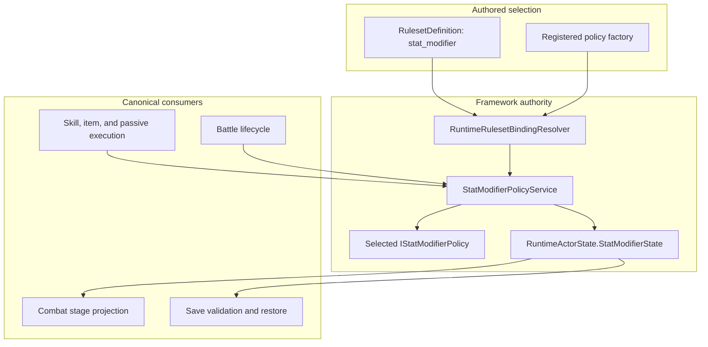
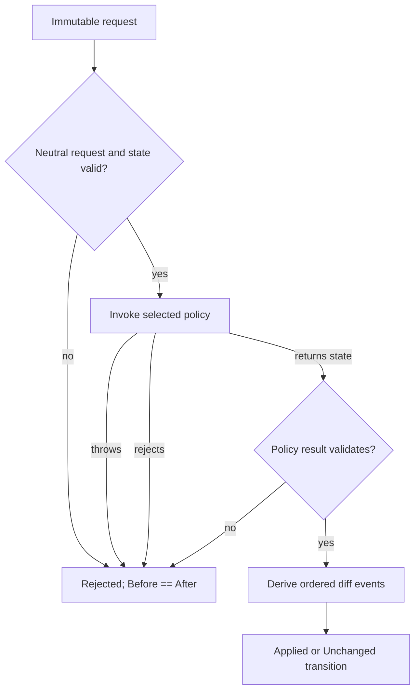
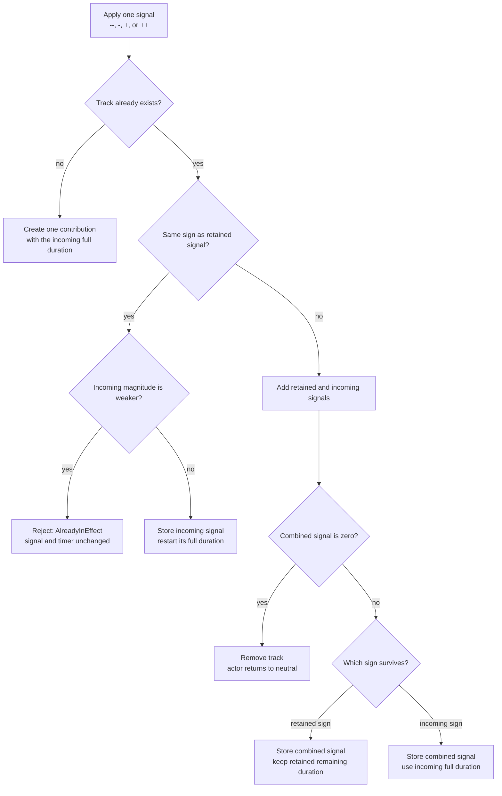
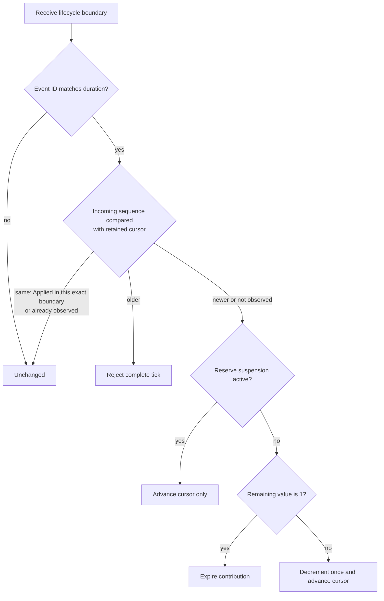
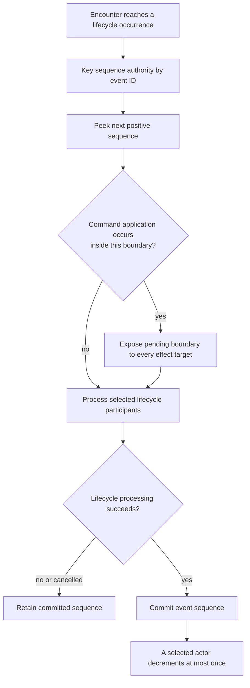
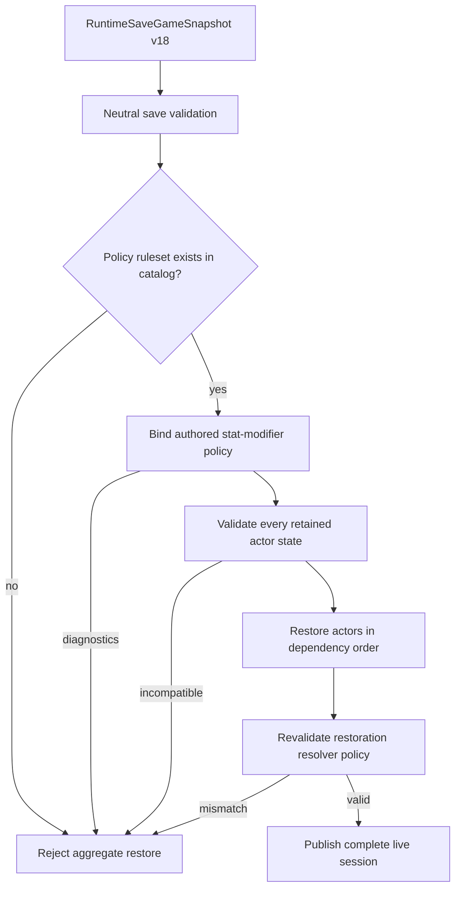

# Stat Modifier Policy Runtime Authority

## Scope

This reference defines the implemented authority, state, transaction, lifecycle,
and restore invariants for the stat-modifier family. It covers all three
supplied policies through M1-8.

The central invariant is:

> One bound `IStatModifierPolicyService` is the only authority that may derive
> canonical modifier state for a live actor.

Neither an effect executor, lifecycle service, host, save codec, nor combat
resolver may directly edit a resolved stage or duration.

## Authority Flow



`RuntimeActorState.StatStages` is a read-only aggregate projection of canonical
policy state. It is not a second mutable authority.

## Neutral Immutable State

`RuntimeStatModifierStateSnapshot` contains:

- one qualified policy ID;
- ordered `RuntimeStatModifierTrackSnapshot` values.

Each track contains:

- a valid modifier-track ID;
- a resolved nonzero stage;
- one or more ordered contribution snapshots.

Each contribution contains:

- a globally unique positive sequence;
- a signed nonzero stage delta;
- optional typed duration;
- optional last-observed lifecycle boundary.

The neutral service validates IDs, duplicate tracks and sequences, duration
shape, boundary shape, integer arithmetic, and policy identity. The selected
policy then validates its own bounds, contribution count, projection, and
duration requirements.

Snapshots sort tracks by ID and contributions by sequence. Public collections
are read-only snapshots, so caller-owned arrays cannot mutate a retained result.

## Service Containment

`StatModifierPolicyService` wraps extension policy code:



Policy exceptions other than process-fatal memory exhaustion become
`PolicyFaulted` diagnostics. Rejection never exposes a partial `After` state.

`AssessApplication` and `Apply` evaluate the same immutable policy path. The
skill and item execution layers do not rely on a general actor revision
counter. They instead enforce executor-owned, single-use assessment tokens;
the exact originating request and definition; rebound prepared target IDs;
current catalog authorization, target eligibility, resource affordability,
modifier applicability, execution context, and active lifecycle boundaries.

## Policy State Machines

### Persistent Staged

One contribution stores the net stage. Application computes
`clamp(current + delta, minimum, maximum)`. Stored duration and lifecycle cursor
must be null. `Tick` is unchanged.

### Timed Exclusive

One contribution stores one of `-2`, `-1`, `+1`, or `+2` and one counted
duration. Neutral is represented by the absence of a track. Rejection is a
result with unchanged state, not another retained state.



The weaker same-sign rejection is `AlreadyInEffect`. Equal opposite magnitudes
remove the complete track.

### Timed Contributions

Every accepted application normally appends one contribution. The projection
is:

```text
resolved = clamp(sum(contribution.StageDelta), minimum, maximum)
```

At a same-direction cap, application refreshes the lowest-sequence contribution
of that sign instead of appending hidden state. Selected-contribution removal
can therefore remove one timed application without removing the complete
track.

## Ordered Effect Transaction

For an active skill or item, modifier execution occurs inside the same staged
actor transaction as all other effects:

```mermaid
sequenceDiagram
    participant Host
    participant Action as BattleActionExecutor
    participant Inventory
    participant Effects as Skill/Item Executor
    participant Modifier as StatModifierPolicyService
    participant Actor as Live RuntimeActorState

    Host->>Action: assess typed command
    Action->>Effects: assess ordered effects on clones
    Effects->>Modifier: assess immutable transition
    Modifier-->>Effects: accepted, unchanged, or rejected
    Effects-->>Action: prepared result
    Host->>Action: execute prepared assessment
    Action->>Inventory: reserve one item when applicable
    Action->>Effects: execute against staged actors
    Effects->>Modifier: apply same transition inputs
    Modifier-->>Effects: immutable state and events
    alt all commits succeed
        Action->>Inventory: commit required reservation
        Inventory-->>Action: committed
        Action->>Actor: publish staged actor state
    else any execution or inventory commit rejects
        Action->>Inventory: roll back reservation
        Action-->>Host: rejected; live actors unchanged
    end
```

A modifier effect reports meaningful success only when its canonical transition
changes state. Typed removal follows the same path. Ordered effect failure rolls
back earlier modifier changes because only staged actor clones were changed.

## Lifecycle Boundary Model

Counted duration uses `TurnDurationDefinition` and
`StatModifierLifecycleBoundary(eventId, sequence)`.

The complete boundary identity is an event ID + positive monotonic boundary sequence.

- Event ID chooses the clock.
- Sequence is positive and monotonic within that clock's scope.
- A matching active boundary stamps application or refresh.
- Completion of the same sequence does not decrement the contribution.
- Repeating the latest sequence is idempotent.
- An older sequence rejects the complete tick.
- A later matching sequence decrements once or expires at one.
- A nonmatching event leaves the contribution unchanged.
- Reserve suspension records the later sequence without decrementing.



The canonical `BattleStatusEncounterLifecyclePort` owns one committed sequence
per lifecycle event ID and implements
`IBattleEncounterStatModifierBoundarySource`. The encounter runner snapshots
the next owner-turn event boundary before command execution, places it on
`BattleEncounterTurnRequest`, and later supplies that same boundary to turn-end
lifecycle processing. Framework automated actions and the DemoHost carry the
request boundaries into `EffectExecutionEnvironment`, so application and
completion share one identity.

Sequence authority is intentionally independent from mutation selection:

- owner-turn processing advances the event sequence but ticks only the acting
  actor;
- team-phase processing advances the mapped event sequence and evaluates the
  phase participant set;
- round processing advances the round event in the same event-keyed authority;
- reusing an event ID across teams or clock kinds shares one sequence stream;
  and
- distinct event IDs create distinct streams.



A larger incoming sequence is one later observed occurrence, not a duration
delta. This matters when other actors use the same owner-turn event between a
cross-target application and the target's next turn.

A custom lifecycle port that owns a timed clock must implement the
boundary-source contract, propagate pending boundaries through its turn
handler, and maintain one monotonic committed sequence per event ID. It must
not use actor-local or team-local counters behind a shared event ID. The
lower-level duration lifecycle also accepts action-end and phase-end boundary
collections from schedulers that define those clocks.

## Lifecycle Commit And Cleanup

Lifecycle work uses staged encounter or actor transactions. Modifier ticks,
passive effects, ailment effects, and resource effects commit together. A custom
handler fault cannot leave only the modifier portion live.

All supplied policies use the same cleanup rules:

| Scope | Result |
|---|---|
| `Swap` | preserve state |
| `ActorDeparture` | clear all modifier state |
| `EncounterEnd` | clear all modifier state |
| `FieldTransition` | clear all modifier state |

## Events

Events are derived from validated before/after snapshots in deterministic track
ID and contribution-sequence order:

1. removed or expired contributions;
2. added contributions;
3. updated contributions;
4. aggregate-stage change;
5. track removal.

`BattleStatusLifecycleEventMapper` carries modifier event payloads into the
encounter event stream. Debug messages are optional; typed IDs, values, and
event kinds are authoritative.

## Ruleset Binding

`RulesetCategory.StatModifier` is independent from `RulesetCategory.Stat`.
The latter binds stat resolution and scaling; the former binds modifier
lifecycle state.

`RuntimeRulesetBindingResolver.BindStatModifierPolicy` validates:

- qualified ruleset lookup;
- `stat_modifier` category;
- registered unqualified policy-factory ID;
- exact allowed parameter names;
- required bounds, a coherent signed range, and compatibility with the
  supplied `-4..+4` scaling domain;
- factory result and diagnostics.

The standard registry supplies `persistent_staged`, `timed_exclusive`, and
`timed_contribution`. There is no policy fallback after binding failure.
`StatStageScalingRequest` itself is range-neutral so a custom modifier policy
and custom `IStatStageScalingPolicy` can deliberately share another integer
domain. `StandardStatStageScalingPolicy` remains table-defined for `-4..+4`.

## Save And Aggregate Restore

Save contract v18 serializes canonical state under
`RuntimeBattleStatusSnapshot.StatModifiers`. Validation performs neutral checks,
catalog lookup of the saved qualified policy ID, authored factory binding, and
selected-policy compatibility validation.



No actor is exposed when aggregate validation fails. Host JSON and Godot save
codecs encode the snapshot but do not reinterpret policy state.

## Source And Test Evidence

Primary source:

- `src/Convergence.Framework/Runtime/StatModifierPolicies.cs`
- `src/Convergence.Framework/Runtime/PersistentStagedStatModifierPolicy.cs`
- `src/Convergence.Framework/Runtime/TimedExclusiveStatModifierPolicy.cs`
- `src/Convergence.Framework/Runtime/TimedContributionStatModifierPolicy.cs`
- `src/Convergence.Framework/Execution/StatModifierExecution.cs`
- `src/Convergence.Framework/Execution/BattleStatusLifecycle.cs`
- `src/Convergence.Framework/Runtime/RuntimeRulesetBindings.cs`
- `src/Convergence.Framework/Runtime/RuntimeRulesetPolicyFactories.cs`
- `src/Convergence.Framework/Runtime/RuntimePersistenceSnapshots.cs`

Executable evidence:

- `tests/Convergence.Framework.Tests/Runtime/StatModifierPolicyContractTests.cs`
- `tests/Convergence.Framework.Tests/Runtime/PersistentStagedStatModifierPolicyTests.cs`
- `tests/Convergence.Framework.Tests/Runtime/TimedExclusiveStatModifierPolicyTests.cs`
- `tests/Convergence.Framework.Tests/Runtime/TimedContributionStatModifierPolicyTests.cs`
- `tests/Convergence.Framework.Tests/SkillSystem/StatModifierExecutionIntegrationTests.cs`
- `tests/Convergence.Framework.Tests/Runtime/RuntimePersistenceSnapshotTests.cs`

## Related Documentation

- [Mechanics](../mechanics/stat-modifier-policies.md)
- [Developer Integration](../developer-guide/stat-modifier-policies.md)
- [Typed Action And Effect Execution](typed-action-and-effect-execution.md)
- [Runtime Actor State And Restoration](runtime-actor-state-and-restoration.md)
