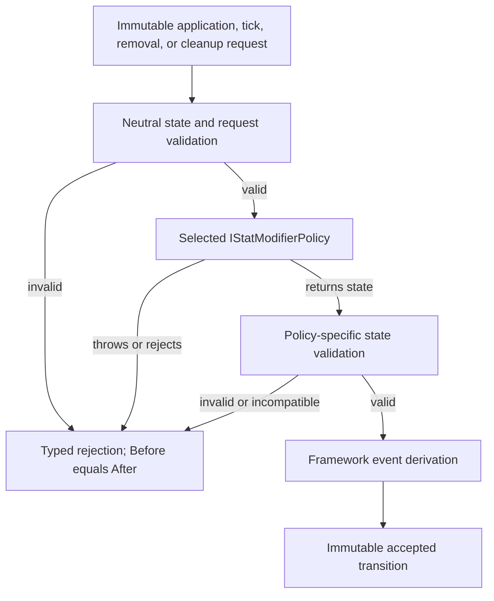
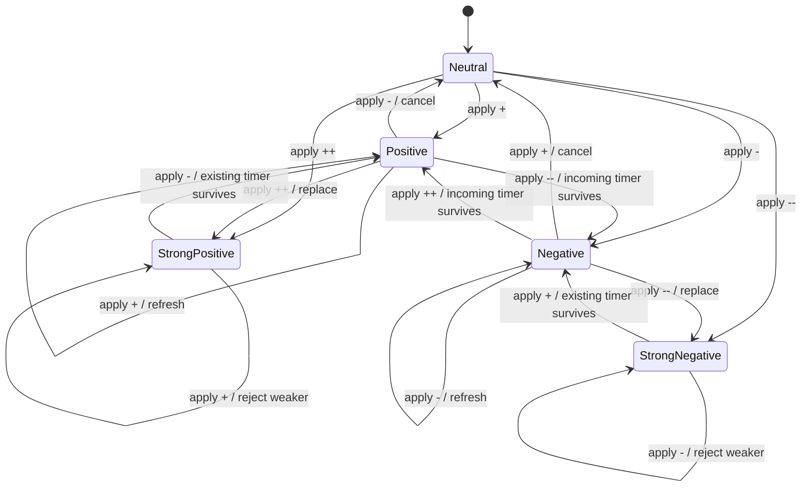
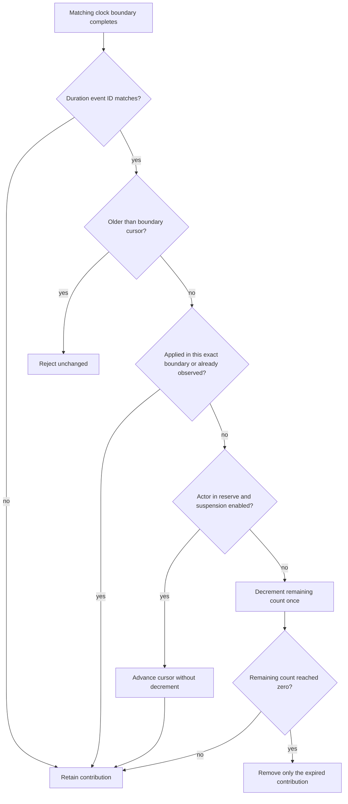

# Stat Modifier Policy Runtime Authority

## Scope And Implementation State

This reference defines the confirmed runtime invariants for the stat-modifier
policy family.

Implemented through M1-3:

- immutable neutral snapshots, requests, decisions, results, diagnostics, and
  events;
- `StatModifierPolicyService` validation and fault containment;
- removal of public direct stage mutation;
- the persistent staged reference policy;
- typed lifecycle-boundary cursors and boundary-aware events;
- the timed-exclusive reference policy.

Confirmed but not yet implemented:

- the timed-contribution policy;
- actor/effect/lifecycle commit integration;
- authored policy binding;
- contribution-aware aggregate persistence.

This distinction is deliberate. The document is current design authority, while
the [roadmap](../roadmap/stat-modifier-policy-roadmap.md) records implementation
progress.

## Authority Boundary

Exactly one selected `IStatModifierPolicy` owns modifier state for one runtime
scope. `StatModifierPolicyService` is the neutral authority around it.



Custom policy code never receives a live `RuntimeActorState`. M1-5 stages an
accepted immutable transition inside the existing actor transaction and only
publishes it after the whole ordered effect operation succeeds.

`RuntimeActorState.ChangeStatStage` is no longer public. M1-5 removes its
remaining internal callers and replaces the old aggregate store with validated
policy state.

## Neutral Retained State

`RuntimeStatModifierStateSnapshot` contains:

- selected policy ID;
- ordered modifier tracks.

Each `RuntimeStatModifierTrackSnapshot` contains:

- modifier track ID;
- resolved bounded stage;
- ordered retained contributions.

Each contribution contains:

- globally unique positive sequence;
- signed, nonzero stage delta;
- optional duration;
- optional last-observed lifecycle boundary.

Neutral validation rejects invalid IDs, duplicate tracks, duplicate or
nonpositive sequences, zero deltas, invalid duration shapes, and raw arithmetic
outside the integer domain. The selected policy additionally validates its
bounds, contribution count, aggregate projection, and allowed duration shape.

Counted durations use this boundary cursor shape:

```text
Contribution
  identity sequence
  signed magnitude
  duration
  optional last lifecycle boundary: event ID + monotonic sequence
```

The identity sequence orders contributions and event output. It is not a
duration clock. The lifecycle boundary is initialized from an active matching
boundary during application and advances whenever a later matching boundary is
observed.

## Timed-Exclusive State Machine

The supplied timed-exclusive policy permits one contribution per track and
stages `-2..+2`, excluding stored zero.



The complete arithmetic is:

```text
same sign, equal magnitude   -> same stage, incoming fresh duration
same sign, incoming stronger -> incoming stage and duration
same sign, incoming weaker   -> AlreadyInEffect rejection
opposite signs               -> existing stage + incoming stage
opposite result zero         -> remove track
opposite existing sign wins  -> result stage, existing remaining duration
opposite incoming sign wins  -> result stage, incoming fresh duration
```

The weaker same-sign rejection occurs during assessment and must be identical
during execution. It cannot reserve a cost, commit an item, mutate state, or
consume turn economy.

## Timed-Contribution Projection

The supplied timed-contribution policy retains each accepted application as a
separate contribution. Its aggregate is:

```text
resolved stage = clamp(sum(active signed contributions), minimum, maximum)
```

Positive and negative contributions coexist. Expiry removes only the due
contribution, then recomputes the aggregate.

An authored multi-stage application is one contribution. This preserves one
application identity and one duration.

When an incoming same-sign contribution would leave the resolved stage at the
same configured cap, the policy refreshes the oldest retained contribution of
that sign instead of appending hidden state. "Oldest" means lowest contribution
identity sequence. The retained contribution keeps its magnitude and receives
the incoming duration.

## Lifecycle Clock Contract

Every counted duration names its clock through a lifecycle event ID. One runtime
boundary is represented by:

```text
event ID + positive monotonic boundary sequence
```

Sequences are monotonic within the selected clock's scope. For owner-turn
events, the scope is the affected actor; for team-phase events, it is the team;
for round events, it is the encounter.

The scheduler owns boundary creation. The modifier service owns matching,
suspension, decrement, and expiry. Presentation owns neither.

The boundary cursor also makes ticking idempotent. A sequence equal to the
cursor has already been observed and is ignored. A lower sequence violates the
monotonic contract and rejects the complete tick without mutation.

### Application Anchor

Application receives the currently active matching boundary when one exists:

- self-application during owner turn 12 records owner-turn boundary 12;
- application to an actor whose owner turn is not active records no active
  owner-turn boundary;
- application during team phase 5 records phase 5 only when the duration uses
  the team-phase clock.

Ticking uses this order:



This prevents immediate same-turn loss without granting an extra duration to an
effect applied before the target's next turn.

## Turn Windows Versus Actions

The owner-turn clock advances once per completed turn window, not once per
animation or effect:

- command cancellation before commitment: no completion;
- committed normal command: completion;
- committed pass, guard, forced action, or skipped action: completion;
- immediate bonus action in the same window: no additional completion;
- genuinely new scheduled turn: another completion.

A future bonus-action scheduler must expose whether the bonus continues the
current window. `IBattleTurnEconomy` alone cannot infer scheduling boundaries
from token consumption.

## Removal And Cleanup

The neutral service validates selector shape before dispatch:

- positive and negative removal require no selectors;
- selected-track removal requires track IDs only;
- selected-contribution removal requires contribution sequences only;
- complete removal requires no selectors.

Policies decide which retained contributions match. Events are derived from the
validated before/after states and report contribution addition, update,
removal, expiry, aggregate change, and track removal in deterministic order.

Persistent policy cleanup preserves swap state and clears on actor departure,
encounter end, or field transition. Timed reference policies follow the same
cleanup scope unless a later confirmed policy decision explicitly differs.

## Atomic Integration Requirements

M1-5 must route all of these paths through the selected service:

1. skill and item assessment;
2. ordered active and passive effects;
3. battle-status lifecycle application;
4. matching clock ticks and expiry;
5. typed positive/negative/selected removal;
6. swap, departure, encounter, and field cleanup;
7. actor clone/commit and event publication.

No production caller may directly change an aggregate stage, decrement a
duration, or clear the old stage dictionary after that checkpoint.

## Persistence Requirements

M1-7 advances the save contract because the current aggregate stage snapshot
cannot preserve:

- policy identity;
- independent contribution identity and magnitude;
- remaining duration per contribution;
- application boundary anchor.

Restore validates neutral state and selected-policy compatibility before any
actor becomes live. A failure returns aggregate diagnostics and publishes no
partial session.

## Evidence

Current implementation evidence:

- `src/Convergence.Framework/Runtime/StatModifierPolicies.cs`
- `src/Convergence.Framework/Runtime/PersistentStagedStatModifierPolicy.cs`
- `src/Convergence.Framework/Runtime/TimedExclusiveStatModifierPolicy.cs`
- `tests/Convergence.Framework.Tests/Runtime/StatModifierPolicyContractTests.cs`
- `tests/Convergence.Framework.Tests/Runtime/PersistentStagedStatModifierPolicyTests.cs`
- `tests/Convergence.Framework.Tests/Runtime/TimedExclusiveStatModifierPolicyTests.cs`

Confirmed future behavior:

- [Stat Modifier Policy Family Decision](../decisions/stat-modifier-policy-family.md)
- [Stat Modifier Policy Roadmap](../roadmap/stat-modifier-policy-roadmap.md)
- [Player And Designer Rules](../mechanics/stat-modifier-policies.md)
- [Developer Integration](../developer-guide/stat-modifier-policies.md)
