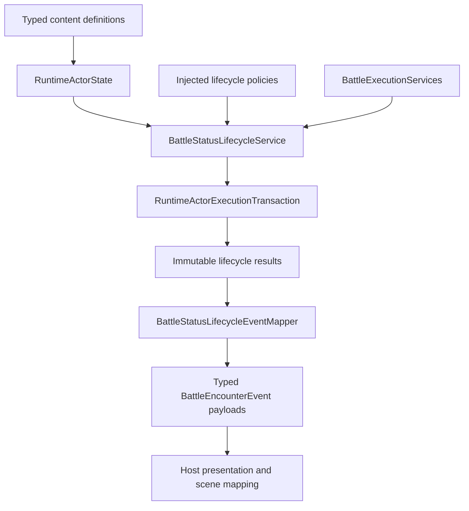
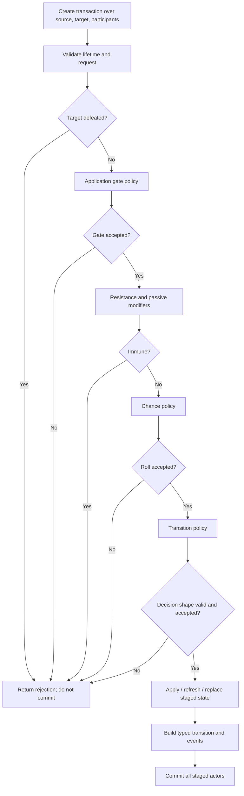
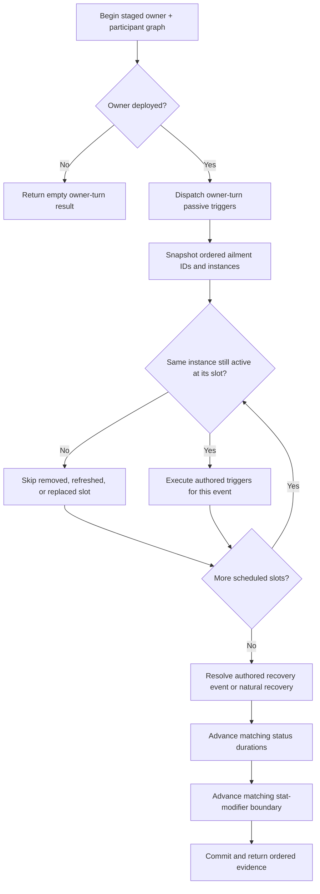
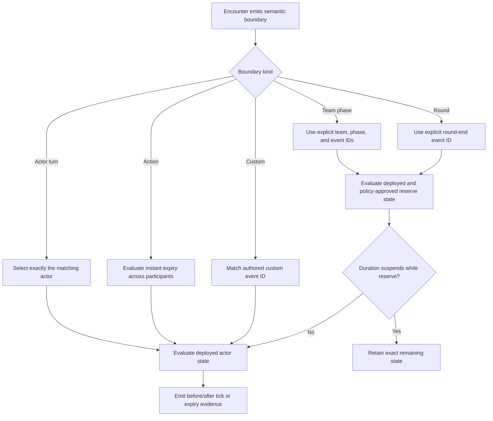
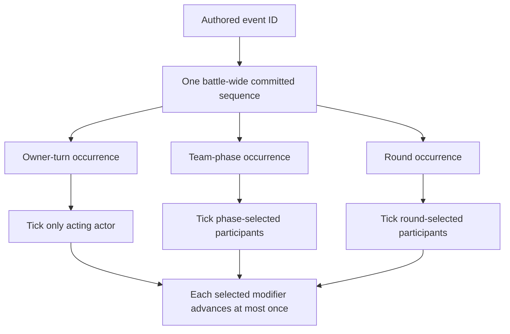
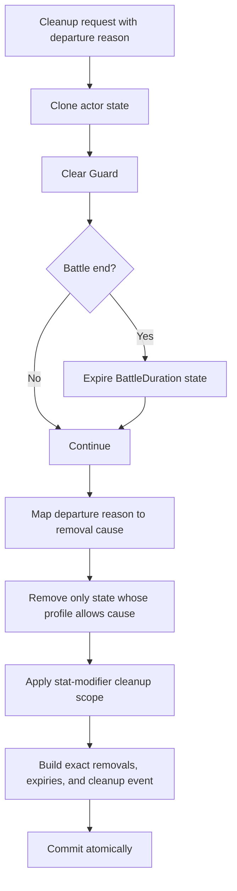
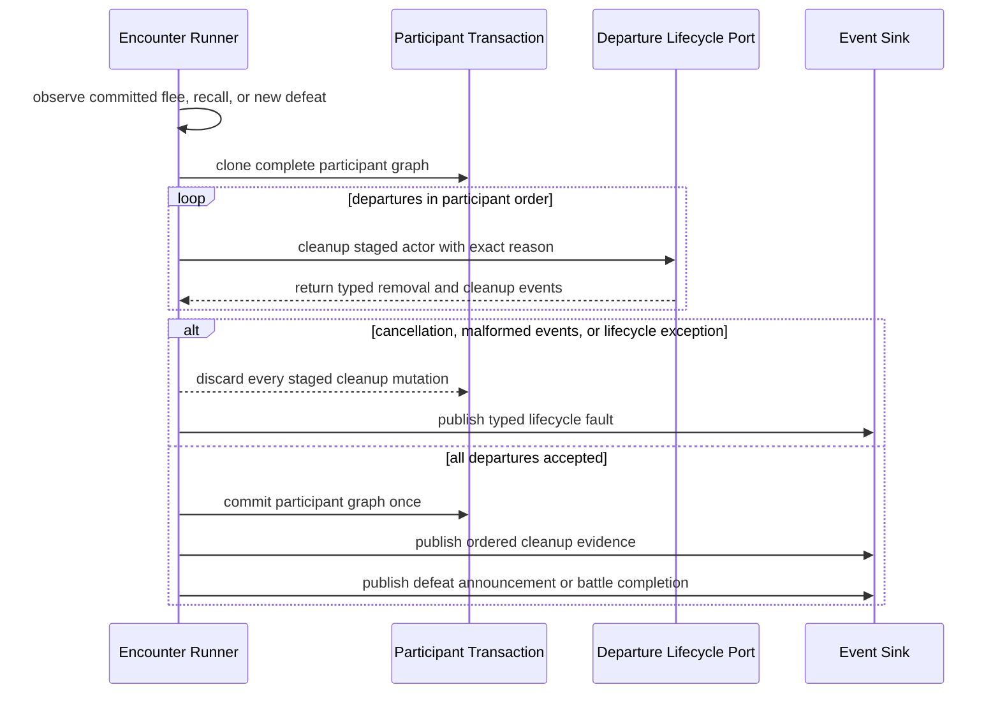

# Status And Passive Lifecycle Runtime

## Scope

This reference documents the internal authority, ordering, transaction, event,
and persistence invariants for ailments, timed state, cleanup, and passive
triggers. Stat-modifier policy internals are documented separately in
[Stat Modifier Policy Runtime Authority](stat-modifier-policy-runtime.md).

## Authority Map



`RuntimeActorState` is the live authority. Definitions specify behavior;
policies decide configurable conflicts; lifecycle services stage mutations;
results and encounter events expose committed evidence. Host presentation is
downstream and never rule authority.

## Lifetime Model

`StatusLifetimeDefinition` contains:

1. one `DurationDefinition` expiration; and
2. one immutable `StatusRemovalProfileDefinition`.

Duration and persistence are deliberately independent. Clock-driven Instant,
Turn, Phase, and Battle durations must permit `DurationExpired`; construction
rejects a profile that would make their clock impossible to complete.

The live duration guard rejects null values, non-positive counted turns,
invalid event IDs, invalid phase IDs, and undefined duration kinds before any
public timed-state mutator stores them.

The same lifetime shape is used by ailments, charges, shields, affinity Break,
affinity overrides, and other timed status state.

Instant expiration belongs to the end of the outermost
`OrderedEffectExecutor` scope. A passive or ailment trigger therefore has one
action-end boundary for its complete ordered sequence; nested execution does
not expire state early. The executor returns those completion events separately
from effect-owned events so callers can retain the exact expiry evidence
without duplicating grants or other effect events.

## Ailment Application Transaction



The public direct-application path and typed effect path share this staged
authority. Extension policies receive staged actors. A false result, malformed
decision, exception, or transition rejection cannot publish partial live actor
mutation.

For exclusivity replacement, each removed ailment must allow
`ExclusivityReplacement`. Otherwise the transition rejects with
`ReplacementProtected`.

## Combat-Profile Composition

`ProductionCombatRuleset.CreateCombatantProfile` projects live status into the
combat resolver without mutating the actor:

1. resolve physical attack, magical attack, defense, hit, and evasion through
   the injected `IStatStageScalingPolicy`;
2. initialize generic damage dealt to `1`, critical vulnerability to `0`, and
   rigid body to `false`;
3. for each active ailment, saturating-multiply generic damage dealt, damage
   taken, and evasion by the authored ailment values;
4. saturating-add the authored critical-chance-taken bonus; and
5. OR the authored rigid-body flag into the projected status.

Consequently, stage-derived damage taken and evasion are the starting values
for ailment composition. Physical and magical stage-derived damage-dealt
multipliers remain separate from the generic ailment damage-dealt multiplier;
the damage resolver multiplies the applicable attack channel later. Ailment
enumeration order cannot change ordinary results because multiplication,
addition, and logical OR are commutative; saturation makes extreme inputs
bounded rather than overflowing.

The projection consumes only typed definitions and live runtime state. It does
not inspect display text, and the host does not participate in the arithmetic.

## Turn-Start Resolution

`ProcessTurnStart` creates a one-actor transaction and follows this order:

1. clear Guard and add a typed `GuardCleared` event;
2. snapshot ordered ailment ID and exact-instance pairs;
3. re-resolve each scheduled ID and skip a missing or different instance;
4. resolve the surviving instance's turn behavior;
5. validate custom-handler results;
6. combine restrictions through `IBattleTurnRestrictionPolicy`;
7. add one typed restriction event; and
8. commit.

The supplied resolver ranks recall/flee, skip, confusion, basic attack,
limited actions, then normal action. Equal limited-action restrictions are
intersected. Deterministic source-ID ordering resolves equal non-limited ties.

Custom turn-behavior handlers receive the staged actor and may alter its
ailments. The boundary-start schedule prevents those writes from invalidating
dictionary enumeration. Removing, refreshing, or replacing a scheduled
instance invalidates only that old slot. Adding an ailment does not append a
new slot. A handler exception, malformed result, or later policy failure
discards Guard clearing and all handler mutations with the transaction.

Chance-skip and flee behavior use the injected `IRandomSource`. Invalid random
values fail at the host-random boundary rather than indexing or selecting an
unrelated outcome.

Before chance validation or random input, chance-skip-or-flee resolution checks
that `CompanionFleeOutcome` is one of `RecallToRoster` or `EscapeBattle`. The
semantic content validator performs the same check for programmatic content.
An undefined value throws inside the turn-start transaction, so staged Guard
clearing and handler mutation are discarded instead of treating the value as
escape.

## Owner-Turn-End Pipeline



The schedule is fixed when ailment-trigger dispatch begins. Each slot retains
both its ID and the exact `ActiveAilmentState` reference. Re-resolving the ID
and comparing the current instance prevents a removed ailment or a same-ID
refresh from executing stale effects. An exclusivity replacement likewise
removes the old slot. Ailments added after the snapshot are absent from the
schedule and first become eligible at the next matching boundary. The active
state's boundary-start order is preserved for surviving scheduled instances.

If an ailment trigger's ordered effect pipeline stops, later ailment triggers
do not run. Recovery and duration processing still follow, because those are
separate lifecycle steps rather than later effects in the stopped pipeline.

Natural recovery computes:

`floor(baseChance + positiveStat * statMultiplier)`

and clamps the policy-derived result to `0..100`. Authored base chance must be
`0..100`; the multiplier cannot be negative. Overflow saturates to 100.

## Explicit Clock State Machine



Actor-turn selection faults if a matching runtime ID is absent or ambiguous.
Team-phase mapping comes from `IBattleEncounterLifecycleClockPolicy`; team IDs
are never treated as phase IDs. Reserve advancement accepts only TeamPhase or
Round policies and, for TeamPhase, only the reserve actor's owning team.

Boundary sequence values support idempotent stat-modifier lifecycle handling.
The canonical encounter port maintains one committed sequence per lifecycle
event ID across actor turns, team phases, and rounds. Mutation selection stays
boundary-specific: an actor-turn event still advances only its actor, while
phase and round processing use their participant policies. A numeric jump
between two observations decrements a selected modifier once, not once per
missing number.



Sharing an event ID deliberately shares this identity stream. Independent
clocks require independent event IDs. A cancelled or rejected transition does
not commit the pending sequence. Sequence values do not make field time advance
automatically.

## Cleanup Transaction



Battle-end duration expiry occurs before general battle-end removal so events
retain the correct cause. Cleanup operates on all timed-state families and the
selected stat-modifier service. Unknown or rejected modifier transitions abort
the transaction.

Direct status-removal effects use `RemoveNonModifierStatuses`, which returns
one `BattleStatusRemovalResult` per committed charge, shield, affinity Break,
affinity override, or other-status removal. `RemoveStatusEffectExecutor`
projects each transition into a typed `StatusRemoved` lifecycle event.
Protected and missing state returns no transition and no event.

### Encounter-owned departures

`IBattleEncounterDepartureLifecyclePort` is an optional encounter extension.
The canonical `BattleStatusEncounterLifecyclePort` implements it by adapting
`BattleEncounterDepartureLifecycleRequest` to `BattleStatusCleanupRequest`.
The request requires the departing actor and its participant list to belong to
the same encounter participant graph.



The runner maps an undeployed actor's committed `FleeBattle` restriction to
`Flee` and `RecallToRoster` restriction to `RosterRecall`. It scans the full
participant graph for newly defeated actors and dispatches `Defeat` once per
runtime ID. An explicit flee or recall reason wins if the same actor is also
defeated during that command and remains authoritative for that uninterrupted
defeat period; the fixed-point scan cannot append a second Defeat cleanup.
Defeat announcement is tracked separately and may still occur once. Recovery
releases the period. Actors already defeated when the encounter request begins
are not treated as newly defeated.

If the supplied lifecycle port does not implement the optional extension, the
runner does not fabricate cleanup behavior. Manual deployment swaps and roster
commands also remain outside this automatic path. Their owner must call cleanup
with the matching typed cause. Active Hosted Entity selection changes combat
composition but is not actor departure.

## Passive Dispatcher Authority

### Target resolution

The surrounding execution transaction first requires every distinct actor
object to have a unique runtime ID. Two different objects claiming one ID are
rejected before target policies run. `PassiveTriggerTargetResolver` then
evaluates the typed scope over that validated graph, filters by life state and
reserve inclusion, and normalizes repeated references while preserving
encounter order. The validating dispatch contract captures those eligible
runtime IDs for every enabled trigger matching the requested event before the
inner dispatcher runs. Validation therefore uses one immutable eligibility
view even when an effect changes target life state.

`PassiveEventPolicy.OwnerEligibility` is evaluated before target resolution.
Generic unregistered events use `AllParticipants`.
`BattleStatusEncounterLifecyclePort` registers `DeployedOnly` for battle start
when no host policy exists; a prior explicit `AllParticipants` registration is
preserved. `BattleExecutionServices` uses the same register-if-absent rule for
the supplied one-use defeat-prevention event, so an explicit host policy is not
replaced. Owner eligibility and target reserve inclusion are independent
decisions.

### Dispatch order

The nested order is:

1. enabled passive loadout order;
2. trigger index;
3. resolved target order; and
4. ordered effect index.

The passive owner is the condition actor. The resolved target is the condition
target and effect target.

### Recursion and counts

The active recursion key is:

`owner instance + passive skill + trigger index + event ID`

Re-entry is suppressed unless the event policy permits it. A reentrant policy
must carry a finite positive activation limit.

Per-dispatch activation keys omit target identity. The first condition-accepted
target records one activation and the full eligible fan-out proceeds. Per-target
keys include the target runtime ID and are checked independently. A
condition-not-met target does not record an activation.

### Atomic dispatch

`BattleExecutionServices` wraps its supplied or replacement dispatcher in one
canonical validating transaction over owner, participants, and event targets.
Before dispatch, the wrapper captures enabled passive definitions and each
matching trigger's eligible runtime IDs. Before commit, it requires each
returned activation to match the requested event, an authored trigger index,
and that pre-mutation target set. It rejects duplicate activation evidence,
out-of-range or mismatched authored effect evidence, foreign actor IDs, and
effects attached to a non-executed outcome.

The standard `PassiveTriggerDispatcher` retains its own transaction so it is
also safe when used directly. Effects run against staged actors. Activation
counts and all effect mutations commit together. A thrown effect or malformed
replacement result leaves actor state and activation counts unchanged. Skill
execution translates such an exception into its typed `ExecutionFailed`
rejection; lifecycle ports propagate it to their encounter fault boundary.

The validating wrapper commits its staged graph only when the coherent result
contains at least one `PassiveTriggerOutcome.Executed` activation. An empty
result or a result containing only non-executed outcomes is still valid
evaluation evidence, but cannot authorize a state commit.

## Encounter Startup Atomicity

```mermaid
sequenceDiagram
    participant R as Encounter Runner
    participant T as Startup Transaction
    participant L as Lifecycle Port
    participant S as Event Sink

    R->>T: Clone complete participant graph
    R->>T: Reset staged per-battle passive counts
    R->>S: Publish actor, battle-start, and initiative events
    alt cancellation or initial publication failure
        R-->>T: Discard staged graph
    else initial events accepted
        R->>L: Dispatch staged battle-start passives
        L-->>R: Validate and return typed lifecycle events
        alt cancellation or lifecycle failure
            R-->>T: Discard staged graph
        else lifecycle accepted
            R->>T: Commit all participants once
            R->>S: Publish lifecycle evidence
            Note over R,S: A later sink failure faults the encounter; it cannot roll back committed state
        end
    end
```

No participant's activation counters or battle-start mutations become live
until lifecycle validation succeeds and the complete staged graph commits.
External event publication is deliberately outside the actor transaction. Host
sinks must not assume that throwing can undo framework state or prior host side
effects.

## Event Evidence

Lifecycle events do not make `Detail` authoritative. Typed fields carry:

- gate decisions;
- apply, refresh, replace, and rejection transitions;
- exact before/after duration values;
- exact removal cause and removed ID;
- stat-modifier transition data;
- passive source, event, trigger, target, outcome, and full effect result; and
- cleanup reason.

`BattleStatusLifecycleEventMapper` validates the specialized passive and effect
payload combinations it maps. Generic status events are wrapped in
`BattleStatusChangedEventPayload`; the mapper does not claim to revalidate
every possible generic status-field combination. Outermost action-completion
expiry is retained in active action results and in passive or ailment trigger
results instead of being discarded.

## Persistence And Restore

Runtime save contract v17 serializes the status lifetime rather than only the
remaining number. This preserves expiration kind, event or phase identity,
reserve behavior, and allowed removal causes.

`RuntimeActorSnapshotIntegrity` accepts retained Counted, Phase, Battle, and
Permanent duration kinds when their IDs and values are valid. It rejects
Instant duration state with `RetainedDurationKindInvalid`, because Instant
state belongs to an in-progress outer effect sequence and must expire at
action-end. Public catalog restore returns the corresponding typed snapshot
diagnostic instead of constructing a partially resumed actor. Hosts must place
save checkpoints after that committed boundary.

Passive state snapshots contain exactly one enabled or disabled entry for every
equipped passive. Aggregate validation reports
`MissingPassiveSkillState` when coverage is incomplete; direct actor restore
rejects the same input rather than applying the passive collection's enabled
constructor default.

Passive activation snapshots preserve:

`skill + trigger index + event + optional target + count`

The optional target is present only for per-target accounting. Save validation
requires it to reference a saved actor. Validation resolves every equipped
passive to its `SkillDefinition`, rejects a trigger index outside
`SkillDefinition.Triggers`, and requires the saved event to equal the event at
that exact index. A passive without authored triggers cannot own a persisted
activation counter. Duplicate keys and invalid counts are rejected before
aggregate restoration.

Active ailment restore state is checked against resolved
`AilmentDefinition.ExclusivityGroupId` values. Two distinct active ailments in
one valid group are rejected as
`ConflictingActorAilmentExclusivityGroup`; independent ailments remain valid.
This keeps restoration inside the same state space as live ailment application.

`BattlePassiveCollection.RestoreActivations` repeats the definition check into
temporary activation state before replacing current counts. A malformed later
entry therefore cannot clear or partially replace existing counters. Restore
does not infer per-dispatch or per-target shape because that decision belongs
to the host-supplied `PassiveEventPolicyRegistry`; aggregate save validation
separately verifies any supplied target actor reference. Restored state is
normalized through the same runtime validity guards as live state.

## Failure Containment

Framework transactions cover framework actor state. They do not compensate
external host operations. Integration code must observe this sequence:

1. ask the framework to assess or execute against staged state;
2. receive an immutable accepted result;
3. publish or apply host-side presentation; and
4. perform external irreversible work only at an explicitly owned host commit
   boundary.

Custom handlers should therefore be deterministic rule adapters, not scene or
storage mutators.

## Authored Lifetime Boundary

Schema v9 maps authored lifetime policy without inference. Each ailment
`defaultLifetime` and each applicable status-producing effect `lifetime`
contains an expiration definition plus the exact typed removal causes allowed
for that state. `SkillSystemDtoMapper.MapStatusLifetime` preserves both parts
when constructing `StatusLifetimeDefinition`.

Finite Instant, Turn, Phase, and Battle expirations must permit
`DurationExpired`; both JSON Schema and the runtime definition constructor
enforce that invariant. Permanent state may omit automatic expiry. Duplicate
or unknown causes are rejected by the authoring contract. Stat modifiers keep
their separate `duration` shape because the selected stat-modifier policy owns
contribution expiry rather than `StatusLifetimeDefinition`.

## Source And Test Evidence

Primary source areas:

- `Content/StatusLifetimes.cs`
- `Content/AilmentDefinition.cs`
- `Content/Passives.cs`
- `Execution/BattleAilmentApplicationGates.cs`
- `Execution/BattleAilmentTransitions.cs`
- `Execution/BattleLifecycleClocks.cs`
- `Execution/BattleRuntimeState.cs`
- `Execution/BattleStatusLifecycle.cs`
- `Execution/OrderedEffectExecutor.cs`
- `Execution/PassiveRuntime.cs`
- `Encounters/BattleEncounterRunner.cs`
- `Encounters/BattleEncounterLifecycleClocks.cs`
- `Encounters/BattleStatusEncounterLifecyclePort.cs`
- `Runtime/RuntimeActorSnapshotIntegrity.cs`
- `Runtime/RuntimePersistenceSnapshots.cs`

Primary executable evidence:

- `BattleStatusLifecycleTests`
- `BattleLifecycleClockTests`
- `PassiveSkillRuntimeTests`
- `BattleStatusLifecycleEventMapperTests`
- `BattleEncounterRunnerTests`
- `CatalogBattleRuntimeTests`
- `RuntimePersistenceSnapshotTests`
- `GodotIntegrationContractTests`
