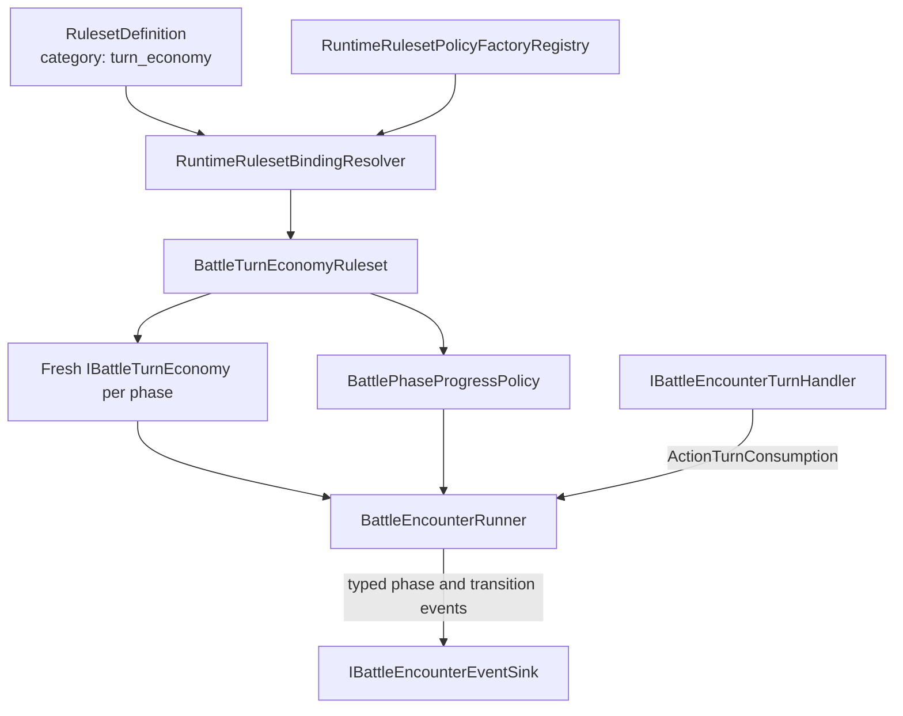
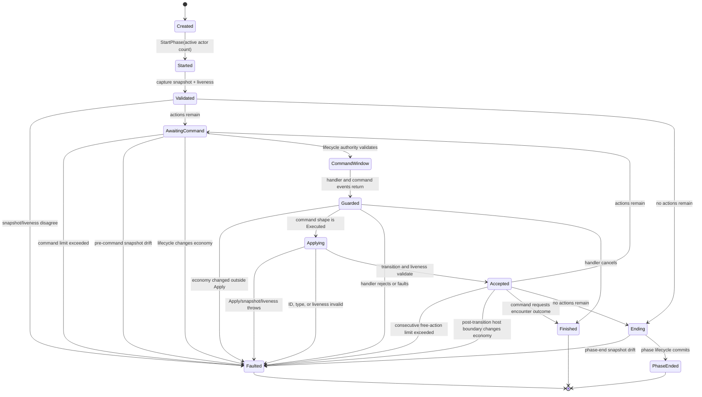
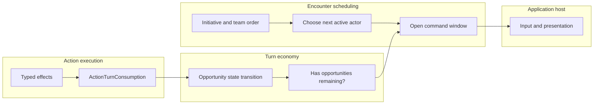

# Turn Economy Runtime

## Scope

This reference defines the runtime authority, transition validation, liveness,
typed event, and extension invariants for `IBattleTurnEconomy` and its use by
`BattleEncounterRunner`.

The central boundary is:

> Turn economy owns action-opportunity state. Encounter orchestration owns team
> and actor scheduling. Action execution owns the typed consumption input.

## Composition



The supplied registry recognizes `standard_actions` and
`standard_action_token`. Both factories require `maximumCommands` and
`maximumConsecutiveFreeActions`; neither inserts a hidden value.

## Generic Contract

`IBattleTurnEconomy` is stateful for one phase:

```csharp
public interface IBattleTurnEconomy
{
    void StartPhase(int activeActorCount);
    bool HasTurnsRemaining();
    BattleTurnEconomySnapshot CaptureSnapshot();
    void Apply(ActionTurnConsumption consumption);
}
```

`BattleTurnEconomySnapshot` requires a valid economy ID and a nonnegative
remaining-action count. Concrete snapshots may expose more state. Supplied
snapshots are immutable getter-only records:

- `StandardActionTurnEconomySnapshot.RemainingActions`;
- `ActionTokenTurnEconomySnapshot.FullTokens` and `PartialTokens`.

For Action Token, `RemainingActions` is the checked sum of full and partial
tokens. Negative components and integer overflow reject snapshot construction.

## Phase Authority State Machine



The accepted phase-start snapshot is the first authority. Before each command
and after every lifecycle, handler, event, and synchronization boundary, the
runner requires a new capture and liveness report to equal the last accepted
authority. Staged turn-start, owner-turn-end, and phase-end lifecycle work is
committed only after that check passes. After `Apply`, the runner accepts a
changed snapshot only when:

- economy IDs match;
- concrete snapshot types match;
- `HasTurnsRemaining()` agrees with `RemainingActions > 0`; and
- a non-`None` consumption did not leave state unchanged.

The resulting snapshot becomes the next authority. The phase-end capture must
still equal it before phase-end lifecycle work can mutate actors.

A `None` consumption may leave the supplied state unchanged. A custom economy
may use `None` for validated internal bookkeeping, but it must expose that state
through the same stable snapshot contract.

## Encounter Sequence

```mermaid
sequenceDiagram
    participant Runner as BattleEncounterRunner
    participant Economy as IBattleTurnEconomy
    participant Lifecycle as Lifecycle port
    participant Handler as Turn handler
    participant Sink as Event sink

    Runner->>Economy: StartPhase(active actor count)
    Runner->>Economy: CaptureSnapshot()
    Runner->>Economy: HasTurnsRemaining()
    Runner->>Runner: validate initial authority
    Runner->>Sink: PhaseStarted(team, snapshot)

    loop while validated actions remain
        Runner->>Economy: CaptureSnapshot()
        Runner->>Economy: HasTurnsRemaining()
        Runner->>Runner: require accepted authority
        Runner->>Lifecycle: ProcessTurnStartAsync(staged actors)
        Lifecycle-->>Runner: restriction + uncommitted lifecycle state
        Runner->>Economy: CaptureSnapshot() + HasTurnsRemaining()
        Runner->>Runner: require authority; commit staged turn-start
        Runner->>Sink: publish turn-start lifecycle events
        Runner->>Runner: require authority
        Runner->>Handler: ExecuteTurnAsync(actor, before snapshot)
        Handler-->>Runner: command + ActionTurnConsumption
        Runner->>Economy: CaptureSnapshot() + HasTurnsRemaining()
        Runner->>Runner: require authority
        Runner->>Sink: publish command events
        Runner->>Runner: require authority
        Runner->>Economy: Apply(consumption)
        Runner->>Economy: CaptureSnapshot()
        Runner->>Economy: HasTurnsRemaining()
        Runner->>Runner: validate and accept transition
        opt consumption is not None
            Runner->>Lifecycle: ProcessTurnEndAsync(staged actors)
            Runner->>Runner: require authority; commit staged turn-end
        end
        Runner->>Sink: TurnEconomyChanged(actor, before, after, consumption)
        Runner->>Runner: synchronize actors and require authority
    end

    Runner->>Economy: CaptureSnapshot() + HasTurnsRemaining()
    Runner->>Runner: require final accepted authority
    Runner->>Lifecycle: ProcessPhaseEndAsync(staged encounter)
    Runner->>Runner: require authority; commit staged phase-end
    Runner->>Sink: PhaseEnded(team, snapshot)
```

Turn-start and turn-end lifecycle use staged participant transactions. An
economy contradiction raised by those lifecycle ports rejects their staged
actor changes. Command handlers remain responsible for their own atomic action
transaction, while the runner rejects any unexplained economy mutation before
it applies the returned cost.

The economy is external state, not part of the actor transaction. A malformed
post-`Apply` snapshot is detected after the turn handler has returned, so the
runner cannot undo arbitrary mutations performed by a custom host handler.
This is why a replacement economy must make `Apply`, snapshot capture, and
liveness reporting exception-safe and truthful. A host must never mutate a
retained economy instance from lifecycle, handler, event, or synchronization
ports. Framework-owned action paths use their own staged actor and inventory
transactions.

## Liveness

Two counters guard different failures:

| Counter | Increment | Reset | Fault threshold |
|---|---|---|---|
| Phase commands | Every command window | New phase | The next command after exactly `maximumCommands` have run. |
| Consecutive free actions | Accepted command whose snapshot is unchanged and which requests no encounter outcome | Any accepted state change or requested encounter outcome | The next unchanged command after exactly `maximumConsecutiveFreeActions` have run. |

Thus a configured free-action limit of `2` permits two consecutive unchanged
commands and faults on the third. The absolute command count still bounds a
custom economy that changes or expands state forever.

`BattlePhaseProgressPolicy` requires:

```text
maximumCommands > 0
0 <= maximumConsecutiveFreeActions < maximumCommands
```

## Supplied Transition Tables

### Standard actions

| Input | State transition |
|---|---|
| `None` | unchanged |
| Normal, Pass, or TurnEconomy | `remaining - 1`, bounded at zero |
| TerminatePhase | zero |

### Action Token

| Input | Full present | Partial present | Result |
|---|---:|---:|---|
| Normal | any | yes | consume one partial |
| Normal | yes | no | consume one full |
| Pass | any | yes | consume one partial |
| Pass | yes | no | convert one full to partial |
| Weakness/Critical | yes | any | convert one full to partial |
| Weakness/Critical | no | yes | consume one partial |
| Miss/Null | any | any | consume up to two, partial first |
| Repel/Absorb | any | any | clear all |
| None | any | any | unchanged |
| TerminatePhase | any | any | clear all |

Every supplied transition preserves or decreases total token count. The phase
start count is therefore the maximum supplied Action Token total.

## Typed Events

Three payloads expose economy state:

| Event kind | Payload authority |
|---|---|
| `PhaseStarted` | Team ID and validated phase-start snapshot. |
| `TurnEconomyChanged` | Actor ID, accepted before/after snapshots, and exact consumption. |
| `PhaseEnded` | Team ID and final accepted snapshot. |

Payload construction rejects invalid IDs, null state, null consumption, and
mixed before/after economy identities or concrete types. Event construction
revalidates the payload so a malformed record clone cannot be published as a
typed encounter event.

`DebugText` is optional and non-authoritative. Presentation must use payloads.

## Scheduling Boundary



The current scheduler uses ordered team phases and round-robin active actors.
It advances `actorIndex` for every executed command window, including `None`.
`None` skips owner-turn-end lifecycle but does not request the same actor again.

Immediate same-actor bonus actions, agility-sorted cross-team turns, and other
turn-window definitions require a future scheduler policy in encounter
orchestration. They must not be implemented by mutating economy snapshots or
parsing event text.

## Extension Checklist

A replacement economy and factory are valid only when:

- every public policy ID is valid and local;
- every factory call returns a fresh per-phase economy;
- snapshots are immutable and compare by complete authoritative state;
- one phase retains one economy ID and one concrete snapshot type;
- `RemainingActions` and `HasTurnsRemaining()` agree;
- state changes only through the runner-owned `Apply` call;
- invalid `ActionTurnConsumption` is rejected rather than repaired;
- factory parameters are either recognized or reported as unknown;
- finite liveness limits are supplied; and
- focused tests include malformed initial, transition, and phase-end behavior.

## Persistence

Turn-economy phase state is not stored in `RuntimeSaveGameSnapshot`. Current
session persistence represents out-of-encounter or checkpoint state, not a
mid-command resumable encounter. Adding battle suspension would require a
versioned save design covering scheduler position, lifecycle cursors, pending
commands, economy snapshot restoration, and host presentation state.

## Source Evidence

- `src/Convergence.Framework/TurnEconomy/BattleTurnEconomy.cs`
- `src/Convergence.Framework/TurnEconomy/ActionTokenTurnEconomy.cs`
- `src/Convergence.Framework/Encounters/BattleEncounterRunner.cs`
- `src/Convergence.Framework/Encounters/BattleEncounterEvents.cs`
- `src/Convergence.Framework/Runtime/RuntimeRulesetPolicyFactories.cs`
- `tests/Convergence.Framework.Tests/Runtime/TurnEconomyContractTests.cs`
- `tests/Convergence.Framework.Tests/SkillSystem/BattleEncounterRunnerTests.cs`
- `tests/Convergence.Framework.Tests/Runtime/RuntimeRulesetBindingTests.cs`
