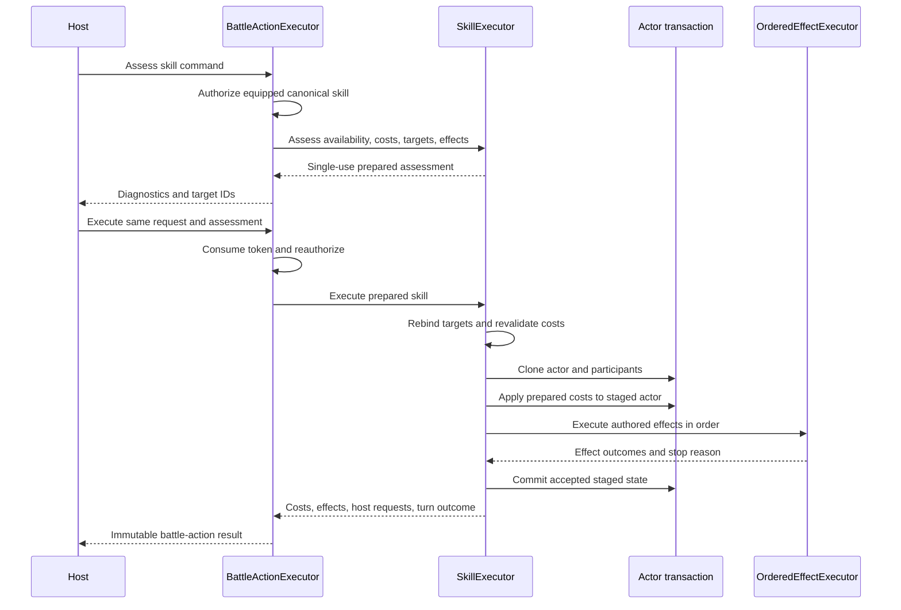
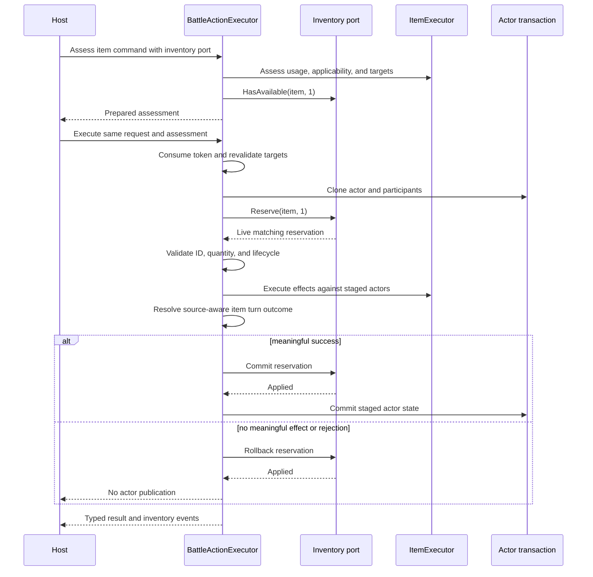

# Typed Action And Effect Execution

## Scope

This reference documents the internal invariants behind the canonical
`BattleActionExecutor` path. It covers command authorization, prepared targets,
skill costs, item reservations, ordered effects, actor-state publication, and
the external host boundary.

## Layered Contracts

| Layer | Responsibility | Deliberately does not own |
|---|---|---|
| `BattleActionExecutor` | command authorization, shared assessment/execution, item transaction coordination, roster commands, turn intent | presentation and external host work |
| `CatalogBattleActionAuthorizationPolicy` | equipped-or-equipment-granted canonical skill identity, canonical item identity, and resolved basic-attack identity | item inventory quantity and target legality |
| `SkillExecutor` | active-skill availability, costs, targets, effects, skill turn outcome | actor loadout authority |
| `ItemExecutor` | consumable usage, applicability, targets, effects, consumption decision | inventory ownership or quantity mutation |
| `AutomatedBattleRunner` | exact selector/assessment identity, catalog-backed equipped-or-equipment-granted skill authority, automated encounter execution | arbitrary non-equipment grants or host-mediated actions |
| `OrderedEffectExecutor` | authored order, conditions, failure policy, action-duration boundary | external callback rollback |
| `RuntimeActorExecutionTransaction` | clone live actors and publish accepted staged state | inventory, scenes, files, network state |

The lower-level skill and item executors remain public composition tools, but
they are not equivalent to the complete actor-owned battle action.

`AutomatedBattleRunner` is a specialized framework consumer of
`SkillExecutor`. A selector may use a prepared skill assessment for scoring,
but the runner accepts it only when its skill, actor, participant references,
encounter environment, and resolved targets describe the exact current action.
It then applies the same shared equipped-or-equipment-granted canonical catalog check used by
`CatalogBattleActionAuthorizationPolicy` immediately before execution. Invalid
selector output faults the encounter before command publication, costs, or
effects.

## Assessment Ownership

Battle, skill, and item assessments contain internal preparation tokens. A token
is valid only for:

- the executor instance that created it;
- the originating request (the battle facade requires the same request object);
- one execution attempt.

The facade consumes its token before dispatch. Nested skill/item assessments
are then consumed by their owning executor. Foreign, reconstructed, or reused
assessments produce typed `AssessmentInvalid` diagnostics.

## Authorization And Stale State

`CatalogBattleActionAuthorizationPolicy` authorizes skills, items, and basic
attacks:

- the skill ID must be equipped on `RuntimeActorState` or granted by the
  actor's current resolved equipment profile;
- the command skill must be the exact canonical repository object;
- the command item must be the exact canonical repository object;
- the resolved basic attack must exist and match action ID, damage definition,
  and targeting definition.

Equipment grants remain outside `RuntimeSkillStateSnapshot`; they neither
become learned nor occupy move-list slots. This authorization path concerns
active grants. Passive grants are loaded separately into the existing
`BattlePassiveCollection` by combat-profile composition and restoration. The
policy resolves the live actor equipment profile during assessment and again
after the battle assessment token is consumed but before execution. This
closes the stale-menu window: unequipping a skill-granting instance,
unequipping a learned skill, substituting an item definition, or changing
basic-attack equipment between assessment and execution rejects the command
without cost, effect, inventory, or turn mutation.

Other command kinds are authorized by their own assessment paths. Party/roster
commands use `IPartyRosterTransitionService`; host-mediated commands explicitly
delegate application behavior.

## Target Preparation

Assessment resolves targets once and stores immutable runtime IDs plus the
untargeted flag. Execution rebinds those IDs to the current participant set and
validates relation, life state, count, and selection constraints again.

Random selection therefore consumes randomness during assessment only. A host
cannot assess one random target and silently execute another. Removed,
duplicated, defeated, or otherwise ineligible prepared targets reject as stale
state rather than causing a reroll.

## Effect Composition Preflight

`EffectConfigurationValidator` is the single internal registration preflight
used by `SkillExecutor`, `ItemExecutor`, and direct effect-backed
`BattleActionExecutor` commands. It recursively checks:

- ailment definitions used by ailment application;
- formula handlers used by resource amount definitions;
- escape-rule handlers;
- custom-effect handlers; and
- custom-condition handlers nested under `all`, `any`, or `not`.

Assessment first validates authored percentages, supported effect executors,
these registrations, and the ordered-effect graph. Only a configuration-clean
action may resolve targets. Skills then resolve their cost quote. This ordering
prevents a missing host registration from consuming target randomness, running
amount policies, reserving inventory, mutating actor state, or acquiring turn
cost. Skills and items preserve their granular diagnostics; direct effect
commands use `EffectConfigurationInvalid` with the affected effect index.

Skill amount formulas and `ResourceCost` modifiers likewise run during
assessment only. The prepared assessment stores one resolved cost per distinct
resource ID. Execution compares those prepared entries with the authored cost
sequence and checks current affordability, then applies the quoted amounts to
the staged actor transaction. It does not recalculate them. This avoids a UI
quote differing from the amount committed and prevents random or custom amount
handlers from running twice. A consumed or rejected assessment cannot be
retried; a host that wants current policy state must assess again.

## Skill Transaction

Cost application happens on staged state before effects. A thrown pre-commit
exception rejects without publishing cost or effects. An ordinary authored
effect failure, `StopTarget`, `StopAction`, or typed interruption is a resolved
execution path and may commit the cost and earlier successful effects.

## Item Transaction

The battle facade hardcodes the command unit to one use. It first runs the
lower-level item assessment and also requires `IItemActionInventory` to report
one available unit.

Malformed reservations reject before item effects. A wrong-ID or wrong-quantity
live reservation receives a rollback attempt. Null or already-completed
reservations are rejected as invalid. If item execution rejects, outcome
aggregation fails, consumption is not required, or commit fails, staged actor
state is not published. Outcome aggregation occurs before the inventory
reservation or actor transaction is committed, so a custom policy exception
rolls both boundaries back.

The inventory adapter is a trusted transactional port. The Framework verifies
observable identity and lifecycle fields, but it cannot prove or undo hidden
adapter state. `Reserve`, `Commit`, and `Rollback` must be atomic.

The item definition remains host-supplied in the command, but the canonical
authorization policy requires it to be the exact object returned by the
injected item repository. Inventory availability and reservation then verify
ownership and quantity for that same content ID. The lower-level `ItemExecutor`
does not perform either check because it deliberately models typed effect
execution rather than an owned-item transaction.

## Ordered Effects

For each authored effect index, `OrderedEffectExecutor` evaluates each prepared
target in deterministic order:

1. validate the sequence-local effect/dependency graph;
2. evaluate any dependency against earlier immutable effect evidence;
3. evaluate current staged target life-state eligibility;
4. evaluate the typed condition;
5. execute the registered executor;
6. append an immutable `EffectExecutionResult`;
7. continue, stop that target, stop the action, or interrupt according to the
   outcome and `EffectFailurePolicy`.

Dependency failure, current-life-state failure, and condition failure each
produce distinct typed skipped evidence. They do not invoke the effect executor
or activate `EffectFailurePolicy`. A `positive_damage` dependency reads actual
committed per-hit resource changes, not calculated damage or a display outcome.
`same_target` evaluates each prepared target separately; `any_target` may read
any result from the referenced earlier effect.

`PartySizeConditionDefinition` compares against the number of living deployed
participants on `context.Actor.TeamId`. Reserve and defeated participants are
excluded. The contract accepts zero and rejects negative authored values in
both JSON Schema and semantic validation.

The sequence graph is checked during skill, item, and basic-attack assessment
and again by execution. This preserves assessment/execution parity for
programmatic definitions while the content validator remains authoritative for
the full catalog contract.

`StopTarget` skips later effects only for the failed target. `StopAction` ends
the remaining action. `Interrupted` ends the action independently of authored
failure policy. Action-duration lifecycle processing runs once around the
outermost ordered-effect scope.

Current life state is read from the staged actor, not from the assessment
snapshot. Damage, instant defeat, ailment application, and ordinary vital
resource restoration require a living target when their turn arrives. Revival
requires a defeated target. A prior effect can therefore defeat or revive a
target and change which later effects are eligible without publishing partial
live state.

## Mutation Boundary

`RuntimeActorExecutionTransaction` snapshots unique live actor references,
builds mutable staged actors, and commits staged snapshots back only when the
caller accepts the complete operation. This protects actor resources, statuses,
knowledge, skills, equipment, and related runtime fields from partial mutation
when execution throws.

The transaction does not include host state. Custom handlers receive staged
actors, but any unrelated file, scene, network, or service mutation they perform
cannot be rolled back. Host-mediated action IDs likewise describe work for the
host rather than claiming Framework atomicity.

`ICustomEffectHandler` output re-enters the canonical pipeline through
`EffectExecutionResult`. The result validates its effect index, execution and
turn-economy outcomes, optional enum/ID fields, host request IDs, and reference
collection entries during both construction and record cloning. Consequently,
an undefined custom outcome throws before transaction commit and is converted
by the skill/item/action boundary into typed rejection. It cannot fall through
ordered failure handling or action aggregation as ordinary success.

## Result Contracts

Public assessments, diagnostics, target IDs, effects, events, resource-cost
changes, and host-action IDs are defensive snapshots. The host consumes them
for presentation and orchestration without receiving mutable Framework-owned
collections.

`ActionTurnConsumption` reports intent to the encounter runner. Rejected
actions report `None`; successful skills, basic attacks, and non-escape items
carry the result selected by `IActionOutcomeAggregationPolicy`. The supplied
policy prices items as `TurnEconomy(Normal)` unless its item behavior is
configured as effect-driven. Guard, pass, roster, host-mediated, and successful
escape commands retain their command-specific contracts.

`ActionTurnConsumption` and `TurnEconomyResolution` expose get-only state and
validate their enum/payload combinations during construction. A
`TurnEconomy` consumption requires exactly one resolution; other consumption
kinds cannot carry one. Encounter command results similarly reject undefined
statuses/outcomes, invalid optional team IDs, missing consumption, and null
event entries. Supplied turn economies handle every legal kind explicitly and
do not reinterpret an unknown value as a normal action.

Effect results enforce the same principle at the earlier extension boundary.
Custom handlers may choose any legal documented outcome, but malformed scalar
or collection state is rejected before it can control effect continuation or
turn pricing.

The replacement authority for stat-stage application and duration is specified
in [Stat Modifier Policy Runtime Authority](stat-modifier-policy-runtime.md).
The action pipeline delegates modifier assessment and execution to the selected
`IStatModifierPolicyService`, preserves its typed transitions in effect
results, and publishes accepted policy-owned state through the same actor
transaction as other typed effects.

## Source And Test Evidence

Primary source:

- [`BattleActionAuthorization.cs`](../../src/Convergence.Framework/Execution/BattleActionAuthorization.cs)
- [`BattleActionExecutor.cs`](../../src/Convergence.Framework/Execution/BattleActionExecutor.cs)
- [`SkillExecutor.cs`](../../src/Convergence.Framework/Execution/SkillExecutor.cs)
- [`ItemExecutor.cs`](../../src/Convergence.Framework/Execution/ItemExecutor.cs)
- [`EffectConfigurationValidator.cs`](../../src/Convergence.Framework/Execution/EffectConfigurationValidator.cs)
- [`OrderedEffectExecutor.cs`](../../src/Convergence.Framework/Execution/OrderedEffectExecutor.cs)
- [`RuntimeActorExecutionTransaction.cs`](../../src/Convergence.Framework/Execution/RuntimeActorExecutionTransaction.cs)

Focused evidence:

- [`BattleActionExecutorTests.cs`](../../tests/Convergence.Framework.Tests/SkillSystem/BattleActionExecutorTests.cs)
- [`ActiveSkillExecutionTests.cs`](../../tests/Convergence.Framework.Tests/SkillSystem/ActiveSkillExecutionTests.cs)
